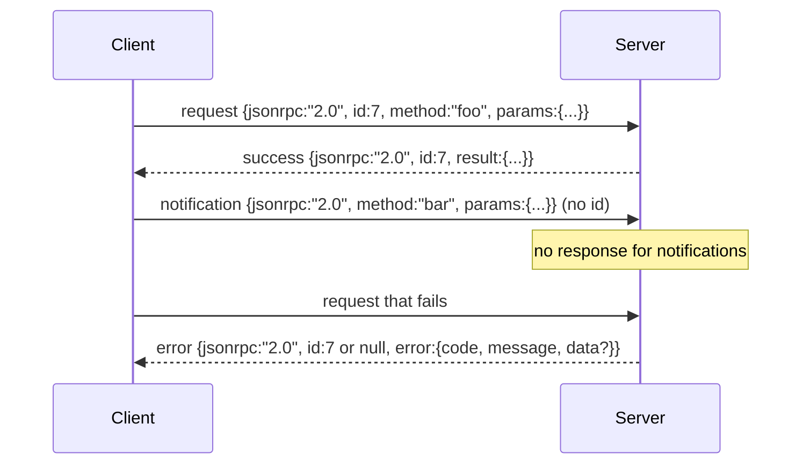

# 基于换行分隔的 Stdio 传输 JSON-RPC 2.0

> 模型客户端与工具服务器之间的传输层是基于 stdio 的 JSON-RPC。亲手实现一次，能让你明白每一层帧结构（framing layer）所承担的职责。

**类型：** 构建
**语言：** Python
**前置要求：** 第 13 阶段课程 01-07，第 14 阶段课程 01
**耗时：** 约 90 分钟

## 学习目标
- 掌握通过 stdin 和 stdout 以换行分隔的 JSON 格式传输 JSON-RPC 2.0。
- 映射五个标准错误码（-32700、-32600、-32601、-32602、-32603），并以正确的语义进行暴露/返回。
- 区分请求、响应、通知和批处理，且不发明新的信封键名。
- 逐行处理解析错误，避免污染后续数据流。
- 使用 io.BytesIO 构建自终止演示程序，使课程无需派生子进程即可运行。

## 为什么 JSON-RPC 依然是通用语

2026 年的代码代理在一次会话中可能会与多达十二个工具服务器通信。每个服务器都是一个独立的进程或远程端点。其网络传输格式自 2013 年以来一直保持不变。JSON-RPC 2.0 仅有一份两页的规范。它能够长盛不衰，是因为其他替代方案（如 gRPC、每次调用一个 HTTP 连接、自定义二进制协议）都强加了 JSON-RPC 所没有的权衡：它们只能在流式传输、批处理或传输层耦合中二选一。而 JSON-RPC 在 stdio、套接字、WebSocket 和 HTTP 上保持对称性；只要双方遵守规范，客户端就能驱动它从未见过的服务器。

本课程将构建基于 stdio 的变体。即换行分隔的 JSON。每个请求占一行。每个响应占一行。传输边界由 `\n` 定义。

## 网络传输形态

存在四种信封形态。两种由客户端发送，两种由服务端发送。



通知消息不包含 `id`。服务端不得对其作出响应。如果服务端对通知消息返回了响应，客户端将无法将其关联到具体的调用位置。正是这一条规则使得帧结构的逻辑保持简单。

批处理是包含请求或通知的 JSON 数组。服务端会回复一个响应数组，顺序不限，每个非通知条目对应一个响应。如果批处理中的所有条目均为通知，则服务端不返回任何内容。

## 五个错误码

```text
-32700  Parse error      JSON could not be parsed
-32600  Invalid Request  Envelope shape is wrong
-32601  Method not found
-32602  Invalid params
-32603  Internal error
```

-32000 到 -32099 之间的代码保留给服务端自定义错误。其余均为应用自定义错误。本课程仅使用这五个。如果你的处理器抛出异常，传输层会将其包装为 -32603，并将异常类名放入 `data.exception` 中。

解析错误有一条特殊规则。响应中的 `id` 字段值为 `null`，因为请求未能解析出足够的信息来提取 ID。

## 换行帧结构与 BytesIO 演示

传输层逐行读取数据。一行是指包含 `\n` 在内的字节序列。如果某行无法解析，传输层会写入一个带有 `id: null` 的 -32700 响应，然后继续处理。数据流不会被污染。下一行将重新独立解析。

在本课程中，我们将一对 `io.BytesIO` 封装为 stdin 和 stdout。服务端读取请求直到 EOF，为每个请求写入响应后返回。客户端读取这些响应。无需派生子进程，也无需设置超时。由于 Python 的 `io` 接口提供了相同的 `.readline()` 和 `.write()` 契约，其传输行为与实际子进程管道完全一致。

## 方法分发

传输层并不知晓存在哪些方法。它将任务交给测试框架提供的可调用对象 `handler(method, params)`。处理器返回结果或抛出异常。三个异常类用于暴露特定的错误码。

```text
MethodNotFound -> -32601
InvalidParams  -> -32602
Anything else  -> -32603 with exception name in data
```

传输层永远不会直接看到工具注册表。注册表位于处理器之后。这正是我们期望的分层架构。传输层负责 JSON-RPC 通信，注册表负责定义工具形状。分发器（第二十三课）将它们缝合在一起。

## 错误状态下的流行为

```text
client writes              server reads             server writes
---------------            -----------              -------------
{...valid request...}      parses ok                {...response, id matches...}
{...broken json...         parse fails              {id:null, error: -32700}
{...valid request...}      parses ok                {...response, id matches...}
{...missing method...}     invalid envelope         {id:X, error: -32600}
```

损坏的 JSON 行不会中断循环。缺失 `method` 字段不会中断循环。处理器异常不会中断循环。传输层将持续读取直到 EOF。

## 通知与非对称流

通知属于“发后即忘”模式。测试框架使用通知来传递进度事件、取消信号和日志行。这是长时间运行的工具在不进行逐次往返通信的情况下流式传输状态更新的唯一方式。

本课程实现了一个出站通知辅助函数 `write_notification`。服务端在处理请求期间使用它来输出进度。演示展示了该模式：收到请求后，处理器发出两条进度通知，随后写入最终响应。

## 如何阅读代码

`code/main.py` 定义了 `StdioTransport`、解析辅助函数（`parse_request`）、三个写入辅助函数（`write_response`、`write_error`、`write_notification`）以及分发循环 `serve`。错误码常量定义在模块作用域内。

`code/tests/test_transport.py` 涵盖了五个错误码、通知（不写入响应）、批处理（输入数组、输出数组、跳过通知）、损坏的 JSON（解析错误后继续）以及非对称流（处理器在调用中途写入通知）。

## 进一步探索

此传输层已足以支撑后续课程。生产级传输层通常会增加三项功能。一是跨转发存活的关联 ID 字段（你的 `id` 已经具备此功能，但在服务网格中还需要外层追踪 ID）。二是取消通道（一种类似 `$/cancelRequest` 的通知，携带正在进行的调用 ID）。三是内容类型协商握手，以便同一套接字能够同时支持 JSON-RPC 和 Streamable HTTP。这些都不会改变底层传输格式，它们只是增加了元数据。
