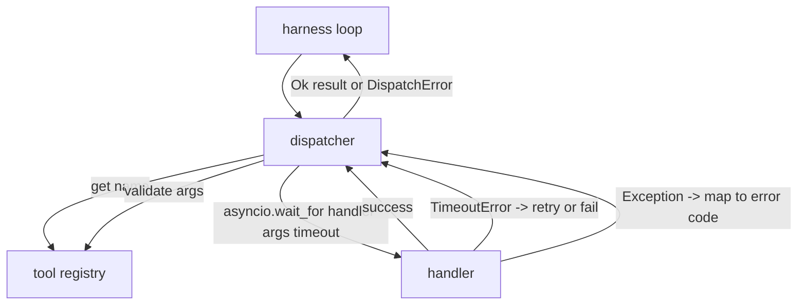
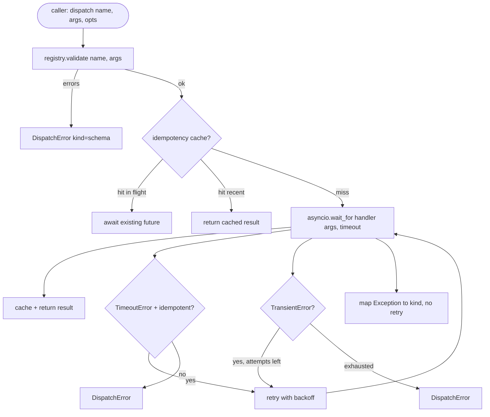

# Function Call Dispatcher

> 调度器是执行框架兑现 Schema 所承诺各项功能的所在。超时控制、重试机制、请求去重、错误映射，全部收敛于这一层。

**Type:** Build
**Languages:** Python
**Prerequisites:** Phase 13 lessons 01-07, Phase 14 lesson 01
**Time:** ~90 minutes

## Learning Objectives
- 为工具处理器包装单次调用超时机制，返回类型明确的错误，避免阻塞 event loop。
- 应用带 jitter 的指数 backoff 重试策略，并设置最大尝试次数。
- 基于 idempotency 键对重试进行去重，防止与缓慢的原生调用发生竞态的重试被重复执行。
- 将处理器异常和传输故障统一映射为执行框架循环已能识别的单一错误信封。
- 通过并发限制约束 fan-out 并行分发，防止四十个工具调用耗尽 event loop。

## Where the dispatcher sits

位于执行框架循环（第二十课）与工具注册表（第二十一课）之间。传输层（第二十二课）向循环提供数据。循环将工具调用交给调度器。调度器调用注册表，执行处理器，并返回结果或符合 JSON-RPC 格式的错误信封。



调度器是唯一知晓定时器、重试和 idempotency 的层级。循环不知道。注册表不知道。处理器也不知道。这种隔离正是设计的关键。

## Timeouts

每个工具都有默认超时时间。注册表记录携带 `timeout_ms`。当执行框架传入单次调用覆盖配置时，调度器会对其进行覆盖。我们使用 `asyncio.wait_for`。超时发生时，处理器任务将被取消，调度器返回 `DispatchError(kind="timeout")`。

对于非 idempotency 工具，超时默认不被视为可重试错误。超时的 `db.write` 可能已提交，也可能未提交。重试会导致写入重复。调度器会遵循注册表记录中的 `idempotent` 标志。Idempotency 工具会重试，非 idempotency 工具则不会。

## Retries with exponential backoff

重试策略最多三次尝试。Backoff 采用带 Jitter 的指数退避算法。

```text
attempt 1  -> delay 0
attempt 2  -> delay 0.1s * (1 + random[0..0.5])
attempt 3  -> delay 0.4s * (1 + random[0..0.5])
```

仅 `timeout` 和 `transient` 错误会触发重试。`schema` 错误、`not_found` 或 `internal` 错误不会重试。Schema 错误是确定性的。重试无法改变结果，只会消耗预算。

重试循环会遵守执行框架提供的预算。如果调用方的剩余工具调用预算为零，调度器将在首次尝试时快速失败，并返回 `kind="budget_exceeded"`。

## Idempotency key dedupe

在原调用仍在进行中时触发重试是一个真实的生产环境 Bug。第一次调用在 4.9 秒时挂起（略低于超时阈值）。重试在 5 秒时触发。此时两个请求会与同一后端发生竞态。如果该工具是 `payments.charge`，你就被扣了两次费。

调度器接受可选的 `idempotency_key`。当新调用到达时，若相同键正在处理中，调度器会等待该进行中的 Future 并返回其结果。缓存会在完成后保留键六十秒，以吸收延迟的重试请求。

键的生成由调用方负责。执行框架从规划器派生它：`f"{step_id}:{tool_name}:{hash(args)}"`。调度器不自行发明键，因为仅从参数推导键会使两个语义不同的调用看起来完全相同。

## Error envelope

分发失败返回单一的结构形状。

```text
DispatchError
  kind        : "timeout" | "transient" | "schema" | "not_found" | "internal" | "budget_exceeded"
  message     : str
  attempts    : int
  jsonrpc_code: int   (one of -32601, -32602, -32603)
```

执行框架循环将 `kind` 映射到下一个状态。`schema` 和 `not_found` 进入 `on_error` 并触发重新规划。`timeout` 和 `transient` 进入 `on_error`，是否重新规划取决于尝试次数。`budget_exceeded` 触发 `on_budget_exceeded`。

## Concurrency limit on fan-out

`gather(*calls)` 会同时运行所有 coroutine。若有四十个工具调用，就意味着四十个打开的 Socket 或四十个子进程管道。大多数后端不喜欢单个客户端发起四十个并行连接。

调度器将 `gather` 封装在 semaphore 中。默认并发限制为八。每次调用在分发前获取 semaphore，完成后释放。调用方看到的是 `gather` 形状的输出，但实际的调度是受限制的。

## Flow for one call



## How to read the code

`code/main.py` 定义了 `Dispatcher`、`DispatchError` 和 `TransientError`。调度器在构造时接收注册表。异步 `dispatch(name, args, ...)` 是唯一的入口点。每次尝试的超时在 `_run_with_retries` 内部内联应用，使用 `asyncio.wait_for`。`gather_bounded(calls)` 在并发限制下运行多次分发。

`code/tests/test_dispatcher.py` 涵盖了超时触发、transient 错误重试、Schema 错误不重试、idempotency 去重（具有相同键的两个并发调用合并为一次处理器调用）以及并发限制（semaphore 的实际作用）。

测试使用 `asyncio.sleep(0)` 和基于确定性 `Counter` 的处理器，因此它们能在毫秒级完成，且不依赖真实 wall-clock timing。

## Going further

生产级调度器通常会添加两项扩展。第一，在每个状态转换处进行结构化日志记录（虽然循环的事件流已经提供了这一点，但调度器也应发出 `dispatch.attempt` 和 `dispatch.retry` 事件）。第二，circuit breakers：在指定窗口内发生 N 次失败后，该工具进入 cool-down period，期间分发直接返回 `kind="circuit_open"`，而不再尝试调用处理器。这两项扩展均可叠加在此调度器之上，且无需更改接口契约。

第二十四课将调度器与 plan-and-execute agent 粘合在一起，让你看到这四个组件协同运转。
