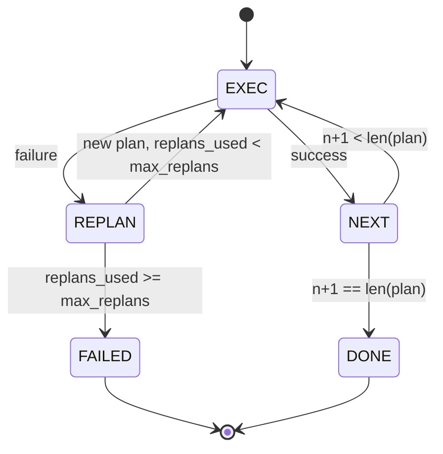

# 规划-执行控制流

> 无法在失败中存活的计划只是脚本。能够重新规划的计划才是智能体。先构建重规划器。

**类型：** 构建
**语言：** Python
**前置条件：** 第 13 阶段课程 01-07，第 14 阶段课程 01
**耗时：** 约 90 分钟

## 学习目标
- 将计划表示为有序的类型化步骤列表，以便执行器能够推理进度和结果。
- 按顺序执行步骤，并在受控的失败情况下将控制权交还给规划器。
- 基于当前游标和上下文中的先前错误进行重新规划，使新计划具备信息依据。
- 在每次修订时生成计划差异（diff），以便下游追踪器或 UI 展示计划变更的原因。
- 强制执行两项预算限制：硬性步骤上限和硬性重规划上限。

## 规划与执行，而非思维链

思维链（Chain-of-Thought）智能体会逐个输出 token，并让循环去猜测工具调用在哪里结束。而“规划-执行”智能体首先输出一个结构化的计划，然后按确定性方式执行每个步骤。计划是主控程序可以自省的数据。执行则是主控程序将该数据通过调度器运行的过程。

分为两部分。一个负责生成计划的规划器。一个负责运行计划的执行器。真正有趣的工作在于当执行器遇到失败时会发生什么。有三种选择：

```text
1. Abort         (return failed, surface the error)
2. Skip          (mark step failed, continue with the rest)
3. Replan        (hand the error to the planner, get a new plan from the cursor)
```

重新规划是将脚本转变为智能体的关键。

## 步骤的结构

```text
Step
  id              : int           (monotonic within a plan revision)
  tool_name       : str
  args            : dict
  expected_outcome: str           (planner's stated success condition)
  result          : Any | None
  error           : str | None
```

`expected_outcome` 是一个规划器随步骤一同输出的简短句子。执行器不会强制校验它。它有两个用途：重规划器在修订计划时会读取它；事件流会输出它，以便追踪器显示“此步骤本应执行 X”。

## 规划器的结构

```python
def planner(goal: str, history: list[Step], last_error: str | None) -> list[Step]:
    ...
```

它是一个纯函数。`goal` 是用户目标。`history` 是已执行的步骤（包含填充的结果和错误）。`last_error` 在首次调用时为 None，在后续每次调用中为最新的失败消息。规划器返回从游标开始的下一个计划。

规划器不感知执行器的存在。它不知道重试机制。它也不知道超时设置。它只负责生成计划。仅此而已。

## 执行器

执行器是一个小型状态机。每个步骤都通过调度器运行。结果只有三种：成功、可重新规划的失败、致命失败。可重新规划的失败会将控制权交还给规划器。致命失败（超出预算、达到重规划上限）则返回一个 `FAILED` 会话结果。



## 修订时的计划差异

当规划器在失败后返回新计划时，执行器会发出一个带有三个字段的 `plan.diff` 事件。

```text
removed: list of step ids that were in the old plan and are not in the new
added  : list of step ids in the new plan that were not in the old
revised: list of step ids whose tool_name or args changed
```

追踪器或 UI 可以将此渲染为被移除步骤的删除线以及新增步骤的高亮。重点不在于 diff 格式本身，而在于修订是一个可见的事件，而非静默重写。

## 两项硬性预算限制

`max_steps` 限制了整个会话期间的总步骤执行次数，包括重新规划。默认值为十二。一个初始五步的线性计划如果重新规划两次且每次增加三步，将达到十六次执行，从而超出预算。此时执行器将拒绝重新规划并返回 FAILED。

`max_replans` 限制了首次计划之后规划器被调用的次数。默认值为五。这是更重要的限制。否则，一个连续五次返回相同错误计划的规划器将会无限循环，直到触及步骤预算限制。限制重新规划次数能让失败更快暴露，原因也更清晰。

## 本课程中的确定性规划器

本课程不调用任何模型。课程内置了一个确定性规划器，它根据 `last_error` 来选择计划。

```text
last_error is None    -> emit a four-step plan
last_error matches X  -> emit a three-step plan that routes around X
last_error matches Y  -> emit a two-step plan that gives up gracefully
otherwise             -> return [] (signals nothing to replan)
```

这足以测试执行器在所有转换路径上的行为：成功、重新规划一次、重新规划两次、重新规划耗尽以及步骤预算耗尽。

## 结果的结构

```text
SessionResult
  status      : "completed" | "failed"
  reason      : str     ("goal_met" | "step_budget" | "replan_budget" | "no_plan")
  history     : list[Step]
  revisions   : list[PlanDiff]
  events      : list[Event]
```

第二十课中的主控程序循环可以直接读取此内容。第二十三课的调度器负责执行每个步骤。第二十一课的注册表用于验证每个步骤的参数。第二十二课的传输层将通过 JSON-RPC 将此完整流程暴露给模型客户端。

## 如何阅读代码

`code/main.py` 定义了 `PlanExecuteAgent`、`Step`、`PlanDiff`、`SessionResult` 以及确定性规划器。执行器是一个单独的 `run(goal)` 方法，它返回一个 `SessionResult`。计划差异是通过比较步骤 ID 和 `(tool_name, args)` 元组来计算的。

`code/tests/test_agent.py` 涵盖了线性成功、中途失败触发一次重新规划、返回 `failed:replan_budget` 的重新规划耗尽、步骤预算耗尽，以及计划差异事件格式。

## 进一步探索

一旦将其接入真实模型，你将需要两个扩展。首先是部分计划缓存：当一个六步计划的前三步成功而后失败时，你不想重新运行前三步。执行器已经保留了历史记录；规划器只需读取它即可。其次是并行分支：当前的执行器是严格顺序执行的。一个能输出独立分支（使用 `gather_step` 而不是 `next_step`）的规划器，可以通过调度器并发运行两个工具调用。

两者都会增加实际的复杂度。但在固定线性执行器之后，添加它们会变得更容易。这正是本课程所做的铺垫。
