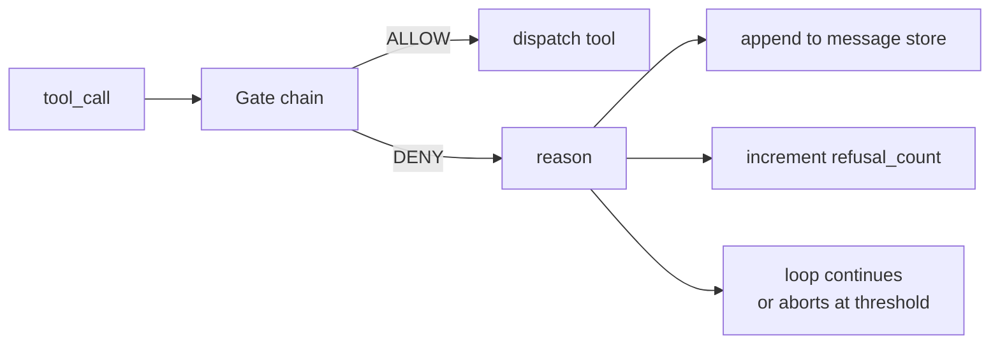
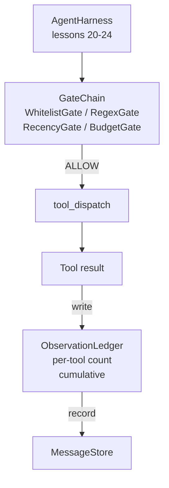

# 毕业设计课程 25：验证门控与观测预算

> 没有验证层的智能体框架只是一份披着风衣的幻想。本课程将构建一个确定性的门控链，用于决定是否允许触发工具调用、智能体可以查看多少输出内容，以及在智能体读取过多内容时何时必须停止循环。该链由一系列小型命名门控组成，并附带一个观测账本，用于追踪模型所看到的所有 Token。

**类型：** 构建
**语言：** Python（标准库）
**前置要求：** 第 19 阶段 · 课程 20-24（A1 轨道：智能体循环、工具注册表、消息存储、提示词构建器、模型路由器），第 14 阶段 · 课程 33（指令作为约束），第 14 阶段 · 课程 36（作用域契约），第 14 阶段 · 课程 38（验证门控）
**时间：** 约 90 分钟

## 学习目标

- 构建带有确定性 `evaluate(call)` 方法的 `VerificationGate` 协议。
- 将预算、时效性、白名单和正则表达式门控组合成具有短路语义的链。
- 通过按工具和轮次键控的 `ObservationLedger` 追踪每一次观测。
- 当累积观测预算即将超出限制时拒绝工具调用。
- 生成结构化的 `GateDecision` 记录，供下游可观测性系统消费。

## 问题所在

当智能体框架允许模型自由调用工具时，在实际使用的前一小时内会出现三类 bug。

第一类是无界观测。对包含 20 万行代码的代码库执行 grep 操作，会将高达 50 万个 Token 的输出倾泻到下一轮中。模型每千字只能看到一个匹配项，其余上下文都被浪费。Token 账单高昂，且智能体完成任务的能力反而下降。

第二类是时效性陈旧。长时间运行的任务会积累五十次工具调用。模型会重新读取第三轮中的第一次 read_file 结果，仿佛它是实时状态。第四十七轮进行的编辑从未显示出来，因为提示词构建器优先序列化了最早的观测结果。

第三类是权限蔓延。一个研究任务最初调用的是 `web_search`，但不知为何最终却运行了 `shell`，因为模型凭空捏造了一个工具名称，而框架默认采用了宽松策略。等到任何人查看跟踪日志时，/tmp 目录下已经躺着一个垃圾文件，且有一个 curl 请求打到了私有 API 上。

验证门控是框架中负责说“不”的组件。它不是模型，也不是裁判。它是一个基于 `(call, history, ledger)` 的确定性函数，返回 ALLOW（允许）或 DENY（拒绝）及原因。原因会被记录，模型会收到通知，循环继续或中止。

## 核心概念



门控是任何具备 `evaluate(call, ctx) -> GateDecision` 方法的对象。链是一个有序列表。评估在遇到第一个拒绝时短路。顺序至关重要：低成本的结构化门控应在高成本的 Token 计数门控之前运行。

本课提供四个门控：

- `WhitelistGate`。允许的工具名称是一个显式集合。任何不在其中的名称都会被拒绝。这是最便宜的门控，最先运行。
- `RegexGate`。工具参数会与正则表达式进行匹配。可用于拒绝包含 `rm -rf` 的 Shell 调用，或发往内网 IP 的 HTTP 调用。仅作用于调用负载。
- `RecencyGate`。模型只能看到最近 N 轮内的观测结果。较旧的观测结果将被掩码。如果某工具调用的结果会延长一个已经过期的观测窗口，该门控将拒绝此调用。
- `BudgetGate`。模型在整个会话中读取的累计 Token 数设有上限。当账本显示达到上限时，所有后续工具调用均被拒绝。

观测账本是记账机制。每次成功的工具调用都会写入一行：工具名称、轮次、发出的 Token 数、累计值。账本回答两个问题：模型总共看到了多少，以及针对特定工具 X 看到了多少。预算门控读取第一个数据。你将在练习中编写的单工具预算门控读取第二个数据。

## 架构设计



框架向链发起询问。链要么点头同意，要么拒绝。如果同意，工具执行，账本更新，结果追加到消息存储中。如果拒绝，模型会收到一条包含拒绝信息的系统消息，循环将决定是否重试或中止。

## 你将构建的内容

实现部分为一个单独的 `main.py` 加上测试用例。

1. `Observation` 和 `ToolCall` 数据类定义了传输数据结构。
2. `ObservationLedger` 记录 `(turn, tool, tokens)` 行，并回答 `cumulative()` 和 `per_tool(name)` 查询。
3. `GateDecision` 携带 `(allow, reason, gate_name)`。
4. `VerificationGate` 是协议。每个门控都实现 `evaluate(call, ctx)`。
5. `GateChain` 包装了一个有序列表。它会依次调用每个门控，返回第一个拒绝结果，或者在所有门控通过后返回允许。
6. 演示程序运行一个微型合成智能体循环。共三轮。第三轮触发预算门控，循环报告一次清晰的拒绝响应，且拒绝计数非零。

Token 计数器故意采用了一种朴素的 `len(text) // 4` 启发式方法。本课的重点在于门控的管道连接，而非分词器。在生产环境中替换为真实的分词器即可。

## 为什么链的顺序很重要

拒绝比允许更廉价。`WhitelistGate` 的运行时间为 O(1) 哈希查找。`RegexGate` 的运行时间为 O(pattern * argv)。`RecencyGate` 读取消息存储的一小部分切片。`BudgetGate` 读取整个账本。按成本升序排列它们，以便被拒绝的调用在执行昂贵工作前就短路退出。

你还应按影响范围排序。白名单是最强的声明：该工具不在契约中。正则表达式门控次之：该参数不在契约中。时效性门控随后：框架仍然关心，但该调用在结构上是合法的。预算门控排在最后，因为根据定义，它只在其他所有条件都满足时才会触发。

## 如何与 A 轨道的其他部分组合

之前的课程为你提供了循环、工具注册表、消息存储、提示词构建器和模型路由器。本课添加了模型与工具之间的层。课程 26 提供沙箱，一旦门控链返回 ALLOW，分发器就会将工具调用移交给它。课程 27 提供评估框架，将拒绝计数记录为质量信号。课程 28 将门控决策接入 OpenTelemetry span。课程 29 将所有组件缝合为一个可用的编码智能体。

## 运行方式

```bash
cd phases/19-capstone-projects/25-verification-gates-observation-budget
python3 code/main.py
python3 -m pytest code/tests/ -v
```

演示程序会打印逐轮跟踪日志，包括每个门控的决策，并以退出码 0 正常退出。测试用例覆盖账本、每个门控的独立测试、链短路逻辑以及合成循环的端到端测试。
