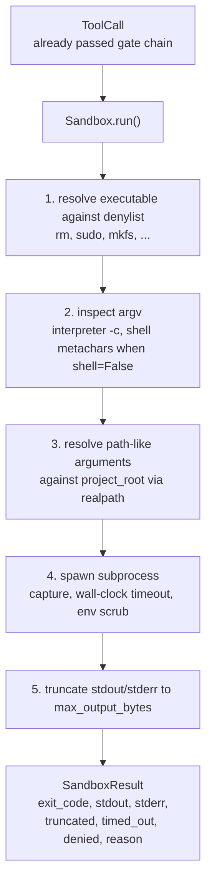
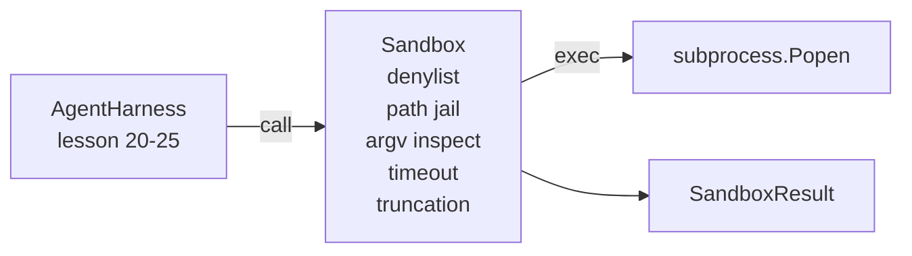

# 毕业设计课程 26：带有黑名单与路径监狱的沙箱运行器

> 验证门控（verification gate）决定工具调用是否应该执行。沙箱决定执行时发生什么。本课程提供了一个子进程运行器，它会拒绝危险的可执行文件、拒绝危险的参数结构、将所有文件路径限制在项目根目录下、截断过大的输出，并在墙钟超时（wall-clock timeout）时终止失控进程。它是位于模型与操作系统之间的两层防护中的第二层。

**类型：** 构建
**语言：** Python（标准库）
**前置条件：** 阶段 19 · 25（验证门控与观测预算）、阶段 14 · 33（指令作为约束）、阶段 14 · 38（验证门控）
**耗时：** 约 90 分钟

## 学习目标

- 构建一个 `Sandbox` 类，封装 `subprocess.run`，并实现超时控制、输出捕获与截断功能。
- 根据黑名单按名称拒绝命令，并根据参数检查器按结构拒绝命令。
- 拒绝任何解析后超出声明的项目根目录的路径参数。
- 在关闭 Shell 模式时拒绝 Shell 元字符。
- 返回结构化的 `SandboxResult`，供下游可观测性组件与评估框架使用。

## 问题背景

能够调用 Shell 的编码代理可以在单次交互中安装后门、窃取密钥、变砖开发者笔记本电脑，并产生巨额云账单。成本最低的防御是不赋予它 Shell 权限。次低成本的防御是一个沙箱，它对精确的模式列表说“不”。

在代理的运行轨迹中，有三类故障反复出现。

第一类是危险的可执行文件。在修复路径问题的压力下，模型会尝试 `sudo`、`chmod -R 777`、`rm -rf`、`mkfs`、`dd`。这些都不应出现在代理的运行环境中。黑名单通过名称和别名来拦截它们。

第二类是参数（argv）技巧。被禁止使用 Shell 的模型会通过解释器传递攻击载荷：`python3 -c "import os; os.system('rm -rf /')"`、`bash -c '...'`、`node -e '...'`、`perl -e '...'`。沙箱需要知道，任何带有类似 `-c` 标志的解释器运行，本质上只是多了一步的 Shell 调用。

第三类是路径逃逸。模型被指示读取 `./src/main.py`，却转而读取了 `../../etc/passwd`。沙箱通过 `os.path.realpath` 解析每个路径参数并断言前缀，从而将其限制在监狱内。

该沙箱并非操作系统意义上的安全边界。拥有代码执行权限的坚定攻击者仍可能突破限制。沙箱是一种开发时的护栏：它让常见的故障模式变得显眼，并阻止代理因纯粹的能力不足而造成破坏。

## 核心概念



沙箱有四个拒绝维度：名称、参数（argv）、路径、结构。每个维度都是对调用的纯函数处理，此时尚未启动子进程。只有当所有维度都通过后，才会派生子进程。

`SandboxResult` 的退出码遵循惯例：0 表示成功，非零表示失败，外加三个哨兵码用于表示被拒（-100）、超时（-101）和截断（退出码为实际值，但附带标志位）。后续课程将直接读取此结构化结果，而非解析 stderr。

## 架构设计



黑名单是一个包含可执行文件基本名称的不可变集合（frozenset）。别名（`/bin/rm`、`/usr/bin/rm`）最终都解析为相同的基本名称。参数检查器了解解释器的形态：任何 argv[0] 为解释器且后续任意参数以 `-c` 或 `-e` 开头的调用都会被拒绝。当调用未显式请求 Shell 时，Shell 元字符（`;`、`|`、`&`、`>`、`<`、反引号、`$()`）会导致拒绝。

路径监狱是最微妙的部分。沙箱在构造时接受一个 `project_root`。任何看起来像路径的参数（包含 `/` 或匹配现有文件）都会通过 `os.path.realpath` 进行规范化，然后与项目根目录的真实路径（realpath）进行比对。如果解析后的目标不在根目录下，则拒绝。针对符号链接逃逸的尝试（项目根目录内的符号链接指向外部）将通过检查真实路径而非字面路径来阻断。

## 你将构建的内容

实现部分由 `main.py` 和一个测试目录组成。

1. `SandboxResult` 数据类：包含 exit_code、stdout、stderr、truncated、timed_out、denied、reason、duration_ms。
2. `SandboxConfig` 数据类：包含 project_root、max_output_bytes、timeout_seconds、denylist、interpreter_block。
3. `Sandbox` 类：`run(argv, *, shell=False, cwd=None)` 方法返回一个 `SandboxResult`。
4. 内部拒绝辅助函数：`_check_executable_denylist`、`_check_argv_interpreter`、`_check_shell_metachars`、`_check_path_jail`。
5. 输出截断功能：设置清晰的 `truncated` 标志，并在捕获的流中添加标记行。
6. 底部演示：一系列合法与对抗性调用。每个调用均展示其结果。

沙箱默认使用 `subprocess.run`，配置为 `shell=False` 和 `capture_output=True`。墙钟超时使用 `timeout` 参数；触发 `TimeoutExpired` 时，沙箱将终止进程组并合成一个 SandboxResult。

## 为什么这不是真正的沙箱

本课程的沙箱不使用命名空间（namespaces）、cgroups、seccomp、gVisor、Firecracker 或任何内核级隔离技术。子进程能做的，沙箱也能做。这里的保护是结构性的：代理会被拒绝执行最常见的危险调用，且明确的拒绝信息会写入可观测性日志，而不是静默运行。

对于生产环境的代理，你需要在此基础上叠加更多防护：在无特权的 Docker 容器中运行、在微虚拟机（microVM）中运行、剥离系统能力（drop capabilities）、将项目根目录挂载为只读、临时目录挂载为读写、设置内存和 CPU 的 ulimit 限制、将环境变量清理为已知的安全白名单。课程 29 会涉及其中部分内容。操作系统级隔离不在本课程范围内。

## 运行方式

```bash
cd phases/19-capstone-projects/26-sandbox-runner-denylist
python3 code/main.py
python3 -m pytest code/tests/ -v
```

演示程序会创建一个临时目录，在其中放入一个干净的文件，然后运行一系列调用。合法调用会成功。被拒调用返回带有 `denied=True` 和原因的 SandboxResult。超时会返回 `timed_out=True`。截断会设置 `truncated=True`。演示程序会打印结果的 JSON 表格并以退出码 0 结束。

## 与 Track A 其余部分的组合关系

课程 25 生成了门控链。课程 26 是门控状态为 ALLOW 后执行的执行器。课程 27 的评估框架会将沙箱结果与每个任务的预期退出码进行比对。课程 28 会在每次 `Sandbox.run` 调用周围生成一个 `gen_ai.tool.execution` span。课程 29 的端到端演示会将真实的编码代理接入这两层防护中。
