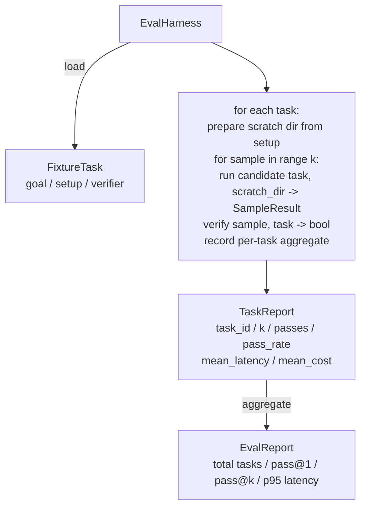

# 毕业设计课程 27：基于示例任务的评估框架

> 代码智能体的能力上限，取决于你用来衡量它的任务套件。本课程将构建一个评估框架（evaluation harness），它会读取一个包含示例任务（fixture tasks）的文件夹，将每个任务输入给候选智能体，通过确定性验证器（deterministic verifier）判定通过或失败，并将结果聚合为 pass@1、pass@k、平均延迟和平均成本。该框架是唯一的真相来源，能让你清晰区分回归错误与重构改进。

**类型：** 构建
**语言：** Python（标准库）
**前置条件：** 第 19 阶段 · 课程 25（验证门控）、第 19 阶段 · 课程 26（沙箱运行器）、第 14 阶段 · 课程 30（评估驱动的智能体开发）、第 14 阶段 · 课程 19（SWE-bench 和 GAIA 基准测试）
**耗时：** 约 90 分钟

## 学习目标

- 将示例任务定义为“目标、环境与验证器”三元组。
- 对每个任务进行多次采样运行并评分，计算 pass@1 和 pass@k。
- 将延迟和成本聚合为平均值和第 95 百分位数指标。
- 将确定性验证器（文件差异、退出码、正则匹配）封装为可复用函数。
- 输出结构化的 JSON 报告，供回归跟踪脚本解析使用。

## 问题所在

缺乏评估框架会导致代理基准测试出现三种失效模式。

第一种是未经验证的通过。智能体声称已修复 Bug，人类快速扫了一眼差异对比，测试套件显示全绿，但三周后回归测试再次暴露了同一个 Bug。智能体只是进行了看似合理的推理，实际上并未真正修复任何问题。

第二种是未被发现的回归。提示词模板的改动让智能体在“高活跃度”任务上提升了 4%，但在“低活跃度”任务上下降了 14%。如果没有黄金数据集和逐任务评分，这种回归会混入主分支，直到客户投诉才会暴露。

第三种是逐任务漂移。周一运行评估时使用了 100 个任务，周五却只用了 95 个，因为有人重命名了五个示例文件。通过率看起来提升了 5%，但实际上并非如此。

评估框架正是将这些问题转化为客观事实的程序。它每次都会以可复现的顺序运行所有示例任务，并使用返回布尔值的确定性验证器进行检查。

## 核心概念

```mermaid
flowchart LR
  F1[fixtures/task_001/<br/>task.json + expected/] --> Harness
  F2[fixtures/task_002/<br/>...] --> Harness
  Harness[Harness<br/>for each task:<br/>setup / run agent k samples /<br/>verify each sample /<br/>record latency, cost]
  Harness --> Report[EvalReport<br/>pass@1 / pass@k<br/>mean ms / p95 ms<br/>mean cost]
```

一个 `FixtureTask` 由一个小巧的 JSON 文件和一个可选的 `expected/` 目录组成。JSON 声明了 `id`、`goal`（输入给智能体的提示词）、`setup` 块（需放入临时目录的文件）以及 `verifier` 块。验证器块指定了框架验证器注册表中的函数名及其参数。

三种验证器形态覆盖了绝大多数实用任务。

第一种是 `file_equals`。智能体运行后，将指定文件的内容与预期内容进行比对。这适用于“必须按此特定方式修复 Bug”的任务。

第二种是 `regex_match`。将指定文件的内容与正则表达式进行匹配。这适用于“函数必须存在且返回 X”的任务，这类任务通常有多种可接受的解法。

第三种是 `shell_exit_zero`。框架通过沙箱（来自课程 26）运行 Shell 命令，仅当命令退出码为 0 时才判定任务通过。这适用于“测试必须全部通过”的任务。

框架会对每个任务运行 `k` 次。Pass@k 的计算公式为 `1 - (1 - p)^k`（其中 p 为经验通过率）；框架还会报告原始计数，以便你观察方差。延迟指单次采样的墙钟时间。成本由智能体自行上报（Token 数量、美元金额或两者兼有）；框架会将各次采样的成本累加，并展示单任务及汇总数据。

## 架构设计



候选者是一个可调用对象：`Callable[[FixtureTask, str], SampleResult]`。框架通过 `tempfile.mkdtemp()` 创建临时目录，并将其路径作为纯字符串传入。框架不关心候选者的内部实现机制。候选者可以是一个确定性的补丁应用器（适用于框架自测）、真实的 LLM 智能体或模糊测试工具。双方约定的契约是 SampleResult。

## 你将构建的内容

`main.py` 将交付以下内容：

1. `FixtureTask` 数据类。
2. `SampleResult` 数据类：包含 success_self_reported、latency_ms、cost_units、edits 字段。
3. `TaskReport` 和 `EvalReport` 数据类，附带 `to_dict()`。
4. `VerifierRegistry`：将验证器名称映射到对应函数。内置验证器包括 file_equals、regex_match、shell_exit_zero。
5. `EvalHarness` 类：接收任务目录与候选者进行运行测试，返回 EvalReport。
6. 五个打包在 `tasks/` 中的示例任务：
   - `fizzbuzz` 中的差一错误
   - `factorial` 中缺失返回值
   - 错误消息中的拼写错误
   - 空函数体
   - 链表遍历中的差一错误
7. 一个确定性参考候选者（`apply_known_fixes`），框架将用它来演示完美的 pass@1 = 1.0。
8. 演示程序将打印 EvalReport JSON 并正常退出（退出码为 0）。

示例任务以 JSON 文件形式打包在 `tasks/` 中，并附带 `tasks/<id>/buggy/` 和 `tasks/<id>/expected/` 中的配对源文件。框架会将包含 Bug 的代码复制到临时目录，交给候选者处理，然后与预期结果进行验证比对。

## 为何采用 pass@k 而非仅 pass@1

真实的 LLM 智能体具有随机性。pass@1 为 0.6 看起来像是失败了。而 pass@5 为 0.95 则表明智能体大部分时候能得出正确答案，只是在早期采样中偶尔选错。解决方案通常是调整采样策略与排序机制，而非一味增加训练量。pass@k 能让这一现象变得直观可见。

pass@k 会与 pass@1 一同报告，因为单独看 pass@k 可能会掩盖真实缺陷：如果模型在二十次尝试中才成功一次，那它根本不是一个可用的智能体。本框架会同时展示两项指标。

## 与 Track A 其他部分的集成

课程 25 产出了门控链（gate chain）。课程 26 产出了沙箱（sandbox）。本框架会为任何 `shell_exit_zero` 验证器调用沙箱。课程 28 会在 OpenTelemetry 追踪中包装每次框架运行过程。课程 29 将针对其中一个内置示例运行端到端演示，并断言参考候选者的 pass@1 = 1.0。

## 运行方式

```bash
cd phases/19-capstone-projects/27-eval-harness-fixture-tasks
python3 code/main.py
python3 -m pytest code/tests/ -v
```

演示程序将以 JSON 格式打印 EvalReport，包含 pass@1、pass@5、平均延迟及逐任务明细。程序退出码为 0。测试用例覆盖了验证器函数、pass@k 数学逻辑、示例加载流程，以及框架针对内置参考候选者的端到端测试。
