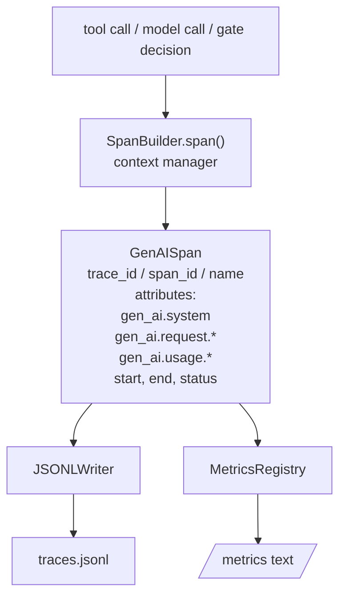
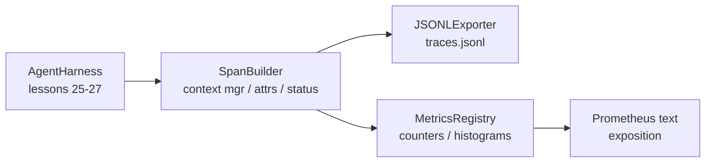

# 综合项目课程 28：使用 OTel GenAI Spans 与 Prometheus 指标实现可观测性

> 缺乏可观测性的智能体框架（agent harness）就是一个烧钱的黑盒。本课程将手动实现一个 Span 构建器，它生成符合 OpenTelemetry GenAI 语义规范的记录，以每行一个 Span 的格式写入 JSON-Lines 文件，并以 Prometheus 文本格式暴露计数器（counters）和直方图（histograms）。整个实现仅依赖 Python 标准库，且支持离线运行。

**类型：** 构建
**语言：** Python (标准库)
**前置条件：** Phase 19 · 25（验证门控）、Phase 19 · 26（沙箱）、Phase 19 · 27（评估框架）、Phase 13 · 20（OpenTelemetry GenAI）、Phase 14 · 23（OTel GenAI 规范）
**预计时间：** 约 90 分钟

## 学习目标

- 构建符合 OpenTelemetry GenAI 语义规范的 Span 数据类。
- 实现一个 JSONL 导出器，每行写入一个自包含的 Span。
- 构建带标签的计数器和直方图，并支持 Prometheus 文本格式的指标暴露。
- 将任意可调用对象包装为 Span 上下文管理器，用于记录执行时长、状态和异常。
- 验证生成的 Span 通过 `json.loads` 进行往返序列化后，其结构符合规范定义。

## 问题背景

生产环境中的代码智能体在每一轮交互中都会产生三类产物：模型调用、工具执行以及验证门控决策。如果没有结构化的遥测数据，这些产物都将失去价值。

第一种故障模式是追踪链路（trace）缺失。周二出了问题，但唯一的记录是一段 500 行的聊天日志。没有任何记录表明具体是哪个工具被执行、耗时多久、提示词中包含了多少 token，或者门控是否拒绝了某些请求。智能体的开发者只能靠猜。

第二种故障模式是无法解析的追踪链路。框架虽然写入了 Span，但使用了自定义的临时字段名。Grafana、Honeycomb、Jaeger 或本地 CLI 都无法读取它们。团队栈中现有的任何工具链都因此失效，因为 Span 不符合标准。

第三种故障模式是未聚合的指标。你可以在追踪链路中看到某次缓慢的工具调用，但你无法回答“过去一小时内 `read_file` 调用的 p95 延迟是多少？”因为没有指标数据，只有追踪链路。

OpenTelemetry GenAI 语义规范正是为此而生。它定义了一组跨大语言模型（LLM）框架的 Span 发射器共享的标准属性。如果你的框架写入这些属性，所有兼容 OTel 的后端都能直接读取。

## 核心概念



框架中的每个操作都会生成一个 Span。Span 包含 trace id（整个智能体调用）、span id（当前操作）、名称（例如 `gen_ai.chat`、`gen_ai.tool.execution`）、遵循 GenAI 规范的属性、开始与结束时间，以及状态。

GenAI 规范对这些属性键进行了标准化：`gen_ai.system`（提供商，例如 `anthropic`、`openai`）、`gen_ai.request.model`（模型 ID）、`gen_ai.request.max_tokens`、`gen_ai.usage.input_tokens`、`gen_ai.usage.output_tokens`、`gen_ai.response.model`、`gen_ai.response.id`、`gen_ai.operation.name`，以及针对特定工具的键 `gen_ai.tool.name` 和 `gen_ai.tool.call.id`。

导出器输出 JSONL 格式。每行一个 JSON 对象。这是下游工具流式处理、grep 搜索和导入的最简格式。真实的 OTel 导出器会使用 OTLP gRPC 协议；本课程的 JSONL 导出器是其离线等效实现，并在每台工作机上以退出码 0 正常退出。

指标与追踪链路并存。每次工具调用时计数器递增：`tools_called_total{tool="read_file"}`。直方图记录观测到的延迟：`tool_latency_ms{tool="read_file"}`。两者均序列化为 Prometheus 文本暴露格式，这是拉取型指标的事实标准。

## 架构设计



Span 构建器是一个小型类，包含一个返回上下文管理器的 `span(name, attrs)` 方法。该上下文管理器在进入时记录开始时间，退出时记录结束时间，若发生异常则附加异常信息，并将最终确定的 Span 推送至导出器。

指标注册表由两个字典组成。计数器实现为 `{(name, frozen_labels): int}`。直方图在列表中保存原始样本，并在暴露时序列化为 Prometheus 直方图桶。

## 你将构建的内容

`main.py` 将交付以下内容：

1. `GenAISpan` 数据类：trace_id, span_id, parent_span_id, name, attributes, start_unix_nano, end_unix_nano, status, status_message, events.
2. `SpanBuilder` 类，带有 `span(name, attrs, parent=None)` 上下文管理器。
3. `JSONLExporter` 类，带有 `export(span)` 方法用于追加一行。
4. `Counter` 和 `Histogram` 类，以及 `MetricsRegistry`。
5. `prometheus_exposition(registry)`，用于生成文本格式的输出。
6. `wrap_tool_call(name)` 装饰器，用于发射 Span 并更新指标。
7. 演示程序：合成一次完整的智能体调用（在工具 Span 外层包裹 gen_ai.chat Span），写入 traces.jsonl，打印 Prometheus 暴露内容，并以退出码 0 正常退出。

Span ID 和 Trace ID 是由 `os.urandom` 生成的 16 字节十六进制字符串。这与 OTel 的 W3C 追踪上下文保持一致。导出器绝不会抛出异常；IO 错误会被上报，但框架会继续运行。

直方图采用固定的桶集合（OTel 默认的毫秒级延迟分桶：5, 10, 25, 50, 100, 250, 500, 1000, 2500, 5000, 10000, +Inf）。样本以列表形式存储；暴露时按需计算各桶的计数。

## 为何手动实现而非使用 opentelemetry-sdk

OTel Python SDK 是一个真实的外部依赖。它包含数千行代码，涉及多个进程用于 OTLP 导出器，且运行时开销会严重超出课程实验的资源预算。手动实现版本旨在教授底层数据交换格式（wire format）。在生产环境中，你可以将相同的属性接入真实的 SDK，从而免费获得 OTLP 导出器、批量处理和资源检测功能。

这些规范是稳定的。本课程输出的数据交换格式将在 2030 年仍可被解析，因为 OTel 永远不会破坏 GenAI 属性命名；它们只会新增属性。

## 与 Track A 其他模块的集成关系

课程 25 生成了门控链。课程 26 生成了沙箱。课程 27 生成了评估框架。课程 28 使这三者具备可观测性。课程 29 将端到端演示的每一步都包裹在 Span 中，并在最后打印 Prometheus 文本。

## 运行方式

```bash
cd phases/19-capstone-projects/28-observability-otel-traces
python3 code/main.py
python3 -m pytest code/tests/ -v
```

演示程序会在课程的工作目录中生成一个 `traces.jsonl`（执行完毕后清理），随后打印三个 Span 的示例，接着打印计数器和直方图的 Prometheus 暴露内容。测试将验证 Span 能否正确完成往返序列化、是否存在标准的 GenAI 属性、计数器是否正确递增，以及直方图暴露内容是否包含预期的桶计数。
