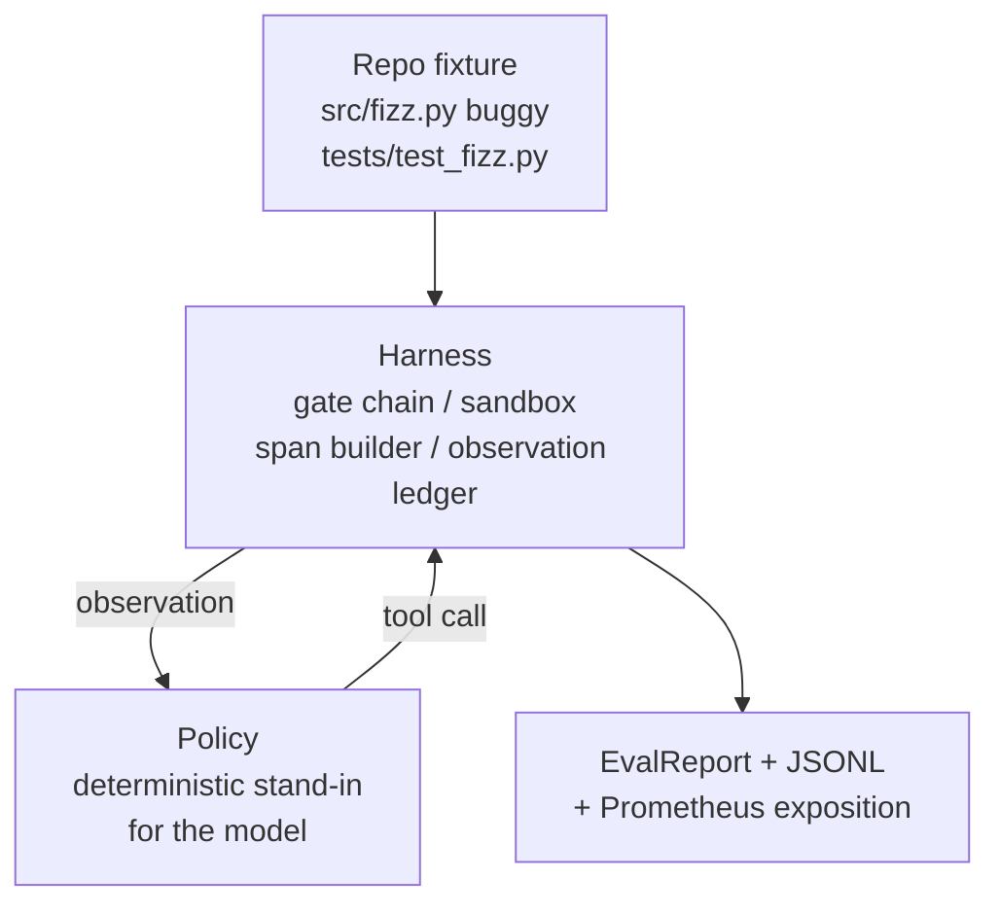
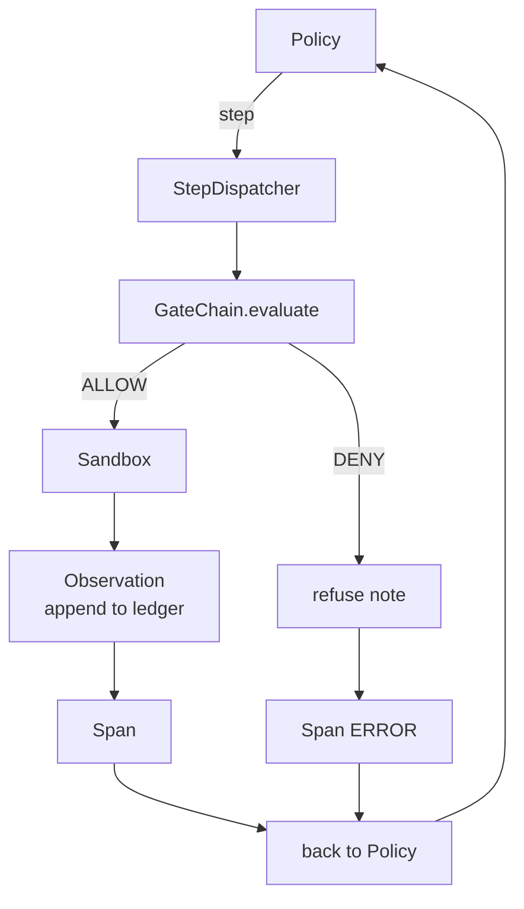

# 毕业设计课程 29：基于评估框架的端到端编码智能体

> Track A 的最终交付成果。本课程将门禁链（gate chain）、沙箱、评估框架（eval harness）和 OTel span 整合为一个可工作的编码智能体，用于修复多文件 Python 项目中的一个真实（小型、测试用例规模）缺陷。该智能体采用确定性策略而非大语言模型（LLM）；这一替换确保了课程的可复现性，并表明框架本身才是核心所在。接口契约保持一致：实际模型只需接入策略接口即可。

**类型：** 构建
**语言：** Python（标准库）
**前置要求：** Phase 19 · 25（验证门禁）、Phase 19 · 26（沙箱）、Phase 19 · 27（评估框架）、Phase 19 · 28（可观测性）、Phase 14 · 38（验证门禁）、Phase 14 · 41（真实仓库工作台）、Phase 14 · 42（智能体工作台毕业设计）
**耗时：** 约 90 分钟

## 学习目标

- 将门禁链、沙箱、评估框架和 span 构建器组合为单一的智能体循环。
- 实现一个确定性策略，通过调用 `read_file`、`run_tests` 和 `write_file` 来修复测试用例缺陷。
- 在端到端运行中强制执行全局步骤预算与观察 token 预算。
- 为完整运行过程输出完整的 OTel GenAI 追踪记录和 Prometheus 指标。
- 验证智能体能在少于 12 步内解决测试用例问题，且对合法工具调用零次触发门禁拦截。

## 问题背景

大多数智能体演示都是孤立运行的：单独的沙箱、单独的评估框架、单独的 span 发射器。它们各自看起来都没问题。但一旦将它们组合在一起，接口缝隙就会暴露出来。

门禁链返回允许（ALLOW），但沙箱却因门禁链未预料到的原因拒绝执行。评估框架记录为通过（pass），但 OTel span 显示门禁拦截了智能体声称使用过的工具。Prometheus 计数器本应只递增一次却递增了两次。观察预算已超标，但智能体仍在继续运行，因为预算仅在门禁链中跟踪，而沙箱并不知情。

本课程是整个学习路径的集成测试。智能体必须按顺序完成一系列操作：读取项目、运行测试、根据测试失败信息定位缺陷、编写修复代码、重新运行测试并停止。每个操作都必须经过门禁链。每次工具执行都必须经过沙箱。每一步都被包裹在一个 span 中。最后由评估框架对整个流程进行评分。

## 核心概念



智能体的策略是一个状态机，包含五个状态。

`SURVEY`：智能体读取项目目录列表。下一状态为 `RUN_TESTS`。

`RUN_TESTS`：智能体运行测试命令。如果测试通过，状态机以成功状态终止。否则进入下一状态 `INSPECT`。

`INSPECT`：智能体读取失败的源文件。下一状态为 `FIX`。

`FIX`：智能体写入修正后的文件。下一状态为 `VERIFY`。

`VERIFY`：智能体再次运行测试命令。如果测试通过，则以成功状态终止。否则以失败状态终止。

每个状态对应一次工具调用。每次工具调用都需经过门禁链。如果工具调用被拒绝，智能体会在追踪记录中报告拒绝信息并终止运行。

测试用例中的缺陷是 `fizz.py` 中的一处差一错误（off-by-one）。确定性策略通过正则表达式从测试失败消息中检测出该缺陷，并生成修正后的文件。将策略替换为 LLM 不会改变框架的接口契约。

## 架构设计



本课程内容完全自包含。前序课程的每个基础组件都在 `main.py` 中以最小规模重新实现（包括 gate、sandbox、ledger、span），以便本课程无需导入其他模块即可独立运行。这些名称与第 25-28 课完全一致，确保概念映射清晰无歧义。

## 你将构建的内容

`main.py` 包含以下内容：

1. 最简化的框架基础组件，沿用第 25-28 课的命名：`GateChain`、`Sandbox`、`ObservationLedger`、`SpanBuilder`、`MetricsRegistry`。
2. `CodingAgentPolicy` 类：包含五个状态的状态机。
3. `Repo` 辅助函数：准备包含内置缺陷测试用例的临时目录。
4. `AgentRun` 类：驱动策略执行，通过框架分发任务，并返回 `AgentRunReport`。
5. 内置测试用例（`fixture_repo/`），包含 `src/fizz.py`、`tests/test_fizz.py` 以及供评估框架使用的 `expected/` 目录树。
6. 演示脚本：端到端运行策略，打印逐步追踪记录，断言通过情况，并输出指标数据。

内置测试用例的结构与第 27 课的任务结构相同：包含一个有缺陷的文件和一个测试文件。测试失败消息中包含足够的信息，使确定性策略能够定位修复方案。实际的 LLM 也能完成同样的工作，只是速度较慢且召回范围更广，但这不会改变框架的预期行为。

## 为何策略不使用 LLM

真实的 LLM 需要 API 密钥、网络请求以及不可验证的随机性。本课程的核心关注点在于框架本身。使用确定性策略替代 LLM，使得课程可以在任何开发者笔记本电脑上运行，无需任何外部依赖，同时允许测试套件精确断言步骤计数。

本课程的策略仅是 LLM 智能体所做工作的严格子集。策略读取仓库、查看失败的测试、定位具体行号并生成修复代码。LLM 也会经历相同的循环，并遵循相同的框架契约；底层开销记录逻辑完全一致。

## 演示断言内容

端到端演示在退出时会断言五项内容，测试套件将以编程方式重新验证这些断言。

策略在少于 12 步内解决了测试用例问题。

观察预算从未超标。

针对合法工具触发的门禁拒绝次数为零。（智能体从未虚构过被拒绝的工具名称。）

`traces.jsonl` 中的每一步都有对应的 span。

Prometheus 暴露数据中包含 `tools_called_total{tool="read_file"}` 条目和 `tool_latency_ms` 直方图。

## 与 Track A 其余部分的集成关系

本课程是最终的集成环节。第 25 课编写了门禁链，第 26 课编写了沙箱，第 27 课编写了评估框架，第 28 课编写了可观测性模块。第 29 课证明了它们作为系统协同工作。实际的智能体框架可在此基础上扩展：将确定性策略替换为模型，将内置测试用例替换为真实仓库任务，将 JSONL 导出器替换为 OTLP。

## 运行方式

```bash
cd phases/19-capstone-projects/29-end-to-end-coding-task-demo
python3 code/main.py
python3 -m pytest code/tests/ -v
```

演示脚本会打印每步追踪记录、最终评估报告和 Prometheus 暴露数据。退出码为 0。测试覆盖了策略状态转换、合成工具调用的门禁拒绝情况、内置测试用例的端到端运行以及步骤预算不变量。
