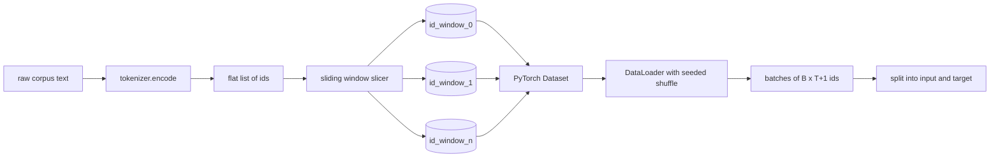
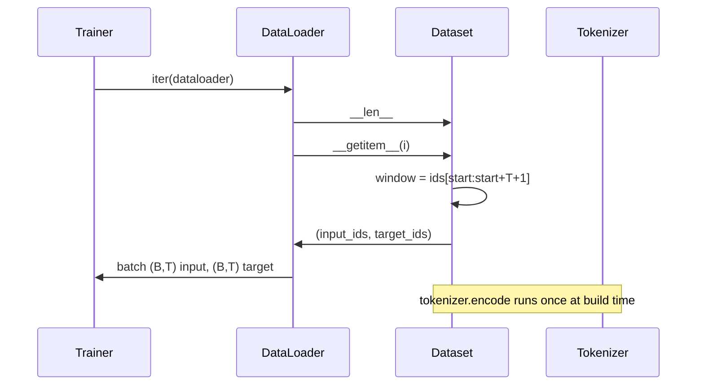

# 使用滑动窗口的分词数据集

> 一次预训练运行是从词元 ID 到梯度的函数。本课程将构建向其中输入这些 ID 的流水线。

**类型：** 构建
**语言：** Python
**前置课程：** Phase 04 课程、Phase 07 Transformer 课程、本阶段的第 30 课
**预计时间：** 约 90 分钟

## 学习目标
- 通过调用一次分词器（tokenizer），将原始语料库转换为词元 ID 流。
- 使用可配置的重叠步长（stride），将 ID 流切片为固定长度的窗口。
- 构建一个 PyTorch Dataset，用于返回用于下一个词元预测的输入和目标张量。
- 将数据集包装在 DataLoader 中，并使用按轮次（epoch）设置种子的确定性打乱（shuffle）。
- 分析步长、冗余度与有效数据集大小之间的权衡关系。

## 整体框架

一次预训练运行每次读取一批词元 ID 并更新模型。每个批次的形状由训练契约固定。对于因果语言模型，批次包含 `(B, T)` 个输入 ID 和 `(B, T)` 个目标 ID，其中目标 ID 是输入向左移动一位的结果。数据管道的任务是以确定且可复现的方式，按需从可能高达数 GB 的原始文本语料库中生成符合该契约的数据。

本课程将构建该流水线。上一课的分词器将文本转换为一个长长的扁平 ID 列表。滑动窗口将该列表切片为训练样本。自定义 Dataset 将这些样本以张量形式暴露出来。DataLoader 将它们分批并进行已知种子的打乱。

## 形状契约

因果语言模型（LM）接收形状为 `(B, T)` 的 ID，其中 `B` 表示批次大小，`T` 表示上下文长度。位置 `t` 处的目标等于位置 `t+1` 处的输入。这意味着每个训练样本覆盖 `T+1` 个原始 ID。窗口步长控制连续样本之间的重叠程度。

切片器永远不会与语料库的边界重叠。如果最后一个窗口没有足够的 ID 来填充 `T+1` 个位置，切片器会将其丢弃。用 `<|pad|>` 对尾部进行填充也是一种有效选择，但会增加损失掩码（loss mask）的复杂度。在本课程中，我们选择直接丢弃。

## 为什么使用滑动窗口

预训练语料库是一个长长的 ID 流。如果模型只看到不重叠的窗口，那么每个训练样本都会教它相同的 `T` 边界。调整步长可以改变这些边界的位置，使模型接触到更多样化的“预测下一个词元”任务。

步长为 `T` 时产生不重叠的窗口。步长为 `T // 2` 时产生 50% 的重叠，并使有效数据集翻倍。步长为 `1` 时产生最大重叠，并将数据集规模扩大 `T` 倍。代价是每个轮次需要更多的计算量。收益是更多的边界多样性。大多数预训练运行使用等于上下文长度的步长，因为语料库通常远大于模型在一个轮次内能处理完的数据量，因此边界多样性的论点相对较弱。

## Dataset 类

PyTorch Dataset 有两个必需的方法。`__len__` 返回样本数量。`__getitem__` 返回一对张量形式的单个样本。我们的 Dataset 存储编码后的 ID 流和步长。对其进行索引时会动态计算窗口的起始位置，因此无论步长产生多少样本，内存开销仅为一份 ID 流的副本。

左移一位的操作发生在 `__getitem__` 内部。Dataset 返回 `(input, target)`，其中 `input = window[:-1]` 且 `target = window[1:]`。两者均为 PyTorch long 类型张量。训练循环将它们视为真实标签（ground truth）。

## 确定性打乱

带有 `shuffle=True` 的 DataLoader 会从 PyTorch 随机数生成器中读取数据。通过传入按轮次显式设置种子的 `torch.Generator`，我们可以在每次重启运行时获得相同的打乱顺序。当你希望比较仅在单个超参数上不同的两次运行时，这一特性至关重要。如果没有种子，两次运行将以不同的顺序查看数据，导致损失曲线因与变更无关的原因而发散。

本课程中的种子契约很简单。`epoch_seed = base_seed + epoch_index`。基础种子在构造时传入。轮次索引由 Trainer 在每个轮次开始时递增。使用相同的基础种子重新运行，每个轮次看到的顺序始终一致。

## 批次采样器

PyTorch 的默认采样器以无放回的方式均匀随机选取索引。这正是预训练所需要的。对于在小数据集上的微调，契约也是相同的。DataLoader 通过调用 `__getitem__` `B` 次并堆叠结果来组装批次。由于每个样本在构造时长度都相同，因此不需要填充逻辑。

为了简化起见，本课程保持 `num_workers=0`。在生产环境中，工作进程（workers）会对 `__getitem__` 调用进行并行化处理。在我们的流水线中，这基本上是一个空操作（no-op），因为工作仅仅是切片一个内存张量，但相同的 Dataset API 能够干净利落地支持工作进程。

## 统计样本数量

对于长度为 `N` 的 ID 流、上下文长度 `T` 和步长 `S`，样本数量为 `max(0, 1 + (N - (T + 1)) // S)`。本课程将该计算作为 Dataset 上的静态方法暴露出来，以便 Trainer 无需迭代即可计算每个轮次的总步数。

## 本课程不涉及的内容

它不支持从磁盘流式读取。语料库完全在内存中编码，并作为单个张量保存。对于数百万 ID 的语料库，其大小远低于一百兆字节，非常适合本课程的需求。磁盘流式读取是一个独立的问题域，可以通过替换存储模块来接入，同时保持 Dataset 契约不变。

它不处理多文档情况。语料库被视为一个连续的 ID 流。当语料库由多个文档构建时，通过在文档边界处插入 `<|endoftext|>` ID 来编码下一文档的边界。模型将学习如何预测跨越边界的序列。

## 如何阅读代码

`main.py` 定义了两个类和一个辅助函数。`SlidingWindowDataset` 是 PyTorch Dataset。`make_dataloader` 返回一个配置好带种子的生成器的 DataLoader。`_encode_corpus_to_ids` 是一次性分词器调用。底部的演示程序会在进程中构建一个小分词器，编码内置语料库，构建数据集和数据加载器，打印一个批次，并断言形状契约。`code/tests/test_dataset.py` 中的测试验证了窗口计数公式、左移一位属性、确定性打乱以及步长权衡。

运行演示程序。然后将上下文长度从 16 更改为 32，观察每个轮次的样本数量如何下降。这个数字就是你的每轮步数预算。
