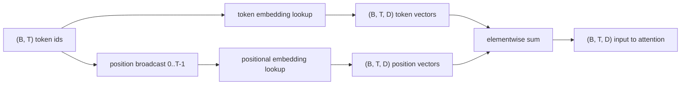
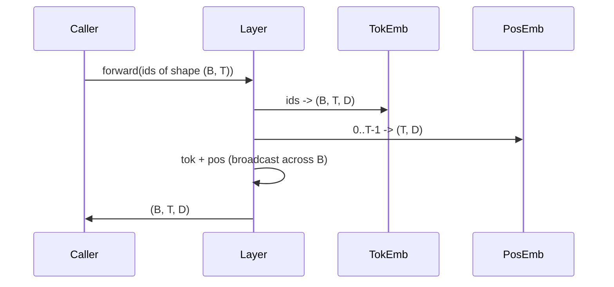

# 词元与位置嵌入

> ID 是整数。模型需要的是向量。两者之间隔着两个查找表，而位置查找表的选择决定了模型能学到什么。

**类型：** 构建
**语言：** Python
**前置课程：** Phase 04 课程、Phase 07 Transformer 课程、本阶段的第 30 和 31 课
**预计时间：** 约 90 分钟

## 学习目标
- 构建一个将词汇 ID 映射为稠密向量的词元嵌入查找表。
- 构建一个按位置索引的可学习位置嵌入查找表。
- 构建一个无参数、按位置索引的固定正弦位置嵌入。
- 将词元嵌入与位置嵌入组合成单个输入，供 Transformer 模块使用。
- 从长度泛化能力和参数量两个方面对比可学习嵌入与正弦嵌入。

## 核心逻辑

模型首次接触词元 ID 时，会在词元嵌入矩阵中进行行查找。该矩阵的每一行对应一个词汇 ID，每一列对应一个模型维度。查找操作返回一个向量，模型的其余部分将其视为该 ID 的含义。反向传播会更新前向传播中使用过的行。随着训练的进行，这些行的几何结构会逐渐学会在方向上编码相似性。

单独的词元 ID 没有顺序信息。模型需要第二个信号来告知它位置 1 与位置 17 是不同的。针对该信号的两种主流选择是可学习的位置嵌入（第二个查找表，每个位置一行）和固定的正弦位置嵌入（一个无参数的数学公式）。这一选择会带来不同的影响。可学习的表包含参数，且受限于模型训练时的最大上下文长度。正弦表在理论上是无参数的，且公式可推广至任意位置，但本课的 `SinusoidalPositionalEmbedding` 在 `max_context_length` 处预计算了一个固定表，且其 `forward` 会超出该界限；因此这两个模块在此处都强制限制了最大上下文长度。即使表足够大以支持索引，模型在处理超过训练长度的序列时仍可能遇到困难。

本课将实现这两种方法，并将它们与词元嵌入组合，作为下一课注意力模块的单一输入。

## 形状契约

嵌入阶段的输入是一个形状为 `(B, T)` 的词元 ID 批次。输出是一个形状为 `(B, T, D)` 的张量，其中 `D` 表示模型维度。每个批次元素具有相同的上下文长度 `T`。每个位置具有相同的向量维度 `D`。



组合方式是相加，而非拼接。相加操作使 `D` 在网络中保持不变，并允许模型逐特征地决定在每一层中是词元含义还是位置信息占主导。

## 词元嵌入矩阵

词元嵌入是一个形状为 `(V, D)` 的参数张量，其中 `V` 为词汇表大小。PyTorch 通过 `nn.Embedding(V, D)` 提供它。初始化时，条目值从一个小方差的高斯分布中采样，传统上对于 Transformer 规模的模型，均值为零，标准差约为 `0.02`。具体的初始化方式不如在整个运行过程中保持一致重要。

前向传播仅是一次索引操作。PyTorch 通过收集行，将 `(B, T)` 类型的 int64 ID 映射为 `(B, T, D)` 类型的浮点数。反向传播仅将梯度累积到前向传播中访问过的行。若某两行在批次中从未出现，则在该步骤中接收到的梯度为零。

一个细微的细节：词元嵌入与模型末尾的输出投影通常共享权重（权重绑定）。当发生这种情况时，每次反向传播都会通过输出端触及嵌入矩阵的每一行。本课将它们暴露为独立的模块，但在完整的模型中，同一个矩阵可同时承担这两种角色。

## 可学习的位置嵌入

可学习的位置嵌入是另一个形状为 `(max_context_length, D)` 的 `nn.Embedding`。查找键为位置 ID `0, 1, 2, ..., T-1`。前向传播将该位置向量沿批次维度进行广播。

可学习表的缺点在于，如果模型仅在位置 `T-1` 之前进行过训练，则无法查询位置 `T`。该行不存在。采用此方案的纯解码器生产级模型会将最大上下文长度硬编码到架构中，并拒绝处理更长的输入。

## 正弦位置嵌入

正弦位置嵌入是一个从位置到向量的函数。位置 `p` 和特征 `i` 生成

```python
angle = p / (10000 ** (2 * (i // 2) / D))
emb[p, 2k]     = sin(angle)
emb[p, 2k + 1] = cos(angle)
```

该函数没有参数。每个位置都有唯一的向量。波长在特征维度上呈几何变化，因此低维编码粗略位置，高维编码精细位置。

同时选择 `sin` 和 `cos` 所带来的性质是：位置 `p + k` 处的向量是位置 `p` 处向量的线性函数。这为注意力层学习相对位置偏移提供了便利途径。模型无需单独的参数来表达“回看五个词元”。

本课在构造时一次性计算完整的正弦表，并在前向传播时对其进行索引。

## 组合方式

输入流水线按顺序执行三件事：读取词元 ID。查找词元向量。加上位置向量。返回求和结果。



求和步骤中的广播操作沿批次维度复制了 `(T, D)` 的位置张量。PyTorch 会自动处理这一点，因为位置张量在 unsqueeze 后形状为 `(1, T, D)`。

## 对比分析

本课在同一输入上运行两种变体，并打印两项诊断指标。

第一项是参数量。可学习变体在词元嵌入的基础上增加了 `max_context_length * D` 个参数。正弦变体增加零个参数。

第二项是相邻位置嵌入之间的余弦相似度。正弦变体具有平滑且可预测的衰减特性，因为其函数是连续的。可学习变体在初始化时具有近乎随机的相似度，因为这些行是独立采样的。训练完成后，可学习变体通常会发展出类似的平滑结构，但它必须从数据中发现这种结构。

## 本课不涉及的内容

本课不实现旋转位置编码（RoPE）或 AliBi。它们是生产级 Transformer 的现代选择。它们都遵循与此处嵌入相同的形状契约（对形状为 `(B, T, D)` 的向量应用依赖于位置的变换），但它们作用于注意力投影步骤，而非输入阶段。下一课将构建注意力模块，其中一个可选扩展是将旋转编码折叠到其中的查询-键投影中。

本课不训练嵌入。训练需要损失函数，这需要模型输出，而模型输出又需要注意力和 LM head。那是下一课以及下下课的内容。

## 如何阅读代码

`main.py` 定义了三个模块。`TokenEmbedding` 封装了 `nn.Embedding(V, D)`。`LearnedPositionalEmbedding` 封装了 `nn.Embedding(L, D)`。`SinusoidalPositionalEmbedding` 预计算该表并将其作为缓冲区暴露。`EmbeddingComposer` 将词元嵌入与位置嵌入绑定在一起。底部的演示程序会打印形状、参数量以及相邻位置相似度诊断指标。`code/tests/test_embeddings.py` 中的测试用例验证了形状、广播行为、参数量以及正弦公式。

运行演示程序。然后将模型维度 `D` 从 64 改为 32，观察正弦波长带的变化。
