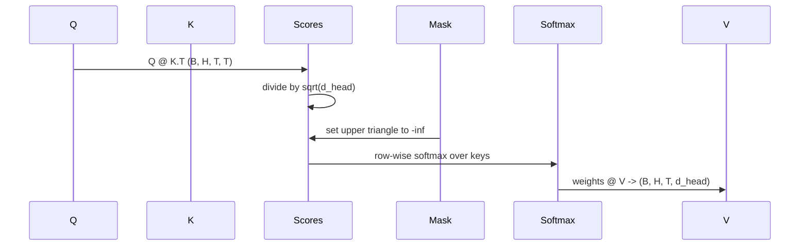

# 多头自注意力

> 一次线性投影，三个视图，H 个并行头，一个掩码。模型实际使用的注意力模块。

**类型：** 构建
**语言：** Python
**前置条件：** 第 04 阶段课程、第 07 阶段 Transformer 课程、本阶段的第 30 至 32 课
**耗时：** 约 90 分钟

## 学习目标
- 实现批处理的 Query/Key/Value 投影，将其作为单个线性层并拆分为 H 个头。
- 使用正确的归一化和数据类型处理计算缩放点积注意力。
- 应用因果掩码，防止位置关注未来位置。
- 检查固定输入下每个头的注意力权重，并推理每个头关注的对象。
- 在玩具任务上训练小型注意力模块，观察损失随头部专业化而下降的过程。

## 框架概述

注意力机制是一种函数，它允许词元的表示从同一序列中的其他词元中提取信息。自注意力意味着查询（Query）、键（Key）和值（Value）均源自相同的输入。多头意味着将投影拆分为 H 个并行的注意力问题，其输出被拼接后再次进行投影。

高效的实现模式是使用一个线性层，将数据从 `D` 投影到 `3 * D`，然后切片为三个视图，再重塑为 H 个头，每个头的大小为 `D // H`。矩阵乘法（matmul）、Softmax 和加权求和均以批处理张量操作的形式执行，从而使各个头在加速器上并行运行。

本课将构建该模块。同时还会添加因果掩码，使同一段代码能够作为仅解码器语言模型中的注意力层使用。下一课会将该模块堆叠成完整的 Transformer，再下一课将进行训练。

## 形状契约

输入形状为 `(B, T, D)`。输出形状为 `(B, T, D)`。掩码形状为 `(T, T)` 或可广播至该形状。在模块内部，中间张量的形状为 `(B, H, T, d_head)`，其中 `d_head = D // H`。约束条件为 `D % H == 0`。

```mermaid
flowchart LR
    A["(B, T, D) input"] --> B[Linear D -> 3D]
    B --> C["split into Q, K, V"]
    C --> D["reshape to (B, H, T, d_head)"]
    D --> E["scores = Q @ K.T / sqrt(d_head)"]
    E --> F[apply causal mask]
    F --> G[softmax over keys]
    G --> H["context = weights @ V"]
    H --> I["reshape to (B, T, D)"]
    I --> J[output Linear D -> D]
    J --> K["(B, T, D) output"]
```

两个线性层（QKV 投影和输出投影）是模块中唯一的参数。掩码、Softmax、矩阵乘法和重塑操作均不包含参数。

## QKV 拆分

朴素实现包含三个独立的线性层，分别用于 Q、K 和 V。高效实现则使用单个输出 `3 * D` 特征的层，并对结果进行拆分。两者在数学上是等价的，因为三次分别乘以 `(D, D)` 权重的矩阵乘法，完全等价于一次乘以由它们堆叠而成的 `(3D, D)` 权重的矩阵乘法。

高效版本速度更快，因为加速器只需启动一次矩阵乘法而非三次。它也更容易初始化，因为三个子矩阵存在于同一个参数张量中，可以一起初始化。

## 头重塑

拆分后，Q、K、V 的每个形状均为 `(B, T, D)`。为了将其转化为 H 个并行的注意力问题，我们将其重塑为 `(B, T, H, d_head)` 并转置为 `(B, H, T, d_head)`。此时头维度紧邻批次维度，因此 PyTorch 会将每个头的注意力视为跨越 `B * H` 个独立实例的批处理操作。

d_head 维度保持在最后，以便分数矩阵乘法 `Q @ K.transpose(-2, -1)` 对其进行收缩。结果是 `(B, H, T, T)` 的每个头注意力分数。

## 缩放

Softmax 之前，分数会除以 `sqrt(d_head)`。如果没有该缩放，点积会随着 `d_head` 的增长而增大，并将 Softmax 推入一种状态：其中一个元素的值几乎占据全部概率质量，而其他元素微乎其微。在这种状态下梯度极小，导致学习停滞。除以 `sqrt(d_head)` 可使分数方差在不同头尺寸下大致保持恒定。

## 因果掩码

仅解码器语言模型在预测下一个词元时只能依赖历史信息。掩码强制执行这一限制。具体而言，在 Softmax 之前，`(T, T)` 分数矩阵对角线上方的所有元素都会被替换为负无穷大。经过 Softmax 后，这些位置的权重变为零。

我们在构造时将掩码注册为缓冲区，使其与模型位于同一设备上，且不参与梯度图计算。掩码覆盖该模块可能遇到的最大上下文长度。在前向传播时，我们会截取左上角的 `(T, T)` 区域。

## 输出投影

获取每个头的上下文向量 `(B, H, T, d_head)` 后，我们将其转置回 `(B, T, H, d_head)`，重塑为 `(B, T, D)`，并应用最终的 `(D, D)` 线性投影。输出投影允许模型混合各个头的信息。如果没有它，这 H 个头只能通过后续层重新组合，从而导致该模块受到人为限制。

## 注意力权重检查

本课在前向传播中暴露了一个 `return_weights=True` 标志。当启用时，模块会连同输出一起返回形状为 `(B, H, T, T)` 的每个头注意力权重。演示程序会在短输入上打印一个头的权重热力图，以便你观察因果三角结构和每个位置的聚焦情况。

在训练好的模型中，不同的头会学习到不同的模式。有些头关注紧邻的前一个词元，有些头关注序列的起始位置，有些头则近乎均匀地分散注意力。该检查钩子正是开展此类可解释性工作的入口。

## 训练演示

`main.py` 底部的演示程序将注意力模块连接到一个微小的 LM 头，并在重复任务上训练整个系统。输入的每一行都是单个随机 ID 在上下文中的复制。目标是输入向右平移一位，因此模型必须学会下一个词元与前一个词元相同。损失函数为交叉熵。在 H=4、D=32、T=12、词表大小为 64 的情况下，损失在 CPU 上经过三个 epoch 会从随机状态（约 `log(64) ~ 4.16`）下降到远低于 `1.0` 的水平。

该演示的目的并非训练一个有用的模型，而是确认梯度能够流经模块的每一个部分，并且头能够在答案显而易见的问题上学到东西。

## 本课未实现的内容

本课不会添加前馈块。真实模型中的 Transformer 层是注意力机制后接一个两层 MLP，并在每层周围带有残差连接和层归一化。下一课会补充这些内容。

本课不会实现 Rotary 或 AliBi 位置编码。两者都在同一模块的 QKV 投影步骤中应用，但它们属于独立的教学单元。此处构建的模块通过在矩阵乘法之前转换 Q 和 K，即可兼容这两种编码。

本课不会为推理实现 KV Cache。跨前向传播缓存键和值是实现自回归解码加速的关键优化。它会改变 K 和 V 张量的形状契约，但不影响 Q。这部分内容属于推理课程。

## 如何阅读代码

`main.py` 定义了 `MultiHeadSelfAttention`。该类包含两个线性层和一个注册的掩码缓冲区。前向传播依次执行投影、重塑、计算分数、应用掩码、Softmax、加权、重塑和再次投影。底部的演示程序构建了一个小型模型，用词元嵌入和位置嵌入包装注意力机制，并加上 LM 头，在复制任务上训练三个 epoch，然后打印损失曲线和每个头的注意力热力图。`code/tests/test_attention.py` 中的测试用例验证了形状契约、因果属性、Softmax 属性、头拆分属性和梯度流。

运行演示程序。然后将 `n_heads` 从 4 增加到 8（保持 `d_model=32` 不变，因此 `d_head=4`），并观察热力图的变化。
