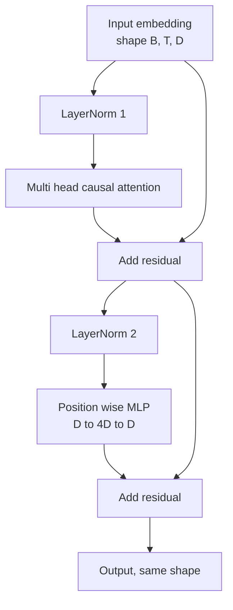
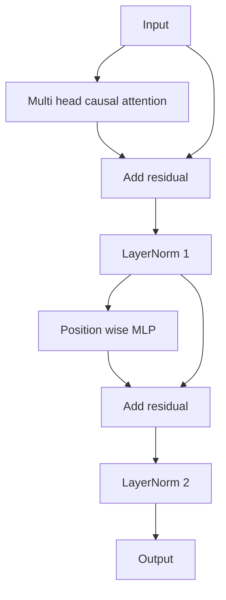

# Transformer Block 从零实现

> 每个现代解码器 LLM 的基本单元都是一个 Transformer Block。包含 LayerNorm、多头注意力、残差连接、MLP、残差连接。Pre-LN 变体无需预热即可稳定训练。Post-LN 变体是原始论文采用的版本。本课将并排构建这两种变体，并展示在常见学习率下，哪一种能在 12 层堆叠中保持稳定。

**类型：** 动手实现
**语言：** Python
**前置课程：** 第 19 阶段课程 30 至 33（分词器、嵌入、注意力数学原理、批量数据加载器）
**预计时间：** 约 90 分钟

## 学习目标

- 使用 PyTorch 从零构建 Transformer Block，整合四个核心组件：LayerNorm、多头因果注意力、残差连接、逐位置 MLP。
- 采用两种配置（Pre-LN 和 Post-LN）放置 LayerNorm，并解释为何其中一种无需预热即可稳定训练。
- 在多头注意力内部实现因果掩码，确保 token `i` 无法看到 token `j > i`。
- 追踪梯度在 12 层堆叠中的两种变体间的流动情况，并能直观解读结果，避免模糊表述。
- 在下节课组装 1.24 亿参数的 GPT 模型时，可直接复用该 Block 作为即插即用单元。

## 问题背景

Transformer 的本质是重复堆叠同一个 Block。如果 Block 实现有误，重复十二次后，你交付的模型要么在第一轮训练就发散，要么后续全程依赖预热技巧来维持稳定。本课中你将遇到的两种失败模式并不罕见。它们通常出现在学习者首次盲目堆叠 Block 时。一种是注意力层“窥探”了未来；另一种是 LayerNorm 放置的位置不当，导致在深层网络中无法有效约束残差信号。

一旦看清结构，修复方法就很机械化了。该 Block 恰好包含两条残差路径和两个归一化位置。选对位置后，其余堆叠工作只是简单的代码组织。

## 核心概念

每个仅解码器的 Transformer Block 本质上是一个函数：接收形状为 `(batch, sequence, embedding)` 的张量，并返回相同形状的张量。其内部由两个子层完成计算。



这是 Pre-LN 变体。LayerNorm 位于残差分支内部、子层之前。残差连接负责传递未归一化的信号。

Post-LN 变体则将 LayerNorm 移至残差相加之后。



两者形状完全一致，但训练行为截然不同。在 Post-LN 中，沿残差路径反向传播的梯度必须穿过 LayerNorm。当网络深度达到 12 层且学习率为 `3e-4` 时，该梯度衰减过快，以至于需要配合预热调度策略。Pre-LN 保持残差路径未归一化，因此梯度能够干净利落地传播至嵌入层。正因如此，GPT-2 及之后的模型均采用此配置。

### 因果多头注意力

注意力子层将输入分别投影为查询（Query）、键（Key）、值（Value）张量。每个张量的形状从 `(B, T, D)` 重塑为 `(B, H, T, D/H)`，其中 `H` 表示头数。缩放点积注意力在每个头上计算 `softmax(Q K^T / sqrt(d_k))`，将上三角区域掩码设为负无穷，通过 Softmax 应用掩码，再与 `V` 相乘。各头的输出拼接回单个 `(B, T, D)` 张量，并再次进行投影。掩码是唯一赋予模型因果特性的部分。若遗漏掩码，训练出的模型就会“作弊”。

### MLP（多层感知机）

逐位置 MLP 独立地对每个 token 应用相同的两层网络。隐藏层宽度是嵌入宽度的四倍，激活函数为 GELU，第二层线性层后接 Dropout。MLP 内部不存在 token 间的信息交互。所有 token 混合均发生在注意力机制中。

### 残差连接的两个作用

它们使跨深度的梯度路径呈加法关系，从而在整个 12 层网络中将梯度范数维持在合理量级。此外，它们让每个 Block 学习的是对当前表示的增量更新，而非完全替换。正是这两个特性使得该 Block 具备良好的可扩展性。

## 动手实现

`code/main.py` 实现了以下功能：

- `class LayerNorm`：支持可学习的缩放与平移参数，带偏置的 epsilon，按每个 token 向量应用。
- `class MultiHeadAttention`：包含 `num_heads`、`head_dim = d_model // num_heads`、融合 QKV 投影、注册的因果掩码、注意力 Dropout 与残差 Dropout。
- `class FeedForward`：包含两个线性层、GELU 激活函数与 Dropout。
- `class TransformerBlock`：包含一个 `pre_ln` 标志位，用于切换上述两种变体。
- 演示脚本：使用相同输入构建 6 层 Pre-LN 堆叠与 6 层 Post-LN 堆叠，并打印 (a) 输出形状，(b) 一次反向传播后嵌入层的梯度范数。

运行方式：

```bash
python3 code/main.py
```

输出结果：检查两种堆叠的输出形状，并排显示梯度范数。在相同学习率下，Pre-LN 堆叠的嵌入层梯度比 Post-LN 堆叠大一个数量级，这从经验上印证了 Pre-LN 无需预热即可稳定训练。

## 技术栈

- `torch`：负责张量数学运算、自动微分以及 `nn.Module` 底层支撑。
- 无 `transformers`，无预训练权重。该 Block 完全基于基础算子从头实现。

## 工业界常见实践模式

三种模式可将教科书式的 Block 转化为可直接部署的工程实现。

**融合 QKV 投影。** 三个独立的线性层会导致三次内核启动和三次矩阵乘法。使用一个宽度为 `3 * d_model` 的线性层可在一次启动中完成相同工作，随后沿最后一个轴拆分输出。融合路径在所有加速器上速度更快，且与 GPT-2、LLaMA 和 Mistral 参考实现的做法一致。

**注册的因果掩码缓冲区。** 掩码仅依赖于最大上下文长度。在构造时使用 `register_buffer` 一次性分配，每次前向传播时切片获取活跃窗口，从而跳过逐次调用时的内存分配。忽略此优化会在长上下文场景下使掩码成为内存分配的热点。

**仅在两处使用 Dropout，而非三处。** Dropout 应置于注意力 Softmax 之后（注意力 Dropout）以及 MLP 第二个线性层之后（残差 Dropout）。若在残差本身添加 Dropout，会破坏允许梯度在深层流动的加法恒等映射。早期某些实现曾在此处犯错，导致训练过程极不稳定。

## 使用指南

- 本课的 Block 可直接无缝接入第 35 课的 GPT 组装流程，无需修改。
- Pre-LN 变体是现代开源权重 LLM 的标准配置。Post-LN 变体是 2017 年原始注意力论文所用的方案。掌握两者足以阅读你将来遇到的任何解码器架构。
- 将 GELU 替换为 SiLU，即得到 LLaMA 系列的激活函数。将 LayerNorm 替换为 RMSNorm，即得到 LLaMA 系列的归一化方法。整体骨架保持不变。

## 练习

1. 为 Block 中的每个线性层添加 `bias=False` 标志位。现代开源权重 LLM 通常在 Linear 层中不使用偏置。请测量在 12 层、768 维的模型中能节省多少参数。
2. 用手动实现的 RMSNorm 替换 `nn.LayerNorm`，并验证输出形状保持不变。
3. 添加一个标志位，以 `(B, T, T)` 张量形式返回第一个头的注意力权重。绘制上三角区域以确认 Softmax 后其为零。
4. 构建一个合理性检查（sanity check）：将形状为 `(2, 16, 384)`、长度为 `H=6` 的张量输入两种变体，并在权重初始化相同且 Dropout 设为零的条件下，断言前向输出不同（例如满足 `not torch.allclose`）。

## 核心术语

| 术语 | 常见说法 | 实际含义 |
|------|----------|----------|
| Pre-LN | “前置归一化” | LayerNorm 位于残差分支内部、每个子层之前；残差传递未归一化的信号 |
| Post-LN | “后置归一化” | LayerNorm 位于残差相加之后；2017 年论文采用的方案，需要配合预热使用 |
| Causal mask | “三角形掩码” | 将注意力 logits 的上三角区域设为负无穷，使得 token i 无法读取 j > i 的 token j |
| Fused QKV | “融合投影” | 使用一个宽度为 3D 的线性层替代三个宽度为 D 的线性层；单次内核启动，单次矩阵乘法 |
| Residual stream | “跳跃连接” | 贯穿每个 Block 自上而下流动的未归一化张量；每个 Block 向其叠加增量更新 |

## 延伸阅读

- 第 7 阶段课程 02（从零实现自注意力）：了解本 Block 底层的注意力数学原理。
- 第 7 阶段课程 05（完整 Transformer）：了解同一骨架的编码器-解码器版本。
- 第 10 阶段课程 04（预训练 Mini GPT）：了解本 Block 所接入的训练流程。
- 第 19 阶段课程 35（本课程后续）：将十二个此类 Block 堆叠为完整的 GPT 模型。
