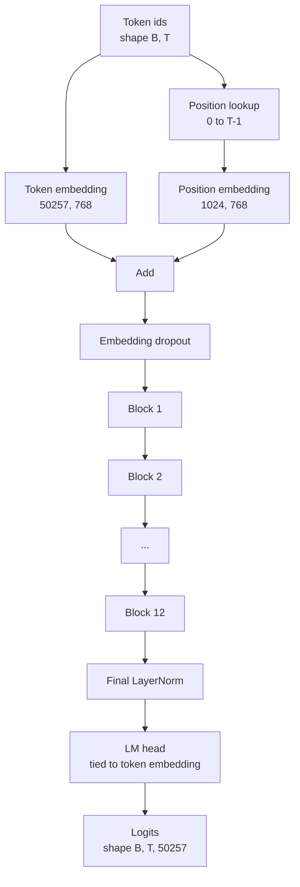
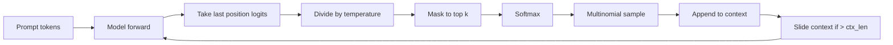

# GPT 模型组装

> 十二个模块堆叠、一个词元嵌入（token embedding）、一个可学习的位置嵌入（learned position embedding）、一个最终的 LayerNorm，以及一个权重绑定的语言模型头（tied language model head）。这就是整个拥有 1.24 亿参数的 GPT 模型。本课程将这些组件组装为一个可工作的类，统计参数数量以确认模型与参考的 124M 结构匹配，并使用多项式采样、温度缩放和 top-k 生成文本。

**类型：** Build
**语言：** Python
**前置课程：** Phase 19 lessons 30 to 34
**耗时：** ~90 minutes

## 学习目标

- 将课程 34 中的 Transformer 模块组装为完整的 GPT 模型：词元嵌入、位置嵌入、N 个模块、最终 LayerNorm、语言模型头。
- 复现 1.24 亿参数配置：词表大小 50257、上下文长度 1024、嵌入维度 768、12 个注意力头、12 层网络。
- 将语言模型头的权重与词元嵌入进行绑定，并解释为何在此规模下能节省约 3800 万参数。
- 从提示词生成文本，使用多项式采样、温度缩放和 top-k 截断，并通过滑动窗口保持上下文长度。
- 测量参数数量和前向传播成本，并与 124M 目标进行对比。

## 问题描述

Transformer 模块本身无法独立工作。你需要将词元 ID 转换为向量，融入位置信息，将其送入网络栈进行处理，最后再投影回词表 logits。忽略其中任何一步，模型要么无法完成前向传播，要么位置信息发生漂移，要么根本无法输出文本。

模型的维度配置同样关键。参考版的 GPT-2 small 在上述精确配置下恰好拥有 1.24 亿参数。这些数字并非魔法。词表大小 50257 乘以嵌入维度 768 构成了词元表。位置长度 1024 乘以 768 构成位置表。12 个模块每个约含 700 万参数，共计 8400 万。最终的头通过权重绑定复用了词元表。将所有部分相加，正好得到 1.24 亿。如果构建的模型参数数量与参考值不符，说明你的连接方式有误。

## 核心概念



词元 ID 变为词元向量。位置 ID 变为位置向量。两者相加后送入网络栈。最终的 LayerNorm 是脱离模块之外、在所有现代变体中都保留的关键组件。LM 头复用了词元嵌入矩阵，这就是权重绑定的含义。

### 权重绑定

词元嵌入的形状为 `(vocab, d_model)`。语言模型头需要将数据从 `d_model` 投影回 `vocab`。这两者是彼此的转置。绑定两者意味着字面意义上使用同一个参数张量两次。在词表大小 50257 且 d_model 为 768 的情况下，该矩阵包含 3800 万参数。若不绑定，你需要支付两份开销；若绑定，只需支付一份，并且由于嵌入和头部同步更新，你还能获得更清晰的梯度信号。

### 位置嵌入是可学习的，而非正弦型

GPT-2 采用可学习的位置嵌入。位置表是一个形状为 `(1024, 768)` 的参数张量。模型在前向传播时查找位置 0 到 T-1，并将查表结果加到词元嵌入上。这是最简单的定位方案之一（其他替代方案包括 RoPE、ALiBi、T5 relative bias），也是 124M 参考实现所使用的方案。

### 文本生成：温度、top-k、多项式采样

生成过程是自回归的。在每一步，模型都会返回所有位置上完整词表的 logits。我们仅取最后一个位置的输出，除以温度系数，可选地将除 top-k 之外的所有 logits 掩码为负无穷，执行 softmax 得到概率分布，然后从该分布中采样一个词元。



三个调节旋钮，三种不同的行为表现。温度接近零时会退化为贪心解码。温度为 1 时匹配模型的自然分布。top-k 为 1 时等同于贪心解码。top-k 为 40 时会过滤长尾分布。组合方式至关重要；下一节关于训练的课程将把生成结果作为定性评估信号。

## 动手实现

`code/main.py` 实现了以下功能：

- 一个包含 124M 默认配置的 `class GPTConfig` 数据类：`vocab_size=50257`、`context_length=1024`、`d_model=768`、`num_heads=12`、`num_layers=12`、`mlp_expansion=4`、`dropout=0.1`、`use_bias=True`、`weight_tying=True`。
- 一个 `class GPTModel` 类，包含词元嵌入、位置嵌入、嵌入 Dropout、12 个 `TransformerBlock` 模块、最终 LayerNorm，以及一个当标志位开启时与词元嵌入绑定的 `lm_head`。
- 一个 `count_parameters` 辅助函数，用于返回唯一参数数量（确保权重绑定在计数中得到正确体现）。
- 一个 `generate` 函数，负责处理温度缩放、top-k 截断、多项式采样和滑动窗口上下文管理。
- 一个演示脚本，用于构建模型，打印与参考 124M 对比的参数数量，并从固定提示词生成短序列，以展示端到端流水线运行正常。

运行方式：

```bash
python3 code/main.py
```

输出内容：与 124M 参考值并列的参数数量、来自随机提示词的生成词元 ID，以及确认在启用绑定时 LM 头与词元嵌入共享存储的信息。

为了保持演示脚本的运行速度，该脚本还会端到端运行一个极小配置（`d_model=64`、`num_layers=2`）并在内联打印生成的词元序列。124M 配置会被构建，但仅会执行参数统计和前向传播测试。

## 技术栈

- `torch` 用于张量数学运算、autograd 和模块基础架构。
- `code/main.py` 在本地重新实现了课程 34 中的相同模块模式。

## 生产环境中的最佳实践

以下三种模式决定了模型是仅仅“能跑”还是能够“上线”。

**将残差投影的初始值设小。** 注意力的输出投影和 MLP 的第二个线性层都直接参与残差相加。如果将它们与其他线性层一样用相同的标准差初始化，会导致残差流随深度增加而膨胀，使最终的 LayerNorm 进入不稳定的高激活区域。将这两个投影的标准差缩小为原来的 `1 / sqrt(2 * num_layers)`；这样残差流在 12 层网络中都能保持在合理范围内。

**缓存位置 ID 张量，避免重复计算。** `torch.arange(T)` 会在每次前向传播时分配新内存。应在 `__init__` 中为最大上下文长度预先分配一次内存，每次调用时切片获取前 T 个条目，从而跳过内存分配的往返开销。

**在参数级别绑定权重，而非简单复制。** 设置 `lm_head.weight = token_embedding.weight` 会共享同一个张量；而复制则不会。优化器需要更新单一参数，autograd 图也需要单次梯度累加。如果你选择复制，头部权重将与嵌入权重逐渐偏离，权重绑定也就失去了意义。

## 应用场景

- 本课程中的模型类结构与下一节课训练的模型完全一致。
- 将可学习的位置嵌入替换为 RoPE，即可在不改动模块和头部的情况下获得 LLaMA 系列架构。
- 将 GELU 替换为 SiLU，并将 LayerNorm 替换为 RMSNorm，即可完成 LLaMA 系列的其余架构变更。
- 生成函数适用于任何 logits 来源，不仅限于本模型。你可以从课程 37 的预训练 GPT-2 文件中提取 logits，并重用相同的生成循环。

## 练习

1. 解除 LM 头与词元嵌入的绑定，并重新统计参数数量。验证减少的数量是否为 50257 × 768 = 3800 万。
2. 将可学习的位置嵌入替换为在构造时计算的正弦位置表。确认模型仍能正常前向传播，且参数数量减少 786,432。
3. 为生成函数添加一个 `greedy=True` 标志位，使其跳过采样步骤并直接选取 argmax。确认生成的序列在不同运行中保持一致（确定性）。
4. 添加一个 `repetition_penalty` 调节项，在 softmax 之前将提示词或已生成历史中任意词元的 logit 除以一个常数。在固定提示词下演示，大于 1 的值会降低输出中的重复次数。
5. 在 `top_k` 旁边添加 `top_p`（核采样/Nucleus sampling）。用两行代码检查保留词元的概率之和是否超过 `top_p`。

## 核心术语

| 术语 | 常见说法 | 实际含义 |
|------|----------|----------|
| Weight tying | "Tied embeddings" | LM 头与词元嵌入共享同一个参数张量；可节省 vocab × d_model 个参数，与 GPT-2 参考实现一致 |
| Position embedding | "Learned positions" | 一个形状为 (context length, d_model) 的独立表格，加到词元向量上；端到端联合学习 |
| Sliding window context | "Context cap" | 当提示词与生成词元总数超过上下文长度时，丢弃最旧的词元，使活跃窗口适配限制 |
| Top-k sampling | "K truncation" | 保留 K 个最高值的 logits，将其余掩码为负无穷，对剩余部分执行 softmax |
| Temperature | "Sampling temperature" | softmax 前将 logits 除以 T；T < 1 使分布尖锐，T = 1 保持自然分布，T > 1 使分布平坦 |

## 延伸阅读

- Phase 19 lesson 34 for the block this model stacks.
- Phase 19 lesson 36 for the training loop that drives this model with cross entropy loss.
- Phase 19 lesson 37 for loading pretrained GPT-2 weights into this exact architecture.
- Phase 7 lesson 07 (GPT causal language modeling) for the math of next token prediction.
- Phase 10 lesson 04 (pre training mini GPT) for the original training procedure on the same architecture.
