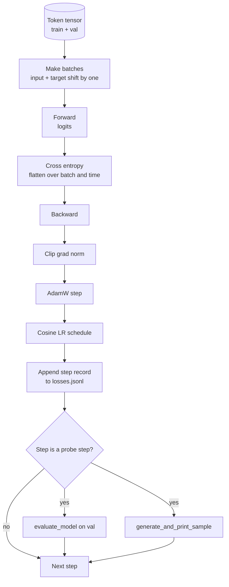

# 训练循环与评估

> “不测量的循环，只会自欺欺人。”本课将构建驱动 GPT 模型的训练循环：包含权重衰减分组的 AdamW、带线性预热和余弦衰减的学习率调度、一个 `calc_loss_batch` 辅助函数、在预留数据上的 `evaluate_model` 评估、每 K 步执行一次的 `generate_and_print_sample` 定性探测，以及可供后续绘图的损失 JSONL 日志。这套骨架将用于训练你未来构建的所有解码器型 LLM。

**类型：** 构建
**语言：** Python
**前置课程：** 第 19 阶段 第 30 至 35 课
**耗时：** 约 90 分钟

## 学习目标

- 构建一个训练循环，为下一个词元预测计算交叉熵损失，并确保输入与目标的正确对齐。
- 配置 AdamW，使权重衰减仅应用于权重张量，而不应用于 LayerNorm 或偏置张量。
- 实现带有线性预热和余弦衰减的学习率调度，并追踪学习率随时间的变化。
- 使用 `evaluate_model` 在预留划分上进行评估，确保不同运行之间的评估损失具有可比性。
- 每 K 步使用 `generate_and_print_sample` 生成定性样本，以便在损失曲线显现异常前捕捉到模型发散。
- 将每一步的损失持久化到 JSONL 文件中，以便重新加载、绘图，并将训练日志作为交付物提交。

## 问题所在

一个只打印损失却不做其他操作的训练脚本会在三个方面失败。它无法告诉你损失下降的原因是否正确（模型可能过拟合了训练集而从未真正学会）。它无法告诉你是否开始出现发散（损失可能单步飙升后恢复，也可能单步直接崩溃）。它无法告诉你模型究竟学到了什么（损失只是一个标量；而生成的样本是一段文本）。除非循环具备测量能力，否则这三种失败都会被掩盖。

本课中的循环通过三种方式进行测量。每一步计算训练批次的损失。每 K 步计算预留批次的损失。每 K 步根据固定提示词生成一段续写内容。训练日志以 JSONL 格式保存，因此该文件就是循环运行的见证。

## 核心概念



两个非直观的关键点是损失对齐和 AdamW 衰减分组。

### 损失对齐

模型在每个位置预测下一个词元。如果输入批次是词元 `[t0, t1, t2, t3]`，那么目标批次必须是 `[t1, t2, t3, t4]`。交叉熵是在展平后的形状 `(batch * seq, vocab)` 与展平后的目标 `(batch * seq,)` 之间计算的。如果忘记移位操作，你就会训练模型去预测自身，这会导致损失收敛到零，但模型实际上什么都没学到。

### AdamW 衰减分组

权重衰减用于正则化权重张量，但不适用于归一化的缩放因子或偏置。对 LayerNorm 的缩放因子施加衰减会使其逐渐趋近于零，从而破坏归一化效果。对偏置施加衰减在数学上无害，但会浪费计算资源。标准的分组方式是：矩阵形状的张量（线性层权重、嵌入表）应用衰减，任何看起来像缩放或平移的参数则不应用衰减。

### Warmup 结合余弦调度

Warmup 会在几百步内将学习率从零线性提升至目标值，使优化器状态有足够时间填充。余弦衰减会在剩余步骤中将学习率逐步降回接近零，以便在最后阶段以小步长微调权重。这种组合是开源权重 LLM 训练中最常用的调度策略，因为它消除了最初一千步和最后一千步中最脆弱的阶段。

### 预留集评估

`evaluate_model` 从验证划分中运行固定数量的批次，累积损失，除以批次数量后返回结果。不计算梯度，不使用 Dropout。只要种子和划分相同，该数值在不同运行间是可复现的。将预留集损失与训练损失并列报告，是发现过拟合的方法。

### 定性采样作为早期信号

一个训练损失下降良好但生成的样本全是同一个词元的模型是损坏的。一个损失曲线看似平坦但生成的样本逐渐变得连贯成词的模型正在学习。定性探测比阅读完整曲线更快，并能捕捉到标量损失所遗漏的模式。

## 动手实现

`code/main.py` 实现了以下功能：

- `make_batches(token_ids, batch_size, context_length)`：将长词元张量切片为输入和目标配对。
- `calc_loss_batch(model, inputs, targets)`：执行前向传播、展平输出，并返回标量交叉熵。
- `evaluate_model(model, val_loader, max_batches)`：在不计算梯度的情况下迭代固定数量的验证批次，并返回平均损失。
- `generate_and_print_sample(model, prompt, max_new_tokens)`：在固定提示词上运行第 35 课的生成函数并打印结果。
- `build_param_groups(model, weight_decay)`：生成两组 AdamW 参数列表。
- `cosine_with_warmup(step, warmup_steps, total_steps, max_lr, min_lr)`：返回指定步数的学习率。
- `train(...)`：运行训练循环，持久化 `outputs/losses.jsonl`，并每隔 `eval_every` 步打印评估损失和样本。
- 一个演示程序：在合成数据上训练极小模型运行少量步数，写入 JSONL 日志，并在探测点打印评估损失和样本。该演示在 CPU 上运行时间远少于 1 分钟。

运行方式：

```bash
python3 code/main.py
```

输出：每步的损失行、每个探测步的评估损失、每个探测步生成的样本，以及最终的 `outputs/losses.jsonl`，你可以使用 `json.loads` 逐行加载它。

## 技术栈

- `torch`：用于自动求导、优化器和模块。
- `main.py`：在本地重新实现了第 35 课的 `GPTModel` 及支持模块。

## 生产环境中的实践模式

三种模式能将教科书式的循环转化为可以通宵运行的可靠系统。

**梯度范数裁剪是绝对必要的。** 一个糟糕的批次（异常数据、学习率尖峰、数值边界情况）会产生巨大的梯度，瞬间抹去数小时的训练成果。在 `backward` 之后、`step` 之前执行 `torch.nn.utils.clip_grad_norm_(params, max_norm=1.0)`，可将优化器保持在安全范围内。裁剪值是一个自由参数；通常设为 1.0，这是能适配大多数设置的默认值。

**可恢复的 JSONL 日志记录，而非 pickle 状态。** 以 `{"step": int, "train_loss": float, "lr": float}` 行记录的每步损失存储在 JSONL 中非常耐用：任何崩溃都会留下可读的产物，你可以用 grep 搜索，可以用三十行 Python 绘图，也可以通过读取最后一步来恢复训练。pickle 状态会将你绑定到生成该文件的精确模块布局上，这在代码重构时非常脆弱。

**从固定切片中抽取评估批次。** 验证词元应在脚本启动时一次性切片为批次，而不是动态生成。可复现性依赖于每次运行时评估批次完全一致；否则，比较两次运行的评估损失实际上是在衡量批次打乱的程度，而非模型本身的差异。

## 应用场景

- 本课中的循环与在真实数据上训练 1.24 亿参数模型使用的是同一套骨架。只需将合成词元张量替换为 `datasets` 风格的加载器，循环即可无缝运行。
- JSONL 日志是将训练过程转化为证据的交付物。下一课将使用它来对比新训练的检查点与预训练检查点。
- 定性样本探测是标量损失无法替代的全面检查手段。

## 练习

1. 添加 `weight_decay_groups()` 单元测试，确认缩放和偏置参数被归入无衰减组，而线性层和嵌入权重被归入衰减组。
2. 将合成的随机词元替换为小型文本文件中的字节，使演示程序能在可读数据上训练。验证生成的样本是否使用了文件中存在的字符。
3. 在余弦调度中添加 `min_lr` 下限，其值为 `max_lr` 的 10%，并重新绘制图表。
4. 除了 JSONL 日志外，每 `eval_every` 步保存一次检查点。添加一个 `resume_from` 标志位，用于重新加载模型状态和优化器状态。
5. 在损失旁边记录每步吞吐量（每秒词元数），并确认其保持在稳定的区间内。

## 关键术语

| 术语 | 常见说法 | 实际含义 |
|------|----------|----------|
| 损失对齐 | “偏移一位” | 输入词元位于位置 0..T-1，目标词元位于位置 1..T；交叉熵在展平后的形状上计算 |
| 衰减分组 | “两组参数” | AdamW 接收带有权重衰减的矩阵形状张量，以及不带衰减的缩放或偏置张量 |
| Warmup | “爬坡” | 学习率在固定步数内从零爬升至目标值，以便优化器状态得以填充 |
| 评估批次 | “预留批次” | 验证词元张量的固定切片，仅在脚本启动时切片一次，每次探测均相同使用 |
| 定性探测 | “样本打印” | 基于固定提示词生成短文本，每 K 步打印一次，以捕获单一损失指标无法隐藏的故障模式 |

## 延伸阅读

- 第 19 阶段第 35 课：了解本循环驱动的模型架构。
- 第 19 阶段第 37 课：了解如何将预训练权重加载到同一模型中。
- 第 10 阶段第 04 课（预训练 Mini GPT）：了解在真实数据上的操作流程。
- 第 10 阶段第 10 课（评估）：了解超越交叉熵损失的更广泛评估维度。
