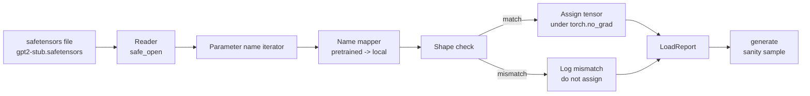

# 加载预训练权重

> 从头训练一个 1.24 亿参数的模型是预算决策；加载已发布的检查点则像过个周二一样平常。本课将从 safetensors 文件中加载预训练的 GPT-2 风格权重到第 35 课构建的精确架构中，逐步梳理参数名称映射过程，并通过生成一段文本续写来验证加载是否成功。无需联网，无需第三方加载器，没有晦涩的黑魔法。

**类型：** 构建
**语言：** Python
**前置课程：** 第 19 阶段课程 30 至 36
**耗时：** 约 90 分钟

## 学习目标

- 使用 `safetensors` Python 库读取 safetensors 文件，并检查张量名称和形状。
- 将每个预训练参数名称映射到第 35 课 GPT 模型中的对应参数。
- 处理发布版 GPT-2 权重与本教程模型之间存在的两种命名差异：`wte/wpe/h.N.attn.c_attn/c_proj` 和 `mlp.c_fc/c_proj` 与本地命名的 `tok_embed/pos_embed/blocks.N.attn.qkv/out_proj` 和 `mlp.fc1/fc2`。
- 在分配任何权重之前，检测并拒绝形状不匹配的情况，并给出清晰的错误提示。
- 使用加载后的权重生成一段简短的续写，确认生成的 token 来自加载后的分布，而非随机初始化的分布。

## 问题所在

发布的权重并非为你的架构打包。它们携带的是原始实现所使用的名称。预训练文件包含形状为 `(2304, 768)` 的 `transformer.h.0.attn.c_attn.weight`；而你的模型期望的是形状为 `(2304, 768)` 的 `blocks.0.attn.qkv.weight`（这实际上是同一矩阵的不同布局约定），或者你的模型使用了存储了转置矩阵的 `nn.Linear`。同一个参数会以三种微妙不同的身份出现（名称、形状、字节布局），而加载器必须协调这三者。

盲目复制的加载器会将正确的张量放到错误的位置，导致模型生成乱码。当形状不同时拒绝复制却什么都不记录的加载器会让你无从猜测哪个张量加载失败。本课的加载器非常明确：每次赋值都会记录日志，每次形状都会检查，并且会生成一份 `LoadReport` 来汇总命中、缺失和形状不匹配的情况，让你清楚了解发生了什么。

## 核心概念



名称映射器只是一个从字符串到字符串的函数。形状检查就是一个 if 语句。赋值操作发生在 `torch.no_grad()` 内部，这样 autograd 就不会追踪加载过程。报告则记录每个名称的处理结果。

### GPT-2 命名约定

已发布的 GPT-2 权重通常使用以下名称：

| 预训练名称 | 形状 | 含义 |
|-----------------|-------|---------|
| `wte.weight` | (50257, 768) | Token 词嵌入 |
| `wpe.weight` | (1024, 768) | 位置嵌入 |
| `h.N.ln_1.weight` | (768,) | 第 N 个模块的 LayerNorm 1 缩放因子 |
| `h.N.ln_1.bias` | (768,) | 第 N 个模块的 LayerNorm 1 偏移量 |
| `h.N.attn.c_attn.weight` | (768, 2304) | 融合 QKV 线性层权重 |
| `h.N.attn.c_attn.bias` | (2304,) | 融合 QKV 线性层偏置 |
| `h.N.attn.c_proj.weight` | (768, 768) | 注意力输出投影权重 |
| `h.N.attn.c_proj.bias` | (768,) | 注意力输出投影偏置 |
| `h.N.ln_2.weight` | (768,) | LayerNorm 2 缩放因子 |
| `h.N.ln_2.bias` | (768,) | LayerNorm 2 偏移量 |
| `h.N.mlp.c_fc.weight` | (768, 3072) | MLP fc1 权重 |
| `h.N.mlp.c_fc.bias` | (3072,) | MLP fc1 偏置 |
| `h.N.mlp.c_proj.weight` | (3072, 768) | MLP fc2 权重 |
| `h.N.mlp.c_proj.bias` | (768,) | MLP fc2 偏置 |
| `ln_f.weight` | (768,) | 最终 LayerNorm 缩放因子 |
| `ln_f.bias` | (768,) | 最终 LayerNorm 偏移量 |

需要预先规划的两个意外情况。`c_attn`、`c_proj`、`c_fc` 线性层的矩阵相对于 `nn.Linear.weight` 的预期是转置存储的。加载器会在赋值时进行转置。LM head 根本不在文件中；模型依赖与 `wte` 的权重共享，因此一旦 `wte` 加载完成，head 就会通过别名设置。

### 本地命名约定

本教程的模型使用描述性名称：

| 本地名称 | 含义 |
|------------|---------|
| `tok_embed.weight` | Token 词嵌入 |
| `pos_embed.weight` | 位置嵌入 |
| `blocks.N.ln1.scale` | 第 N 个模块的 LayerNorm 1 缩放因子 |
| `blocks.N.ln1.shift` | LayerNorm 1 偏移量 |
| `blocks.N.attn.qkv.weight` | 融合 QKV |
| `blocks.N.attn.qkv.bias` | 融合 QKV 偏置 |
| `blocks.N.attn.out_proj.weight` | 注意力输出投影 |
| `blocks.N.attn.out_proj.bias` | 输出投影偏置 |
| `blocks.N.ln2.scale` | LayerNorm 2 缩放因子 |
| `blocks.N.ln2.shift` | LayerNorm 2 偏移量 |
| `blocks.N.mlp.fc1.weight` | MLP fc1 |
| `blocks.N.mlp.fc1.bias` | MLP fc1 偏置 |
| `blocks.N.mlp.fc2.weight` | MLP fc2 |
| `blocks.N.mlp.fc2.bias` | MLP fc2 偏置 |
| `final_ln.scale` | 最终 LayerNorm 缩放因子 |
| `final_ln.shift` | 最终 LayerNorm 偏移量 |

映射关系是一个固定函数。本课将其作为字典提供，供加载器迭代使用。

### 模拟测试数据（Stub Fixture）

真实的 GPT-2 权重文件有 0.5 GB。演示程序不会下载它们；而是在首次运行时生成一个小型 safetensors 模拟文件，采用精确的 GPT-2 命名约定，并为 d_model 192（而非 768）的 12 层模型配置合适的形状。该模拟文件具有正确的结构，可以覆盖加载器的所有代码路径。将模拟文件替换为真实文件后，加载器无需修改即可正常工作。

## 构建实现

`code/main.py` 实现了：

- 第 35 课 `GPTModel` 的小型副本，使本课内容自包含。
- `make_pretrained_to_local(num_layers)`，用于展开每层的条目。
- `load_safetensors(model, path)`，用于遍历名称、进行映射、检查形状、转置 conv1d 风格的权重，并在 `torch.no_grad()` 下执行赋值。返回一个 `LoadReport`。
- `make_stub_safetensors(path, cfg)`，用于生成具有精确预训练命名约定的模拟文件。
- 一个演示流程：首次运行时创建 `outputs/gpt2-stub.safetensors`，构建一个新模型，捕获一次来自随机初始化的生成续写，加载模拟文件，再次捕获续写，打印两者，并验证两者不同（证明加载确实改变了模型）。

运行方式：

```bash
python3 code/main.py
```

输出：模拟文件路径、按名称的加载日志、`LoadReport` 摘要、加载前的续写、加载后的续写，以及针对故意注入的一个错误张量的形状不匹配报错，以覆盖失败路径。

## 技术栈

- `safetensors`，用于磁盘格式和流式读取器。
- `torch`，用于模型和赋值计算。
- 无 `transformers`，无 `huggingface_hub`，无网络调用。

## 生产环境中的实践模式

有三种模式能让加载器在与非你创建的权重对接时保持稳定。

**始终在任何赋值前验证文件。** 打开文件，列出每个张量的名称、dtype 和形状，运行完整的映射与形状检查，仅在成功后开始赋值。半加载的模型是静默失败的温床。

**记录每次赋值的源名称和目标名称。** 当出现问题时，日志能告诉你哪个张量被放到了哪里；否则只能去读十六进制转储。本课中的 `LoadReport` 数据结构类会跟踪 `loaded`、`missing`、`unexpected` 和 `shape_mismatch` 列表，并在最后打印摘要。

**LM head 是权重共享的别名，而非独立的副本。** 加载 `tok_embed` 后设置 `model.lm_head.weight = model.tok_embed.weight` 是标准做法。将嵌入矩阵复制到新的 `lm_head.weight` 参数中会破坏权重共享，并悄无声息地将参数量翻倍。

## 使用方法

- 该加载器适用于任何使用预训练命名约定的 safetensors 文件。真实的 GPT-2 文件（small / medium / large / xl）无需修改代码即可工作；仅需调整模型配置。
- 更新名称映射后，相同模式可扩展至 LLaMA、Mistral、Qwen 权重。形状检查和报告逻辑完全一致。
- 加载后进行基础生成测试是一个快速验证关卡：如果加载后的样本看起来与加载前一样，说明加载未改变模型，这意味着映射静默地漏掉了所有张量。

## 练习

1. 为加载器添加一个 `dtype` 参数，在赋值期间将每个张量转换为目标 dtype（`bfloat16`、`float16`、`float32`）。确认一个 `float32` 模型可以降级为 `bfloat16` 并仍能正常生成。
2. 添加一个 `expected_layers` 参数，拒绝加载其 `h.N` 索引与模型 `num_layers` 不匹配的检查点。
3. 将加载器接入第 35 课的生成函数，并排生成两个样本：一个来自随机初始化，一个来自加载的模拟文件。
4. 添加导出路径：使用预训练命名约定将当前模型状态写入新的 safetensors 文件。对加载器进行往返测试，并确认报告中形状不匹配的数量为零。
5. 扩展 `NAME_MAP` 以处理 LLaMA 命名约定（无偏置项、RMSNorm、融合 qkv 布局），并使用你生成的模拟 LLaMA 文件重新运行加载器。

## 关键术语

| 术语 | 常见说法 | 实际含义 |
|------|-----------------|------------------------|
| Name map | “键重映射” | 从预训练张量名称到本地参数名称的函数；通常是一个字面量字典，针对每个层索引展开循环 |
| Shape mismatch | “形状错误” | 预训练张量在映射后的名称下存在，但其维度与本地参数不一致；加载器会拒绝赋值并记录该对信息 |
| Transpose-on-load | “Conv1d 布局” | 已发布的 GPT-2 将注意力和 MLP 投影以 nn.Linear 预期形式的转置形式存储；加载器会在赋值时进行转置 |
| Weight tying alias | “共享 LM head” | 设置 model.lm_head.weight = model.tok_embed.weight，使 head 和嵌入共享存储；由于此机制，head 不会出现在文件中 |
| Load report | “覆盖率摘要” | 一个小型数据结构类，用于跟踪 loaded、missing、unexpected 和 shape_mismatch 列表；打印它即可判断加载是否成功 |

## 延伸阅读

- 第 19 阶段课程 35：接收权重的架构。
- 第 19 阶段课程 36：生成同形状检查点的训练循环。
- 第 10 阶段课程 11（量化）：内存受限时如何处理加载后的权重。
- 第 10 阶段课程 13（构建完整 LLM 管道）：围绕加载和推理的完整生命周期。
