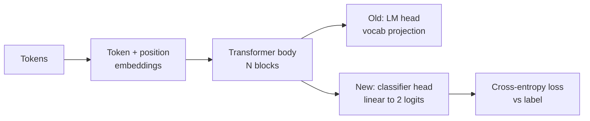
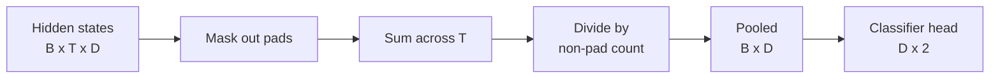
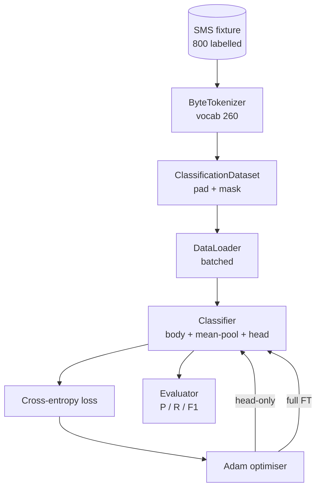

# 毕业设计课程 38：通过头部替换进行分类器微调

> Track B 的第一个毕业设计项目。预训练语言模型是一系列自注意力块的堆叠，末端接一个词元预测头（token-prediction head）。当你需要区分垃圾短信和正常短信时，原有的输出头是错误的，但模型主体（body）的表征基本正确。本课程将移除原有头部，在池化表示上拼接一个二分类线性层，并以两种不同方式训练该分类器：仅训练最后一层，以及全量微调。评估指标为在保留测试集上的精确率、召回率和 F1 分数。你将了解每种策略带来的收益及其代价。

**类型：** 构建
**语言：** Python (torch, numpy)
**前置要求：** Phase 19 课程 30-37（NLP LLM 路线：分词器、词嵌入表、注意力块、Transformer 主体、预训练循环、检查点保存、文本生成、困惑度）
**预计时间：** 约 90 分钟

## 学习目标

- 在不重新初始化主体（body）的情况下，将语言模型头部替换为分类头部。
- 实现两种训练模式：冻结主体（仅训练头部）和全量微调，并共享同一个训练循环。
- 构建感知分词器的数据流水线，完成填充、掩码填充以及池化注意力输出。
- 从原始 logits 计算精确率、召回率、F1 分数及混淆矩阵。
- 分析参数量、训练时间与性能提升空间之间的权衡。

## 问题背景

你在通用语料库上预训练了一个小型 Transformer。输出头部将最后一个隐藏状态投影到 1000 个词元的词表上。你现在有 800 条标注为垃圾短信或正常短信的短信，想要构建一个二分类器。存在三种方案。

错误的方案是在 800 个样本上从头训练一个新的分类器。预训练模型的主体已经编码了有用的结构：词元身份、位置信息、简单的共现关系。丢弃它会浪费构建这些表征所投入的计算资源。

两种正确的方案是：冻结主体的头部替换，以及可训练主体的头部替换。仅训练头部的速度快，内存开销极小，且在数据量如此少的情况下很少过拟合。全量微调速度较慢，在小数据上可能过拟合，但当下游领域与预训练语料分布发生偏移时，能达到更高的准确率。

本课程将同时实现这两种方案，以便你在相同的测试用例上进行对比。

## 核心概念

模型是一个函数 `f_theta(tokens) -> hidden_states`。头部是一个函数 `g_phi(hidden) -> logits`。交换头部意味着保留 `theta` 并替换 `g_phi`。主体的参数是昂贵的部分。头部只是一个单一的线性层。

两个可训练参数集至关重要：

- `theta`（主体）：每个注意力块包含数万维权重。
- `phi`（头部）：包含 `hidden_dim * num_classes` 个权重加上一个偏置项。

在仅训练头部的过程中，你计算针对 `phi` 的梯度，并将针对 `theta` 的梯度置零。PyTorch 允许你通过设置主体参数的 `requires_grad=False` 来实现这一点。优化器随后只能看到头部参数，主体保持冻结。

在全量微调中，你让梯度反向传播穿过整个网络栈。主体的权重会漂移以适应分类目标。风险在于小数据上的灾难性遗忘：主体的预训练知识会被过拟合噪声冲刷掉。

## 池化策略

分类器需要每个序列一个向量，而不是每个词元一个向量。三种常见选择如下：

- **均值池化（Mean pool）**：按注意力掩码加权，对序列上的隐藏状态求平均。
- **CLS 池化（CLS pool）**：在开头添加特殊标记，仅使用其输出。BERT 采用的就是这种方法。
- **末位词元池化（Last-token pool）**：使用最后一个非填充词元。GPT 类分类器通常采用此方法。

本课程使用显式注意力掩码加权的均值池化。它最简单，能在不同序列长度下提供稳定的信号，且不需要预训练 CLS 标记。

## 数据

八百条短信（400 条垃圾短信和 400 条正常短信）在 `code/main.py` 中以确定性方式生成。生成器使用固定随机种子，选择模板并替换槽位填充词，生成长度为 5 到 25 个词元的消息。真实数据集包含噪声，而此测试用例没有。测试用例的目的是保证可复现性。

数据按 80/20 划分：640 条训练，160 条测试。划分采用分层抽样，以保持测试集的 50/50 平衡。具有已知平衡比例的保留测试集使得精确率和召回率能够反映真实水平。

## 评估指标

二分类任务，以类别 1（垃圾短信）为正类。各项计数定义如下：

- `TP`：预测为垃圾短信，实际为垃圾短信。
- `FP`：预测为垃圾短信，实际为正常短信。
- `FN`：预测为正常短信，实际为垃圾短信。
- `TN`：预测为正常短信，实际为正常短信。

三项核心指标：

- `precision = TP / (TP + FP)`。在标记为垃圾短信的消息中，实际是垃圾短信的比例是多少？
- `recall = TP / (TP + FN)`。在实际的垃圾短信中，模型成功标记的比例是多少？
- `F1 = 2 * P * R / (P + R)`。两者的调和平均数。

混淆矩阵将这四项计数以 2x2 网格形式打印出来。演示代码会将此输出到标准输出，涵盖两种训练模式。

## 架构设计

主体是一个刻意设计的小型 Transformer：词表大小 260，隐藏层维度 64，4 个注意力头，2 个块，最大序列长度 32。它足够小，可以在 CPU 上于 90 秒内将两种训练模式都训练至收敛。课程中并未对其进行预训练；相反，`pretrain_quick` 辅助函数会在相同测试用例的文本上进行 5 个 epoch 的语言模型训练，为主体提供一个非平凡的初始点。这保证了课程的独立性。

## 实现内容

实现部分包含一个 `main.py` 模块和一个测试模块（`code/tests/test_main.py`）。

1. `ByteTokenizer`：将字节映射为 ID，并预留填充 ID。
2. `Block`：包含多头注意力和前馈层的 Transformer 块。采用预归一化（Pre-norm）。
3. `LMBody`：词元嵌入与位置嵌入的组合，加上堆叠的块。返回隐藏状态。
4. `MeanPool`：沿序列轴进行掩码加权平均。
5. `Classifier`：主体、池化层与线性头部。在两种模式下主体为同一实例。
6. `freeze_body` 和 `unfreeze_body`：用于切换主体参数的 `requires_grad` 属性。
7. `train_classifier`：共享的训练循环。接收模型和优化器，优化器已根据当前可训练的参数组进行配置。
8. `evaluate`：运行测试集并返回 `Metrics(precision, recall, f1, confusion)`。
9. `run_demo`：短暂预训练主体，随后依次训练并评估仅头部模式和全量模式，打印两份报告后正常退出。

## 为什么进行比较很重要

仅训练头部的模式通常训练更快，且欠拟合表现更平缓。在此测试用例上，经过二十个 epoch 的仅头部训练后，通常可见精确率接近 0.9，召回率接近 0.85。全量微调耗时约三倍，最终结果通常在几个百分点的范围内波动，具体取决于随机种子。

本课程不判定胜负。它教你解读数字背后的含义及其成本。在 800 个样本和小型主体的情况下，仅训练头部是正确的选择。在 80,000 个样本和更大主体的情况下，全量微调开始显现优势。从本课程中获得的核心契约是 API：同一个 `train_classifier` 函数同时处理两种情况，切换只需一次调用。

## 拓展目标

- 添加第三种模式，仅解冻最后一个块。这有时被称为部分微调（partial fine-tuning）。其成本低于全量微调（FT），且比仅训练头部能学到更多内容。
- 添加学习率调度器。头部使用余弦调度，主体使用较小的恒定学习率，这是常见的生产环境配置。
- 用可学习的注意力池化替换均值池化：一个带有单个可学习查询向量的小型注意力层。这在较长序列上通常优于均值池化。

实现代码为你提供了扩展钩子。测试用例锁定了接口契约。性能指标的提升由你来探索。
