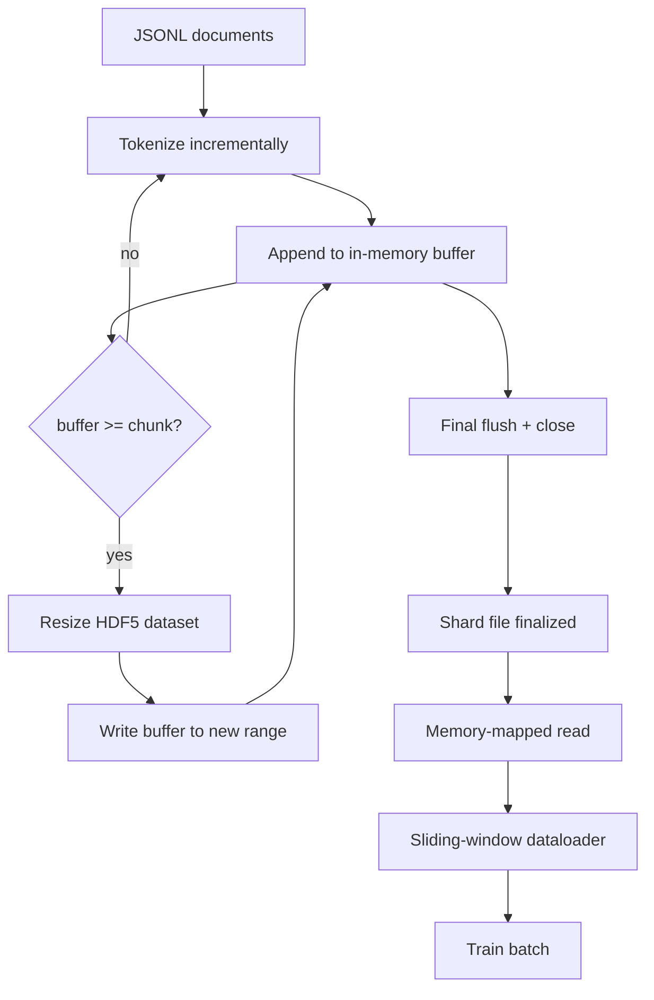

# HDF5 Tokenized Corpus

> 下载的语料库必须采用一种布局，使得训练器能够以线速（line speed）进行流式读取。磁盘上的 JSONL 无法支撑 16 个 dataloader worker。而具有可调整大小、分块整数数据集的 HDF5 可以。本课程将流式 tokenization 构建到可调整大小的 HDF5 数据集中，实现跨多个文件的分片写入、训练时的内存映射读取，以及一个滑动窗口 dataloader，用于生成具有正确打包规则的固定长度序列。

**类型：** Build
**语言：** Python
**前置课程：** Phase 19 第 30-37 课
**耗时：** 约 90 分钟

## 学习目标

- 使用确定性分块，将文档流式写入可调整大小的 HDF5 整数数据集。
- 将写入操作分片到多个 HDF5 文件中，从而限制故障影响范围并支持并行处理。
- 通过 HDF5 的页缓存支持的分块布局读取 tokens，使 dataloader 仅在组批时将其复制到 batch buffer 中。
- 实现一个滑动窗口 dataloader，按照明确的打包规则输出固定长度的训练序列。

## 问题所在

现代大模型训练运行时，数十个 worker 每秒需读取数十万个样本的 tokens。磁盘上的 JSONL 在遇到第一个冷缓存页错误时就会崩溃：JSON 解析器速度慢，文档边界不可寻址，且要“采样 4,217,884”需要扫描整个文件。即使压缩率很高的 Parquet 也不合适，因为训练器不需要列式存储；它需要一个支持 O(1) 随机访问的扁平 token 流。

HDF5 之所以契合，是因为它提供了分块、可调整大小且仅包含整数的数据集，其分块在读取时对页缓存友好。当训练器请求 `tokens[3,200,000 : 3,200,8192]` 的一个切片时，HDF5 会将请求的 hyperslab 从页缓存复制到新分配的 NumPy 数组中。开销仅为每个 worker 一个打开的文件句柄和一个分块大小的页缓存占用，与解码 JSONL 的成本相比微不足道。

构建的难点在于确保写入端的可靠性。可调整大小的数据集很容易被误用：一次只写一个文档会导致 HDF5 文件碎片化到无法使用的地步；一次性调整大小写入所有文档则意味着进程崩溃会丢失整个 shard。正确的做法是“先缓冲再扩展”，缓冲区大小与分块大小匹配，并通过分片写入将负载分散到不同文件中，这样崩溃最多只丢失一个 shard。

## 核心概念



### 正确使用可调整大小的 HDF5

Token 数据集使用 `maxshape=(None,)` 和固定的 `chunks=(chunk_size,)` 创建。写入过程是将 tokens 缓冲到一个长度为 `chunk_size` 的 NumPy 数组中。当缓冲区满时，数据集精确调整大小 `chunk_size`，并将缓冲区内容写入新范围。在 shard 结束时，剩余的缓冲区内容会被写入最后一个不完整的范围。除最后一次写入外，所有写入都是连续且与分块对齐的；最后一次写入时，阅读器会根据 shard 的 HDF5 属性中记录的 `token_count` 进行截断。

### 分片写入

单个 HDF5 文件是一个单点故障源。流水线并行写入 shards：Phase 19 第 42 课的每个输入 shard 都会生成一个 HDF5 输出 shard。一个 `shards.json` 索引按 shard 记录文件路径、token 数量、文档数量以及 tokens 的 sha256 哈希值。训练器读取 `shards.json` 以计算全局偏移量并验证语料库。

### 内存映射读取

在训练期间，每个 worker 以 `swmr=True` 模式打开其负责的 HDF5 文件，并请求 `tokens[start:stop]`。一旦分块被加载到缓存中，HDF5 的分块布局就能使其成为由页缓存支持的读取操作。worker 永远不会将整个文件加载到内存中：切片会被复制到 dataloader 的 batch buffer 中，随后 dataloader 会在组批时将其复制到 pinned-memory 训练张量中。热路径上每次分块切换仅产生一次系统调用；其余均为 RAM 访问。

### 滑动窗口 dataloader

dataloader 是唯一知晓训练序列长度的阶段。它在全局 token 流中选择一个随机起始索引，读取 `window_size + 1` 个 tokens，并返回 `(input, target) = (tokens[:-1], tokens[1:])`。不强制文档边界：一个窗口可能跨越两个文档，中间插入显式的 `boundary_token_id`，以便模型学习如何使用该分隔符。这是标准的打包规则；也是初学者容易忽略的规则，否则会导致语料库中 8% 的训练边界 token 和 92% 的自然文本。

## 动手实现

`code/main.py` 实现了以下功能：

- `Tokenizer` —— 一个字节级确定性 tokenizer，足以满足演示需求。接口为 `encode(text) -> list[int]` 和 `vocab_size`。
- `HDF5ShardWriter` —— 打开可调整大小的整数数据集，将 tokens 缓冲至分块大小，以固定步长调整大小并写入，关闭时记录 `token_count` 和 `sha256` 作为 HDF5 属性。
- `ShardedTokenizationPipeline` —— 遍历输入文档，将其路由至写入器，并输出 `shards.json` 索引。
- `MmapTokenStore` —— 打开 shard 文件以进行内存映射读取，计算全局偏移量，暴露单一的 `get_slice(start, stop)` API。
- `SlidingWindowDataloader` —— 从全局流中选取随机窗口，并 yield `(input_ids, target_ids)` 格式的 NumPy 数组。

文件底部的演示代码会构建一个极小的内存语料库，将其 tokenizes 为两个 shards，通过内存映射打开它们，运行 dataloader 10 个 batch，并打印每个 batch 的形状和校验和。

运行方式：

```bash
python3 code/main.py
```

脚本正常退出（exit code 0）并打印 batch 校验和。

## 生产环境模式

四种模式可将本课程扩展到真实训练运行中。

**分块大小等于典型读取大小。** 训练器每个样本读取 `window_size + 1` 个 tokens。将 HDF5 分块设置为 `window_size` 的倍数，读取即可与页缓存对齐。分块不匹配会使吞吐量减半，因为每个样本都会触及两个分块。

**Token 数量存储在属性中，而非数据集中。** 数据集的尾部切片可能未完全填满，因为分块大小不能整除文档边界。将真实的 `token_count` 存储为数据集的 HDF5 属性，并让阅读器在该值处截断。否则，阅读器会越界读取零填充的 tokens，导致模型学会预测零。

**带并行验证的分片 sha256。** 每个 shard 都有自己独立的 token 字节 sha256 哈希值。训练器可在训练开始前并行验证所有 shard。sha256 错误会提前终止运行，而不是在十六小时后的第三个 epoch 才失败。

**两端均使用 `swmr=True`，写入端启用 `libver="latest"`。** Single-Writer-Multiple-Reader 模式要求写入器以 `libver="latest"` 打开文件，预先创建所有数据集，然后设置 `file.swmr_mode = True`。此后，写入器必须在每次调整后调用 `dataset.flush()`，以便阅读器 worker（以 `swmr=True` 打开）看到一致的数据。跳过 `libver="latest"` 或在结构变更后启用 SWMR 是导致“文件被锁定”错误的常见原因。

## 使用指南

生产环境实践：

- **每个源 shard 对应一个 HDF5 文件。** 下载器（第 42 课）为每个 URL 输出一个 shard；tokenization（本课）为每个源 shard 输出一个 HDF5 文件。1:1 的映射使得断点续传和部分故障恢复变得简单。
- **边界 token id。** 边界 token 属于 tokenizer 词表的一部分，也是 dataloader 唯一注入的 token。如果模型应忽略它，训练损失函数会将其 mask 掉；否则模型会学习将其用作序列分隔符。
- **将 `shards.json` 作为唯一事实来源。** 添加新 shard 意味着写入 HDF5、计算其 sha256 并追加一条记录。训练器仅在启动时读取一次该文件，之后不再触碰目录列表。

## 交付说明

`outputs/skill-hdf5-tokenized-corpus.md` 将在实际项目中描述哪些 tokenizer 为流水线提供数据、何种分块大小匹配训练器的窗口、`shards.json` 在版本控制中的位置，以及 dataloader worker 如何在文件间分片。本课程交付的是核心引擎。

## 练习

1. 向 HDF5 写入器添加 `--compression gzip` 标志，并在演示语料库上测量其对吞吐量的影响。论证所选默认值的合理性。
2. 为滑动窗口 dataloader 添加确定性种子，并验证两次相同种子的运行是否生成相同的 batch。
3. 添加 `--validate` 模式，该模式读取每个 shard，重新计算其 tokens 的 sha256，并与 `shards.json` 进行比较。CI 应在训练开始前运行此检查。
4. 比较分块大小等于、一半于和两倍于窗口大小时的 dataloader 吞吐量。报告页缓存效应。
5. 添加 `--max-document-tokens` 标志，在写入时截断超长文档。论证与在读取时决定的权衡取舍。

## 关键术语

| 术语 | 人们常说的说法 | 实际含义 |
|------|----------------|----------|
| Resizable dataset | “仅追加” | 具有 `maxshape=(None,)` 的 HDF5 数据集，通过以分块大小为步长的 `resize` 调用来增长 |
| Chunked layout | “HDF5 的存储方式” | 固定大小的磁盘页面，内核可对其进行内存映射，dataloader 可连续读取 |
| `swmr` mode | “边读边写” | Single-Writer-Multiple-Reader 模式，允许 dataloader worker 安全地共享文件 |
| Shard index | “shards.json” | 包含所有 token shard 及其偏移量和内容哈希的持久化索引 |
| Sliding window | “训练样本” | 全局 token 流的固定长度切片，训练器会将其与向右偏移一位的目标配对 |

## 延伸阅读

- [HDF5 chunking documentation](https://docs.hdfgroup.org/hdf5/v1_14/) - 本课程使用的分块、可调整大小的数据集布局
- [h5py user guide](https://docs.h5py.org/en/stable/) - HDF5 的 Python 绑定库
- [NumPy memory mapping](https://numpy.org/doc/stable/reference/generated/numpy.memmap.html) - HDF5 通过 h5py 暴露的读取侧基础操作
- Phase 19 · 42 - 本课对其输出进行 tokenization 的下载器
- Phase 19 · 44 - 消费此 dataloader 的余弦调度器
- Phase 19 · 45 - 包装训练步骤的 AMP 循环
