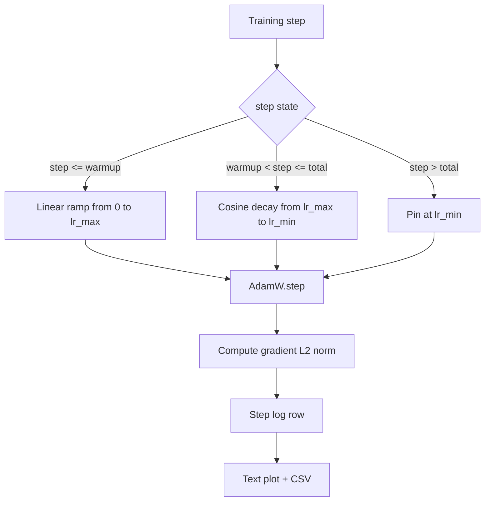

# 带线性预热（Warmup）的余弦学习率调度

> 学习率调度是损失函数之后最重要的决策。AdamW 配合余弦衰减与线性预热是现代语言模型训练的现代默认配置，因为它能让模型在最初一千次更新中保持较小的有效步长，随后逐步攀升至配置的峰值，最后平滑地衰减回零。本课程将构建该调度器，绘制训练步骤上的曲线，记录梯度范数并与调度器并列展示，并验证调度器是否严格遵守预热、峰值和衰减边界。

**类型：** 构建
**语言：** Python
**前置课程：** 第 19 阶段 课程 30-37
**耗时：** 约 90 分钟

## 学习目标

- 实现一个绑定到带线性预热的余弦学习率调度的 AdamW 优化器。
- 计算任意步骤下调度的精确值，确保跨运行无浮点漂移。
- 将梯度 L2 范数与学习率并列记录，以便观察训练健康状况。
- 将调度器渲染为肉眼可读的文本图表以及任何工具均可解析的 CSV 文件。

## 问题背景

最初的千次训练更新最为关键。模型的权重仍接近初始化状态。优化器的二阶矩估计尚未稳定。梯度范数较大且噪声显著。如果在此阶段学习率达到峰值，模型要么直接发散，要么陷入无法逃脱的损失平台期。两个广为人知的解决方案是梯度裁剪（见第 19 阶段课程 45）以及从较小值开始逐步提升的学习率调度。

带预热的余弦调度包含三个区域。从步骤 0 到步骤 `warmup_steps`，学习率从零线性缩放至配置的峰值 `lr_max`。从步骤 `warmup_steps` 到步骤 `total_steps`，学习率遵循余弦曲线的上半部分，从 `lr_max` 衰减至 `lr_min`。超过 `total_steps` 后，学习率被固定在 `lr_min`，以防止配置错误的训练器越界时悄无声息地退出调度。

构建难点在于调度器极易出现“差一错误”（off-by-one）。这种错误通常会在训练进行六小时后显现：当模型开始过拟合时，学习率恰好偏高或偏低 1%，除非在边界处对调度器进行穷举测试，否则这种偏差完全不可见。

## 核心概念



### 预热公式

对于 `step` 处于 `[0, warmup_steps]` 范围内且 `warmup_steps > 0` 的情况，学习率为 `lr_max * step / warmup_steps`。退化的 `warmup_steps = 0` 情况被视为“无预热”：调度器直接在步骤 0 以 `lr_max` 启动，并立即进入余弦衰减阶段。部分测试框架会传入 `warmup_steps = 0` 以验证调度器仍能生成可用的曲线。

### 余弦公式

对于 `step` 处于 `(warmup_steps, total_steps]` 范围内的情况，学习率为 `lr_min + 0.5 * (lr_max - lr_min) * (1 + cos(pi * progress))`，其中 `progress = (step - warmup_steps) / max(1, total_steps - warmup_steps)`。在 `step = warmup_steps` 处，余弦函数计算结果为 `cos(0) = 1`，得出 `lr_max`，与预热终点完全匹配。在 `step = total_steps` 处，余弦函数计算结果为 `cos(pi) = -1`，得出 `lr_min`，与衰减终点完全匹配。

两端点的连续性并非偶然。这正是调度器被实现为覆盖 `step` 的单一函数，而非拼接三个不同函数的原因。拼接的调度器在首次修改 `lr_max` 时会丢失一个边界条件。

### 总步骤后的下限（Floor）

对于 `step > total_steps`，学习率保持在 `lr_min`。契约明确规定：调度器不会报错也不会外推；它会将值固定在下限，并允许训练器记录警告。需要延长训练的训练器应修改调度器的 `total_steps`，而非修改循环。

### 与学习率并列记录梯度范数

调度器占训练健康指标的一半，梯度范数占另一半。训练循环按步骤同时记录两者。发散的训练运行会在损失上升前显示梯度范数尖峰；预热良好的训练会使范数随学习率线性上升；峰值设置过于激进则表现为预热结束后范数依然居高不下。磁盘上的数据集为 `step, lr, grad_l2_norm, loss`。CSV 是唯一持久的记录。

## 构建实现

`code/main.py` 实现了以下功能：

- `CosineWithWarmup` —— 针对配置调度器的无状态函数 `lr(step) -> float`。
- `TrainState` —— 将模型、`AdamW` 优化器和调度器封装为单个步骤函数。
- `TrainState.step` —— 执行一次前向传播、一次反向传播，记录梯度 L2 范数，并将 `lr(step)` 应用于优化器。
- `plot_schedule_ascii` —— 将调度器渲染为肉眼可读的文本图表。
- `write_schedule_csv` —— 每步输出一行包含学习率的数据。

文件底部的演示代码构建了一个微小的 `nn.Linear` 模型，在固定输入批次上训练 20 个步骤，并打印每步的学习率、梯度范数和损失。调度器也会渲染为文本图表以供视觉合理性检查。

运行方式：

```bash
python3 code/main.py
```

脚本将以退出码 0 结束，并打印每步训练日志及调度器图表。

## 生产环境模式

四种模式可将调度器提升为生产级工件。

**调度器应位于配置文件中，而非硬编码。** 训练器从提交到 Git 的 YAML 或 JSON 配置中读取 `warmup_steps`、`total_steps`、`lr_max`、`lr_min`。由于配置文件具有内容寻址特性，调度器可复现；由于配置文件属于 PR 差异的一部分，调度器可审计。

**步骤计数器必须是单调递增的，且与 Epoch 解耦。** 某些框架在数据集分片或 DataLoader 重启时会混淆步骤与 Epoch。调度器应从训练器的检查点读取 `global_step`，而非使用本地计数器。恢复运行能继续在正确的调度位置进行，因为步骤计数器是持久化的基准轴。

**运行目录中包含调度器图表。** 每次训练运行都会将其 `outputs/lr_schedule.png`（在本课程中为文本图表）写入运行目录。审阅者只需浏览目录即可在不重新运行的情况下对调度器进行合理性检查。这能在 PR 阶段捕获配置错误的调度类 Bug。

**日志行 Schema 必须固定。** `step, lr, grad_l2_norm, loss` 按此顺序排列。下游笔记本或仪表板依赖该 Schema；重命名列而不升级版本会使所有现有仪表板失效。

## 使用指南

生产环境实践：

- **优先扫描峰值参数。** `lr_max` 是最敏感的旋钮。先在小型模型上扫描它；最优的 `lr_max` 随模型规模呈弱比例缩放，因此小型模型的扫描结果是一个强先验。
- **预热应为总步骤的比例，而非绝对数量。** 2 亿步的训练若仅预热 2000 步，几乎立即达到峰值；而 2 万步的训练若同样预热 2000 步，则预热占比达 10%。将预热配置为比例（典型值为 1%-3%），使调度器随训练时长自动缩放。
- **`lr_min` 故意设为非零。** 设置为 `lr_max` 的 10% 的下限可使优化器在漫长的尾部阶段继续学习。采用 `lr_min = 0` 调度器会产生看似完美的训练曲线，但模型实际上并未完成训练。

## 交付说明

`outputs/skill-cosine-warmup.md` 在实际项目中会描述哪个配置文件承载了调度器、全局计数器从哪个训练器步骤读取，以及哪个 `lr_max` 扫描生成了部署值。本课程提供的是核心引擎。

## 练习

1. 添加调度器的逆平方根变体，并在 200 步的玩具训练运行中进行对比。哪条曲线能产生更低的最终损失？
2. 添加一个 `--restart` 标志，在 `total_steps / 2` 处添加第二次预热。论证在玩具运行中，热重启（warm restarts）是有益还是有害。
3. 添加单元测试验证调度器的连续性：对于 `[0, total_steps]` 中的每个步骤，差值 `|lr(step+1) - lr(step)|` 必须受限于 `lr_max / warmup_steps`。
4. 将调度器接入 `torch.optim.lr_scheduler.LambdaLR` 以使其能与框架代码组合。本课程使用的是普通步骤函数；包装器带来了什么改变？
5. 添加一个 `--plot-png` 标志，通过 `matplotlib` 写入真实图表。论证在 CI 运行中，本课程的文本图表还是 PNG 图是更好的默认选项。

## 关键术语

| 术语 | 常见说法 | 实际含义 |
|------|-----------------|------------------------|
| Warmup（预热） | “缓慢起步” | 在前 `warmup_steps` 次更新中，从零线性爬升至 `lr_max` |
| Cosine decay（余弦衰减） | “平滑下降” | 在剩余步骤中，从 `lr_max` 到 `lr_min` 的上半段余弦曲线 |
| Floor（下限） | “训练结束后” | 超过 `total_steps` 后，调度器固定的 `lr_min` 值 |
| Gradient norm（梯度范数） | “梯度的 L2 范数” | 拼接后的梯度向量的欧几里得范数，每步记录 |
| Global step（全局步骤） | “调度轴” | 一个能跨越重启的单调步骤计数器，用于驱动调度器 |

## 延伸阅读

- [Loshchilov and Hutter, SGDR: Stochastic Gradient Descent with Warm Restarts (arXiv 1608.03983)](https://arxiv.org/abs/1608.03983) —— 余弦调度器的参考论文
- [Loshchilov and Hutter, Decoupled Weight Decay Regularization (arXiv 1711.05101)](https://arxiv.org/abs/1711.05101) —— AdamW 的参考论文
- [PyTorch torch.optim.lr_scheduler](https://docs.pytorch.org/docs/stable/optim.html#how-to-adjust-learning-rate) —— 步骤函数如何与框架调度器组合
- Phase 19 · 42 —— 本调度器所消耗语料库的下载器
- Phase 19 · 43 —— 与本调度器协同演进的 DataLoader
- Phase 19 · 45 —— 梯度裁剪与 AMP，循环中的下一层
