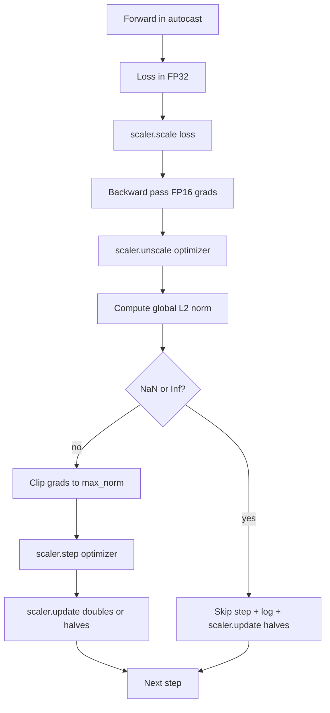

# 梯度裁剪与混合精度

> 上一课的优化器和调度器假设梯度是正常的。但通常并非如此。单个糟糕的批次可能使梯度范数激增三个数量级。混合精度训练通过引入损失端的 FP16 溢出进一步放大了这一问题。本课将构建生产环境训练不可或缺的两道安全防线：将全局 L2 范数裁剪至配置的阈值，以及包含 autocast 和 GradScaler 的混合精度循环，用于检测 NaN 和 Inf、干净地跳过步骤，并记录缩放因子以供事后分析。

**类型：** Build
**语言：** Python
**前置课程：** Phase 19 第 30-37 课
**预计时间：** ~90 分钟

## 学习目标

- 计算所有参数梯度的全局 L2 范数，并在超过配置阈值时进行原地裁剪。
- 使用 autocast 和 GradScaler 包装训练步骤，使 FP16 的前向和反向传播能够安全处理溢出。
- 检测损失或梯度中的 NaN 和 Inf，跳过优化器步骤并记录该跳过操作。
- 每一步报告 GradScaler 的缩放因子，以便立即发现连续的跳过情况。

## 问题所在

昨天运行正常的训练任务在步骤 8,217 处产生了垂直上升的损失曲线。罪魁祸首是单个梯度范数为 4,200 的批次，是之前峰值的二十倍。如果不进行裁剪，优化器会应用一个步长，从而重置模型在过去一小时内学到的所有内容。若在全局 L2 裁剪中设置阈值为 1.0，同一批次仅贡献单位范数的更新；损失保持在趋势线上；训练得以继续。

混合精度训练通过将前向传播和大部分反向传播计算移至 FP16，将吞吐量提升了 2-3 倍。代价是 FP16 的指数范围较窄。典型的在 FP16 中溢出的梯度会评估为 Inf，随后以 NaN 的形式传播到后续层，并在下一次优化器步骤中将所有权重设为 NaN。PyTorch 的 GradScaler 通过在反向传播前将损失乘以一个较大的缩放因子，并在优化器步骤前将梯度除以相同的因子来解决此问题。如果在取消缩放（unscale）时任何梯度为 Inf 或 NaN，scaler 将跳过该步骤并将缩放因子减半；如果之前的 N 个步骤均正常，scaler 会将因子翻倍。在整个训练过程中，因子会找到 FP16 范围允许的最高值。

构建难点在于正确连接这两者。在取消缩放前裁剪，阈值作用于缩放后的梯度；在取消缩放后裁剪，GradScaler 的操作顺序至关重要。正确的顺序是：`scaler.scale(loss).backward()`，然后 `scaler.unscale_(optimizer)`，然后 `clip_grad_norm_`，然后 `scaler.step(optimizer)`，然后 `scaler.update()`。任何其他顺序都会导致静默损坏的循环。

## 核心概念



### 全局 L2 范数

全局 L2 范数是拼接后梯度向量的欧几里得范数，而非每个参数的独立范数。PyTorch 将其实现为 `torch.nn.utils.clip_grad_norm_(parameters, max_norm)`。该函数返回裁剪前的范数，以便本课同时记录自然值和裁剪后的值，这对于“每一步都在裁剪”的诊断是必要的。

### autocast 与 GradScaler

`torch.amp.autocast(device_type)` 是一个上下文管理器，可选择性地在 FP16 中运行符合条件的操作（大多数 matmul 类操作）。`torch.amp.GradScaler(device_type)` 是辅助工具，负责在反向传播前缩放损失，并在优化器步骤前逆缩放梯度。两者是协同设计的；单独使用其中一个属于配置错误，测试应能捕获此类问题。

本课使用 CPU autocast，因为 CI 环境运行于此；只需将 `device_type="cpu"` 更改为 `device_type="cuda"`，该模式即可无缝迁移至 CUDA。CPU 上的 GradScaler 是一个存根（CPU autocast 默认已在 BF16 下运行，无需损失缩放），但本课仍包含调用点，以确保接线方式与 GPU 循环完全一致。

### NaN 与 Inf 检测

检测发生在两个位置。首先，在反向传播前使用 `torch.isfinite` 检查损失本身；Inf 或 NaN 损失不会产生有效的梯度，且会在不进入优化器的情况下被跳过。其次，在 `scaler.unscale_(optimizer)` 之后，本课使用 `has_non_finite_grad(...)` 扫描未缩放的梯度，并将任何 Inf 或 NaN 视为跳过信号。两项检查共同覆盖了前向传播和反向传播的故障模式。

### 缩放因子诊断

缩放因子是 GradScaler 的内部状态。每一步，本课都会读取 `scaler.get_scale()` 并将其与学习率和梯度范数一起记录。健康的训练中，缩放因子会以 2 的幂次递增，直到在 `2^17` 或 `2^18` 附近饱和。异常的训练则表现为因子在高值和低值之间振荡，这表明模型的梯度有时在范围内，有时不在。若无日志记录，此诊断信息将不可见。

## 动手实现

`code/main.py` 实现了以下功能：

- `clip_global_l2_norm` - 对 `torch.nn.utils.clip_grad_norm_` 的封装，同时返回裁剪前和裁剪后的范数。
- `has_non_finite_grad` - 扫描梯度中是否存在 NaN 和 Inf 的辅助函数。
- `AmpTrainState` - 包装模型、`AdamW` 优化器、GradScaler 和 autocast 设备。暴露了 `step(inputs, targets)`，用于运行完整的裁剪、缩放及 NaN 跳过流水线。
- `StepLog` 和 `SkipLog` - 结构化的单步记录。
- 一个演示脚本，训练小型 `nn.Linear` 模型 20 步，在第 5 步向梯度中注入 Inf 以触发跳过路径，并打印生成的日志。

运行它：

```bash
python3 code/main.py
```

该脚本退出码为 0，并打印带有逐行标记 `STEP` 或 `SKIP` 的单步日志；其中至少有一行是 `SKIP`。

## 生产环境模式

四种模式可将该循环提升至生产级训练步骤的标准。

**跳过计数器作为告警而非日志行。** 每次训练任务中有少量跳过步骤是正常的。但每个 epoch 数百次跳过则是严重告警：模型处于 FP16 无法承载的区间，且循环正在静默失败。本课跟踪 1,000 步的滚动跳过率，在生产环境中，若速率超过 5% 则会触发告警。

**裁剪阈值应置于配置文件中。** `max_norm = 1.0` 是现代大语言模型训练的现代默认值。先在小型模型上进行 sweeps；较大的阈值允许模型从真正困难的批次中恢复；较小的阈值以损失曲线更嘈杂为代价，限制最坏情况。该阈值应与第 44 课的调度器一同放在同一个 YAML 或 JSON 配置文件中。

**范数日志应以 CSV 格式与调度器一同保存。** CSV 列包括 `step, lr, grad_l2_pre_clip, grad_l2_post_clip, loss, skipped, skip_reason, scaler_scale`。审查者打开文件时，可在同一行中看到调度器、梯度变化、缩放因子以及跳过结果（含原因）。将列拆分到不同文件中会导致分析错位。

**`scaler.update()` 应在每一步执行，包括跳过步骤。** 在正常步骤中，scaler 读取其无 Inf 计数器，递增它，并可能将因子翻倍。在跳过步骤中，scaler 将因子减半并重置计数器。在跳过路径上忘记调用 `update()` 是导致“缩放因子从未改变”这一 bug 的根源。

## 使用指南

生产环境模式：

- **Autocast 设备需与优化器设备匹配。** GPU 训练使用 `torch.amp.autocast(device_type="cuda")`；CPU 训练使用 `torch.amp.autocast(device_type="cpu")`。混用设备会产生静默的类型错误，表现为损失曲线看似正常但模型并未学习。
- **反向传播前检查损失。** `torch.isfinite(loss).all()` 仅需一次张量规约；成本可忽略不计，而避免 NaN 损失可节省整整一个训练步骤。务必始终运行它。
- **在 `zero_grad` 中使用 `set_to_none=True`。** 将梯度设置为 `None` 而非零，这允许优化器跳过未受影响参数组的计算。这是免费的吞吐量提升，并能略微减少 bug 暴露面。

## 交付说明

`outputs/skill-clip-amp.md` 在实际项目中将描述训练步骤使用的裁剪阈值和 autocast 设备、每步 CSV 在版本控制中的位置，以及生产环境的跳过率告警阈值。本课提供的是核心引擎。

## 练习

1. 将合成的 Inf 注入替换为真实的损失尖峰（将一个批次的目标值乘以 1e8），并验证跳过路径是否触发。
2. 添加 `--bf16` 模式，将 autocast 切换为 BF16 而非 FP16。BF16 的指数范围比 FP16 更宽，通常不需要损失缩放；验证在同一演示中跳过率是否降至零。
3. 添加单元测试，验证在无裁剪发生时，梯度裁剪包装器能正确返回裁剪前和裁剪后的范数。
4. 添加滚动窗口跳过率计算，并增加一个 CLI 标志，若跳过率在连续 100 步内超过配置阈值，则终止运行。
5. 将循环接入写入标准 CSV（`step, lr, grad_l2_pre_clip, grad_l2_post_clip, loss, skipped, skip_reason, scaler_scale`），并通过在每行后刷新缓冲区来确认文件能在 Ctrl-C 中断后幸存。

## 关键术语

| 术语 | 常见说法 | 实际含义 |
|------|-----------------|------------------------|
| 全局 L2 范数 | “裁剪目标” | 跨所有可训练参数的拼接梯度向量的欧几里得范数 |
| autocast | “混合精度” | 在 `with` 块内选择性执行 FP16（或 BF16）符合条件的操作 |
| GradScaler | “损失缩放器” | 在反向传播前乘以损失、在优化器步骤前逆缩放梯度的辅助工具 |
| Skip | “坏步骤” | 因梯度或损失非有限值而被拒绝的优化器步骤；scaler 会将因子减半 |
| 缩放因子 | “Scaler 状态” | GradScaler 的当前乘数；在连续正常步骤后翻倍，在每次跳过时减半 |

## 延伸阅读

- [Micikevicius et al., Mixed Precision Training (arXiv 1710.03740)](https://arxiv.org/abs/1710.03740) - 原始的损失缩放提案
- [Pascanu, Mikolov, Bengio, On the difficulty of training recurrent neural networks (arXiv 1211.5063)](https://arxiv.org/abs/1211.5063) - 梯度裁剪的参考论文
- [PyTorch torch.amp.GradScaler](https://docs.pytorch.org/docs/stable/amp.html) - 本课封装的 scaler API
- [PyTorch torch.nn.utils.clip_grad_norm_](https://docs.pytorch.org/docs/stable/generated/torch.nn.utils.clip_grad_norm_.html) - 本课使用的裁剪原语
- Phase 19 · 42 - 为循环提供语料库的下载器
- Phase 19 · 43 - 循环消费的数据加载器
- Phase 19 · 44 - 本循环与之组合的调度器
