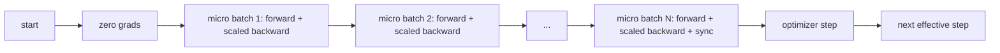
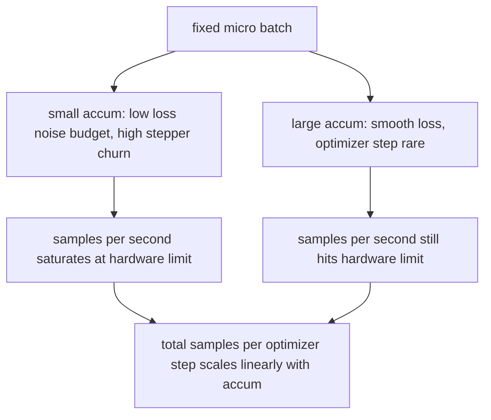

# 梯度累积

> 以你负担不起的有效批量进行训练，一次一个微批量。缩放损失，暂停优化器步进，让梯度堆积起来。

**类型：** 构建
**语言：** Python
**前置条件：** 第 19 阶段课程 42 至 45
**耗时：** 约 90 分钟

## 学习目标

- 推导有效批量的恒等式：`effective_batch = micro_batch * accum_steps`。
- 实现每个微批量的损失缩放，使累积的梯度与单次全批量反向传播相匹配。
- 跳过优化器同步，直到最后一个微批量（最后一步同步）。
- 阅读吞吐量随有效批量变化的曲线图，并解释收益递减现象。

## 问题所在

你希望以 512 的有效批量进行训练，因为这样损失曲线更平滑，且在该规模下优化器步进更有意义。当前硬件加速器在内存耗尽前仅能容纳 32 个样本。增加一倍批量不可行，减半模型也不可行。该领域自 2017 年起采用并一直沿用至今的技巧是：运行 16 次反向传播，让梯度在参数缓冲区中累积，仅在计数达到目标时才执行优化器步进。

风险在于，损失值不再等于较大批量时的数值。如果简单地将 16 个小批量的交叉熵相加，结果将是单个全批量损失的 16 倍。如果不进行缩放，梯度的方向是正确的，但幅值是错误的，导致优化器步进过大 16 倍。修复方法很简单：除以一个系数。但这个细节也很容易被遗忘。

## 核心概念



核心约定如下：

- 每个微批量的损失在 `backward()` 之前需除以 `accum_steps`。PyTorch 默认将梯度累加到 `param.grad` 中；除法操作会将运行中的累加和推回正确的尺度。
- 优化器步进在每个有效批量内仅触发一次，即在最后一个微批量反向传播之后。在累积中途步进会扭曲后续运行所依赖的所有参数。
- 优化器状态（动量缓冲区、Adam 矩）在每个有效步长中仅更新一次，而非每个微批量一次。否则指数移动平均将会看到错误的频率，从而过早消耗完学习率调度。
- 在单设备上这仅是簿记工作。在多节点集群上，相同的模式会将非最后的微批量包裹在 `no_sync` 上下文中，以跳过梯度 all-reduce；最后一个微批量一次性归约完整的累积梯度，而不是重复支付 N 次网络开销。

### 代码中的等价性证明

```python
loss = criterion(model(x_full), y_full)
loss.backward()
opt.step()
```

等价于

```python
for x, y in chunks(x_full, y_full, n):
    scaled = criterion(model(x), y) / n
    scaled.backward()
opt.step()
```

在浮点数求和顺序的误差范围内。循环结束时的累积梯度缓冲区与单次全批量反向传播所产生的张量相同。课程代码在 `equivalence_check` 中使用最大绝对差值小于 1e-4 来断言这一点。

### 成本去向

每个微批量需要一次前向传播和一次反向传播。使用累积时，你是在用时间换取显存。`outputs/accum-curve.json` 中的吞吐量曲线展示了当微批量固定而有效批量增大时会发生什么：



天下没有免费的午餐。将 `accum_steps` 翻倍会使每次优化器步进的墙钟时间翻倍。发生变化的是梯度估计的方差：在相同的墙钟预算下，你执行的优化器步进次数减少了，但每次步进都基于更多样本的平均值。文献通常将大批量和小批量视为不同的优化问题；本课程的要点是机械性的，而非统计性的。

## 动手实现

`code/main.py` 是可运行的工件。它完成三件事。

### 步骤 1：等价性检查

`equivalence_check()` 使用相同的随机种子构建同一网络的两个副本。其中一个在一次前向传播中处理 16 个样本的批量。另一个处理四个 4 样本的块，并将损失除以四。该函数比较优化器步进前的梯度缓冲区和步进后的参数。断言语句为 `max_abs_diff < 1e-4`。

### 步骤 2：最后一步同步模式

`train_one_optimizer_step` 遍历微批量。对于除了最后一个之外的所有微批量，它会进入 `no_sync_context(model)`。在单进程环境下，该上下文是无操作（no-op）；在 DDP 中，这里正是跳过梯度 all-reduce 的地方。无论哪种情况，簿记逻辑都相同。一个 `sync_counter` 记录我们退出 no_sync 作用域的次数；对于 N 个微批量，该计数是每个有效步长一次，而不是 N 次。

### 步骤 3：吞吐量曲线

`sweep_effective_batches` 使用固定的微批量和一组累积步长运行同一模型。针对每种设置，它记录以下指标：

- `samples_per_sec`：总样本数除以墙钟时间
- `median_step_ms`：每个有效步长的第 50 百分位数
- `sync_calls`：调用的集合通信点
- `avg_loss`：扫描过程中优化器步长的平均值

输出保存在 `outputs/accum-curve.json` 中，并可从 Notebook 中复用。

运行方式：

```bash
python3 code/main.py
```

脚本将打印等价性差异、扫描表格以及 JSON 路径。退出码为 0。

## 实际应用

在生产环境训练中，梯度累积隐藏在一个超参数背后。PyTorch 的模式是 `accumulation_steps = effective_batch // (micro_batch * world_size)`。此处不允许使用的框架同样封装了该循环，但步骤一致：缩放损失、在非最后微批量时跳过同步、累积、步进一次。

实际应用中常见的三种模式：

- 微批量大小选择为使设备内存饱和。更小会浪费加速器周期，更大则会崩溃。
- 有效批量根据学习率调度表选择。较大的有效批量需要缩放的学习率和预热；这是自 2017 年以来讨论的线性缩放规则。
- 累积计数是两者之间的桥梁，也是唯一允许你在不重写数据加载器的情况下自由调整运行时参数的旋钮。

## 交付规范

`outputs/skill-gradient-accumulation.md` 记录了配方，以便同事可以将其直接放入新仓库：按 `accum_steps` 缩放损失，在非最后微批量时跳过优化器同步，每个有效批量对优化器步进一次，并以 JSON 格式记录吞吐量随有效批量的变化，使权衡关系一目了然。

## 练习

1. 使用 `--num-steps 100` 重新运行扫描，并绘制每秒样本数随有效批量变化的图表。曲线在哪里趋于平缓？
2. 添加一个错误的缩放变体（不进行除法），并展示在第 1 步时与参考实现的参数差异。
3. 将 SGD 替换为 AdamW，并确认优化器状态在每个有效步长中仅更新一次，而非每个微批量一次。
4. 引入真实的 `DistributedDataParallel` 包装器，并将 `no_sync_context` 路由至其方法。确认 sync_calls 在每个有效批量中减少 N-1 次。
5. 修改等价性检查以比较两种不同的微批量划分（2×8 与 4×4），并解释你需要放宽的任何容差范围。

## 关键术语

| 术语 | 人们常说的 | 实际含义 |
|------|------------|----------|
| Micro batch | 你进行前向传播的批量 | 单次前向传播中能放入内存的数据切片 |
| Accum steps | 每次步长的反向传播次数 | 执行一次优化器步进前累加的反向传播数量 |
| Effective batch | 最终使用的批量 | 微批量 × 累积步数 × 数据并行全局大小 |
| Loss scaling | 除以 N | 每个微批量单独除法，使累加的梯度与全批量匹配 |
| Sync on last | 跳过其余部分 | 仅在窗口内的最后一次反向传播时执行梯度集合通信 |

## 延伸阅读

- PyTorch 关于 `DistributedDataParallel.no_sync` 的文档，用于了解最后一步同步技巧的生产级版本。
- Goyal 等人，2017年，关于大批量训练的线性缩放规则，这是关注有效批量的经典原因。
- PyTorch 问题追踪器中关于梯度累积与混合精度反缩放交互的讨论。
- 第 19 阶段课程 42 至 45 涵盖了本课程所假设的模型、数据加载器、优化器和训练器脚手架。
- 第 19 阶段课程 47 涵盖检查点与恢复机制，以确保长时间的累积训练能够承受墙钟时间限制。
