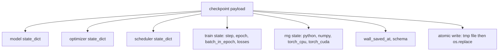
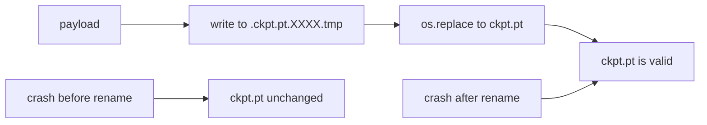
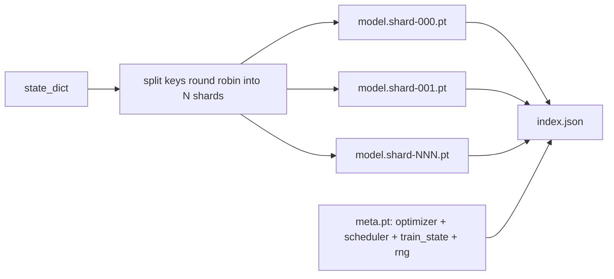

# 检查点保存与恢复

> 训练中断会终止运行；检查点则让运行得以继续。原子性地保存模型、优化器、调度器、损失历史、步数计数器和 RNG 状态，确保在任何时刻被强制终止时，磁盘上都会留下一个有效的文件。

**类型：** 构建
**语言：** Python
**前置要求：** 第 19 阶段课程 42 至 45
**耗时：** 约 90 分钟

## 学习目标

- 将完整的训练状态捕获为单个有效载荷，以便重新加载到新的进程中。
- 实现“先写入临时文件再重命名”的原子保存机制，确保崩溃时永远不会留下未写完的文件。
- 恢复 Python、NumPy 和 PyTorch 的 RNG 状态，使恢复后的损失曲线与未中断的基线一致。
- 为无法放入单个文件的模型构建分片检查点布局，包含哈希验证的分片和 JSON 索引。

## 问题背景

你设置了一个 18 小时的训练任务。但墙钟时间上限只有 4 小时。在第 11 小时，集群因为上级批准了内核升级而重启。如果没有检查点，一切得从头开始。如果没有恢复功能，你还会丢失优化器状态——前 11 小时的学习成果付诸东流。因此，即使模型权重幸存，AdamW 的一阶和二阶动量也会丢失，下一步会朝着训练轨迹早已越过的方向剧烈偏移。

正确的产物是一个包含所有续训所需信息的单一文件：模型参数、优化器状态、调度器状态、用于绘图的损失历史、当前的步数/轮数/批次计数器，以及所有随机性来源的 RNG 状态。没有 RNG 状态，恢复后的损失曲线就会截然不同。同样的模型，同样的数据，不同的打乱顺序，不同的 Dropout 掩码，仪表盘上的数字自然也不同。

原子保存是契约的另一半。直接写入最终文件名意味着写入中途崩溃会留下损坏的文件；恢复时会读到乱码。写入同一目录下的临时文件然后再重命名，意味着写入中途崩溃时，之前的完好文件不受影响。在 POSIX 文件系统上，重命名操作是原子的。

## 核心概念



### 五个状态类别

| 状态类别 | 重要性 |
|----------|--------|
| 模型 (Model) | 权重和缓冲区；决定模型本身。 |
| 优化器 (Optimizer) | 动量和自适应矩；缺少它们，下一步就变成了完全不同的优化问题。 |
| 调度器 (Scheduler) | 学习率在曲线上的位置；余弦调度器等对此尤为敏感。 |
| 训练计数器 (Train counters) | 步数、轮数、当前轮内的批次，以及用于绘制仪表盘的损失历史。 |
| RNG 状态 (RNG state) | 保证 Dropout、数据打乱以及模型内部任何采样操作的确定性。 |

### 原子保存



两条规则。首先，临时文件必须与目标文件位于同一目录下，以确保重命名操作在同一文件系统内完成；跨设备重命名不是原子的。其次，每次尝试使用的临时文件名必须唯一，防止多个写入者相互覆盖。

### 分片检查点

当模型变得庞大时，单文件有效载荷会变得太大，导致加载缓慢、难以检查，且在读取过程中网络共享出现抖动时会极其痛苦。解决方案是将参数状态拆分为多个分片，并编写一个小型索引将它们关联起来。



索引记录了分片数量、每个分片的 sha256 值以及元文件的 sha256 值。当任何哈希值不匹配时，加载器会立即报错。分片可以分布在不同的物理磁盘上；元文件很小且优先读取。

### 轮中恢复

如果恢复功能直接跳到下一轮的开头，会浪费几分钟到一天的时间。修复方案是 `(epoch, batch_in_epoch)` 加上 RNG 状态。加载完成后，训练循环会将随机数生成器快进到已消耗完当前轮次批次的状态，并从 `batch_in_epoch` 继续。课程代码正是这样实现的；其断言是恢复后的损失轨迹与未中断的基线之间的差异在 1e-4 以内。

## 动手实现

`code/main.py` 提供了四个基础原语和一个演示驱动。

### 步骤 1：捕获和恢复 RNG 状态

`capture_rng_state` 返回一个字典，包含 Python 的 `random.getstate`、NumPy 的 `np.random.get_state` 以及 PyTorch CPU 和 CUDA 的 RNG 字节数据。`restore_rng_state` 负责将其还原。CPU 张量是一个 uint8 字节缓冲区，PyTorch 的 RNG 知道如何消费它。

### 步骤 2：原子保存

`atomic_save` 将有效载荷写入目标目录下的临时文件，随后 `os.replace` 将其替换为最终文件名。`atomic_write_json` 对分片索引执行相同的操作。

### 步骤 3：完整检查点往返

`save_checkpoint` 将模型、优化器、调度器、训练状态和 RNG 打包到一个字典中。`load_checkpoint` 负责还原，并返回一个 `TrainState`。schema 字段是升级钩子：未来的格式变更会递增版本号字符串，加载器据此进行分发处理。

### 步骤 4：分片变体

`save_sharded_checkpoint` 将参数键通过轮询方式分配到 N 个分片中，使用各自的原子保存机制写入每个分片，写入包含优化器、调度器和训练状态的元文件，并写入带有分片 sha256 的 JSON 索引。`load_sharded_checkpoint` 在合并前会验证每一个分片。

### 步骤 5：恢复演示

`run_resume_demo` 训练一个小模型 `total_steps`，在 `interrupt_at` 处保存检查点，然后继续运行。第二个进程恢复该检查点并运行剩余的步骤。该函数返回中断点后两条损失轨迹的最大绝对差值。恢复 RNG 后，差值为零或浮点数噪声。

运行它：

```bash
python3 code/main.py
```

单文件和分片演示均断言最大差值低于 1e-4。摘要输出保存在 `outputs/resume-demo.json`。

## 生产应用

生产级训练框架通常将检查点功能作为训练器的一部分提供。结构是相同的：模型 + 优化器 + 调度器 + 计数器 + RNG，以原子方式写入，按步数命名以便快速定位最新版本。分片布局支持并行读取以加速大模型加载；index.json 是实现这一功能的关键。

需要遵循的三个模式：

- **Payload 中的 Schema 必须是字符串。** 迁移逻辑基于它进行分支。没有它，你就无法在不破坏旧运行的情况下演进格式。
- **对每个分片计算 Sha256。** 静默截断的下载是最糟糕的 Bug；加载器要么快速失败，要么延迟失败。
- **保持合理的检查点保存节奏。** 每 N 步或每墙钟一分钟保存一次，取较短者。否则，一旦长步训练崩溃，将浪费整整一个时间窗口的计算成果。

## 交付部署

`outputs/skill-checkpoint-save-resume.md` 是任何新训练脚本的配方：有效载荷结构、原子写入、RNG 捕获、分片索引。将该模块引入仓库，在定期保存位置接入 `save_checkpoint`，在启动时接入 `load_checkpoint`，运行就能抵御中断。

## 练习

1. 用按参数组分片替代轮询分片（以 `.weight` 结尾的层与以 `.bias` 结尾的层）。每种布局分别在何时更优？
2. 扩展保存循环，保留最近的 K 个检查点并清理较旧的。当磁盘空间有限时，K 应该设为多少才合适？
3. 添加一个 `--ckpt-every-seconds` 标志，使其按墙钟间隔触发保存，而不仅仅是基于步数。
4. 添加一个校验和验证路径，在启动时运行，扫描目录中的每个检查点，并报告哪些已损坏。
5. 实现一个 `migrate_v1_to_v2` 函数，向 Payload 添加新字段并递增 schema 字符串。使加载逻辑能够兼容这两个版本。

## 关键术语

| 术语 | 人们常说的说法 | 实际含义 |
|------|----------------|----------|
| 原子保存 (Atomic save) | “写完祈祷” | 写入同一目录下的临时文件，然后通过 `os.replace` 替换为目标文件名 |
| 状态字典 (State dict) | “权重” | 模型参数和缓冲区，以参数名为键 |
| 分片检查点 (Sharded checkpoint) | “大模型文件” | 多个文件，每个分片一个，外加一个元文件和带有 sha256 的 JSON 索引 |
| RNG 状态 (RNG state) | “随机种子” | 捕获的 python random、numpy、torch CPU、torch CUDA 的状态；不仅仅是种子 |
| 轮中恢复 (Mid-epoch resume) | “重启” | 快进 RNG 并从当前轮的下个批次继续 |

## 延伸阅读

- 支撑 `os.replace` 所依赖的原子性声明的 POSIX `rename` 语义。
- PyTorch 关于 `torch.save` 和 `torch.load` 的文档，包括用于跨设备恢复的 `map_location`。
- 第 19 阶段课程 46 涵盖了梯度累积，本课程的检查点有效载荷需能够安全跨越该过程。
- 第 19 阶段课程 48 涵盖了分布式包装器，本方案适配了其 state dict 格式。
- Linux 内核 `fsync` 文档，阐述了原子重命名背后的持久性保证。
