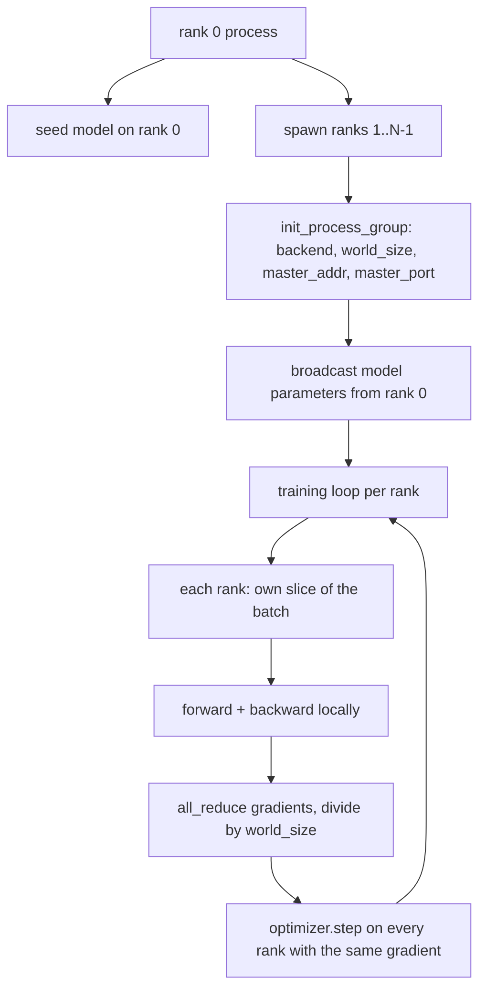
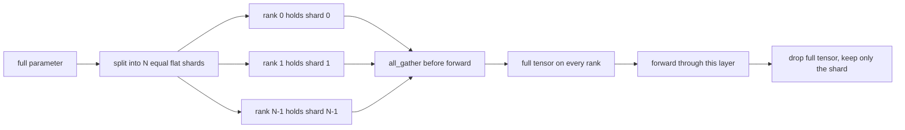

# 从零实现分布式数据并行与 FSDP

> 多卡训练的核心就是两个集合通信操作加一条规则：启动时广播参数，反向传播后平均梯度，绝不让各 Rank 对当前训练步数产生分歧。

**类型：** 构建
**语言：** Python
**前置要求：** 第 19 阶段课程 42 至 45
**耗时：** 约 90 分钟

## 学习目标

- 使用 `gloo` 后端在 N 个 Rank 上拉起进程组，无需特殊硬件。
- 实现一个极简的 DDP 包装器，在构造时广播参数，并在反向传播后执行 all-reduce 梯度。
- 证明各 Rank 梯度的 all-reduce 结果与单进程在拼接输入上的梯度一致。
- 勾勒 FSDP 参数分片方案：每个 Rank 持有切片，前向传播时收集完整张量，结束后丢弃。

## 问题背景

模型可以放入单个设备中，但数据集不行。优化预算要求你希望每秒（wallclock）处理的数据样本量达到原来的 N 倍。第一个杠杆是数据并行：每个 Rank 在批次（batch）的不同切片上运行相同的模型，然后在优化器更新前平均梯度。第二个杠杆是 FSDP：模型本身也无法放入单个设备，因此每个 Rank 仅持有每个参数的一部分，并在前向传播期间逐层重建完整张量。

痛点在于状态管理。如果参数在各 Rank 间发生漂移，训练会静默损坏。如果你只平均梯度而不同步损失，监控面板就会显示错误数据。如果集合通信后端无法就拓扑结构达成一致，训练将永远挂起。解决方案是亲手编写一次集合通信逻辑，并且绝不信任那些你无法复现的封装库。

本课程在 CPU 上运行。不假设存在 CUDA 环境。`gloo` 后端随每个 PyTorch 构建版本提供，并接受 `torch.multiprocessing` 工作进程；同一套代码在多 GPU 节点上可无缝切换至 `nccl`，且无需更改结构。

## 核心概念



### 关键的两个集合通信操作

| 集合通信操作 | 作用 | 使用时机 |
|------------|--------------|------|
| `broadcast` | 将一个张量从一个 Rank 复制到其他所有 Rank | 参数初始化、调度器状态同步、任何一对多同步 |
| `all_reduce` | 在所有 Rank 上对张量求和（或取均值、最大值），每个 Rank 都会得到结果 | 反向传播后的梯度平均 |
| `all_gather` | 每个 Rank 贡献一个张量，最终每个 Rank 获得拼接后的结果 | Logits 收集、FSDP 参数反分片 |

DDP 的契约是在构造时执行 `broadcast`，在反向传播后执行 `all_reduce`。FSDP 的草图方案在每个层的前向传播前增加了 `all_gather`。

### 梯度平均与单进程梯度等价

在 N 个 Rank 上以大小为 B 的批次训练的模型，必须产生与单个进程以大小为 N*B 的批次训练完全相同的梯度。关键在于，将各 Rank 的梯度求和后除以 N，即可得到平均损失梯度，这与在全批次上使用均值归约（mean reduction）的交叉熵损失所计算出的结果一致。课程代码通过 `max-abs-diff < 1e-3` 验证了手动 all-reduce 梯度与参考单进程梯度之间的这一等价性。

### FSDP 方案草图



内存收益是精确的：每个 Rank 的参数显存占用降至原来的 1/N。代价是每次前向传播都需要执行 gather 操作。生产环境的 FSDP 会将 gather 操作与前一层计算重叠，因此实际耗时远小于朴素估算。本课程会对每个参数执行往返操作，并断言重建结果与原张量在比特级别完全一致。

### CPU 与 gloo 后端

CUDA 是生产环境的目标平台，但相同的代码路径同样适用于 CPU。`gloo` 是 CPU 集合通信后端。它在 GPU 上的速度比 `nccl` 慢几个数量级，但 API 接口完全一致。本课程的进程组使用 `backend="gloo"` 初始化，Rank 通过 `torch.multiprocessing` 而非 `torchrun` 生成；两者最终都会调用相同的 `torch.distributed`。在多 GPU 节点上，唯一需要更改的是 `backend="nccl"`、设备张量以及用于启动的 `torchrun`。

## 动手实现

`code/main.py` 是可运行的产物。

### 步骤 1：拉起进程组

```python
os.environ["MASTER_ADDR"] = "127.0.0.1"
os.environ["MASTER_PORT"] = str(port)
dist.init_process_group(backend="gloo", rank=rank, world_size=world_size)
```

`MASTER_ADDR` 和 `MASTER_PORT` 负责 rendezvous（协调点）：每个 Rank 都在同一主机上拨号相同的端口。本课程通过“绑定后关闭”的技巧选择一个空闲端口，以避免多台训练任务共享同一台机器时发生端口冲突。

### 步骤 2：构造时广播

`MinimalDDP.__init__` 遍历所有参数和缓冲区，并调用 `dist.broadcast(tensor, src=0)`。Rank 0 的值将成为标准初始化值。如果没有这一步，每个 Rank 都会用自己的随机种子初始化，导致从第一步开始各 Rank 就产生分歧。

### 步骤 3：反向传播后 all-reduce 梯度

```python
def all_reduce_grads_(module, world_size):
    for p in module.parameters():
        if p.grad is None:
            p.grad = torch.zeros_like(p.data)
        dist.all_reduce(p.grad.data, op=dist.ReduceOp.SUM)
        p.grad.data.div_(world_size)
```

每个 Rank 最终都会得到相同的平均梯度。此时优化器更新步骤在所有 Rank 上基于相同的输入进行，这也是参数在整个训练过程中保持同步的原因。

### 步骤 4：验证等价性

`manual_all_reduce_matches_single_process` 在 Rank 0 上构建相同的模型，并将 all-reduce 后的梯度与单进程在拼接输入上计算的梯度进行比较。最大绝对误差约为 1e-8。

### 步骤 5：FSDP 往返测试

`fsdp_round_trip_sketch` 将每个参数展平，填充至 `world_size` 的倍数，进行切片，执行 all-gather，然后去除填充。每个 Rank 的重建结果都与原张量一致。这就是反分片（unshard）步骤；其逆过程（前向传播后重新分片）只需从收集到的张量中切下本地切片即可。

运行方式：

```bash
python3 code/main.py
```

默认 world size 为 2。两个 CPU 进程被生成，通过 `gloo` 相互通信，并以退出码 0 正常结束。输出 `outputs/ddp-demo.json` 记录了每个 Rank 的参数总和、all-reduce 后的梯度范数、FSDP 往返测试结果以及手动计算与参考梯度之间的差异。

## 实际应用

生产环境的训练框架会调用相同的基础原语。PyTorch 的 `DistributedDataParallel` 增加了以下功能：反向传播后的梯度钩子（使 all-reduce 与反向传播重叠）、bucketed all-reduce（将多个小梯度合并为一个集合通信操作），以及课程 46 中使用的 `no_sync` 上下文管理器。

PyTorch 的 FSDP 增加了：每层的扁平化参数视图，使每个 Rank 持有一个连续缓冲区；下一层的反分片与当前层计算的重叠；以及可选的分片 CPU 卸载功能。

核心模式保持不变：启动时广播，反向传播后归约，当参数无法放入单个设备时分片。

## 交付指南

`outputs/skill-distributed-fsdp-ddp.md` 提供了新训练脚本的配方：使用 `gloo`（CPU）或 `nccl`（GPU）拉起进程组，用 DDP 外壳包裹模型（构造时广播，反向传播后归约），并根据 FSDP 草图中的 all_gather 模式选择性地对参数进行分片。

## 练习

1. 使用 `--world-size 4` 运行，并确认整个训练过程中参数差异保持在 1e-3 以下。
2. 将手动平均替换为 `dist.all_reduce(op=dist.ReduceOp.AVG)`，并计时对比差异。
3. 为 DDP 包装器添加反向传播后钩子，使 all-reduce 与其他反向传播步骤重叠；测量实际耗时的提升。
4. 实现 FSDP 重新分片步骤：前向传播结束后，将完整张量替换回本地分片。确认每个 Rank 的显存占用下降。
5. 在 CUDA 机器上将后端切换为 `nccl`。记录哪些环境变量发生变化，哪些保持不变。

## 关键术语

| 术语 | 常见说法 | 实际含义 |
|------|-----------------|------------------------|
| Backend | “gloo 或 nccl” | 实现集合通信操作的底层库；gloo 用于 CPU，nccl 用于 GPU |
| World size | “总 Rank 数” | 进程组中的进程数量；进程组是集合通信操作的基本单位 |
| Rank | “Worker ID” | 进程组内的进程标识符，从零开始索引 |
| All-reduce | “累加梯度” | 在所有 Rank 上对张量求和，每个 Rank 最终得到相同的结果 |
| Unshard | “收集参数” | 通过 all_gather 从各 Rank 的切片中重建完整张量 |

## 延伸阅读

- PyTorch `torch.distributed` 文档，了解本课程所依赖的集合通信语义。
- `gloo` 库的集合通信列表，其结构与基于 CUDA 的 `nccl` 原语完全一致。
- 第 19 阶段课程 46，了解如何将 DDP all-reduce 封装在 `no_sync` 中的梯度累积模式。
- 第 19 阶段课程 47，了解能够兼容 DDP 和 FSDP 运行的检查点布局。
- PyTorch FSDP 官方文档，查看此处勾勒的参数分片方案的生产级实现。
