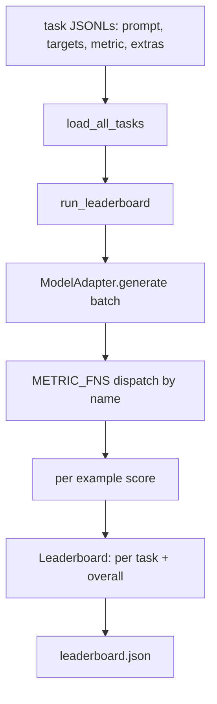
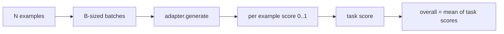

# 语言模型评估框架

> 在无法明确定义的任务上表现良好的模型，只是碰巧表现良好。该框架将任务定义、评估指标、运行器和排行榜浓缩为一个简短且可替换的结构。

**类型：** 构建项目
**语言：** Python
**前置条件：** 第 19 阶段课程 42 至 45
**耗时：** 约 90 分钟

## 学习目标

- 将任务定义为 JSONL 文件，每个示例包含 `prompt`、`targets`、`metric` 以及可选的 `extras`。
- 实现五种评估指标：精确匹配（exact match）、rouge-l F1、可执行检查（executable check）、多项选择（multiple choice）和子串包含（substring contains）。
- 构建一个运行器，按任务对示例进行批处理，并分发给可替换的模型适配器。
- 输出可复现的排行榜 JSON，包含各任务得分、延迟及整体平均分。

## 问题背景

每周都有新的语言模型发布。营销宣传称其表现优异。但诚实的问题是：究竟在哪方面优异？诚实的答案是你自己编写的排行榜，因为厂商的排行榜是他们专门调优过的。

如果仓库中没有该框架，你只能通过主观感觉来比较两个模型。有了框架，你就能基于固定的任务集和固定的指标，通过可对比差异（diff）的 JSON 输出来比较它们的得分。框架是昨日运行与今日运行之间的契约。没有它，性能回退就会混入生产环境。

陷阱在于让框架过度适配单一模型。解决方法是反向利用这一陷阱：框架足够小，十五分钟内即可读完；任务足够小，可直接提交到仓库中；指标从零编写，以便同事能够审计；而模型特定代码仅存在于适配器中。更换适配器，排行榜随之变化；更换任务，排行榜也随之变化。除此之外，不应有其他变动。

## 核心概念



### 任务规范

每个示例占一行 JSONL：

```json
{"id": "arith-00", "prompt": "compute: 2 + 2", "targets": ["4"], "metric": "exact_match"}
```

对于需要评分辅助函数的指标，`extras` 承载附加负载：

```json
{
  "id": "code-00",
  "prompt": "python: write a function f that doubles its input",
  "targets": ["ok"],
  "metric": "code_exec",
  "extras": {"io_pairs": [[1, 2], [3, 6]]}
}
```

任务是一个位于 `outputs/tasks/` 下的 `.jsonl` 文件。文件名即为任务名。同一文件中的所有示例共享同一个指标。

### 五个基准任务

| 任务 | 指标 | 测试内容 |
|------|------|----------|
| arithmetic | exact_match | 确定性答案的 Token 级正确性 |
| summary | rouge_l | 与单行参考摘要的最长公共子序列 F1 分数 |
| code-exec | code_exec | 可执行测试：预测的函数必须满足一组输入-输出对 |
| multiple-choice | multiple_choice | 预测的首字母必须与允许的字母匹配 |
| generation | substring_contains | 自由文本必须至少包含一个目标子串 |

### 指标契约

每个指标都是一个从 `(prediction, targets, extras) -> float in [0.0, 1.0]` 出发的函数。框架计算每个示例得分的平均值以得到任务得分，再计算任务得分的平均值得到总体得分。这些指标函数非常精简：

- `exact_match`：转小写，合并空白字符，判断相等。
- `substring_contains`：相同归一化处理，子串匹配测试。
- `multiple_choice`：首字母大写。
- `rouge_l`：最长公共子序列长度除以预测和参考的长度，计算精确率和召回率的 F1 分数。
- `code_exec`：在受限命名空间中执行预测代码，对每个输入-输出对调用 `f(x)`，统计匹配次数。

code_exec 指标会在剥离了内置模块的命名空间中运行预测代码。课程的测试断言 `import os` 会报错，因为 `os` 不在该命名空间中；你无法从代码预测中访问文件系统。

### 模型适配器

```python
class ModelAdapter(Protocol):
    def generate(self, prompts: Sequence[str]) -> List[str]: ...
    @property
    def name(self) -> str: ...
```

适配器是系统的接缝处。课程提供了 `ToyAdapter`，这是一个确定性的模式匹配器，能为五个基准任务中的每个提示返回正确答案。真实的适配器会调用模型并返回其输出。框架并不关心具体使用哪一个。

### 运行器

`run_task` 每次将 `batch_size` 个提示进行批处理，并分发至指标函数。`run_leaderboard` 遍历所有任务并计算平均值。`write_leaderboard` 输出带有 Schema 字符串的 JSON，以便未来的格式变更不会静默破坏仪表盘。



## 构建步骤

`code/main.py` 是可运行的产物。

### 步骤 1：初始化基准任务

`seed_fixture_tasks(target_dir)` 写入五个 `.jsonl` 文件。首次运行 `main.py` 时，若目录为空则会自动初始化它们。

### 步骤 2：加载任务

`load_all_tasks(task_dir)` 读取每个 `.jsonl`，并返回一个从任务名映射到 `Example` 记录列表的字典。以 `#` 开头的注释行和空行会被跳过，以便贡献者可以为文件添加注解。

### 步骤 3：实现指标

每个指标都是一个带单元测试的小型函数。课程的测试套件包含 13 个用例，覆盖归一化、部分重叠、代码执行和不安全代码拒绝等场景。

### 步骤 4：编写运行器

`run_task` 迭代批次并生成包含得分、正确数、总数和延迟的 `TaskResult`。`run_leaderboard` 遍历所有任务并生成包含整体平均分的 `Leaderboard`。

### 步骤 5：输出 JSON

`write_leaderboard` 序列化排行榜。启用 `--include-per-example` 标志可导出每个示例的记录，以便在得分发生变化时，将预测结果与上一次运行进行差异对比。

运行方式：

```bash
python3 code/main.py
```

该脚本在首次运行时初始化基准数据，使用模拟适配器（能答对所有基准题）进行评分，并写入 `outputs/leaderboard.json`。使用模拟适配器时总分为 1.0；`test_main.py` 中的存根适配器测试表明，当适配器无法作答时，同一框架会产出 0.0 分。

## 使用指南

要接入真实模型，只需编写一个适配器。其结构如下：

```python
class HttpAdapter:
    name = "vendor.v1"

    def __init__(self, endpoint, api_key):
        self.endpoint = endpoint
        self.api_key = api_key

    def generate(self, prompts):
        out = []
        for prompt in prompts:
            response = http_post(self.endpoint, prompt, self.api_key)
            out.append(response["text"])
        return out
```

在 `main()` 顶部将 `ToyAdapter` 替换为 `HttpAdapter`。框架、任务、指标和排行榜保持不变。

在实际项目中交付该框架时，需遵循三个规范：

- **固定任务文件。** leaderboard.json 应携带哈希固定的任务内容，或与其并列存放 JSONL 文件；否则任务文件变动会导致分数波动，你将无法分辨是任务变了还是模型变了。
- **对比预测结果，而非仅看分数。** 启用 `--include-per-example` 标志可查看分数下降当天模型的具体输出。
- **限制批处理大小。** 真实适配器通常有速率限制。较小的批处理大小可确保框架在不同厂商间保持兼容。

## 交付说明

`outputs/skill-lm-eval-harness.md` 包含了完整配方：JSONL 任务规范、五种指标、可替换适配器、批处理运行器、带 Schema 字符串的排行榜 JSON。`outputs/tasks/` 中的任务文件即为基准数据；可将其复制到实际项目中作为起点。

## 练习

1. 添加第六个任务，并使用从零编写的自定义指标（类 BLEU 的重叠度、类 BLEURT 的参考评分，或任何具有明确契约的指标）。
2. 扩展 `code_exec` 以捕获标准输出，并接受预期标准输出列表作为目标。
3. 添加排行榜差异对比命令：给定两个 `leaderboard.json` 文件，打印哪些任务的分数发生了变化及其变化幅度。
4. 限制每个示例的延迟时间。为适配器调用包裹超时机制；在排行榜中暴露独立的 `timeouts` 列。
5. 在排行榜中使用 sha256 固定任务内容，以便未来读者可以验证他们评估的是相同的任务。

## 关键术语

| 术语 | 常见说法 | 实际含义 |
|------|----------|----------|
| Task spec | “评估格式” | 每个示例包含提示词、目标、指标和可选附加信息的 JSONL 文件 |
| Metric | “如何打分” | 接收 `(prediction, targets, extras)` 并返回 `[0, 1]` 区间浮点数的函数 |
| Adapter | “模型客户端” | 具有 `generate(prompts) -> list[str]` 方法的对象；唯一包含模型特定代码的地方 |
| Leaderboard | “记分板” | 包含各任务得分、总数、延迟和整体平均分的 JSON 文件 |
| Code exec metric | “运行并检查” | 在受限命名空间中执行预测代码，并与输入-输出对进行比较 |

## 延伸阅读

- 原始的 `lm-evaluation-harness` 可作为生产环境的参考，规模更大但结构相同。
- HuggingFace 的 `lighteval` 提供了同一契约的另一种实现。
- 第 19 阶段课程 46 介绍了该框架所评估的训练栈中使用的梯度累积模式。
- 第 19 阶段课程 47 介绍了用于评分的检查点格式；请在排行榜中固定检查点的哈希值。
- 第 19 阶段课程 48 介绍了生成被测模型的分布式训练栈。
