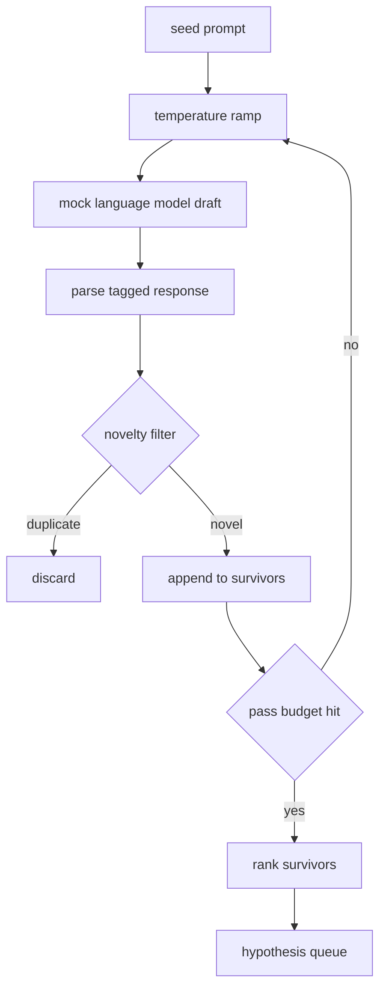

# 假设生成器

> 重复问同一个问题的研究代理是在浪费 token。关键在于强制每一版草稿都落在新的方向上。

**类型：** 构建
**语言：** Python
**前置条件：** 第 19 阶段 A 轨道课程 20-29
**耗时：** 约 90 分钟

## 学习目标
- 基于种子提示词驱动采样器，并将其输出转换为强类型的假设记录。
- 在每次迭代中逐步提高采样器的温度，使下一版草稿偏离上一版更远。
- 使用轻量级嵌入模型和余弦距离阈值过滤近重复项。
- 使用融合新颖性、具体性和可测试性的评分函数对筛选后的候选项进行排序。
- 确保每一步都是确定性的，使得相同的种子始终生成相同的队列。

## 为何先生成后过滤

规划器仅向一个模型询问一次只能得到一个假设。这对于演示示例尚可接受，但对于研究循环来说结构不对。循环需要一个具有深度的排序队列，这样当第一个假设失败时，运行器可以直接准备下一个，而无需再支付一次完整的采样开销。

两个概念结合生成了该队列。首先是温度递增：每次通过采样器都会将温度调高一点，从而鼓励后续草稿发散探索。其次是新颖性过滤：每生成一版草稿后，生成器会测量其与之前所有幸存候选项的嵌入距离，并拒绝落入聚类范围内的任何内容。

本课程附带了一个模拟语言模型，它针对固定提示词返回预设的 token 序列。该模拟模型足以跑通完整流程：输入种子提示词，应用温度递增，解析候选项，运行新颖性过滤，输出排序队列。

## 假设的数据结构

```text
Hypothesis
  id             : int           (monotonic within a run)
  text           : str           (the claim)
  variables      : list[str]     (what changes between conditions)
  metric         : str           (what the runner will measure)
  baseline_ref   : str | None    (which paper or run the comparison cites)
  draft_pass     : int           (which sampler pass produced this)
  temperature    : float         (the sampler setting at draft time)
  novelty_score  : float         (distance from prior survivors, 0..1)
  rank_score     : float         (weighted sum used for ordering)
```

`variables` 和 `metric` 不是自由文本。解析器会从带标签的响应中提取它们。第五十二课的运行器在构建实验配置时会直接读取这些字段。

`baseline_ref` 是可选但推荐的。第五十三课的评估器需要一个基线作为对比参照。如果假设中省略了该项，评估器将回退到同一指标的上次运行结果。

## 架构设计



该循环逻辑直白清晰。有趣之处在于每个模块都有严格的接口契约。

## 温度递增策略

起始温度为 `t_min`，结束温度为 `t_max`，步长为 `(t_max - t_min) / (n_passes - 1)`。每次迭代以当前温度调用采样器，从 `GeneratorConfig.schedule()` 生成 `n_passes` 个均匀分布的值。模拟模型通过根据 `(prompt, temp_bucket)` 切换一组预设响应来“尊重”温度设置。这些区间为开区间，因此温度的微小变化就会选择不同的区间并生成不同的草稿。在生产环境中，采样器将是真实模型，并通过 `temperature=t` 传递参数。

默认调度为从 `0.2` 到 `1.2` 共六次迭代。六次足以填满队列，且避免了因新颖性过滤而白白浪费的采样开销。低于 `0.2` 时，模型会机械地复述种子提示词。高于 `1.2` 时，回复容易偏离主题并导致解析失败。

## 新颖性过滤

每版草稿解析后，生成器会对文本进行嵌入处理，并与所有已通过的假设进行比较。该嵌入是一个轻量级的词 token 哈希词袋，已归一化为单位长度。两个单位向量之间的余弦距离计算公式为 `1 - dot(a, b)`。如果某草稿与之前任何幸存候选项的最小距离大于 `novelty_threshold`，则视为通过。默认阈值为 `0.25`。

这种哈希嵌入并不花哨。它是确定性的，零依赖，且足以捕捉明显重复的情况：即共享大部分名词的两版草稿。生产环境部署时可替换为轻量级句子嵌入模型。接口保持不变。

## 排序评分

```text
rank_score = w_novelty * novelty_score
           + w_specificity * specificity_score
           + w_testability * testability_score
```

包含三个子分数。`novelty_score` 是与之前幸存候选项的最小嵌入距离。`specificity_score` 是假设中具体变量的数量除以目标数量。`testability_score` 若假设同时指定了指标和基线则为 1，仅包含指标则为 0.5，否则为 0。

默认权重分别为 `0.4`、`0.3`、`0.3`。权重保存在生成器配置中，以便下游课程在不 fork 代码的情况下调整它们。

## 模拟语言模型

```python
class MockLLM:
    def sample(self, prompt: str, temperature: float, seed: int) -> str:
        ...
```

给定 `(prompt, temperature, seed)` 三元组时，采样器是确定性的。模拟模型维护着一个以 `(prompt_signature, temperature_bucket)` 为键的预设响应表。如果表中没有对应键的条目，采样器将返回一个会导致解析失败的降级响应。其中一个测试用例会覆盖该降级路径。

种子会被混合进响应中，因此相同的 `(prompt, temperature)` 配对在不同种子下会生成不同的草稿。在测试中我们固定种子以保证结果可复现。在实际部署中，种子将来源于系统时钟或计数器。

## 输出队列

输出是一个按 `rank_score` 降序排列的 `Hypothesis` 记录列表。第五十二课的运行器弹出队首元素执行实验，第五十三课的评估器写回判决结果。如果判决表明假设错误，运行器将继续弹出下一个。

队列是有限的。当队列为空时，编排器可以选择拓宽种子提示词并重新运行生成器，或者停止并报告预算耗尽。

## 如何阅读代码

`code/main.py` 定义了 `Hypothesis`、`MockLLM`、`HypothesisGenerator` 以及一个确定性演示。生成器暴露了一个单一的 `run(seed_prompt)` 方法用于返回排序队列；迭代次数直接从 `GeneratorConfig.n_passes` 读取，而非作为参数传入。嵌入采用 token 哈希词袋实现。新颖性过滤是一个独立函数。排序评分也是一个独立函数。代码不依赖 `numpy`；嵌入数学计算完全基于标准库，确保课程内容保持可移植性。

`code/tests/test_generator.py` 覆盖了线性主路径、重复项拒绝路径、解析失败路径、温度递增边界以及排序逻辑。

## 课程定位

第五十课负责生成队列。第五十一课取出队首元素并执行文献检索以确认或反驳该假设。第五十二课同样取出队首元素并执行实际实验。第五十三课读取两者的输出并写入判决。这四节课组合成了一个无人干预的研究循环；人类可以在任意边界介入。
