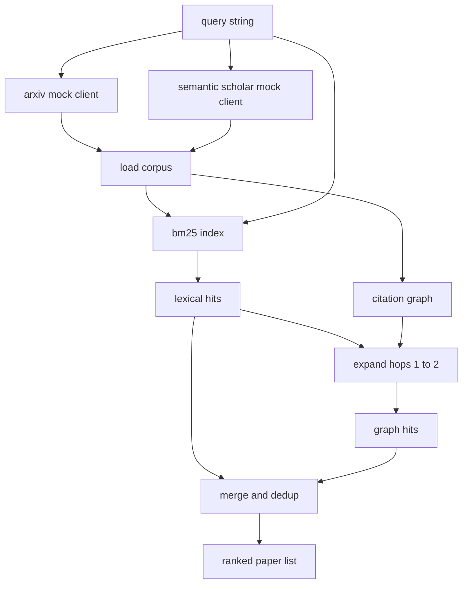

# 文献检索

> 提出假设很容易。知道是否有人已经证明了它才是昂贵的部分。在运行器启动沙箱之前，先构建能回答该问题的检索层。

**类型：** 构建
**语言：** Python
**前置条件：** 第 19 阶段 Track A 课程 20-29
**耗时：** 约 90 分钟

## 学习目标
- 使用下游循环将读取的字段，建模一个小型论文记录。
- 仅使用标准库数据结构，为摘要构建 BM25 索引。
- 遍历引文图，以发现词法搜索遗漏的论文。
- 通过稳定的论文 ID，对词法搜索和图遍历两轮的命中结果进行去重。
- 将两个模拟外部 API 封装在单一客户端背后，以便在实际端点上线时，上游调用方无需修改。

## 为何需要两轮检索

对摘要进行关键词搜索会返回与查询共享词汇的论文。这覆盖了大部分情况，但会遗漏两种情形。第一种是奠基性论文使用了不同的词汇；例如，查询“稀疏注意力（sparse attention）”可能会漏掉一篇题为“Transformer 路由中的块选择（block selection in transformer routing）”的论文。第二种是相关论文是一篇引用了已知锚点论文的后续研究；此时找到锚点并向前遍历，比暴力扫描整个摘要池更高效。

本课程将实现这两轮检索。基于摘要的 BM25 用于捕获词法命中。引文图遍历则从一个种子集合出发，向前或向后扩展一到两跳。最终结果集按论文 ID 去重，并通过一个轻量级的综合得分进行排序。

## 论文数据结构

```text
Paper
  id          : str           (stable identifier, "p001" for the mock corpus)
  title       : str
  abstract    : str
  year        : int
  authors     : list[str]
  references  : list[str]     (paper ids this paper cites)
  citations   : list[str]     (paper ids that cite this paper)
  source      : str           (which mock api supplied it, "arxiv" or "s2")
```

references 和 citations 字段构成了有向引文图。这两个模拟 API 返回的字段存在重叠但不完全相同，因此语料库加载器会在 `id` 上对它们进行合并。

## 架构设计



检索客户端负责执行两轮检索及合并操作。调用方传入查询语句，返回一个排序后的列表，其中每条记录都携带解释排名的单篇论文得分字段（`bm25_score`、`graph_distance`、`recency_score`、`final_score`）。

## 从零实现 BM25

实现采用标准的 Okapi BM25 算法，默认参数为 `k1=1.5` 和 `b=0.75`。索引由两个字典组成：`term -> doc_frequency` 和 `term -> list of (doc_id, term_count)`。文档长度定义为摘要的 token 数量。平均文档长度仅在建立索引时计算一次。查询评分是对查询项求和 `idf * tf_norm`，其中 `tf_norm` 为标准 BM25 长度归一化的词频。

分词器首先执行 `lower`，然后按非字母数字字符分割。不进行词干提取。生产环境通常会替换为一个轻量级词干提取器，但接口保持不变。

```text
idf(t)      = log((N - df + 0.5) / (df + 0.5) + 1.0)
tf_norm(t)  = (f * (k1 + 1)) / (f + k1 * (1 - b + b * dl / avgdl))
score(d, q) = sum over t in q of idf(t) * tf_norm(t)
```

## 引文图遍历

该图基于语料库一次性构建。正向边从论文指向其参考文献，反向边从论文指向引用它的论文。遍历过程是一种广度优先搜索（BFS），以 BM25 得分最高的结果为种子节点，最大深度限制为两跳。

设置两跳上限是刻意为之。一跳太浅；智能体通常希望获取直接的前驱或后继节点。三跳在连通图上会导致结果规模爆炸，且容易偏离主题。本课程将跳数限制暴露为配置项，以便下游循环可以收紧该限制。

## 去重与排序

两轮检索返回的结果集存在重叠。合并操作以论文 ID 为键。对于每篇论文，最终得分为加权混合值。

```text
final_score = w_bm25 * bm25_score_norm
            + w_graph * graph_score
            + w_recency * recency_score
```

`bm25_score_norm` 为 BM25 得分除以合并集中的最大 BM25 得分（因此该字段取值范围为 0 到 1）。`graph_score` 对于直接词法命中为 1，一跳为 `0.6`，两跳为 `0.3`，否则为 0。`recency_score` 是一个线性递增函数，在语料库最小年份时为 0，在最大年份时为 1。

默认权重分别为 `0.5`、`0.3`、`0.2`。权重属于配置项；对于陈旧的主题可能会调低时效性权重，而对于快速发展的主题则会调高它。

## 模拟语料库

语料库包含一百篇论文，由 `build_corpus()` 生成。每篇论文的手写标题和摘要均围绕五个主题之一：注意力稀疏性、检索增强、低秩适配器、数据集蒸馏和评估框架。参考文献和引用关系经过精心设计，使每个主题形成一个连通子图，并包含少量跨主题边。

两个模拟 API 客户端（`ArxivMockClient`、`SemanticScholarMockClient`）读取相同的语料库，但暴露不同的字段。Arxiv 返回标题、摘要、年份和作者。Semantic Scholar 额外提供参考文献和引用信息。检索客户端按 ID 进行合并；跨客户端字段不一致的处理将推迟到后续课程中讲解。

## 第 52 和 53 课读取的数据

第 52 课的运行器读取 `paper.id`、`paper.title` 以及摘要的前三句作为实验上下文。第 53 课的评估器读取 `paper.year` 和 `paper.references`，以便将基线归因于特定论文。

检索客户端返回一个 `RetrievalResult`，其中包含排序后的列表以及每次查询的指标：命中数量、平均得分、最高得分、总耗时。运行器会记录这些数据，以便下游的可观测性流程绘制随时间变化的质量曲线。

## 如何阅读代码

`code/main.py` 定义了 `Paper`、`ArxivMockClient`、`SemanticScholarMockClient`、`BM25Index`、`CitationGraph`、`RetrievalClient` 以及一个确定性演示用例。模拟客户端和语料库位于同一文件中，以确保课程具备可移植性。BM25 实现仅包含一个类，共六十行。图遍历逻辑封装在一个方法中。

`code/tests/test_retrieval.py` 涵盖了词法路径、图路径、合并、去重以及空查询处理。

## 在本阶段中的位置

第 50 课生成一个假设。第 51 课检索文献，以验证该假设是否已被解决。若未解决，第 52 课将运行实验。第 53 课同时读取检索结果和实验指标，以撰写最终结论。检索客户端是这四个阶段中成本最低的，并在编排器中率先执行。
