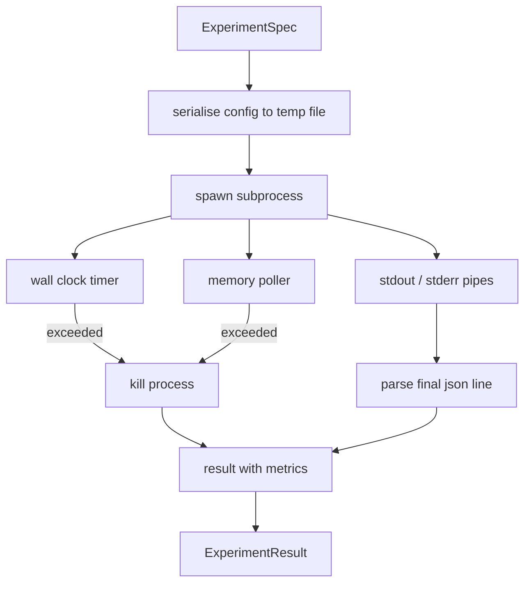

# 实验运行器

> 循环的诚实程度取决于其测量结果。构建一个运行器：接收规范，在沙箱子进程中执行它，并输出一个评估器可以信任的 JSON 指标数据块。

**类型：** 构建
**语言：** Python
**前置条件：** 第 19 阶段 A 轨道课程 20-29
**耗时：** 约 90 分钟

## 学习目标
- 将实验编码为类型化的规范（spec），供运行器序列化后传递给子进程。
- 启动带有硬性墙钟超时和软性内存上限的子进程，并将两者作为终止条件暴露出来。
- 捕获 stdout、stderr 以及结构化指标数据块，合并为单一的结果记录。
- 构建消融表，在固定的基础规范上每次仅遍历一个配置参数。
- 给定随机种子时确保每个结果具有确定性，以便评估器在多次运行中看到相同的数值。

## 为何使用子进程

研究循环会运行不受信任的代码。假设来自采样器，实验脚本也来自同一来源；在进程内将其视为安全代码无异于自找崩溃，进而拖垮编排器。子进程是编程语言内置的最简单隔离机制：独立的进程、独立的地址空间，以及父进程侧的信号句柄。

本运行器并未实现完整的沙箱机制。没有 cgroup，没有 seccomp 过滤器，也没有命名空间重映射。但它具备墙钟超时、用于监控内存增长的轮询循环，以及在任一限制触发时终止进程的清理路径。这是所有更复杂沙箱所扩展的基础运行时契约。本课程将该契约保持得足够精简，便于一次性阅读完毕。

## ExperimentSpec 结构

```text
ExperimentSpec
  spec_id        : str            (stable id, "exp_001")
  hypothesis_id  : int            (link back to the queue from lesson 50)
  script_path    : str            (path to the python script to run)
  config         : dict           (passed to the script as one json arg)
  seed           : int            (deterministic seed for the experiment)
  wall_timeout_s : float          (hard timeout, killed on exceed)
  memory_cap_mb  : int            (soft cap, polled; killed on exceed)
  metric_keys    : list[str]      (which fields the evaluator will read)
```

脚本存在于磁盘上；运行器将配置写入临时文件路径，由脚本读取。脚本预期在 stdout 上打印单行 JSON，其键应为 `metric_keys` 的超集。stdout 上的其他内容会被捕获，但会被指标解析器忽略。

## 架构



运行器是一个包含单个主方法的类。轮询器是一个小型线程，每隔轮询间隔唤醒一次，并在可用时从 proc 文件系统读取子进程的 `psutil` 等效值，当平台未提供该信息时则回退为空操作。

## 为何采用软性内存上限

硬性内存上限需要 `resource.setrlimit`，且仅在 POSIX 系统上有效。本课程提供了一种可移植方案：从平台轮询驻留集大小（RSS），若超出上限则终止子进程。该上限是“软性”的，因为轮询器存在非零的时间间隔；进程可能在两次轮询之间短暂突破上限，随后回落。运行器会记录观测到的最大 RSS，以便评估器查看运行过程距离限制有多近。

在不支持进程检查的系统上，轮询器会记录一次警告并自行禁用。墙钟超时仍然生效。课程测试覆盖了这两种路径。

## 捕获 stdout 与 stderr

运行器在任务完成后读取两个管道流。逐行扫描 stdout；最后一行能解析为包含所有必需 `metric_keys` 的 JSON 的内容将被视为指标数据块。之前的 JSON 行会作为 `intermediate_metrics` 保留在结果中；评估器可利用它们绘制学习曲线。

stderr 被原样捕获至结果中。运行器绝不会因非零退出码而抛出异常；相反，它会将其记录在结果中。任何非零退出都会被标记为 `"crash"`，即使脚本已打印指标，因此评估器默认将部分运行的结果视为失败。

## 消融表

```python
def ablate(base: ExperimentSpec, knob: str, values: list[Any]) -> list[ExperimentSpec]:
    ...
```

给定基础规范和参数名，辅助函数会为每个值返回一个规范，其中 `config[knob]` 已被覆盖。每个规范都会生成一个派生的 `spec_id`（即 `f"{base.spec_id}_{knob}_{value}"`）。运行器提供了一个 `AblationRunner`，按顺序执行它们并返回以参数值为键的 `AblationTable`。

为何每次仅调整一个参数。全因子遍历会呈指数级爆炸，产生评估器无法解读的结果。每次仅调整一个参数能生成清晰的坐标轴，便于评估器绘图。本课程仅支持通过调用方组合重复的单参数消融来实现多参数遍历。

## 确定性

每个规范都携带一个随机种子。运行器通过配置字典（`config["__seed"] = spec.seed`）将种子转发给脚本。`code/experiments/` 中的模拟实验脚本会遵循该种子，并在多次运行中产生完全相同的指标。第五十三课的评估器依赖于此；若无确定性，“性能倒退”可能仅仅是不同的随机初始化所致。

## 模拟实验脚本

本课程附带一个实验脚本：`code/experiments/sparsity_experiment.py`。它是一个真实脚本，会读取配置文件，使用 numpy 随机过程模拟一次小型训练运行，并打印 JSON 指标数据块。该脚本支持 `sleep_s` 参数用于测试超时，以及 `allocate_mb` 参数用于测试内存轮询器。

该模拟并非在训练任何真实模型。它是一项数值计算，旨在模仿训练循环的结构：损失曲线、最终困惑度、墙钟耗时。本课程的重点在于运行器，而非模拟本身。真实的实验脚本将会导入模型。

## 结果结构

```text
ExperimentResult
  spec_id              : str
  hypothesis_id        : int
  exit_code            : int
  terminal             : "ok" | "timeout" | "oom" | "crash"
  wall_time_s          : float
  peak_rss_mb          : float | None
  metrics              : dict
  intermediate_metrics : list[dict]
  stdout_tail          : str
  stderr_tail          : str
```

评估器首先读取 `metrics` 和 `terminal`。如果终止状态不是 `"ok"`，则该实验被视为失败运行，评估器的判定自动生效。否则，指标将通过显著性检验。

## 如何阅读代码

`code/main.py` 定义了 `ExperimentSpec`、`ExperimentResult`、`ExperimentRunner`、`AblationRunner` 以及一个确定性演示。子进程管理封装在一个类中。内存轮询器是一个小型线程。消融辅助函数是一个单独的函数。

`code/experiments/sparsity_experiment.py` 是测试中使用的模拟实验。它从 argv 读取配置文件路径，并在完成后写入单行 JSON 指标。

`code/tests/test_runner.py` 覆盖了成功路径、超时路径、崩溃路径、消融表以及跨两次运行的确定性检查。

## 课程定位

第五十课生成假设。第五十一课过滤掉文献中已确定的内容。第五十二课对剩余内容运行实验。第五十三课读取结果，执行显著性检验，并将评估器得出的判定写入编排器，与假设 ID 关联存储。
