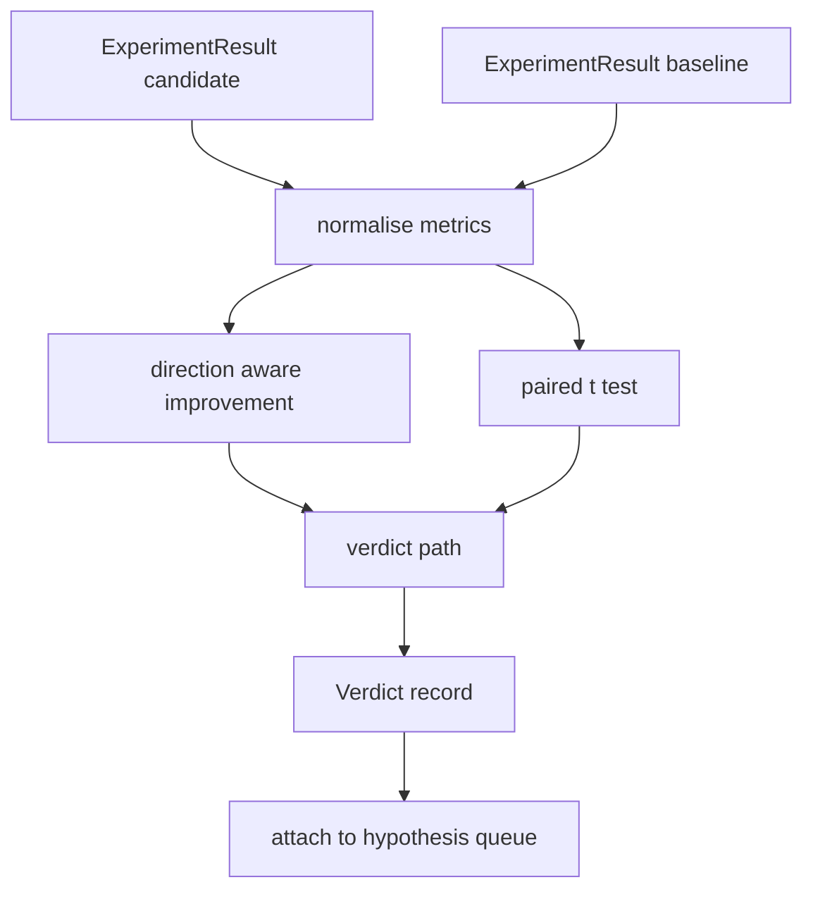

# 结果评估器

> 运行器生成了数据。评估器决定这些数据是改进、退化还是噪声。构建判决路径，将指标转化为单行结论。

**类型：** Build
**语言：** Python
**前置条件：** Phase 19 Track A lessons 20-29
**耗时：** ~90 分钟

## 学习目标
- 使用方向感知的改进值和固定阈值，将 candidate run 与 baseline 进行比较。
- 从零开始对 per seed metrics 运行 paired t test，并读取生成的 p value。
- 对 log scaled metrics 进行归一化，以便下游报告能将其与 linear metrics 混合。
- 为每个 hypothesis 生成 verdict，供 orchestrator 附加到 lesson fifty 创建的 queue 中。
- 保持每一步的纯函数特性，确保相同输入始终产生相同 verdict。

## 为何使用 paired t test

runner 输出的单个数字无法说明变化是否真实。同一配置使用不同 seed 会得到不同的 perplexity。这种变化可能只是噪声。正确的比较方式是 paired：使用相同的 seed 和相同的数据，分别用 candidate 和 baseline 各运行一次。每个 seed 贡献一个差值。这些差值的均值即为 effect。这些差值的标准误即为 noise floor。

本课程从零实现该检验。不使用 `scipy.stats`。数学推导足够简短，可在一个屏幕内读完。

```text
diffs    = [a_i - b_i for i in seeds]
mean     = sum(diffs) / n
variance = sum((d - mean) ** 2 for d in diffs) / (n - 1)
t_stat   = mean / sqrt(variance / n)
df       = n - 1
p_value  = two_sided_p(t_stat, df)
```

双侧 p value 使用 regularised incomplete beta function。课程附带了一个使用 Lentz continued fraction 的轻量实现。整个实现仅包含六十行 stdlib math 代码。

## 方向感知改进

某些指标越高越好（accuracy, throughput）。另一些指标越低越好（loss, perplexity, wall time）。评估器在每个 metric 上携带一个 `direction` 字段。

```text
if direction == "higher_is_better":
    improvement = (candidate - baseline) / abs(baseline)
elif direction == "lower_is_better":
    improvement = (baseline - candidate) / abs(baseline)
```

Improvement 是带符号的。在 higher is better metric 上出现负的 improvement 意味着 candidate 表现更差。verdict path 会综合读取 sign 和 magnitude。

固定阈值（`improvement_threshold=0.02`，two percent）用于判断变化是否足够显著以作出判定。低于该阈值时，无论 p value 如何，verdict 均为 "noise"；该循环不关注用户无法测量的微小变化。

## 架构



评估器执行三项独立计算，并在 verdict path 中将它们合并。每项计算均为无共享状态的纯函数。

## Log 归一化

Perplexity 是 loss 的指数形式。loss 下降 0.1 会导致 perplexity 大幅下降。直接跨两个配置比较 perplexity 是可以的，但在单一报告中将其与 linear metrics 混合时需要归一化。

课程会对任何 `scale` 字段为 `"log"` 的 metric 在计算 improvement 前取自然对数进行归一化。随后在 log space 中应用阈值。perplexity 从 32 降至 28 在 lower is better metric 上对应 `log(28) - log(32) = -0.133`，这远高于 two percent 阈值。

```text
if scale == "log":
    a = log(candidate)
    b = log(baseline)
else:
    a = candidate
    b = baseline
```

具有 `scale="linear"`（default）的 metric 跳过该变换。同一段代码路径同时处理这两种情况。

## 按 seed 的 paired t test

lesson fifty-two 的 runner 每次运行输出一个最终的 metrics blob。对于 paired t test，评估器需要 candidate 每个 seed 一个 blob，以及 baseline 每个 seed 一个 blob。orchestrator 在一系列 seed 下使用两种配置运行同一实验，并向评估器提供两个 `ExperimentResult` 记录列表。

评估器通过 seed 将它们配对（seed 位于 `result.metrics["seed"]` 中），并遍历请求的 metric。如果两个列表中的 seed 不匹配，评估器将抛出 `PairingError`。此时 orchestrator 应重新运行。

## Verdict 结构

```text
Verdict
  hypothesis_id          : int
  metric                 : str
  direction              : "higher_is_better" | "lower_is_better"
  scale                  : "linear" | "log"
  candidate_mean         : float
  baseline_mean          : float
  improvement            : float       (signed, fraction; see direction rules)
  p_value                : float | None  (None if n < 2)
  significance_threshold : float
  improvement_threshold  : float
  verdict                : "improved" | "regressed" | "noise" | "failed"
  rationale              : str
```

verdict path 是一个小型决策表：

```text
1. If any candidate result has terminal != "ok": verdict = "failed"
2. else if |improvement| < improvement_threshold:  verdict = "noise"
3. else if p_value is None or p_value > significance: verdict = "noise"
4. else if improvement > 0:                          verdict = "improved"
5. else:                                             verdict = "regressed"
```

Rationale 是一句人类可读的单行文本，orchestrator 可将其与 hypothesis id 一起记录日志。

## 如何阅读代码

`code/main.py` 定义了 `MetricSpec`、`Verdict`、`Evaluator`、t statistic 与 incomplete beta helpers，以及一个 deterministic demo。t test 完全使用纯 stdlib math 实现；numpy 仅用于读取 metrics list 并计算 means 和 variances。

`code/tests/test_evaluator.py` 覆盖了 improved path、regressed path、noise path（small improvement）、noise path（low n）、failed terminal path、log normalised path、针对已知 reference value 的 t test，以及 pairing error。

## 在本系列中的位置

lesson fifty 生成了 hypothesis queue。lesson fifty-one 过滤掉了 literature 已确定的内容。lesson fifty-two 在一系列 seed 下使用 candidate 和 baseline 配置运行了实验。lesson fifty-three 读取这些运行结果并写入 verdict。orchestrator 将这四部分串联起来：

```text
for hypothesis in queue:
    literature = retrieval.search(hypothesis.text)
    if literature_settles(hypothesis, literature):
        attach(hypothesis, verdict="settled")
        continue
    candidates = runner.run_all(specs_for(hypothesis))
    baselines  = runner.run_all(baseline_specs_for(hypothesis))
    metric_spec = MetricSpec("perplexity", direction=LOWER, scale=LOG)
    verdict = evaluator.evaluate(hypothesis.id, metric_spec, candidates, baselines)
    attach(hypothesis, verdict)
```

该 orchestrator 不在本课中；这四节课无需额外胶水代码即可组合成它，仅依赖各自定义的 dataclasses。
