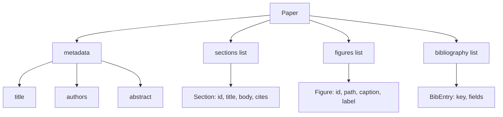
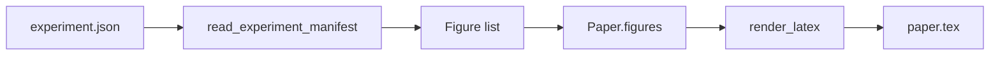
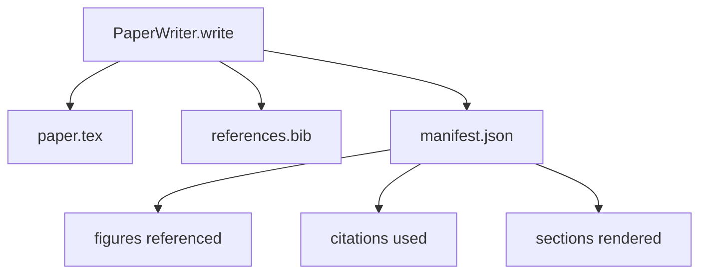

# Paper Writer

> LaTeX 骨架是研究者与排版者之间的契约。若契约被破坏，文档将无法编译，且错误会明确报错。先构建骨架，再填充内容。

**类型：** Build
**语言：** Python
**前置要求：** Phase 19 lessons 50-53
**耗时：** ~90 minutes

## Learning Objectives

- 将研究论文视为具有已知章节结构的结构化产物，而非自由格式的文档。
- 在撰写任何正文之前，生成声明了摘要、章节、图片占位符和参考文献键的 LaTeX 骨架。
- 通过确定性的占位符机制，将实验输出（路径和标题）中的图片注入到骨架中。
- 接入一个模拟的正文生成器，使其根据结构化大纲填充各章节，从而无需模型即可对测试框架进行验证。
- 输出单个 `paper.tex`、一个 `references.bib` 以及一个清单，该清单列出所有引用的图片和所有使用的文献引用。

## Why a skeleton first

以正文开头的草稿会积累结构性债务。引言部分会多出三段本应放在 related work 中的内容。图片会在定义之前就被引用。参考文献列表最终会出现针对同一篇论文的三个键。等到作者注意到这些问题时，修改的成本已经高于撰写的成本。

骨架则反转了这一过程。结构作为数据提前声明。章节是具有名称和顺序的占位符。图片是具有 ID 和标题的占位符。参考文献键在顶部声明，并指向对应的条目。正文按顺序逐个生成到这些占位符中。测试框架可以在撰写任何正文之前进行验证，确保每张图片都有占位符，每个引用都有对应条目，每个章节都出现在目录中。

这与前面课程中对 plans、tool calls 和 traces 所应用的原则一致。结构即是契约。

## The Paper shape

每个字段都是纯 Python 数据。渲染器是一个从 `Paper` 到 LaTeX 字符串的纯函数。测试框架可以在渲染前检查论文：统计章节数量、列出缺失的图片文件、检查每个 `\cite{key}` 是否都有匹配的 `BibEntry`。

## The render contract

渲染器保证三个属性。首先，骨架中的每个图片占位符都会输出一个 `\begin{figure}` 块，其标签格式为稳定的 `fig:<id>`。其次，每个章节都会输出一个 `\section{}`，其标签格式为稳定的 `sec:<id>`，以便 cross-references 正常工作。第三，参考文献会输出一个 `\bibliography` 块，其 `references.bib` 恰好包含论文中声明的所有条目，不多也不少。

违反其中任何一条均视为渲染错误，而非警告。骨架即是契约；静默丢弃图片的渲染行为即构成违约。

## Figure injection from experiments

本系列的前面课程将实验输出生成为 JSON manifests。每个 manifest 都携带一个带有路径和简短标题的 artifacts 列表。论文编写器读取该 manifest 并生成 `Figure` 记录。

注入过程是确定性的。图片 IDs 由实验名称加上单调递增计数器派生而来。标题来自 manifest。路径相对于论文的 output directory 进行规范化处理，因此即使实验输出位于磁盘的其他位置，LaTeX 也能正常编译。

## The mocked prose generator

本课程不调用模型。一个 `MockProseGenerator` 读取 outline shape 并确定性地产出正文。outline shape 为每个章节对应一个短字符串。生成器将该字符串扩展为两个短段落，并将章节标题自然融入其中。生成的正文仅在 outline 声明的位置提及图片和 citations。

这足以测试编写器的所有行为。实际实现会将生成器替换为模型调用。围绕它的测试框架保持不变。这正是将正文生成器声明为 callable 的价值所在：测试时替换为确定性生成器，生产环境替换为模型生成器，管道的其余部分完全相同。

## The manifest output

编写器向 output directory 输出三个文件。

manifest 是下游 evaluator 或 critic loop 读取的内容。它不解析 LaTeX；它直接读取 manifest。下一课“critic loop”将此 manifest 作为输入并生成 feedback list。这就是为什么 manifest 属于契约的一部分，而 LaTeX 不是的原因。

## Validation gates

编写器在写入任何文件之前运行四个校验关卡。

1. 每张图片的 ID 在论文内唯一。
2. 每个章节的 `cites` 字段引用的 bibliography key 必须在论文中已声明。
3. abstract 非空。
4. title 非空。

关卡失败时会抛出 `PaperValidationError` 并附带精确原因。测试框架会将该原因作为 failure mode 暴露出来。不存在部分写入的情况：要么三个文件全部输出，要么一个都不输出。

## How to read the code

`code/main.py` 定义了 `Paper`、`Section`、`Figure`、`BibEntry`、`PaperValidationError`、`MockProseGenerator`、`PaperWriter` 以及一个 `render_latex` 函数。`write` 方法接收一个 output directory，并输出 `paper.tex`、`references.bib` 和 `manifest.json`。`read_experiment_manifest` 辅助函数将 experiment manifests 列表转换为 `Figure` 记录。

`code/tests/test_paper_writer.py` 涵盖以下内容：无章节的 skeleton render、包含两个章节和两张图片的 full render、missing-citation gate、duplicate-figure-id gate、manifest content，以及 LaTeX-string contract（每个章节输出一个 `\section{}`，每张图片输出一个 `\begin{figure}`）。

## Going further

实际实现通常需要两项扩展。首先，multi-format render：相同的 `Paper` 形状可编译为用于博客文章的 Markdown 和用于预览的 HTML。渲染器变为作用于 `Paper` 的策略。其次，citation enrichment：给定本地 DOI 缓存，编写器会从 citation key 获取 BibTeX 条目。这两项都能增加价值，且都可以在不触碰 skeleton contract 的情况下添加。

骨架是关键所在。将章节、图片和引用声明为 data，将正文生成到 slots 中，将 manifest 与 LaTeX 一同输出。其他所有改进均可在此基础上组合实现。
