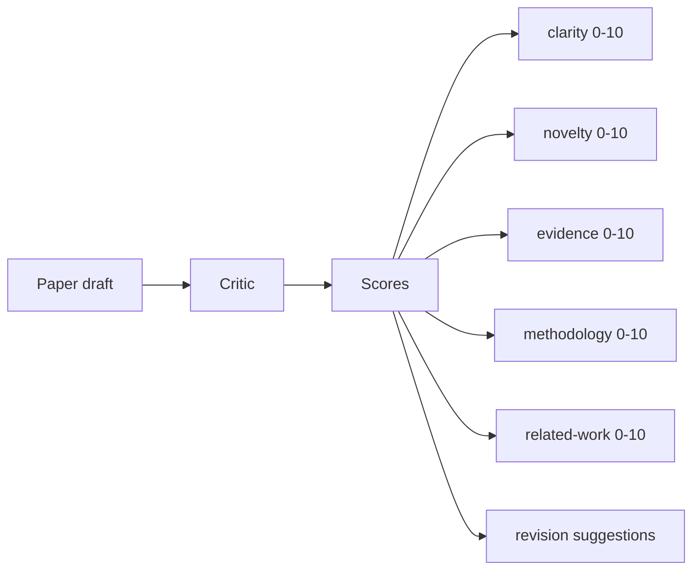
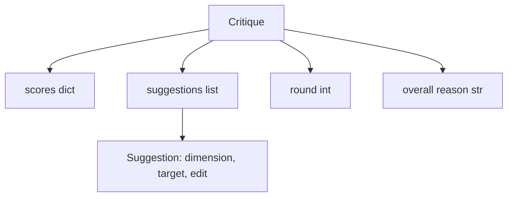
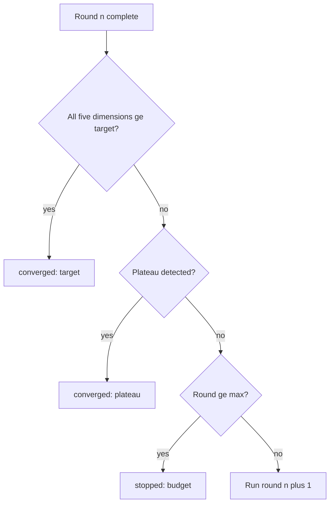
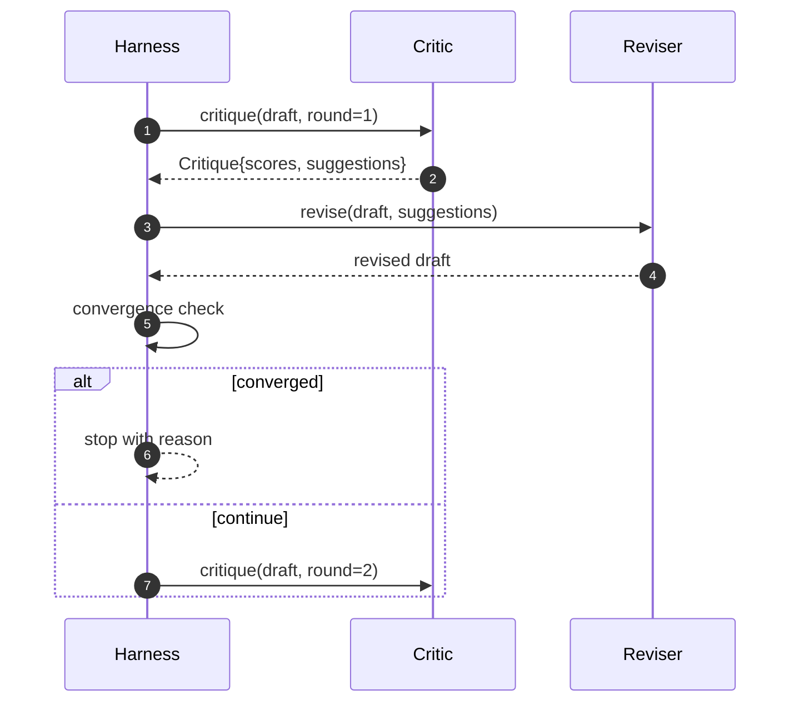

# 评审循环

> 第一次就返回“看起来不错”的评审器是坏的。总是返回“需要修改”的评审器也是坏的。有趣的评审器是能够收敛的那个，而你需要通过工程手段来实现这种收敛。

**类型：** 构建
**语言：** Python
**前置条件：** 第 19 阶段课程 50-53
**耗时：** 约 90 分钟

## 学习目标

- 在五个固定维度上对论文草稿进行评分：清晰度（clarity）、新颖性（novelty）、证据（evidence）、方法论（methodology）、相关工作（related-work）。
- 将每一轮的评审意见作为结构化的修订差异（diff）应用，而非自由形式的重写。
- 通过跨轮次比较分数来检测收敛；在出现平台期、达到目标或预算耗尽时停止。
- 使用最大迭代预算限制轮次，防止无法收敛的评审器无限运行。
- 输出每轮的追踪记录（trace），以便仪表盘或下一阶段渲染分数轨迹。

## 为什么采用五个固定维度

自由形式的评审器是一个返回一段建议文本的模型。下一轮的修订会将这段文本视为背景上下文。由于评审意见从未具备结构化特征，因此无法验证重写是否真正解决了该批评。

五个维度为编排框架（harness）提供了契约。



分数是一个向量。框架会跨轮次监控每个维度的变化。如果某次修订提升了清晰度但严重拉低了证据分，这属于证据维度的退化，收敛检查机制能够捕捉到这一点。仅依赖模型的评审器无法提供这种保证。

## 评审意见的数据结构



每条建议都包含其改进的维度、目标章节，以及一个修订器（reviser）可执行的 `edit` 指令。修订器本身也是一个可调用对象。本课程附带了一个确定性修订器，它将编辑指令解释为“追加到指定章节”的操作。基于模型的修订器则会将同一字段解释为提示词（prompt）。契约保持不变。

## 收敛规则的执行顺序

当以下三个条件中的任意一个触发时，评审循环即终止。



目标是最严格的情况：在循环返回成功之前，五个维度（clarity, novelty, evidence, methodology, related_work）中的每一个都必须达到 `>= target_score`（默认值为 `8.0`）。平均分很高但有一个维度很弱是不够的。平台期检测会比较当前轮次的平均分与上一轮的平均分。如果连续两轮的提升幅度低于 `plateau_epsilon`（默认值为 `0.1`），循环将以 `plateau` 状态退出。预算是对轮次的硬性上限（默认值为 `5`），达到后将以 `budget` 状态退出。

执行顺序至关重要。目标的优先级高于平台期，平台期高于预算。如果第三轮在同一迭代中既达到了目标又触发了平台期条件，结果为 `target`，而不是 `plateau`。

## 为什么平台期检测需要跨越两轮

单轮的平台期只是噪声。真实的评审器即使在固定的草稿上，每次迭代也会返回略有不同的分数，因为确定性评分仍然取决于应用了哪些建议以及应用的顺序。要求连续两轮出现平台期可以过滤掉这种噪声。如果框架报告了平台期，说明草稿确实已经停止改进。

## 本课程中的确定性评审器

本课程不调用任何模型。附带的评审器是一个可调用对象，它基于三个信号对草稿进行评分：平均章节正文长度（清晰度）、图表数量与引用数量（证据），以及论文元数据中的 `originality_tag` 字段（新颖性）。修订器知道如何推动各项分数向上提升。

```text
clarity      grows when the average section body length increases
novelty      grows when originality_tag is set to "high"
evidence     grows when a section's figure_refs is non-empty
methodology  grows when a section titled "Method" exists with body
related-work grows when a section titled "Related Work" exists with body
```

修订器将每条建议解释为定向追加操作。第一轮之后，框架可以观察到分数上升。测试用例利用这一特性来断言循环能够缩小差距。

## 完整的循环契约



框架负责管理轮次计数器、追踪记录和收敛检查。评审器负责生成分数。修订器负责生成差异（diff）。这三者互不触碰对方的状态。

## 追踪记录输出

每一轮都会输出一个追踪事件，包含轮次编号、分数向量、建议数量以及收敛判定结果。完整的追踪记录会与最终草稿一同返回。下游仪表盘可以据此渲染每轮分数图表。下一课（迭代调度器）将读取该追踪记录，以决定该分支是否值得保留。

## 防范劣质评审器的预算机制

如果评审器生成的建议永远无法提升分数，循环将被锁定在最大迭代上限。追踪记录会清晰暴露这一问题：五轮结束，分数持平，判定结果为 `budget`。用户会将其识别为评审器缺陷，而非草稿缺陷。相比之下，仅展示最终草稿的做法会掩盖问题诊断。以追踪为先的设计能直接暴露根因。

## 如何阅读代码

`code/main.py` 定义了 `Critique`、`Suggestion`、`Critic` 协议、`Reviser` 协议、`CriticLoop`，以及一个返回确定性评审器和匹配修订器的 `make_deterministic_critic_pair` 工厂函数。其中包含一个最小化的 `Paper` 数据结构，以确保本课程可独立运行。

`code/tests/test_critic_loop.py` 覆盖了以下内容：第一轮后的单调递增、针对调优草稿的目标收敛、两轮平稳后的平台期检测、无建议能提升时的预算耗尽、修订器应用建议的逻辑，以及追踪记录的数据结构。

## 进一步扩展

实际实现通常需要两项扩展。首先是维度权重：会议论文的权重可能更看重新颖性而非方法论；期刊则相反。此时收敛检查将变为加权平均值。其次是配对评审器：一个评审器负责打分，另一个评审器在修订器看到建议之前对其进行裁决。两者都能增加价值，且均可基于相同的 `Critique` 数据结构进行组合。

核心设计在于分数向量。一旦评审意见被结构化，其他所有改进项——收敛规则、仪表盘、配对评审器等——都可以无缝接入，而无需修改循环本身。
