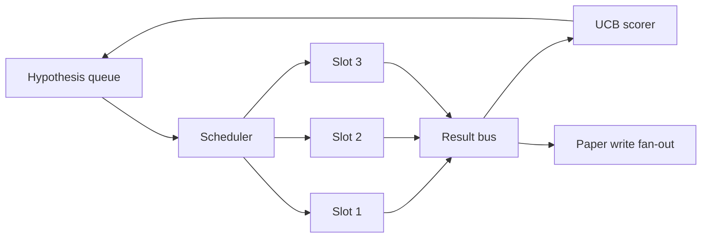
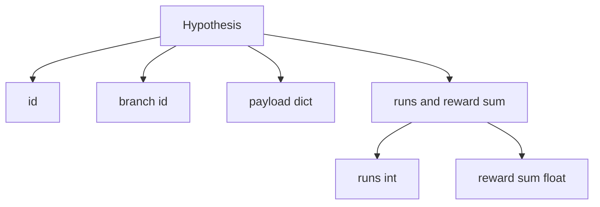
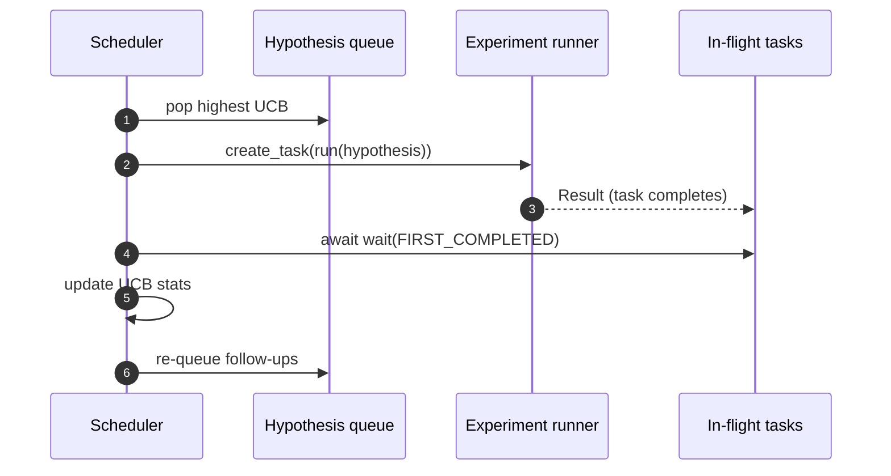

# 迭代调度器

> 没有调度器的研究循环只是一个带有幻觉的队列。调度器决定了循环何时停止探索，而这个决策就是整个游戏的核心。

**类型：** 构建
**语言：** Python
**前置要求：** 第 19 阶段课程 50-53
**耗时：** 约 90 分钟

## 学习目标

- 将研究工作流建模为假设队列，向并行的实验槽位输入数据，并将结果反馈回来。
- 使用 asyncio 并发运行多个实验，以便调度器能保持所有槽位处于忙碌状态。
- 使用 UCB 对每个假设分支进行评分，使调度器能在不放弃探索的前提下剪除低收益分支。
- 将完成的结果分发到论文撰写阶段和重新入队阶段，以便高收益分支能生成后续假设。
- 提供包含分支评分、槽位占用情况和剪除决策的逐次迭代追踪记录。

## 为什么需要调度器而非工作列表

扁平的工作列表按提交顺序执行任务。当每个任务相互独立时，这没问题。但研究工作并非独立：实验三的发现会改变实验四和五的优先级。能够读取结果反馈并重新排序队列的调度器，能在单位计算资源下完成更多有效工作。

有趣的设计选择在于评分规则。贪婪评分器总是选择当前领先者而从不探索。均匀评分器从不利用现有优势。UCB（上置信界）是中间路线：在利用领先者的同时，为尝试较少的分支保留容量。

## 系统结构



队列保存假设。当某个槽位空闲时，调度器会选择 UCB 得分最高的假设。每个槽位异步运行一个实验。完成的实验将其结果广播到总线上。总线更新原始分支的 UCB 统计信息，并在分支收益超过阈值时将结果分发到论文撰写阶段。

## 假设结构



`branch` 是 UCB 统计信息的键。多个假设可能共享同一个分支（分支代表研究方向；假设是该方向下的单次试验）。`runs` 是该分支已完成实验的数量，`reward_sum` 是累积奖励。UCB 会同时读取这两项数据。

## UCB 评分

本课程使用的 UCB 公式是经典的 UCB1。

```text
ucb(branch) = mean_reward(branch) + c * sqrt( ln(total_runs) / runs(branch) )
```

`total_runs` 是所有分支已完成实验的总数。`c` 是探索权重；课程默认值为 `sqrt(2)`。运行次数为零的分支获得 `+inf`，以确保未尝试的分支始终优先被调度。平均奖励高的分支会保持高分，直到其他分支赶上；运行多次但未获得显著奖励的分支会被运行次数较少的替代方案超越。

剪除机制与选择器是独立的。当分支的平均奖励在至少经过 `prune_after_runs` 次试验（默认 `3`）后低于绝对下限（默认 `0.2`）时，剪除机制会将其从未来的调度中移除。这有助于保持队列规模可控。

## 基于 asyncio 的并行槽位

调度器通过 `asyncio.create_task` 驱动实验。每个任务运行实验运行器（一个 `async def` 可调用对象），该运行器返回一个 `Result`。主循环使用 `asyncio.wait(..., return_when=asyncio.FIRST_COMPLETED)` 等待一组正在运行的任务，并在每次任务完成时触发评分更新。



三个槽位并发运行。主循环绝不会阻塞于单个实验。一旦有槽位空闲，调度器就会立即启动新任务，直到队列为空且没有任务在运行。

## 结果分发：论文触发器

当分支的平均奖励超过 `paper_threshold`（默认 `0.7`）且该分支尚未生成论文时，调度器会将一个 `paper.trigger` 事件分发到输出列表中。下游来自第五十四课的论文撰写模块会接收此事件。在本课中，触发器被捕获为列表形式，以便测试用例进行断言。

## 结果分发：后续假设

当高收益结果产生时，调度器可以调用用户提供的 `expander`，在同一分支上生成一个或多个后续假设。扩展器是一个从 `Result` 映射到 `list[Hypothesis]` 的纯函数。课程自带一个确定性扩展器，会为任何奖励超过论文阈值的生成两个后续假设。

## 预算控制

两种预算机制保护调度器免受无限循环的影响。

```text
max_experiments    : total count of experiments run across all branches
max_seconds        : wall-clock cap (asyncio time)
```

任一预算触发时，调度器将停止调度新任务，等待正在运行的任务完成，并返回最终追踪记录。该追踪记录包含一个 `stop_reason`。

## 追踪记录与最终报告

每次调度决策（选择、派发、结果、剪除、分发）都会产生一个事件。最终报告汇总了各分支的统计信息、总运行次数、总墙钟时间以及触发的论文触发器。下一课（端到端演示）将读取此报告来驱动论文撰写模块。

## 如何阅读代码

`code/main.py` 定义了 `Hypothesis`、`Result`、`BranchStats`、`IterationScheduler`，以及一个返回具有可预测奖励的 asyncio 实验运行器的 `make_deterministic_runner` 工厂函数。运行器会休眠固定的 `delay_ms`（默认 `5ms`），以便观察并发行为。

`code/tests/test_scheduler.py` 涵盖以下内容：UCB 优先选择未尝试的分支、并行槽位占用情况、阈值跨越时的论文触发器、低收益试验后的分支剪除、分发后续假设，以及预算退出（包括实验数量和墙钟时间）。

## 进一步拓展

实际实现通常需要三种扩展。首先，跨会话持久化 UCB 统计信息：当前统计信息仅存在于内存中；实际调度器会对其进行检查点保存，以便重启后保留已消耗的探索预算。其次，多目标评分：不再使用标量奖励，而是让每个结果输出一个向量，UCB 转变为帕累托风格的选择器。第三，上下文老虎机算法：选择器会根据假设特征（长度、复杂度）进行条件判断，使相似假设共享探索过程。

调度器是让研究工作超越简单工作列表的关键所在。一旦接入 UCB 并实现槽位并行运行，其他所有改进都能在此基础上组合叠加。
