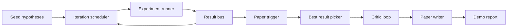
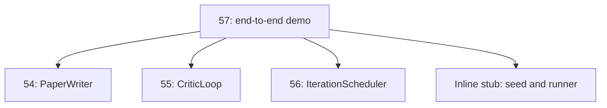
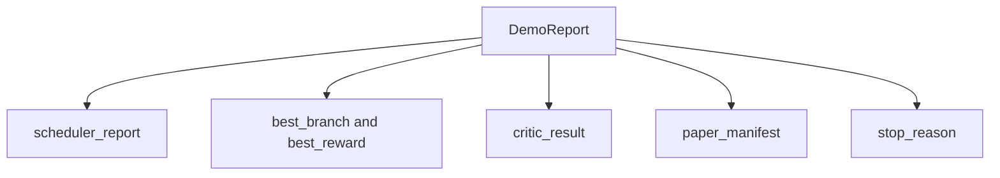

# 端到端研究演示

> 演示是检验你此前编写的所有契约能否正确组合的地方。如果其中任何一个出现疏漏，这个演示就是能捕获该问题的课程练习。

**类型：** 构建
**语言：** Python
**前置要求：** 第 19 阶段课程 50-53
**耗时：** 约 90 分钟

## 学习目标

- 将自动研究循环端到端串联：假设种子、实验运行器、调度器、评审循环、论文撰写器。
- 通过纯 Python 导入（而非框架）组合来自之前四个 Track D 课程的基础组件。
- 运行循环直至自动终止，并生成一份包含各阶段输出的单一演示报告。
- 保持演示的确定性，以便测试套件能够断言最终输出结构。
- 当任何阶段的契约被破坏时，暴露出明确的故障模式，防止下一阶段使用损坏的输入继续运行。

## 此处如何组合



五个阶段。种子是三个假设的列表。调度器在三个并行槽位中针对它们运行六个实验。总线报告一个或多个论文触发条件。选择器选出唯一最佳结果。评审循环基于该结果构建的草稿进行迭代。论文撰写器输出最终的 LaTeX、BibTeX 和清单文件。

## 为何使用导入而非复制

每个之前的课程都提供了一个包含公开数据类和函数的 `main.py`。演示通过调整 `sys.path` 指向每个课程的父目录来导入它们。这不是框架接线；它与之前课程中的测试文件所使用的导入方式完全相同。



内联桩代码替代了第五十至五十三课的内容：一个小型的种子假设生成器和一个同步奖励函数。用户可以通过调整两个导入语句，将内联桩代码替换为这些课程中的真实基础组件。

## 确定性保证

演示在构造上就是确定性的。实验运行器使用了固定种子的 numpy。评审循环的修订器以固定顺序遍历固定维度。论文撰写器的文本生成器是第五十四课中的模拟版本。调度器的 UCB 选择器在平局时依据迭代顺序打破僵局，而非随机选择。

给定相同的种子，演示会输出相同的报告。测试套件通过两次运行演示并比对清单文件来断言此属性。

## 演示报告的结构



每个字段均直接取自上游阶段。演示不会转换任何输出；它只是将它们组合起来。这正是该演示所承载的测试本身。

## 故障模式处理

每个阶段要么成功，要么抛出类型化的错误。

```text
Scheduler ........ returns SchedulerReport with stop_reason
                   in {queue_empty, max_experiments, deadline}
Best-result pick . raises NoTriggerError if no paper trigger fired
Critic loop ...... returns LoopResult with status converged or stopped
Paper writer ..... raises PaperValidationError on contract break
```

任何阶段的失败都会通过类型化异常短路整个演示。测试固定了这一契约：`test_no_triggers_raises_typed_error` 和 `test_best_picker_raises_when_no_triggers` 断言当没有任何分支触发条件时，选择器会抛出 `NoTriggerError` / `BestResultError`，且撰写器永远不会被调用。

## 最佳结果选择器

调度器为每个分支输出论文触发条件。选择器选出所有触发条件下平均奖励最高的分支。平局时按分支 ID 字母顺序打破僵局，以确保演示的确定性。选择器是一个小型纯函数；测试基于固定的调度器报告对其进行了验证。

## 连接评审循环

第五十五课的评审循环作用于一个 `MiniPaper`。演示从选定的分支构建一个 `MiniPaper`：用分支 ID 填充摘要，初始化两个章节（引言与结果），并根据分支的平均奖励设置 `originality_tag`（若 `>= 0.8` 则为高，若 `>= 0.6` 则为中，否则为低）。

随后，修订器对草稿进行迭代直至收敛。输出结果将传入论文撰写器。

## 连接论文撰写器

第五十四课的论文撰写器作用于包含图表和参考文献的完整 `Paper` 结构。演示通过 `mini_to_full_paper` 升级收敛后的 `MiniPaper`，为其附加选定分支的一张图表，以及由评审建议的引用键集合构建的小型合成参考文献列表。演示添加的每一个引用也会同步添加到参考文献列表中，从而确保验证通过。

## 如何阅读代码

`code/main.py` 定义了 `BestResultError`、`NoTriggerError`、`DemoReport`、`pick_best_branch`、`build_mini_paper`、`mini_to_full_paper` 和 `run_demo`。顶部的导入语句仅调整一次 `sys.path`，并从各自的课程中拉取 `PaperWriter`、`CriticLoop` 和 `IterationScheduler`。

`code/tests/test_e2e.py` 涵盖以下内容：演示端到端运行并输出填充了全部五个字段的报告、两次运行间的确定性、无分支跨越阈值时抛出 NoTriggerError、撰写器契约破坏时抛出 PaperValidationError、论文清单包含所选分支的图表，以及调度器停止原因为预期值之一。

## 进一步探索

一旦演示测试全部通过，值得串联的三个扩展功能如下。第一，持久化状态：每个阶段的结果写入一个小型 JSON 存储库，以便重启时无需重新运行低成本阶段即可恢复。第二，仪表盘：调度器和评审循环的追踪事件渲染为单一时间线。第三，真实模型调用：将模拟的文本生成器和确定性评审替换为基于模型的实现；连接逻辑无需更改。

演示的任务是证明“组合即架构”。五个课程，四次导入，一份报告。下次当你新增一个阶段时，连接代码仅精确增加一行。
