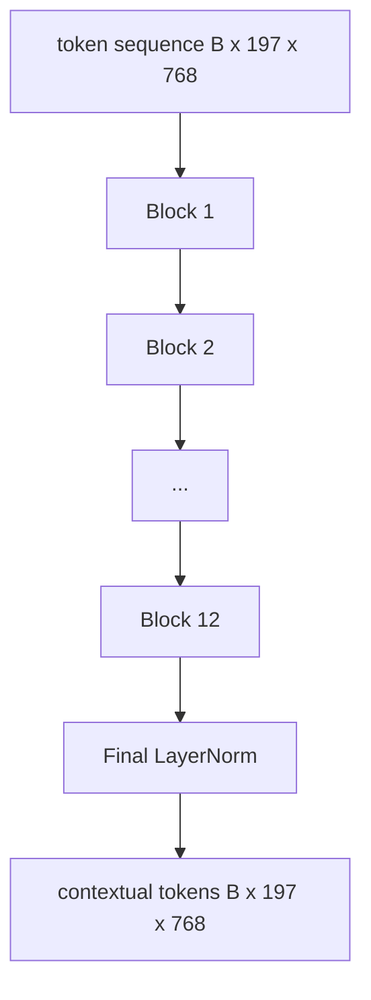
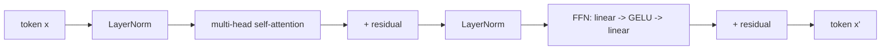

# Vision Transformer 编码器

> 仅凭图像块（Patches）无法实现“视觉”。一个包含 12 层 Pre-LN 结构的 Transformer，配备 12 个注意力头，将图像块标记序列转换为上下文标记序列。CLS 标记在其最终隐藏状态中聚合了整张图像的特征。本课程是现代视觉语言模型的核心引擎。

**类型：** 构建
**语言：** Python
**前置课程：** 第 19 阶段课程 30-37（B 轨基础）
**预计时间：** 约 90 分钟

## 学习目标

- 实现带有多头自注意力和前馈子层的 Pre-LN Transformer 模块。
- 堆叠 12 个模块（每个含 12 个注意力头）以构成 ViT-Base 编码器。
- 将课程 58 中的图像块前端接入编码器并执行前向传播。
- 验证 CLS 标记是否聚合了来自所有图像块的信息。

## 问题背景

图像块嵌入会生成一个包含 197 个标记的序列，每个标记均为独立向量，彼此之间毫无感知。要识别一张猫的图片，需要所有图像块协同工作，才能分辨出哪些块包含胡须、哪些是背景、哪些是眼睛。Transformer 正是通过逐层注意力机制来构建这种全局感知能力的工具。没有它，图像块前端只是一个缺乏理解力的巧妙分词器。

标准配置为 12 层深度、12 个注意力头宽度，采用 Pre-LayerNorm 结构、GELU 激活函数以及 4 倍的前馈扩展。这套配置是 CLIP ViT-L、SigLIP、DINOv2、Qwen-VL 系列、InternVL 以及 2025-2026 年所有其他开源权重视觉编码器的骨干。该架构非常稳定，除非论文明确说明，否则你可以默认它们均采用此模块结构。

## 核心概念





### Pre-LN 与 Post-LN 对比

原始 Transformer 在残差连接之后放置 LayerNorm。Pre-LN（在每个子层之前应用 LayerNorm）是现代视觉语言模型采用的版本，因为它无需学习率预热技巧即可稳定训练。两者在前向传播中仅有一行之差，但在 12 层以上的深度中，梯度流动的差异可谓天壤之别。

### 多头自注意力

每个注意力头将标记向量投影到其独立的 `(query, key, value)` 三元组上，维度为 `head_dim = hidden / num_heads`。结合 `hidden = 768` 和 `heads = 12`，每个注意力头拥有 `dim = 64`。12 个注意力头并行计算，随后将输出拼接回 768 维，并通过输出投影层。多头机制的意义在于：一个头可以学习“关注猫眼”，而另一个头可以学习“关注背景渐变”，互不干扰。

### 为何使用 4 倍前馈扩展

FFN 的结构为 `hidden -> 4 * hidden -> hidden`，中间使用 GELU 激活。因子 4 是基于经验的设定，自 2017 年以来在语言模型和视觉 Transformer 中一直沿用。较小的扩展（2 倍）会导致欠拟合；较大的扩展（8 倍）在固定数据预算下会导致过拟合。MLP 是模型存储大部分已学知识的地方，而较宽的中间层正是这些知识的载体。

| 组件 | ViT-Base 规模下的参数量 |
|-----------|------------------------------|
| 每个块的 qkv 投影 | `3 * 768 * 768 = 1.77M` |
| 每个块的输出投影 | `768 * 768 = 590K` |
| 每个块的 FFN（4 倍扩展） | `2 * 768 * 4 * 768 = 4.72M` |
| 每个块的 LayerNorm | `4 * 768 = 3K` |
| 每个块总计 | 约 710 万 |
| 12 个块 | 约 8500 万 |
| 加上前端 | 总计约 8600 万 |

ViT-Base 是一个拥有 8600 万参数的编码器。按 2026 年的标准来看这很小（SigLIP-So400M 为 4 亿，Qwen-VL 的 ViT 为 6.75 亿），但其架构在宽度和深度之外是完全一致的。

### 是否需要因果掩码？

视觉 Transformer 仅为编码器结构且支持双向：任意一对标记 `i` 和 `j` 均可相互关注。无需掩码。课程 61 中的解码器端交叉注意力会使用因果掩码，但在视觉编码器内部，注意力是全连接的。

### CLS 标记学到了什么

CLS 标记初始化为可学习参数，自身不包含任何图像块内容，而是通过每个块中的注意力机制逐步累积信息。到了最后一层，CLS 行已成为整张图像的向量摘要；下游任务头会将这个单一向量投影为类别 logits、对比嵌入表示，或作为文本解码器的交叉注意力键值。

## 代码实现

`code/main.py` 实现了以下功能：

- `MultiHeadSelfAttention`，包含 `qkv` 和输出投影、缩放点积注意力计算逻辑以及形状断言。
- `FeedForward`，即 4 倍扩展的 GELU MLP。
- `Block`，一个 Pre-LN 模块，由带残差连接的注意力和前馈子层组合而成。
- `ViT`，由 12 个模块堆叠而成，末尾附带一个 LayerNorm。
- `VisionEncoder`，将课程 58 中的 `VisionFrontEnd` 接入 `ViT` 堆栈，并暴露一个 `forward()`，返回上下文序列和池化后的 CLS 向量。
- 一个演示脚本，将合成的 224x224 测试图像输入完整编码器，并打印输入形状、输出形状、参数量以及每隔一层的 CLS 范数。

运行方式：

```bash
python3 code/main.py
```

输出结果：测试图像被编码为 `(1, 197, 768)` 张量。随着层级的叠加，CLS 范数逐渐上升，最终在最后一个 LayerNorm 处趋于稳定。总参数量报告约为 8600 万。

## 使用指南

此处定义的编码器，在宽度和深度之外，与 2025-2026 年所有开源 VLM 内置的模块堆栈相同。差异主要体现在：

- **宽度与深度。** ViT-Large 为 `hidden=1024, depth=24, heads=16`；SigLIP So400M 为 `hidden=1152, depth=27, heads=16`。模块结构完全一致。
- **池化头。** CLS 池化（本课）与平均池化（SigLIP）及注意力池化（后续 VLM）的区别。
- **位置编码处理。** 固定正弦位置编码（课程 58）、可学习 1D 位置编码、ALiBi 与 2D RoPE 的区别。模块数学逻辑保持不变。
- **寄存器标记（Register Tokens）。** DINOv2 在开头额外添加了 4 个可学习标记。仅需一行代码。

该模块堆栈是整个系统的基石。接下来的课程（60-63）将在此基础上展开。

## 测试

`code/test_main.py` 覆盖以下测试用例：

- 单个模块保持形状不变，且对输入批次大小具有不变性
- 沿键轴（key axis）的注意力分数之和为 1（Softmax 合理性检查）
- 残差路径已正确连接（零输入仍可通过 CLS 标记产生非零输出）
- 4 层堆叠的前向传播能输出正确的形状
- 梯度能从 CLS 输出反向传播至图像块投影层

运行方式：

```bash
python3 -m unittest code/test_main.py
```

## 练习

1. 添加寄存器标记（在 CLS 后 prepend 4 个可学习向量）并重新运行。通过最后一层 Softmax 分布的熵来比较注意力图的平滑度。
2. 将 Pre-LN 替换为 Post-LN，并在合成形状分类器上训练一个 epoch。观察哪种配置在不使用学习率预热时仍能稳定训练。
3. 将因果掩码实现为 `attn_mask` 参数，以便同一模块可复用为解码器模块。掩码形状为 `(seq, seq)`，呈下三角矩阵。
4. 使用 `torch.profiler` 对批次大小为 1、8、64 的前向传播进行性能分析。MLP 层主导实际运行时间，而非注意力层。
5. 将一个注意力头的 q-k-v 投影替换为低秩 LoRA 适配器，冻结其余部分，并验证梯度仅流向预期位置。

## 关键术语

| 术语 | 含义 |
|------|---------------|
| Pre-LN | 在每个子层之前而非之后应用 LayerNorm |
| 自注意力 | 每个标记都会关注同一序列中的所有其他标记 |
| 多头 | 隐藏层维度被划分为 `H` 个独立的注意力头 |
| FFN 扩展 | 前馈层在收缩前会先扩展至 `4 * hidden` |
| CLS 池化 | 使用第一个标记的最终隐藏状态作为图像摘要 |

## 延伸阅读

- 《An Image is Worth 16x16 Words》(ViT, 2021)：了解编码器配置方案。
- DINOv2 (2023)：了解寄存器标记与自监督预训练目标。
- SigLIP (2023)：了解平均池化变体及课程 62 中使用的 Sigmoid 对比损失。
