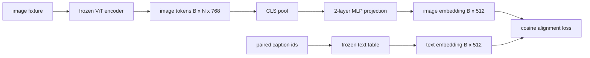

# 用于模态对齐的投影层

> 视觉编码器生成图像 token。文本解码器消费文本 token。两者存在于不同的向量空间中。一个小型的两层 MLP 将图像 token 投影到文本嵌入空间，并通过与配对标题（caption）的余弦对齐损失将两个空间拉齐。该投影是视觉语言模型中最小的组成部分，也是迁移学习中最重要的部分。

**类型：** 构建
**语言：** Python
**前置要求：** 第 19 阶段课程 30-37（B 轨道基础）
**时间：** 约 90 分钟

## 学习目标

- 构建一个两层 MLP 投影层，将图像特征映射到文本嵌入空间。
- 构建一个模拟文本嵌入表（无需预训练分词器，无需真实语料库）。
- 计算投影后的图像 token 与配对标题嵌入之间的余弦对齐损失。
- 仅训练投影层，同时冻结视觉编码器和文本表。

## 问题描述

你有一个视觉编码器（课程 58-59），它生成的 token 维度为 `vision_hidden = 768`。你希望在其顶部附加一个文本解码器，其嵌入维度为 `text_hidden = 512`（其他数值同样合理）。解码器期望接收文本形状的 token。但图像 token 并非文本形状：它们处于编码器在纯视觉预训练期间学习到的基中，与解码器的词向量没有关联。

两层 MLP 投影（线性、GELU、线性）可以弥合这一差距。它足够小（约 `768 * 1024 + 1024 * 512 = 1.3M` 个参数），可以在单张 GPU 上几分钟内完成训练，并且是在对齐阶段唯一需要学习的部分。视觉编码器保持冻结。文本嵌入表保持冻结。只有投影层会更新。这正是 LLaVA 在 2023 年采用的方案，BLIP-2 将其重构为 Q-Former，且此后所有开源权重的 VLM 都以某种形式采用了该方案。

## 核心概念



### 投影前的池化操作

视觉编码器输出 197 个 token。文本侧只有一个标题级嵌入。为了对齐它们，你需要每个样本一个图像级向量。CLS 池化是最简单的方法：取编码器的第一个 token 并进行投影。对所有 197 个 token 进行平均池化是另一种选择，SigLIP 正是如此使用。这两种方法都将 197 个向量压缩为一个。

### 为什么是两层而不是一层

单个线性投影只能旋转和缩放，但如果两个空间存在曲率不匹配，则无法修正基。GELU 位于两个线性层之间，为投影提供了一个非线性弯曲，经验表明这足以将 CLIP 风格的特征对齐到语言模型嵌入中。更深的投影（LLaVA-NeXT 使用了 GLU；Qwen-VL 使用了一堆注意力层）是扩展方案；两层 MLP 是规范化的基线，也是 BLIP-2 的 Q-Former 投影头底层所搭载的结构。

| 层 | 形状 | 参数 |
|-------|-------|------------|
| fc1 | `(vision_hidden, projection_hidden)` | `768 * 1024 + 1024` |
| activation | GELU | 0 |
| fc2 | `(projection_hidden, text_hidden)` | `1024 * 512 + 512` |

对于 `768 -> 1024 -> 512` 的头，约有 130 万个参数。

### 余弦对齐损失

对齐并不意味着 `image_emb == text_emb`。对齐意味着 `image_emb` 在联合空间中与 `text_emb` 指向相同的方向。余弦损失为 `1 - cos_sim(image, text)`，范围从 0（完全对齐）到 2（相反）。训练过程会将每对的损失驱动至零。课程 62 将其推广到对比批次（InfoNCE），其中每张图像都必须比批次中的任何其他图像更接近其自身的标题；本课程使用逐对版本以便观察动态变化。

### 冻结编码器是关键技巧

视觉编码器有 8600 万个参数。文本表还有另外几百万。从头开始训练所有这些参数（基于模拟语料库）是不可行的。冻结两者意味着投影层的 130 万个参数是唯一变化的部分，而在合成对上运行几百步就足以将损失降低。这正是所有基于适配器的 VLM 的标准操作形态：重型部分保持冻结，轻量桥接网络进行训练。

## 构建实现

`code/main.py` 实现了：

- `MLPProjector(in_dim, hidden_dim, out_dim)`，带有 GELU 激活函数的两层线性 MLP。
- `MockTextEmbedding(vocab_size, dim)`，具有基于种子确定性初始化的冻结嵌入表。
- `make_pair(seed, vocab_size)`，用于合成一个配对的（图像，标题）样本。标题是短 ID 序列；标题嵌入是对 token 嵌入进行平均池化的结果。
- `cosine_alignment_loss(image_emb, text_emb)`，逐对的 `1 - cos_sim` 目标函数。
- 一个训练循环，在 32 个合成样本（循环使用）上运行投影 200 步，冻结视觉编码器和文本表，并每 25 步打印一次损失。

运行方式：

```bash
python3 code/main.py
```

输出：训练报告指出，初始损失约为 1.07，在 200 步内降至约 0.80，证明了仅凭投影层就能将图像 token 拉向文本空间。还会打印每对的最终余弦相似度。

## 应用场景

相同的模式出现在每一个开源权重的 VLM 中：

- **LLaVA 1.5。** 从 CLIP-ViT-L 隐藏层到 LLaMA 嵌入维度的两层 GELU MLP 投影。冻结视觉编码器和 LLM，仅训练投影层（然后在第二阶段解冻 LLM）。
- **BLIP-2。** Q-Former 让 32 个可学习的查询 token 与图像 token 进行交叉注意力计算，然后投影到 LLM 嵌入维度。Q-Former 最末端的投影头与本课程的 MLP 类似。
- **MiniGPT-4。** 从 BLIP-2 Q-Former 输出到 Vicuna 嵌入维度的单层线性投影。
- **Qwen-VL。** 包含多层结构的交叉注意力适配器，但最终部分仍然是投影到语言模型嵌入维度。

形状各异，但角色完全相同：池化图像 token，投影到文本嵌入维度，单独训练。

## 测试

`code/test_main.py` 涵盖：

- 投影器输出形状与配置的 `out_dim` 匹配
- 冻结的文本嵌入表拥有零个 `requires_grad` 参数
- 余弦损失在相同向量上为 0，在反平行向量上为 2
- 反向传播一次后投影器梯度正常流动
- 训练循环在步骤 0 到步骤 200 之间降低了损失

运行方式：

```bash
python3 -m unittest code/test_main.py
```

## 练习

1. 用对 196 个 patch token 的平均池化替换 CLS 池化，并比较 200 步后的最终损失。平均池化通常在合成数据上训练更快；CLS 在自然图像上更具样本效率。

2. 为余弦损失添加一个可学习的标量温度系数（`cos / tau`），并观察当 `tau` 过小（梯度噪声）或过大（损失高位平台期）时会发生什么。

3. 将两层 MLP 替换为单层线性层，并量化损失差距。非线性在自然图像特征上更为重要，在合成特征上作用较小。

4. 为投影器权重添加一个微小的 L2 惩罚项，观察其与余弦对齐的交互作用（余弦相似度具有尺度不变性，因此惩罚项主要会收缩未使用的方向）。

5. 持久化保存投影器权重，然后重新加载并在不进行视觉编码器反向传播的情况下运行推理，以验证部署时仅需投影器。

## 关键术语

| 术语 | 含义 |
|------|---------------|
| 模态对齐 | 使图像和文本嵌入在一个共享空间中可比的操作 |
| 投影头 | 将一个空间映射到另一个空间的轻量模块，通常为两层 MLP |
| 余弦相似度 | 点积除以 L2 范数的乘积 |
| 冻结编码器 | 视觉（或文本）模型的所有参数均设置为 `requires_grad=False` |
| 模拟语料库 | 用于训练的合成配对数据，以避免数据集下载依赖 |

## 延伸阅读

- LLaVA 论文：介绍两阶段训练（先投影，再解冻语言模型）。
- BLIP-2 论文：介绍 Q-Former 作为可学习的投影替代方案。
- Qwen-VL 技术报告：介绍交叉注意力适配器作为更深层的投影头。
