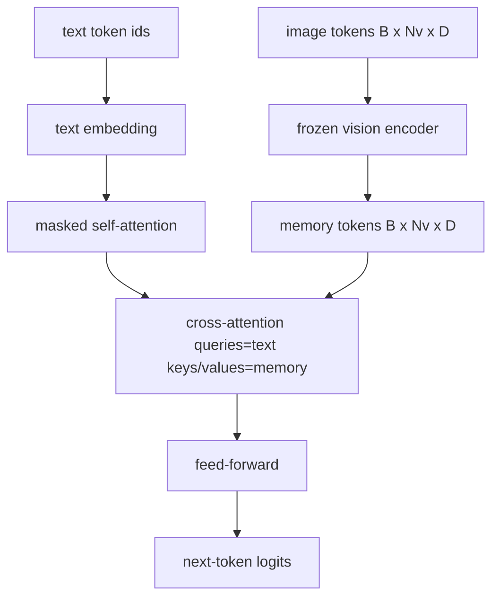
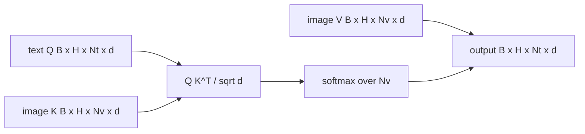

# 交叉注意力融合

> 投影层将一个图像向量与一个图像描述向量对齐。真正的视觉-语言解码器需要每个文本 token 都能关注到每个 patch token，以便模型能将每个词锚定到特定区域。交叉注意力（Cross-attention）正是实现这种映射的机制。文本提供查询（Query），视觉的键（Key）和值（Value）进行响应。本课程将构建交叉注意力模块、因果自注意力以及确保两者合法运行的掩码形状。

**类型：** 构建
**语言：** Python
**前置要求：** 第 19 阶段课程 30-37（Track B 基础）
**预计时间：** ~90 分钟

## 学习目标

- 实现多头交叉注意力，其中查询流为文本，键/值流为视觉特征。
- 组合解码器模块：因果自注意力 + 交叉注意力 + 前馈网络。
- 正确设置掩码形状：自注意力使用因果掩码，交叉注意力不使用掩码。
- 使用批处理的文本 token 和固定数量的图像 token 执行前向传播。

## 问题背景

将图像 token 和文本 token 拼接成一个序列是一种融合选项（早期融合，即 Chameleon 和 Emu3 所走的路径）。交叉注意力是另一种方案（晚期融合，由 Flamingo 引入，此后所有采用 Flamingo 架构的解码器均沿用了此路径）。在晚期融合中，文本解码器仅在文本 token 上运行，并通过每一层的交叉注意力“跨越”到图像流中。

晚期融合具有两个优势。首先，文本流保持纯净，模型得以保留纯文本能力。其次，图像流对每张图仅计算一次，并在每个解码步骤中复用，因此即使生成长描述，计算开销也很低。代价是每个模块需额外增加一个注意力子层。

## 核心概念





### 掩码形状

解码器模块内的两种注意力需要不同的掩码：

| 注意力类型 | 查询长度 | 键长度 | 掩码 | 原因 |
|-----------|--------------|------------|------|-----|
| 自注意力 | `Nt`（文本） | `Nt`（文本） | 因果掩码：下三角矩阵 `(Nt, Nt)` | 自回归过程中文本 token 不能提前查看后续内容 |
| 交叉注意力 | `Nt`（文本） | `Nv`（视觉） | 无掩码 | 每个文本位置都能看到完整的图像 |

课程包含一个形状验证函数，以便在混淆两者时直接抛出 `ValueError`，而不是导致损失曲线无声地崩溃。

### 为什么交叉注意力不需要掩码

在任何文本生成之前，图像已被完全观测。描述中的 Token `t` 可以关注图像的任意 patch；图像 patch 之间不存在时间顺序。某些 Flamingo 变体在交错处理多个图像和文本片段时会添加逐样本的掩码模式，但对于单张图像加一个描述的情况，交叉注意力可以看到全部内容。

### 键/值缓存（KV Cache）

图像的键和值在解码开始时计算一次并缓存在缓存中。每个新文本 token 直接使用缓存而无需重新计算。这正是推理时生成描述快速的原因：沉重的 ViT 只需运行一次；交叉注意力在每个步骤中复用其键和值。课程会暴露该缓存并测试缓存命中路径。

### 模块组合

一个解码器模块的运行流程为：pre-LN -> 自注意力 -> 残差连接 -> pre-LN -> 交叉注意力 -> 残差连接 -> pre-LN -> 前馈网络 -> 残差连接。三个子层，每个子层都有独立的 LayerNorm。Flamingo 论文在交叉注意力的残差上增加了一个可学习的门控（gate），使模型能够以牺牲训练稳定性为代价选择是否使用图像路径；本文使用的标准基线没有门控。

```python
class DecoderBlock:
  def forward(self, text_tokens, image_tokens, text_mask, cross_mask):
      text_tokens = text_tokens + self.self_attn(self.ln1(text_tokens),
                                                 mask=text_mask)
      text_tokens = text_tokens + self.cross_attn(self.ln2(text_tokens),
                                                  image_tokens,
                                                  mask=cross_mask)
      text_tokens = text_tokens + self.ffn(self.ln3(text_tokens))
      return text_tokens
```

## 动手实现

`code/main.py` 实现了以下功能：

- `CrossAttention(hidden, heads)`：支持独立 `q` 和 `kv` 投影的多头交叉注意力。
- `CausalSelfAttention(hidden, heads)`：来自标准解码器的带掩码自注意力。
- `DecoderBlock`：使用 pre-LN 残差组合上述三个子层。
- `VisionLanguageDecoder`：四层解码器，输入为模拟的视觉编码器输出和小型文本嵌入表。
- `causal_mask(length)`：返回一个 `(length, length)` 下三角布尔张量。
- 一个演示脚本：输入长度为 10 的两个文本序列批次，配合长度为 197 的图像记忆，打印输出形状、自注意力掩码形状以及每个位置的交叉注意力输出范数。

运行它：

```bash
python3 code/main.py
```

输出：解码器生成一个 `(2, 10, text_vocab)` 形状的 logits 张量。掩码形状为 `(10, 10)`。KV 缓存复用检查确认了缓存路径与非缓存路径的 logits 完全一致。

## 应用场景

交叉注意力主要出现在两类工业界主流架构中：

- **Flamingo 与 IDEFICS。** 每 K 个语言模型块插入一个交叉注意力子层，语言模型保持冻结。视觉-语言适配器即为交叉注意力模块及其门控。
- **BLIP-2。** Q-Former 使用交叉注意力，将一组固定的 32 个查询 token 映射到图像特征上，随后将查询投影到语言模型的嵌入空间。

本课程中模块的形状设计可直接映射到上述两种架构。掩码规范（自注意力使用因果掩码，交叉注意力无掩码）也完全一致。

## 测试用例

`code/test_main.py` 覆盖以下场景：

- 因果掩码为下三角矩阵，且匹配预期的布尔形状
- 无论键长度如何，交叉注意力输出形状均为 `(B, Nt, hidden)`
- KV 缓存路径与非缓存路径的结果在浮点容差范围内一致
- 文本流与图像流的形状不匹配时会抛出清晰的 `ValueError`
- 完整的解码器前向传播能产生正确的批次和序列形状

运行测试：

```bash
python3 -m unittest code/test_main.py
```

## 练习

1. 在交叉注意力残差上添加一个可学习的 tanh 门控（Flamingo 的技巧），并验证训练能从接近零的初始门控值开始收敛。门控初始值为 0；模型会在混合图像流之前先恢复纯文本行为。

2. 实现交错注意力机制，使同一个解码器能够处理多个图像和多个文本片段。构建逐样本的交叉注意力掩码，防止文本片段 2 关注到图像 1。

3. 在 `Nt=64, Nv=576`（更高分辨率下的 24x24 网格）配置下分析交叉注意力与自注意力层的性能。交叉注意力的计算开销为 `Nt * Nv`，在高分辨率图像下将成为主导因素。

4. 在交叉注意力图上添加查询侧的 Dropout，并在演示中测量描述生成的多样性（交叉图中的 Dropout 会导致描述采样方差增加）。

5. 将交叉注意力层替换为 Q-Former 风格的注意力模块，其中固定的 32 个 token 查询池每层仅对图像特征进行一次关注。

## 关键术语

| 术语 | 含义 |
|------|---------------|
| 晚期融合（Late fusion） | 文本和视觉特征保持在独立的流中；交叉注意力在每一层模块中将其桥接 |
| 交叉注意力（Cross-attention） | Query 来自一个流，K 和 V 来自另一个流 |
| 因果掩码（Causal mask） | 下三角布尔掩码，用于防止自回归过程中提前查看后续内容 |
| KV 缓存（KV cache） | 图像键和值仅存储一次，并在每个解码步骤中复用 |
| 记忆 token（Memory tokens） | 被解码器引用的冻结图像 token |

## 延伸阅读

- Flamingo (2022)：介绍带有门控交叉注意力的标准晚期融合设计。
- BLIP-2 (2023)：介绍 Q-Former，这是一种伪装成可学习查询池的交叉注意力模块。
- IDEFICS (2023)：开源复现 Flamingo 方案的文档。
