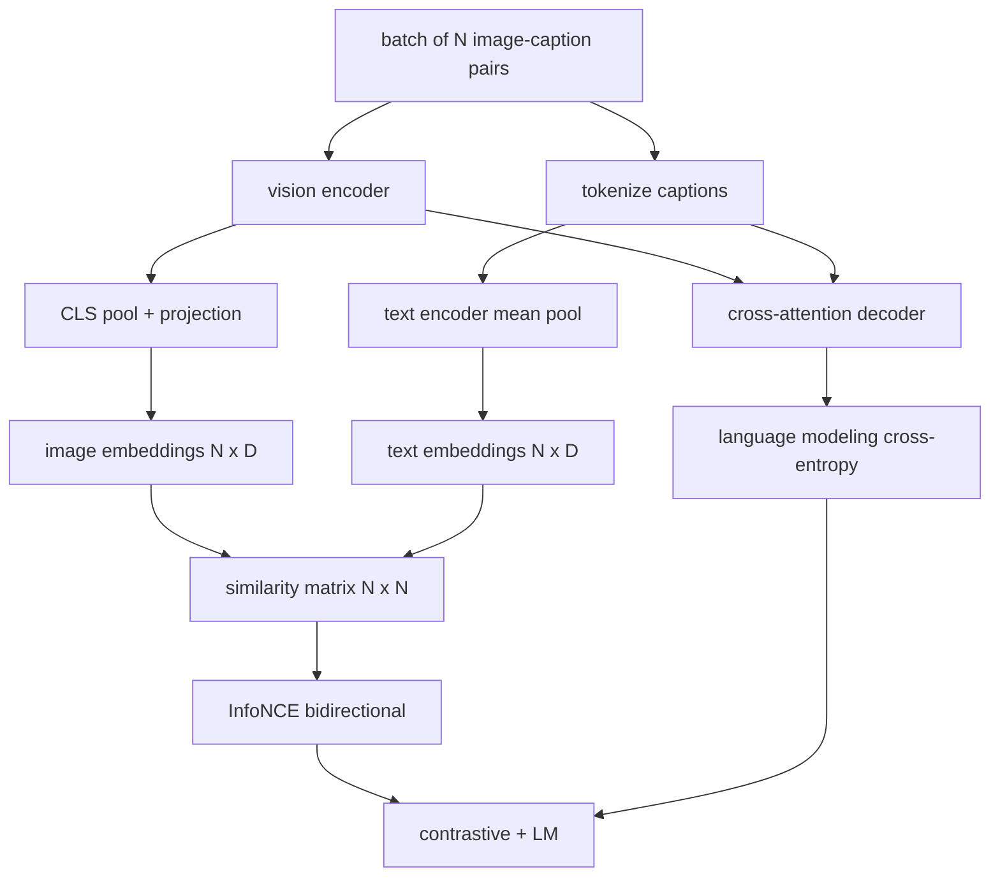

# 视觉-语言预训练

> 编码器、投影层和解码器已连接完毕。现在将它们一起训练。两个目标驱动学习：一个是对比图像-文本损失（InfoNCE），它在联合嵌入空间中将匹配的配对拉近；另一个是语言建模损失，要求解码器为每张图像生成描述。结合两者，网络既能学会根据描述找到正确的图像，也能学会为图像撰写描述。

**类型：** 构建
**语言：** Python
**前置条件：** 第 19 阶段课程 30-37（B 轨基础）
**耗时：** 约 90 分钟

## 学习目标

- 在图像-描述配对的批次上实现 InfoNCE 对比损失。
- 将对比损失与自回归语言建模损失组合。
- 合成一个包含 200 对图像的模拟图像-描述语料库，无需下载真实数据集。
- 运行一个 50 步的演示训练循环，并观察两种损失均下降。

## 问题背景

视觉-语言模型需要两项技能。它必须能排序：给定一段描述，从众多图像中找出正确的那张。它必须能生成：给定一张图像，写出对应的描述。仅用单一技能进行预训练只能得到半个系统。CLIP 完美解决了排序任务但无法生成描述。GPT-4V 可以生成描述，但使用独立的检索头来进行排序。多目标预训练可以在一次训练中同时获得这两项能力。

InfoNCE 负责处理排序部分。对于一个包含 N 个配对的批次，模型将 N 个匹配配对视为正样本，将 `N^2 - N` 个不匹配配对视为负样本，然后在生成的 `(N, N)` 相似度矩阵上计算交叉熵损失。LM 损失负责处理生成部分：基于图像条件的标准下一个词元预测。两种损失均可微，并且可以共享编码器、投影层和解码器的权重。

## 核心概念



### 一句话理解 InfoNCE

将 N 个图像嵌入堆叠为行，将 N 个文本嵌入也堆叠为行。对两者进行 L2 归一化。计算 `N x N` 矩阵 `S = I T^T / tau`，其中 `tau` 是一个可学习的温度参数。对角线元素代表匹配配对；非对角线元素代表负样本。应用交叉熵损失，目标 `argmax` 沿对角线分布：第 `i` 行的最大值应出现在第 `i` 列。沿列方向对称执行相同操作。总损失为两者的平均值。这就是八行代码实现的 CLIP 损失。

### 温度参数的影响

温度参数 `tau` 控制着 softmax 的尖锐程度。过小（例如 `tau = 0.01`）会导致梯度仅来自最难的那个负样本，训练过程充满噪声。过大则会使 softmax 变得平坦，导致梯度消失。CLIP 将 `tau` 作为参数进行学习；本演示同样采用此做法。

### 语言建模损失

解码器通过交叉注意力机制处理图像记忆词元，并在每个位置预测下一个文本词元。损失函数为标准交叉熵，目标为下一位置的词元。填充位置会在损失计算中被掩码排除。

### 损失函数的组合

`total = contrastive + lm_weight * lm`，其中 `lm_weight` 是一个标量（通常为 1.0）。两种损失将梯度共享至编码器和投影层；只有解码器接收 LM 损失的梯度。这是 CoCa、BLIP 和 SigLIP 等模型共同采用的多任务配方，只是权重配比不同。

| 组件 | 损失曲面 | 影响范围 |
|-----------|--------------|---------|
| InfoNCE | 联合空间中的配对排序 | 编码器 + 投影层 + 文本头 |
| LM | 基于图像的词元预测 | 编码器 + 投影层 + 解码器 |
| Combined | 多任务 | 整个网络栈 |

### 为什么 50 步足以用于演示

该模拟语料库是一个合成的 200 对数据集，包含随机图像和随机的描述 ID。在使用批量大小 16 进行 50 次 SGD 步骤后，即使绝对值仍高于真实数据模型所能达到的水平，两种损失也会明显下降。演示的重点在于确认端到端的梯度通路正常工作，且添加 LM 损失不会破坏对比目标的稳定性。

## 动手实现

`code/main.py` 实现了以下功能：

- `MultimodalModel`，结合了小型 ViT 编码器、MLP 投影层、轻量级文本侧编码器（对嵌入 ID 进行平均池化）以及第 61 课中的交叉注意力解码器。
- `info_nce_loss(image_emb, text_emb, temperature)`，双向的类 CLIP 对比损失。
- `lm_loss(logits, target_ids, padding_id)`，带掩码的下一个词元交叉熵。
- `make_mock_corpus(seed, n_pairs)`，返回 200 个确定性的 (image, caption_ids) 配对。
- 一个训练循环，以批量大小 16 运行 50 步，使用 Adam 优化器和可学习的对数温度参数。每 5 步打印一次两种损失。

运行方式：

```bash
python3 code/main.py
```

输出结果：对比损失从约 `ln(16) = 2.77` 下降至 2.4 左右；LM 损失从随机均匀基线的 `ln(512) ≈ 6.24` 下降至约 4.7。两者的下降证明了梯度连接正确。真实模型的训练通常持续数百万步；其动态变化规律是一致的。

## 应用场景

这与以下模型使用的损失配方相同：

- **CLIP (2021)**：仅使用图像-文本对比损失，配合独立的冻结编码器描述探针。
- **CoCa (2022)**：在一个模型中结合图像-文本对比损失与图像描述 LM 损失。正是本课所构建的精确模式。
- **BLIP (2022) 与 BLIP-2**：对比损失加上 LM 损失再加上图像-文本匹配头。结合了三种损失。
- **SigLIP (2023)**：将 InfoNCE 替换为 Sigmoid 成对损失；承担相同的对比角色，但函数形式不同。
- **LLaVA 系列**：两阶段训练，第一阶段是对齐（在冻结的 LM 上使用余弦相似度），第二阶段加入未冻结 LM 的 LM 损失。第 60 课对应第一阶段；本课对应第二阶段。

## 测试

`code/test_main.py` 涵盖以下内容：

- InfoNCE 损失在图像/文本行之间具有对称性
- 当相似度矩阵为全大正数的完美对角阵时，InfoNCE 损失返回 0
- LM 损失正确掩码了填充位置
- 模型前向传播能无错误地输出两种损失
- 5 步训练循环可降低组合损失

运行方式：

```bash
python3 -m unittest code/test_main.py
```

## 练习

1. 将 InfoNCE 替换为 SigLIP 风格的 Sigmoid 成对损失，并在模拟语料库上比较收敛情况。

2. 添加难负样本挖掘步骤：每隔一个批次，从上一个批次中选择最难的非对角线配对并将其追加。进行训练并检查对比损失是否下降得更快。

3. 在联合嵌入之上添加一个图像-文本匹配的二分类头（真/假：这些是否匹配？）作为第三种损失，复现 BLIP 的三头设置。

4. 用从马尔可夫链抽取的描述 ID 序列替换模拟语料库，其转移矩阵以图像哈希为条件。描述损失应进一步下降，因为存在实际的可学习信号。

5. 分别使用 `lm_weight = 0` 和 `lm_weight = 1` 训练同一模型。比较对比损失；LM 损失不应导致排序目标退化。

## 关键术语

| 术语 | 含义 |
|------|---------------|
| InfoNCE | 噪声对比估计：基于相似度矩阵的交叉熵 |
| Temperature | 控制对比 softmax 尖锐程度的标量 |
| Hard negative | 模型难以区分的非对角线配对，常用于采样 |
| LM loss | 描述端的标准下一个词元交叉熵 |
| Joint embedding space | 投影后图像和文本向量所在的共享空间 |

## 延伸阅读

- CLIP 论文：原始对比配方。
- CoCa 论文：单模型中的对比与描述生成。
- SigLIP 论文：Sigmoid 成对损失变体及其为何具有更好的可扩展性。
