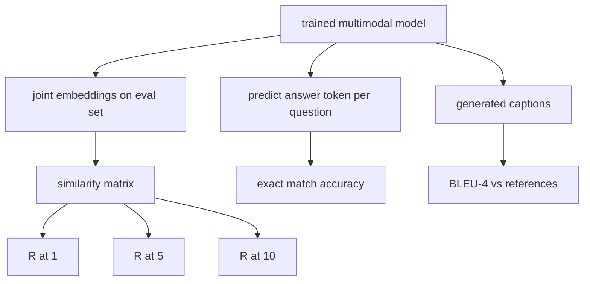

# 多模态评估

> 训练只占整个流程的一半，另一半是评估。本课将基于基础组件构建三个评估指标：图像-文本检索（报告 R@1、R@5、R@10）；视觉问答（报告精确匹配准确率）；以及图像描述生成（报告 BLEU-4）。每个指标都是对模型输出的函数计算，配合一个可在数秒内运行的合成评估套件。

**类型：** 构建
**语言：** Python
**前置课程：** 第 19 阶段课程 58-62（E 路径基础：编码器、Transformer、投影层、交叉注意力融合、预训练）
**耗时：** 约 90 分钟

## 学习目标

- 从图像与描述嵌入的相似度矩阵中计算 Recall@K。
- 从将 (图像, 问题) 对映射到固定答案词汇表的模型中计算精确匹配 VQA 准确率。
- 在不使用任何外部库的情况下，根据生成的和参考的 token 序列计算 BLEU-4。
- 针对基于课程 62 中训练好的模型构建的合成套件运行全部三项评估。

## 问题背景

当训练损失趋于平稳时，很容易产生一种错觉，认为多模态模型已经训练完成。训练损失仅衡量模型在训练分布上的拟合程度；它无法反映模型是否能在保留批次中对配对进行排序、回答问题，或生成人类可接受的描述。业界标准的三个评估维度如下：

- **检索 (R@1, R@5, R@10)。** 为查询描述构建联合嵌入；按余弦相似度对评估池中的每张图像进行排序；报告匹配图像是否进入前 1、前 5 或前 10 名。对称形式（图像到文本）的运行方式相同。
- **视觉问答 (精确匹配)。** 给定 (图像, 问题)，模型输出一个答案 token。精确匹配是单样本二值判断：预测答案是否等于参考答案？在整个评估集上求平均。
- **描述生成 (BLEU-4)。** 生成一段描述。计算与参考描述相比的 1-gram 到 4-gram 精度的几何平均数，并加入长度惩罚。多参考标准形式（一张图像对应多个参考描述）。

每个指标都是一个轻量级函数。本课将通过代码实现所有这些函数，使数学原理具体化，并确保评估过程完全由你掌控。真实的基准测试套件（如 MS-COCO、VQA v2、GQA、OK-VQA）均可适配相同的函数结构。

## 核心概念



### 基于相似度矩阵的 Recall@K

构建图像与描述嵌入之间的 `(N, N)` 余弦相似度矩阵。对每一行，按相似度降序排列列。Recall@K 是指对角线列索引位于前 K 个位置内的行数占比。对称形式的 Recall@K（描述到图像）在转置矩阵上计算。两个数值均需报告。对于 N=100 的评估，R@1 = 0.6 表示 100 段描述中有 60 段成功将正确图像排在首位。

### VQA 精确匹配

对于每个 (图像, 问题, 答案)，编码图像，嵌入问题，通过解码器融合，并读取下一个 token。将预测的 token ID 与参考 ID 进行比较；相等则判定正确。在整个评估集上求平均。真实的 VQA 数据集通常包含每个问题的多个人工标注答案，并使用软准确率公式（10 位标注者中至少 3 人一致记为 1.0，按比例缩放）；本课为求清晰起见，采用单答案精确匹配。

### BLEU-4

```text
BLEU-4 = BP * exp(mean(log p1, log p2, log p3, log p4))
```

其中 `p_n` 为修正后的 n-gram 精度（出现在任意参考中的生成 n-gram 截断计数除以总生成 n-gram 数），`BP` 为长度惩罚：

```text
BP = 1                if generated length > reference length
   = exp(1 - r/g)     otherwise, where r is reference length and g is generated
```

在小样本情况下，若某些 `p_n` 为零，则需要进行平滑处理。本实现采用 Chen 和 Cherry 的“方法 1”（任何零计数均在分子分母上加 1），这是在低计数场景下最安全的默认策略。

### 合成评估套件

基于课程 62 中使用的相同模拟语料模式，利用独立的保留种子在内存中构建一个包含 50 个样本的评估套件。该套件由三个列表组成：

- `pairs`：用于检索的 50 个 (图像, 描述ID) 对。
- `vqa`：用于问答的 50 个 (图像, 问题ID, 答案ID) 三元组。
- `caps`：用于描述的 50 个条目，格式为 (图像, [参考描述ID, ...])，每张图像最多包含 3 个参考描述。

该套件由种子确定性生成，且独立于训练语料，因此指标是在模型从未见过的数据上计算的。将套件持久化为 JSON 文件留作练习（见下文）。

| 指标 | 范围 | 随机基线 (N=50) |
|--------|-------|------------------------|
| R@1 | 0 到 1 | 0.02 (1 / N) |
| R@5 | 0 到 1 | 0.10 |
| R@10 | 0 到 1 | 0.20 |
| VQA EM | 0 到 1 | 1 / vocab |
| BLEU-4 | 0 到 1 | 较小但非零 |

在合成数据上进行 50 步训练时，指标预期不会很高；预期它们会高于随机基线，这也是演示程序所验证的内容。

## 构建实现

`code/main.py` 实现了以下功能：

- `recall_at_k(sim_matrix, k)`：返回 `[0, 1]` 范围内的浮点数，支持双向计算。
- `vqa_exact_match(predictions, references)`：返回 `int` 相等的平均值。
- `bleu4(generated, references, smoothing=True)`：支持多参考描述。
- `build_eval_suite(seed, n_samples, vocab_size, max_len)`：返回三个确定性的评估列表。
- `evaluate(model, suite)`：运行全部三项指标，并返回一个包含数字的 `dict`。
- 一个演示脚本：加载课程 62 中全新初始化的多模态模型，进行评估；随后训练 50 步并再次评估，打印前后指标对比。

运行方式：

```bash
python3 code/main.py
```

输出说明：前后指标表显示检索性能从接近随机水平向模型学到的信号提升，VQA 准确率超越随机基线，BLEU-4 也有所提升（合成数据的结构足以带来 4-gram 精度的提高）。

## 实际应用

每个指标均可直接映射到生产环境的基准测试：

- **检索。** MS-COCO 5K 验证集、Flickr30K、ImageNet 零样本任务均是基于同一相似度矩阵的 R@K 问题。将合成评估替换为真实文件后，函数签名保持不变。
- **VQA。** VQA v2、GQA、OK-VQA 均采用相同的精确匹配结构（VQA v2 使用软准确率替代单答案精确匹配）。
- **BLEU-4。** MS-COCO 描述生成、NoCaps、Flickr30K 描述生成均使用 BLEU-4 结合 CIDEr 和 METEOR。添加 CIDEr 仅需增加一个函数。

对于真实基准测试，只需将 `build_eval_suite` 替换为真实数据加载器，并保持函数体不变。其数学原理与具体基准无关。

## 测试用例

`code/test_main.py` 覆盖以下测试：

- 当相似度矩阵为完美单位矩阵时，recall@k 返回 1.0；当矩阵翻转且 k < N 时返回 0.0
- recall@k 遵守 `k <= N` 的上界约束
- 当生成结果与某一参考完全一致时，bleu4 返回 1.0
- 当词汇表完全不重叠时，bleu4 返回 0.0
- vqa 精确匹配等于相等样本对的占比
- build_eval_suite 返回预期的对数、VQA 项数和描述条目数

运行方式：

```bash
python3 -m unittest code/test_main.py
```

## 练习

1. 为描述生成指标添加 CIDEr。CIDEr 对 n-gram 使用 TF-IDF 加权，从而奖励信息量丰富的 token。

2. 实现软准确率 VQA：每个问题包含多个人工答案，若存在匹配则准确率为 `min(human_count / 3, 1)`。此设计复现了 VQA v2 的标准。

3. 为 `bleu4` 添加防 NaN 变体，使其能够安全处理空生成序列而不崩溃。

4. 在 R@K 之外计算平均倒数排名 (MRR)。MRR 对正确项超出前 K 名的具体位置敏感；而 R@K 仅关注其是否落入前 K 名。

5. 在训练过程中的五个检查点（步骤 0、10、20、30、40、50）对模型运行评估，并绘制学习曲线。确认指标轨迹与损失轨迹保持同步变化。

## 关键术语

| 术语 | 含义 |
|------|---------------|
| R@K | 正确匹配落入前 K 个结果中的查询占比 |
| 精确匹配 | 最简单的 VQA 评分方式：预测答案等于参考答案 |
| BLEU-4 | 1-gram 至 4-gram 精度的几何平均数，含长度惩罚 |
| 多参考 | 描述生成指标允许每张图像对应多个参考描述 |
| 保留集 | 评估集从与训练语料不相交的种子中采样生成 |

## 延伸阅读

- VQA v2 论文：了解软准确率公式及数据集统计信息。
- CIDEr 论文：了解基于 TF-IDF 加权的 n-gram 描述生成方法。
- BLEU 原始论文 (Papineni 等, 2002)：了解各种平滑变体。
- MS-COCO 描述生成评估脚本：获取官方参考实现。
