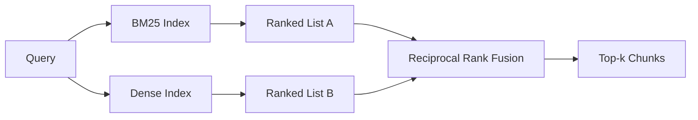

# 基于 BM25 与稠密嵌入的混合检索

> 词法检索与语义检索在相反的查询分布上表现不佳。使用倒数排名融合（Reciprocal Rank Fusion）的混合检索不进行插值，而是投票——且该投票机制能在每一类查询中胜出。

**类型：** 构建
**语言：** Python
**前置条件：** 第 11 阶段课程 04（Embeddings）、06（RAG）；第 19 阶段 B 轨基础（课程 20-29）；第 19 阶段课程 64（Chunking Strategies）
**耗时：** 约 90 分钟

## 学习目标
- 从零实现 BM25，基于 Robertson 和 Sparck Jones 的公式，包含字段权重、文档长度归一化以及可调的 k1 和 b 参数。
- 基于确定性模拟嵌入构建稠密检索器，使循环可在离线环境下运行。
- 严格按照 Cormack、Clarke 和 Buettcher 于 2009 年发表的论文实现倒数排名融合，并解释为何它优于分数加权插值。
- 调整 RRF 的 k 常数及各模态权重，并在小型测试语料库上解读权衡关系。

## 问题背景

当查询包含语料库中逐字匹配的标识符时，词法检索占优。针对 `AbortMultipartOnFail` 的查询可通过 BM25 在微秒级时间内返回正确的 Go 函数。而将同一查询进行嵌入后，它会位于三个相似度簇的边界上，导致稠密检索器将错误的文件排在首位。

当查询是对语料库字面标记的改写或同义表达时，稠密检索占优。用户询问“我们如何处理取消的上传”时，从未输入过 abort 或 multipart 等词。BM25 会返回关于“上传大文件”的文档块，因为该页面包含 uploads 一词。稠密检索则能找到摘要中提到 cancellation 的 abort 函数。

两者之间的选择并非静态的。查询分布才是变量。生产环境的 RAG 系统需通过同一个端点处理这两类查询，因此检索必须同时兼顾两者。这就是混合检索。合并步骤是必须做对的关键部分。

## 核心概念



### 一段话讲清 BM25

BM25 通过对查询词求和来计算查询-文档对的得分：每个词的得分由逆文档频率因子乘以一个饱和的项频率因子得出，后者包含长度归一化修正。两个关键参数。`k1` 控制项频率的饱和程度；默认值 1.5 是文献推荐值，若无基准测试支撑不应随意更改。`b` 控制文档长度的影响程度；默认值 0.75 表示会对长文档施加惩罚，但并非线性惩罚。

IDF 公式采用平滑后的 Robertson 和 Sparck Jones 定义，即 `log((N - df + 0.5) / (df + 0.5) + 1)`。对数内的加一操作可确保当某词出现在超过一半语料库中时，IDF 仍保持正值。这在停用词理论上罕见的小型语料库中尤为重要。

字段权重允许你告知 BM25 符号名的匹配比正文中的匹配更重要。其实现方式是在索引期间对词频计数乘以系数，而非在打分时处理。这能保持数学计算的一致性，并避免为每个字段生成独立分数。

### 一段话讲清稠密检索

使用嵌入模型将每个分块映射为固定维度的向量。查询时，将查询也进行嵌入，按余弦相似度对所有分块排序，并返回 Top-k。模型质量是决定效果的关键变量。检索算法本身仅两行代码：点积运算与排序。

本课程使用确定性的基于哈希的嵌入，以便你在无需网络请求的情况下理解融合算法的数学原理。该哈希将基于 token 键的偏移量累加到 96 维向量中并进行归一化。跨运行的余弦排名是确定性的，这正是测试套件所要求的。

### 倒数排名融合（已发表公式）

两条排名列表。对于出现在任一列表中的每个候选项，将其倒数排名贡献相加。2009 年的论文使用了 `1 / (k + rank)`，并将 k 设为 60 作为默认值。按总分排序即可。这就是整个算法。

已发表的常数 k = 60 并非随意设定。当 k = 60 时，排名第 1 的贡献为 1/61，排名第 10 的贡献为 1/70。贡献度衰减缓慢，使得靠后的候选项仍能参与投票。较小的 k 会使头部结果占据主导。较大的 k 则会拉平贡献曲线。

我们的实现中有两个可调参数。`k` 常数。以及一对模态专属权重，以便在有先验证据表明某一模态在你的语料库上表现更好时进行提升。将排名贡献乘以权重是最简单且合理的基础实现方式；它保留了排名衰减的形状，且保持尺度无关性。

### 为何融合优于分数加权插值

BM25 分数是无界的且依赖语料库。余弦相似度有界于 [-1, 1]。线性组合 `alpha * bm25 + (1 - alpha) * cosine` 需要针对每个语料库调整 alpha，且每次重新索引都会失效。而基于排名的融合不会如此。两种排名在不同模态间是可比的。自 2010 年以来，已发表的 RRF 基线在所有公开的 TREC 评测中均优于分数插值。

这与你在 Vespa 和 Weaviate 文档中听到的关于 RankFusion 与 RRF 的论点一致。它们得出了相同的结论：除非你有极强的证据支持进行分数插值，否则请坚持使用基于排名的方法。

## 构建实现

`code/main.py` 实现了以下功能：

- `tokenize(text)` - 快速正则表达式分词器。
- `BM25Index` - 支持字段权重，包含 `add` 与 `search`，以及可调的 k1、b 参数。
- `mock_embed`、`DenseIndex` - 与课程 64 相同的确定性嵌入，确保分块可比。
- `rrf(rankings, k, weights)` - 已发表的融合算法，支持多模态权重。
- `HybridRetriever` - 结合 BM25 与稠密检索。
- 演示脚本 `main()`，加载小型测试语料库，运行三个分别针对各检索器优势与弱点的查询，并打印各模态生成的排名及融合后的列表。

运行方式：

```bash
python3 code/main.py
```

对照阅读演示输出。字面标识符查询在 BM25 中排名第 1，稠密检索中排名第 4，RRF 中排名第 1。改写查询在 BM25 中排名第 6，稠密检索中排名第 1，RRF 中排名第 1。模糊查询在 BM25 中排名第 3，稠密检索中排名第 3，RRF 中排名第 1。融合并非用于打破平局；它是能在每一类查询中胜出的系统。

## 调整参数

| 参数 | 默认值 | 调高时机 | 调低时机 |
|------|--------|----------|----------|
| BM25 k1 | 1.5 | 文档中术语重复出现，且你希望词频发挥更大作用 | 文档较短，且术语重复属于噪声 |
| BM25 b | 0.75 | 长文档确实每词信息量更低 | 文档长度与主题无关 |
| RRF k | 60 | 希望靠后的候选项继续参与投票 | 希望排名第一的结果占据主导 |
| BM25 权重 | 1.0 | 语料库包含字面标识符，且查询与之匹配 | 查询为用户改写/同义表达 |
| 稠密权重 | 1.0 | 查询为改写/同义表达 | 查询为字面匹配 |

请通过在预留查询集上重新运行课程 68 的评估框架来调整参数，而非凭直觉。

## 演示未覆盖的失败模式

**未登录词（OOV）。** BM25 的 IDF 基于语料库计算，因此仅出现在查询中的词贡献为零。稠密嵌入会为同一词“幻觉”出一个向量。对于语料库外的标识符，稠密模态会返回看似合理但实际错误的邻居。融合机制能吸收此问题，因为 BM25 无返回结果，其排名贡献随之消失，但这仅在按文档去重（而非按分块去重）时成立。

**停用词主导。** 使用 BM25 检索单词 "the" 会在整个语料库中产生均匀排名。请在索引器中过滤停用词，或接受高 IDF 词自然主导排名的现实。

**跨模态内容相同。** 如果你的语料库足够小，使得 BM25 和稠密检索的 Top-1 相同，RRF 也会给出相同的 Top-1 及相同邻居。这是正确行为而非故障，但会让融合效果显得不可见。请在评估中添加对抗性查询对，以验证融合确实在工作。

## 生产应用

生产环境模式：

- 在进程内建立 BM25 索引；瓶颈在于词频字典，而非向量。
- 在独立存储中建立稠密向量索引（本课程使用扁平列表；生产环境中应使用 HNSW）。
- 并行执行两种查询；融合是对并集进行的常数时间合并。
- 持久化保存每个命中结果的模态来源，以便下游重排器知晓是哪个模态为其投票。

## 交付衔接

课程 66 将本课程的融合 Top-k 取出，并使用交叉编码器进行重排。课程 68 使用精确率、召回率、MRR 和 nDCG 对整个流水线进行评估。本课程中的混合检索器是课程 69 端到端系统的第一阶段。

## 练习

1. 将 `mock_embed` 替换为你提供商的真实模型。重新运行演示，并报告在改写查询下纯稠密检索排名的变化。
2. 添加第三种模态：单独索引的分块摘要，并将其作为第三条排名列表进行融合。测量性能增益。
3. 遍历 RRF 的 k 值（10、30、60、100、200）。绘制课程 68 中的 recall@k 曲线。报告在你的语料库上曲线达到峰值时的 k 值。
4. 正确实现 BM25F（按字段进行长度归一化，而非使用乘数技巧），并在符号匹配至关重要的语料库上进行对比。

## 核心术语

| 术语 | 常见说法 | 实际含义 |
|------|----------|----------|
| BM25 | “词法检索” | 基于 idf × 饱和词频 × 长度归一化的概率排序 |
| RRF | “排名融合” | 跨排名列表的 1 / (k + rank) 求和；默认 k = 60 |
| k1 | “词频饱和” | 控制重复术语停止增加得分的速度 |
| b | “长度惩罚” | 0 表示忽略文档长度，1 表示完全归一化 |
| 字段权重 | “符号提升” | 在索引期间重复 token 以提升该字段的匹配权重 |
| 基于排名 vs 基于分数的融合 | “为何 RRF 优于线性” | 不同模态间的排名可比，而分数不可比 |

## 延伸阅读

- Cormack, Clarke, Buettcher, "Reciprocal Rank Fusion outperforms Condorcet and individual rank learning methods", SIGIR 2009
- Robertson, Walker, Beaulieu, Gatford, Payne, "Okapi at TREC-3" (the original BM25 paper)
- [Vespa: Hybrid Retrieval with BM25 and Embeddings](https://docs.vespa.ai/en/tutorials/hybrid-search.html)
- [Weaviate: Hybrid Search](https://weaviate.io/developers/weaviate/search/hybrid)
- 第 11 阶段课程 06 - RAG 基础
- 第 19 阶段课程 64 - 此处索引输出的分块器
- 第 19 阶段课程 66 - 消费融合 Top-k 的交叉编码器重排器
