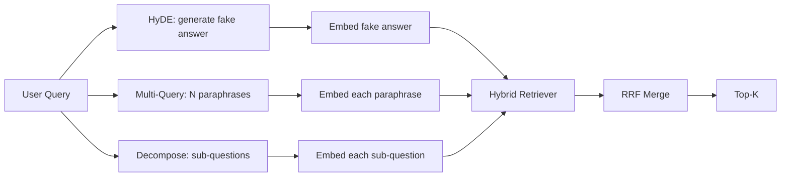

# 查询重写：HyDE、Multi-Query 与 Decomposition

> 用户输入的查询并非检索器真正想要的查询。在检索之前进行重写可以弥合这一差距，使索引看到的内容更接近答案的形态。

**类型：** 构建
**语言：** Python
**前置知识：** Phase 11 课程 04（嵌入）、06（RAG）；Phase 19 Track B 基础（课程 20-29）；Phase 19 课程 64 和 65
**耗时：** 约 90 分钟

## 学习目标
- 实现假设文档嵌入（HyDE）：生成一个虚构的答案，对其进行嵌入，并使用该向量而非查询向量进行检索。
- 实现多查询扩展：将一个查询重写为 N 个同义表述，分别对每个表述进行检索，并通过倒数排名融合（RRF）合并结果集。
- 实现查询分解：将复杂问题拆分为子问题，针对每个子问题分别检索，然后合并结果。
- 在同一组测试用例（fixture）上对比这三种重写器的表现，并解释每种策略在何种场景下占优。
- 接入一个能产生确定性输出（基于固定测试数据）的模拟 LLM，以便离线运行重写循环。

## 问题背景

用户输入：“当上传失败且预算耗尽时，我们的团队会怎么做？”。语料库中包含一篇文档写道：“AbortMultipartOnFail 会中止正在进行的 S3 分片上传，并在上传失败时减少每个存储桶的重试预算。”查询与文档之间没有共享的名词短语。BM25 会漏检。双编码器将该文档排在第三或第四位，因为查询向量落在了嵌入空间中偏好“已取消任务”文档的区域，而不是“已中止上传”文档的区域。课程 66 中的两阶段重排序（rerank）如果该文档位于 Top-N 内还能挽救答案，但如果它连 Top-N 都进不去，重排序器根本看不到它。

解决方案是在查询接触检索器之前对其进行重写。2023 年的论文《Precise Zero-Shot Dense Retrieval without Relevance Labels》（Gao 等人）提出了 HyDE：让 LLM 撰写能够回答该查询的文档，对该假设文档进行嵌入，并将其嵌入向量作为检索向量。由于假设文档使用了语料库的行文风格，它会落在嵌入空间的正确区域。而原始查询向量则不然。

两种衍生技术与 HyDE 配合使用。多查询扩展（Microsoft 的 GraphRAG 中使用的术语）会生成查询的 N 个同义表述并分别检索，然后合并结果。分解（在 2024 年斯坦福 DSPy 工作中被称为“子查询分解”）将“当上传失败且预算耗尽时，我们的团队会怎么做？”拆分为两个问题：“上传失败时会发生什么”以及“重试预算耗尽时会发生什么”。两次检索，一次合并，答案的两部分均可获取。

本课程将实现这三种方法，并在同一组测试语料上进行运行对比。

## 核心概念



### HyDE 详解

HyDE 用 LLM 撰写的假设文档向量替换用户的查询向量。提示词非常简短：

```
You are a domain expert. Write a one-paragraph passage that answers the question
below. Use the same vocabulary and phrasing the documentation in this domain would
use. Do not refuse. Do not say you do not know.

Question: {user_query}

Passage:
```

作为事实性答案，LLM 的回答是错误的，因为它不了解你的语料库。但这没关系。检索器不关心事实是否正确，只关心词元分布。假设段落包含了“abort”、“multipart”、“bucket”、“budget”等词汇，因为关于此主题的文档段落本来就会这么说。对该段落进行嵌入。向量会落在真实段落附近。

在生产环境中，通常将假设文档限制在两到三句话。过长的假设会引入更多噪声，过短则会丢失 HyDE 所需的词汇信号。

### 多查询扩展详解

生成用户查询的 N 个同义表述。最简单的提示词如下：

```
Rewrite the following question in {N} different ways. Each rewrite must preserve
the original intent. Number them 1 to {N}. Do not add explanations.
```

对每个同义表述检索 Top-K 结果。使用 RRF（与课程 65 相同的算法）合并这 N 个排名列表。成本低、可并行、结果确定。

当用户的措辞只是提问的众多有效方式之一，且任何重写都能更好地表达意图时，多查询扩展会胜出。当所有重写结果同样糟糕（因为原始查询本身就很差）时，它会失效。

### 查询分解详解

单次检索无法满足多维度问题。分解要求 LLM 将问题拆分为子问题，系统针对每个子问题分别检索。提示词如下：

```
The following question may require information from multiple distinct topics.
Decompose it into a list of sub-questions. Each sub-question must be answerable
independently. If the question is already atomic, return it unchanged.

Question: {user_query}
```

针对每个子问题检索，然后合并。对于包含连词、多从句比较或两个不相关主题的问题，分解是合适的工具。但对于原子查询，它是错误的工具；此时分解器的职责是返回原问题，而不是编造虚假的子问题。

### 为什么需要这三种方法

三者互为补充。HyDE 弥补了查询与语料库之间的词元鸿沟。多查询扩展覆盖同义表述的差异。分解覆盖多主题查询。生产系统会同时运行这三种方法，并根据具体查询选择策略（课程 69 的端到端系统展示了选择器的工作方式）。

## 模拟 LLM

本课程将在离线环境下运行。模拟 LLM 是一个以用户查询为键的小型查找表，并附带未见过查询的回退机制。查找表包含以下内容：

- 针对每个测试查询：一段预写的假设段落、三个同义表述和一个分解结果。
- 针对未知查询：一种确定性转换：提取查询中的实词，通过同义词映射表进行扩展，并返回结果。

模拟代码的结构才是关键，而非具体数据。在生产环境中，你会将其替换为真实的模型调用。检索器本身无需更改。

## 动手实现

`code/main.py` 实现了：

- `MockLLM` - 上述确定的替代方案。
- `HyDERewriter` - 调用 LLM 撰写假设文档，将重写器的输出返回为 `RewriteResult`，其中包含假设文本以及检索器应使用的查询。
- `MultiQueryRewriter` - 调用 LLM 生成 N 个同义表述，返回查询列表。
- `DecomposeRewriter` - 调用 LLM 进行分解，返回子问题列表。
- `retrieve_with_rewriter` - 接收重写器和检索器，执行重写操作并融合结果。
- 一个演示脚本，在测试集上运行三种重写器，并打印哪种策略最先返回黄金答案文档。

检索器的结构复用了课程 65 的设计（混合 BM25 + 稠密检索）。融合算法同样是 RRF。唯一新增的结构是重写器接口，其规模很小。

运行方式：

```bash
python3 code/main.py
```

输出内容为各策略的排名及最终总结。HyDE 在措辞不匹配的查询上胜出。多查询扩展在同义表述差异的查询上胜出。分解在多主题查询上胜出。回退方案（无重写器）至少在三项测试中有一项失利。

## 演示未覆盖的故障模式

**HyDE 错误地幻觉化语料库特定标识符。** 模型捏造了一个函数名。假设文档在目标文档上的 BM25 分数因此暴跌，因为捏造的名称现在成了一个高权重词元，但并未出现在索引中。限制假设文档的长度，并在融合时降低 BM25 的权重。

**多查询重写全部收敛。** 较弱的模型生成了三个几乎 identical 的同义表述。N 次检索返回了相同的 Top-K。RRF 合并的效果并不优于单次检索。在重写提示词中添加明确的多样性指令，并通过 Jaccard 相似度检测重复项。

**分解过度拆分。** 分解器将原子问题拆分成列表。检索结果虽然都是同一篇文档，但排名下降。合并后的效果反而不如原始查询。在扇出（fan-out）之前增加一轮“这些子问题是否足够不同”的检查来避免此问题。

**延迟成倍增加。** HyDE 消耗一次 LLM 调用。多查询扩展消耗一次 LLM 调用生成 N 个重写，随后进行 N 次检索。分解消耗一次 LLM 调用进行拆分，随后进行 M 次检索。检索可并行执行；LLM 调用构成了延迟下限。

## 生产应用

生产环境模式：

- 按查询长度选择策略：原子型短查询使用多查询扩展，复杂多从句查询使用分解，专业术语密集的查询使用 HyDE。
- 按查询哈希缓存重写器输出。许多查询会重复出现。
- 并行运行三种策略，并使用 RRF 将三个结果集融合为一个。成本为三次 LLM 调用和一次融合；质量则是三种策略覆盖范围的并集。

## 交付部署

课程 69 会将此重写阶段接入到课程 65 的检索器之前，以及课程 66 的重排序器之前。课程 68 评估了重写器为检索召回率带来的提升。

## 练习

1. 实现 RAG-Fusion（多查询扩展的 2024 年变体），其中重写器的同义表述刻意保持多样性，随后由重排序步骤（课程 66）挑选最终列表。
2. 添加第四种策略：后退提示（step-back prompting，要求 LLM 提出更通用的问题，基于该问题进行检索，然后再缩小范围）。在测试集上进行对比。
3. 训练分解器识别原子查询，方法是增加一个“是否为原子问题”的输出头。测量优化前后的过度拆分率。
4. 将模拟 LLM 替换为真实的模型调用。在你的技术栈上测量各策略的延迟。
5. 为每次重写添加置信度评分。丢弃低于阈值的重写结果。测量其对召回率的影响。

## 核心术语

| 术语 | 常见说法 | 实际含义 |
|------|----------|----------|
| HyDE | “假文档检索” | LLM 撰写答案；对该答案进行嵌入并用于检索，而非直接使用查询 |
| Multi-query | “同义扩展” | 将查询重写 N 次；检索 N 次，通过 RRF 合并 |
| Decomposition | “子查询拆分” | 将多主题查询拆分为子问题，分别检索 |
| Atomic query | “单主题” | 无法在不编造虚假子问题的情况下进行拆分 |
| Step-back | “抽象查询” | 提出更通用的问题，进行检索，然后再缩小范围 |

## 延伸阅读

- Gao, Ma, Lin, Callan, "Precise Zero-Shot Dense Retrieval without Relevance Labels" (HyDE), 2023
- Microsoft Research, "Multi-Query Expansion for Retrieval"
- Stanford DSPy, "Subquery Decomposition for Multi-Hop QA"
- [LlamaIndex 查询转换文档](https://docs.llamaindex.ai/en/stable/optimizing/advanced_retrieval/query_transformations/)
- Phase 11 课程 07 - 高级 RAG 模式
- Phase 19 课程 65 - 本重写器所对接的检索器
- Phase 19 课程 68 - 衡量重写器提升效果的评估实验
