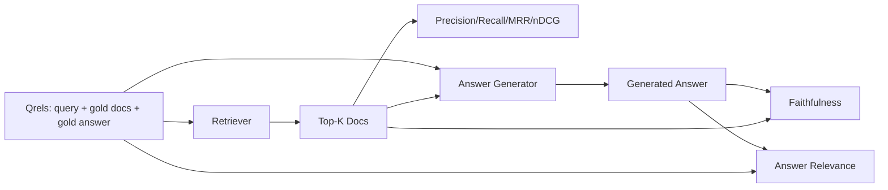

# RAG 评估：Precision、Recall、MRR、nDCG、Faithfulness、Answer Relevance

> 如果你无法同时评估检索结果和生成答案，就无法上线该系统。这两者并非同一指标，且同一个提示词在不同维度上会失效。

**类型：** 实战构建
**语言：** Python
**前置要求：** 第 11 阶段课程 06（RAG）、10（评估）；第 19 阶段 Track B 基础（课程 20-29）；第 19 阶段课程 64、65、66、67
**耗时：** 约 90 分钟

## 学习目标
- 基于标准 qrels（gold qrels）计算四项检索指标：precision@k、recall@k、MRR（平均倒数排名）和 nDCG@k。
- 计算两项答案评分指标：faithfulness（每个主张均基于检索到的上下文）和 answer relevance（答案是否切题）。
- 构建一个 fixture qrels 文件（包含查询、标准文档 ID、标准答案文本），供评估流程端到端读取。
- 通过解读指标值诊断流水线故障环节：检索、排序、生成或事实 grounding。

## 问题背景

RAG 系统至少包含四个动态组件：chunker（分块器）、retriever（检索器）、reranker（重排器）、generator（生成器）。其中任何一个都可能导致错误答案。如果没有分阶段指标，你将如同盲人摸象。

用户报告了错误答案。是因为 chunker 切断了答案片段？是因为 retriever 未将该 chunk 包含在 top-k 中？是因为 reranker 将正确的 chunk 排到了第一位之后？还是因为 generator 忽略了该 chunk 并凭空捏造？仅凭答案本身无法判断。你需要：

- 检索指标：评估 retriever 的输出质量。
- 排序指标：评估正确 chunk 在排序列表中的位置。
- Faithfulness：评估 generator 是否严格遵循检索到的上下文。
- Answer relevance：评估答案是否真正回应了问题。

本课程将基于 fixture qrels 文件构建全部六项指标。该评估是离线且确定性的；在生产环境中，你会将模拟的 LLM-as-judge 替换为真实模型。

## 核心概念



### Precision@k

在 retriever 返回的 top-k 个文档中，有多少比例属于标准集合（gold set）？如果标准集合包含三个文档，而 top-3 返回了其中两个和一个错误文档，则 precision@3 为 2 / 3。当无关检索 chunk 的代价较高时（generator 在其上浪费 token，或该 chunk 污染了答案），请使用 precision。

### Recall@k

在标准文档中，有多少比例出现在 top-k 中？如果标准集合包含三个文档，而 top-5 包含了全部三个，则 recall@5 为 1.0。当遗漏答案的代价较高时（你宁愿多看到一个错误 chunk，也不愿完全错过答案 chunk），请使用 recall。

在生产级 RAG 中，人们通常引用的指标是 recall@k。生成阶段可以轻松丢弃无关 chunk；但它无法从未见过的 chunk 中凭空捏造答案。

### MRR（Mean Reciprocal Rank，平均倒数排名）

对于每个查询，在排序列表中找到第一个相关文档的位置。倒数排名为 1 / 位置。对查询集取平均值。MRR 是一个单一数值摘要，用于衡量 retriever 将最佳答案排在顶部的能力。

MRR 极度看重第 1 位。标准文档排在第 1 位的查询贡献 1.0。第 2 位贡献 0.5。第 10 位贡献 0.1。该指标主要由列表顶部主导。

### nDCG@k

Normalized Discounted Cumulative Gain（归一化折损累计增益）。完整公式为每个检索文档分配增益（通常相关为 1，不相关为 0），按位置的对数进行折损，求和后除以理想 DCG（完美排序时的 DCG）。取值范围 0 到 1。

nDCG 支持分级相关性：标准集可以标注“文档 A 为 3，文档 B 为 2，文档 C 为 1”。MRR 和 recall@k 将所有内容扁平化为二值。当语料库中每个查询存在多个部分相关文档时，请使用 nDCG。

### Faithfulness

对于生成答案中的每个主张（claim），检查该主张是否得到检索上下文的支持。标准实现使用 LLM-as-judge 提示词，输入 (claim, context) 并返回 yes 或 no。该指标为通过检查的主张比例。

Faithfulness 用于捕捉 generator 捏造内容的故障模式。即使 retriever 返回了正确的 chunk，产生幻觉的 generator 也是失效的。Faithfulness 也被称为 groundedness、support 或 attribution。

本课程使用确定性的模拟 judge 实现 faithfulness，通过阈值检查每个主张的 token 是否与检索上下文重叠。在生产环境中，你会替换为真实的模型调用。指标的计算形态保持一致。

### Answer relevance

答案是否真正回应了问题？Faithfulness 问的是“答案是否基于上下文？”。Answer relevance 问的是“答案是否基于问题？”。一个忠实但跑题的答案在 faithfulness 上得分高，在 relevance 上得分低。一个简短、切题但忽略上下文的答案在 relevance 上得分高，在 faithfulness 上得分低。

标准实现同样使用 LLM-as-judge：输入 (question, answer) 并询问答案是否回应了问题。本课程实现了一个基于 token 重叠加 judge 的替代方案。

## fixture qrels

```python
{
  "qid": "q1",
  "query": "what is the abort threshold for multipart uploads",
  "gold_doc_ids": ["d1", "d3"],
  "gold_answer_substring": "three failed parts",
  "graded_relevance": {"d1": 3, "d3": 2},
}
```

每个查询包含：
- 查询字符串，
- 一组标准文档 ID（用于 precision / recall / MRR），
- 一个分级相关性字典（用于 nDCG），
- 标准答案子串（作为每个 qrel 的参考元数据保留；本课程中的 faithfulness 是通过将提取的主张与检索上下文进行比对来计算的，而非与此子串比对）。

在生产环境中，你需要手动标注这些数据。本课程提供了一个手工构建的 fixture，以便评估开箱即用。

## 动手构建

`code/main.py` 实现了：

- `precision_at_k(retrieved, gold, k)` - 字面定义。
- `recall_at_k(retrieved, gold, k)` - 字面定义。
- `mean_reciprocal_rank(retrieved_list_of_lists, gold_list)` - 查询集上的平均值。
- `ndcg_at_k(retrieved, graded_relevance, k)` - 具有二值或分级增益的 DCG / IDCG。
- `extract_claims(answer)` - 将答案拆分为句子形态的主张。
- `faithfulness(claims, context_texts, judge)` - 被判定为受支持的主张比例。
- `answer_relevance(question, answer, judge)` - 判定答案是否回应问题的 judge。
- `MockJudge` - 确定性 token 重叠 judge，使评估可离线运行。
- `evaluate_pipeline(pipeline_fn, qrels, ks)` - 运行所有指标的编排器。
- 一个演示程序，针对 qrels 运行三种流水线变体（chunker 基线、混合检索、混合 + 重排）并打印指标表格。

运行它：

```bash
python3 code/main.py
```

输出将在单个指标表格中显示每个变体的 precision@k、recall@k、MRR、nDCG@k、faithfulness 和 answer relevance。混合检索行在 recall 上优于 chunker 基线；重排行在 MRR 上优于混合检索。

## 解读指标以诊断故障

| 症状 | 可能原因 | 修复方向 |
|---------|-------------|-------------|
| recall@k 低，precision@k 低 | Chunker 切断了答案或 retriever 无法找到它 | Chunker 边界（课程 64）或 retriever 模态（课程 65） |
| recall@k 尚可，MRR 低 | 正确的 chunk 在 top-k 中但不在第 1 位 | Reranker（课程 66） |
| MRR 高，faithfulness 低 | 尽管上下文正确，generator 仍捏造内容 | 生成提示词；强制引用或拒绝生成 |
| faithfulness 高，relevance 低 | 答案有依据但跑题 | 查询重写器（课程 67）或生成提示词 |
| 四项均高，用户仍抱怨 | 评估集缺乏代表性 | 使用真实用户查询扩展 qrels |

## 演示程序会掩盖的故障模式

**LLM-as-judge 偏差。** 模型倾向于认为自己的输出比实际更忠实。请为 judge 使用与 generator 不同系列的模型，或人工抽检评分。

**Qrels 腐化。** 随着语料库变更，标准答案会发生漂移。2024 年 1 月 q1 的标准文档在 2024 年 10 月可能不再是正确答案，因为团队重命名了函数。请安排季度 qrels 审查。

**Faithfulness 微观检查遗漏宏观主张。** 逐句 faithfulness 可能通过，但整体答案结构仍具误导性。在自动化指标之上增加样本级定性审查。

**Recall@k 掩盖单查询故障。** 90% 的平均 recall 可能掩盖某一类查询始终失败的事实。按查询类别（字面、改写、多主题）对 qrels 进行切片，并报告各切片指标。

## 实际应用

生产环境模式：

- 每次变更 retriever 或 generator 时运行评估。将 recall@k 回退视为测试失败。
- 持久化每个查询的指标追踪记录。当用户投诉时，查找匹配的 qrels 条目，确认该问题是否本应被捕获。
- 对 qrels 进行分级：20 个查询的冒烟集在 CI 中运行；200 个查询的回退集每晚运行；2000 个查询的深度集每周运行。

## 上线准备

课程 69 将串联整个流水线（chunker、retriever、reranker、generator），并针对该端到端系统运行此评估。

## 练习

1. 添加第五项检索指标：hit-rate@k。将其与 recall@k 进行对比。解释它们在何时会产生差异。
2. 实现分级 faithfulness：0（无支持）、1（部分支持）、2（完全支持）。相应更新指标计算。
3. 将模拟 judge 替换为真实模型调用。在 fixture 上测量模拟 judge 与真实 judge 之间的不一致率。
4. 添加查询类别切片（“literal”、“paraphrased”、“multi-topic”）。报告各切片的指标。
5. 添加“答案长度”指标，并计算其与 faithfulness 的相关性。绘制曲线图。

## 关键术语

| 术语 | 人们常说的 | 实际含义 |
|------|-----------------|------------------------|
| Precision@k | “检索结果的命中率” | top-k 中属于标准集合的比例 |
| Recall@k | “标准集合的命中率” | top-k 中包含标准文档的比例 |
| MRR | “首次命中位置” | 第一个相关文档排名的倒数之平均值 |
| nDCG@k | “分级排序质量” | top-k 的 DCG 除以理想 DCG |
| Faithfulness | “事实依据/扎根性” | 答案主张中得到检索上下文支持的比例 |
| Answer relevance | “它回答问题了吗？” | 答案是否契合问题的意图 |
| Qrels | “标准标签” | 已标注的查询集合及其对应的标准文档与答案 |

## 延伸阅读

- Buckley, Voorhees, "Evaluating Evaluation Measure Stability", SIGIR 2000 - 关于排序指标的权威论文
- Jarvelin, Kekalainen, "Cumulated Gain-based Evaluation of IR Techniques" - nDCG 原始论文
- [Ragas: Automated Evaluation of RAG Pipelines](https://docs.ragas.io)
- [Anthropic, Evaluating RAG](https://www.anthropic.com/news/evaluating-rag)
- 第 11 阶段课程 10 - 评估框架基础
- 第 19 阶段课程 64-67 - 此处评估的组件
- 第 19 阶段课程 69 - 本评估所打分的端到端流水线
