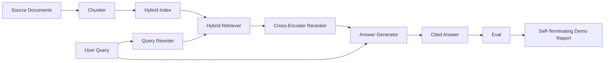

# 端到端 RAG 系统

> 六个组件课程。一条流水线。一个评估循环。一个自动终止的演示程序。这就是你要交付的系统。

**类型：** 构建
**语言：** Python
**前置要求：** 第 11 阶段课程 06（RAG）、10（评估）；第 19 阶段 B 轨道基础（课程 20-29）；第 19 阶段课程 64、65、66、67、68
**耗时：** 约 90 分钟

## 学习目标
- 将分块器（chunker）、混合检索器（hybrid retriever）、查询重写器（query rewriter）、交叉编码器重排器（cross-encoder reranker）和答案生成器（answer generator）组合成一条单一的端到端流水线。
- 实现一个答案生成器，通过分块锚点（chunk anchor）为其主张提供引用，并具备低置信度拒绝（refuse-on-low-confidence）的回退机制。
- 针对组装好的流水线运行课程 68 的评估，证明分阶段构建的系统在各项指标上均优于孤立运行的相同组件。
- 构建一个自动终止的 CLI 演示程序，它能够摄入固定语料库，运行固定的查询集，并在输出摘要报告后以状态码 0 退出。

## 问题背景

孤立运行的六个组件证明不了什么。分块器可能在语料库的 recall@5 上获胜，却在系统的 recall@5 上失败，因为检索器无法对分块器输出的内容进行有效排序。重排器可能在合成候选池上提升 MRR，却在真实的双编码器（bi-encoder）候选集上失败，因为双编码器在重排预算内的召回率过低。查询重写器可能在单个查询上提升黄金文档的排名，却在下一个查询上失效，因为 LLM 模拟接口返回了退化的假设性文档。

集成测试是整个流水线针对相同的固定 qrels 数据集端到端运行，使用相同的指标，并通过一个编排文件将所有组件连接起来。这正是本课程要构建的内容。如果集成流水线上的指标击败了每个阶段孤立演示的指标，你就证明了该系统的有效性。

## 核心概念



### 连接策略

流水线是一个小型图结构。每个阶段都是一个具有明确签名的函数。

| 阶段 | 输入 | 输出 |
|-------|-------|--------|
| 分块器（Chunker） | 文档文本 | Chunk 记录列表 |
| 检索器（Retriever） | 查询字符串 | Top-N Chunk 记录 |
| 重写器（Rewriter，可选） | 查询字符串 | 重写列表 + 假设文档 |
| 重排器（Reranker） | 查询、候选集 | 带有交叉分数的 Top-K Chunk 记录 |
| 生成器（Generator） | 查询、Top-K Chunk 记录 | 带引用的答案字符串 |

当每个签名保持稳定时，组合过程就非常直接。本课程中的 `Pipeline` 类包含这五个阶段，以及一个按顺序运行它们的 `query` 方法。每个阶段都是可替换的：传入不同的分块器、检索器、重写器、重排器或生成器，流水线依然可以运行。

### 带引用的答案生成器

生成器是最后一个阶段，也是最容易出问题的环节。本课程提供了一个确定性的模拟生成器，它：

1. 接收重排后的 Top-K 分块。
2. 选出最多两个分块，其文本与查询的内容词元（content-token）重叠度最高。
3. 输出一个答案，该答案由每个选中分块中的一句话拼接而成，每句话后跟一个 `[doc_id:chunk_index]` 锚点。
4. 如果没有分块的重叠度超过拒绝阈值，则输出“我不知道”（I do not know）且不附带引用。

在生产环境中，你会将模拟生成器替换为真实的 LLM 调用，并使用以下提示词模板：

```
You are answering a question using only the snippets below.
Cite every claim with the anchor in parentheses.
If the snippets do not answer the question, say "I do not know".

Question: {query}

Snippets:
{enumerated chunks with anchors}

Answer:
```

低置信度拒绝路径正是记录交叉编码器 rank-1 分数的全部原因。如果该分数低于语料库阈值，生成器将拒绝回答。这是防止幻觉答案的安全阀。

### 自动终止的演示程序

该演示程序端到端运行所有组件。它会打印单个查询的各阶段细分结果，针对四个固定 qrels 运行评估，输出指标表格；如果所有课程 68 的指标均达到演示中设定的阈值，则以状态码 0 退出。如果任何指标低于阈值，演示程序将以非零状态码退出，并输出指明失败指标的消息。

这正是 CI 冒烟测试的形态。流水线离线运行，速度快且具备确定性。在固定数据集上故意设置了严格的阈值，以便六个课程中任何一个出现退化都会导致演示失败。

## 构建步骤

`code/main.py` 实现了：

- `Chunk` - 贯穿所有阶段的记录（在课程 64 的结构基础上扩展了 chunk_index 和源 doc_id）。
- `Chunker` - 从课程 64 中选择策略（默认为递归分割）。
- `HybridIndex` - 捆绑了课程 65 中的 BM25 + 稠密检索 + RRF。
- `Rewriter`（可选）- 根据查询长度和连词的存在情况，从课程 67 中选择 HyDE、多查询或分解策略之一。
- `Reranker` - 课程 66 中训练好的交叉编码器，使用较小的固定训练集以便在数秒内收敛。
- `Generator` - 带有引用和低置信度拒绝机制的确定性模拟生成器。
- `Pipeline` - 通过 `query(question)` 方法组合这五个阶段，并返回 `Result(answer, top_k, latency_ms_per_stage)`。
- `run_demo()` - 摄入语料库，运行三个固定查询，执行评估，打印结果，并根据阈值设置退出码。

运行它：

```bash
python3 code/main.py
```

输出内容包括一条打印的查询追踪记录、完整的评估表格以及最终的通过/失败状态。在固定数据集上返回退出码 0。

## 演示程序可能掩盖的故障模式

**分块器边界漂移。** 如果在评估 qrels 标注阶段和演示之间切换分块器策略，黄金文档 ID 将不再对齐。请在 qrels 文件中锁定分块器策略。演示程序包含一个指明分块器名称的头部信息。

**重排器训练集泄露至评估集。** 课程 66 中的 14 个训练三元组包含与评估查询相似的查询。在生产环境中，必须严格隔离评估查询。演示程序的评估查询故意与重排训练集保持不相交。

**模拟生成器掩盖了幻觉风险。** 模拟生成器不会产生幻觉，因为它仅输出检索到的分块中的文本。本课程指出了这一点，并指明了在生产环境中替换为真实模型的路径。

**无流式输出。** 流水线在每个阶段结束时返回完整答案。生产系统通常会流式输出生成器的结果。流式处理不在本课程范围内；答案级指标无论如何都基于最终字符串进行计算。

**延迟为离线模式。** 模拟 LLM 调用耗时恒定。真实 LLM 调用将占据主导地位。请在请求范围内规划延迟预算；本课程的各阶段计时仅测量 CPU 工作量。

## 使用建议

生产环境模式：

- 将流水线文件置于单一编排器下，并定义明确的阶段接口。避免将连接逻辑分散在整个代码库中。
- 在每次涉及阶段修改的合并前运行评估。如果评估指标下降，则拒绝合并。
- 持久化每次 CI 运行的指标追踪记录，以便将退化归因于特定的阶段替换。
- 添加包含 20 个查询的冒烟测试集（回归测试集的子集），确保在 30 秒内运行完毕；完整的回归测试集则每晚运行。

## 交付说明

本课程中的流水线文件结构是第 19 阶段 F 轨道其余课程所基于的形态。后续课程将在此基础上添加自动化摄入、增量重新索引、遥测以及服务层。检索、重排、重写和评估部分在此已完整实现。

## 练习

1. 在重写器内部添加按查询选择的策略选择器：利用课程 67 的启发式规则（长度、连词、术语比例）选择 HyDE、多查询或分解策略。
2. 通过环境变量标志为生成器添加真实的 LLM 调用。默认使用模拟生成器。测量延迟差异。
3. 扩展演示程序以接受 `--corpus path` 标志来加载真实语料库。重新运行评估和阈值检查。
4. 为分块器添加 `--strategy` 标志。测量每种策略对端到端召回率的贡献。
5. 添加流式生成器接口并将其接入评估。确认忠实度（faithfulness）是基于最终字符串而非流式前缀计算的。

## 关键术语

| 术语 | 常见说法 | 实际含义 |
|------|-----------------|------------------------|
| 流水线（Pipeline） | “RAG 流水线” | 从数据摄入到带引用答案的组合阶段 |
| 引用锚点（Citation anchor） | “来源链接” | 附加在每个主张上的 (doc_id, chunk_index) 引用 |
| 低置信度拒绝（Refuse-on-low-confidence） | “我不知道” | 当重排器 top-1 分数低于阈值时，生成器不返回答案 |
| 冒烟测试集（Smoke set） | “CI 评估” | 在每次 PR 检查中运行的最小 qrels 子集 |
| 阶段接口（Stage interface） | “函数签名” | 流水线每个阶段稳定的输入和输出类型 |

## 延伸阅读

- [Anthropic, Building search and retrieval](https://www.anthropic.com/news/contextual-retrieval)
- [Pinterest, MCP internal search](https://medium.com/pinterest-engineering) - 参考生产架构
- [Ragas: Automated Evaluation of RAG Pipelines](https://docs.ragas.io)
- 第 11 阶段课程 06 - RAG 基础
- 第 19 阶段课程 64-68 - 此处组合的组件
