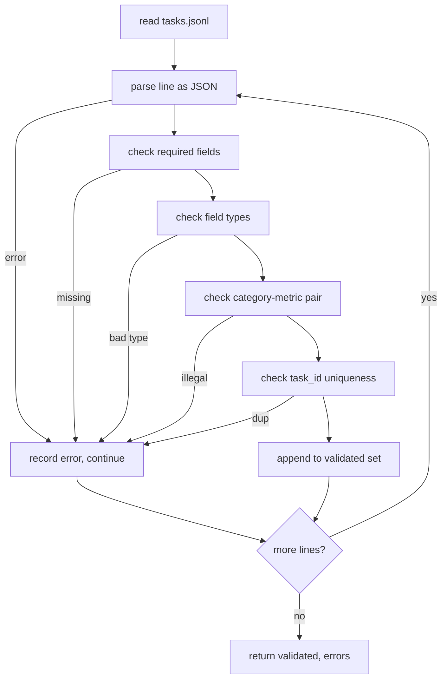

# 任务规范格式

> 评估框架的质量取决于其任务所遵循的契约。在编写任何评分函数之前，先固定 JSONL 结构和指标词汇表。

**类型：** 构建
**语言：** Python
**前置要求：** 第 19 阶段 B 轨道基础
**耗时：** 约 90 分钟

## 学习目标

- 定义一个统一的 JSONL 任务记录模式，涵盖算术、多项选择、代码执行、分类和自由文本摘要。
- 固定一个封闭的指标名称词汇表，以便下游课程（71-73）可以基于单个字段进行分发。
- 将少样本（few-shot）示例和后处理规则指定为任务的一部分，而非运行器（runner）的一部分，从而确保相同的提示词在不同模型下生成相同的目标。
- 实现一个严格的验证器，在格式错误的记录到达运行器之前将其拒绝。
- 提供一套包含 10 个任务的测试夹具（fixture），覆盖规范的每个分支，以便验证器有真实的用例进行测试。

## 为何需要固定的规范

研究代码库积累评估脚本的速度往往快于积累测试的速度。六个月后，每个 notebook 都会有自己的 JSON 结构，每个指标都会被重复实现两次，且不同运行之间的结果无法比较。解决方法很枯燥：选定一个模式，编写一个验证器，拒绝其他所有内容。这正是本课要做的事情。

该结构借鉴了 BIG-bench、HELM 和 lm-eval 风格框架的思想，但字段名称由我们自定义。每个字段都有单一的职责归属。运行器读取任务，指标读取目标，后处理步骤对生成内容进行规范化。在流水线中途，没有任何字段是可变的。

## 记录结构

一个任务是单行上的一个 JSON 对象。框架读取 `tasks.jsonl` 并独立验证每一行。错误的行会中止该记录，但不会中止整个运行。

```json
{
  "task_id": "arith_001",
  "category": "arithmetic",
  "prompt": "Compute the result. Question: 17 + 24\nAnswer:",
  "targets": ["41"],
  "metric_name": "exact_match",
  "few_shot_examples": [
    {"prompt": "Question: 2 + 2\nAnswer:", "completion": "4"}
  ],
  "post_process": "strip_whitespace",
  "metadata": {"difficulty": "easy"}
}
```

必填字段为 `task_id`、`category`、`prompt`、`targets`、`metric_name`、`post_process`。`few_shot_examples` 和 `metadata` 为可选字段。未知的顶层字段会导致验证失败。

## 字段规则

`task_id` 是一个不含空白字符的字符串。验证器会强制其在整个文件中保持唯一。

`category` 是 `arithmetic`、`mcq`、`code_exec`、`classification`、`summary` 之一。该类别约束了哪些指标和后处理组合是合法的。`code_exec` 任务必须使用 `metric_name = code_exec`，而 `mcq` 任务必须针对单字母目标使用 `metric_name = exact_match`。

`prompt` 是一个非空字符串。验证器禁止尾随空白字符，并拒绝提示词正文中已包含少样本块的记录。少样本的渲染由运行器完成，而非由作者完成。

`targets` 是一个非空字符串列表。对于 `exact_match`，匹配任意元素均计分。对于 `f1` 和 `rouge_l`，得分最高的目标胜出。对于 `mcq`，该列表仅包含一个元素。

`metric_name` 是 `exact_match`、`f1`、`bleu_4`、`rouge_l`、`accuracy`、`code_exec` 之一。该词汇表是封闭的。新增指标需要新课程以及在此处添加新条目。

`few_shot_examples` 是一个 `{prompt, completion}` 对的列表。验证器将该列表上限设为八条，以控制提示词长度。

`post_process` 是 `none`、`strip_whitespace`、`lower`、`extract_letter`、`extract_code_block`、`extract_first_line` 之一。每条规则都具有单一的确定性行为。验证器禁止组合规则。

## 验证器行为



验证器返回两个列表：已验证的记录和错误记录（包含出错行、违反的规则以及出错的字段）。除非显式设置了 `--allow-bad-tasks` 标志，否则如果错误列表非空，运行器将拒绝启动。

## 少样本渲染

运行器使用空行分隔符将少样本示例拼接在提示词前方。所有模型都执行相同的代码路径，因此唯一的变量来源是模型本身。作者只需编写一次示例，而无需为每个提供商单独编写。

```python
def render(task):
    parts = []
    for ex in task.get("few_shot_examples", []):
        parts.append(ex["prompt"] + " " + ex["completion"])
    parts.append(task["prompt"])
    return "\n\n".join(parts)
```

## 后处理规则

后处理步骤在生成之后、指标计算之前运行。它是确定性且无状态的。

- `none` 原样返回字符串。
- `strip_whitespace` 去除首尾空白字符。
- `lower` 将字符串转换为小写。
- `extract_letter` 返回匹配 `[A-E]` 的第一个字符，用于多项选择题。
- `extract_code_block` 返回第一个三反引号代码块的内容，用于代码执行。
- `extract_first_line` 返回第一个非空行，用于摘要分类。

需要此列表之外规则的任务应归属于新课程。

## 本课不涉及的内容

本课不进行评分。不调用模型。不运行代码。这些内容将在第 71、72 和 75 课中介绍。本课仅固定所有后续课程都将遵循的契约。

这 10 个任务的测试夹具涵盖两道算术题、两道多选题、两道代码执行题、两道分类题和两道摘要题。验证器对这 10 项全部放行。另一个独立的测试夹具（`tasks_bad.jsonl`）会触发每一条规则，验证器将返回确切数量的错误。

## 如何阅读代码

`main.py` 定义了 `TaskSpec`、`validate_task`、`validate_file` 以及一个 CLI 入口点。测试夹具加载器为 `load_fixtures`。渲染和后处理辅助函数与验证逻辑放在同一位置，以便第 75 课的运行器只需导入单个模块。

从上到下阅读 `main.py`。然后阅读 `code/tests/test_spec.py`。测试固定了每一条验证规则和每一种后处理行为。`main.py` 底部的演示会验证内置的测试夹具并打印摘要。

## 进阶延伸

真实的评估套件增加类别的方式，就像数据库模式增加列一样。理智的做法是：拒绝在未同时添加指标、后处理规则和至少一个测试夹具任务的情况下新增类别。将规范视为数据库迁移。每一次变更都需经过审查、版本控制，并附带测试。本课中的验证器就是这道关卡。
