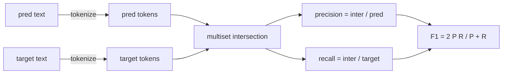
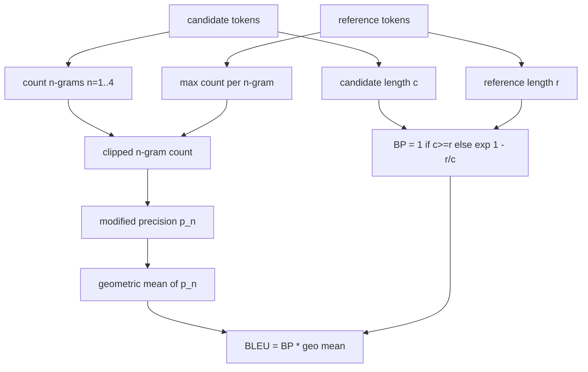

# 经典评估指标

> BLEU、ROUGE-L、F1、exact-match（精确匹配）、accuracy（准确率）。这五个指标至今仍占据已发布 LLM 评估数据的绝大部分。从第一性原理出发实现它们，以便你真正理解这些数字的含义。

**类型：** 构建
**语言：** Python
**前置要求：** 第 19 阶段 B 轨基础，第 70 课
**耗时：** 约 90 分钟

## 学习目标

- 使用明确的分词规则实现词元（token）级别的 exact-match、F1 和 accuracy。
- 从零实现 BLEU-4：修正的 n-gram 精确率、n 从 1 到 4 的几何平均值、简短惩罚（brevity penalty）。
- 使用最长公共子序列（LCS）实现 ROUGE-L，并结合精确率与召回率的 F-beta 组合。
- 基于第 70 课的 `metric_name` 字段进行分发，使运行器（runner）保持与具体指标无关。
- 使用来自详细示例的参考向量来固定行为，而非依赖第三方库。

## 为何要重新实现

你会读到报告 BLEU 为 28.3 的论文，也会看到报告 BLEU 为 0.283 的论文。你会发现两个库给出的 ROUGE-L 分数相差十分，仅仅因为一个库将文本截断为小写而另一个没有。消除困惑的最快方法就是自己编写这些指标，然后明确指出决定分词器的代码行以及应用平滑处理的代码行。此后，跨论文比较数字就变成了阅读指标配置的问题，而不是争论库的差异。

标准库加上 numpy 就足够了。BLEU 本质是计数和 clamp 操作。ROUGE-L 是动态规划。F1 是词元上的集合交集。最难的部分是选择分词器并坚持使用它。

## 分词（Tokenisation）

分词器为 `re.findall(r"\w+", text.lower())`。转为小写，提取字母数字序列，丢弃标点符号。本课中的每个指标都使用完全相同的分词器。运行器无权选择。如果你更换分词器，就等于在运行一个不同的基准测试。

```python
TOKEN_RE = re.compile(r"\w+", re.UNICODE)
def tokenize(text):
    return TOKEN_RE.findall(text.lower())
```

这是一种刻意的简化。生产环境会关注中日韩字符（CJK）、缩写和代码标识符。本课的重点在于：分词器是一份契约，而不是一个可随意调节的旋钮。

## 精确匹配（Exact match）

```python
def exact_match(pred, targets):
    return float(any(pred.strip() == t.strip() for t in targets))
```

它对每个任务返回 1.0 或 0.0。在整个数据集上的聚合结果为均值。这是算术题、多选题（MCQ）和短文本分类任务的主力指标。

## 词元级 F1（Token-level F1）

为预测结果和目标结果构建词元多重集（multiset）。精确率是多重集交集除以预测结果的多重集。召回率是同一交集除以目标结果的多重集。F1 是两者的调和平均数。该实现处理了预测为空和目标为空的边界情况。



对于多目标任务，我们取目标列表中最佳的 F1 值。这与文献中广泛报告的 SQuAD 风格行为一致。

## BLEU-4

BLEU 是机器翻译领域的标准指标，至今仍常见于文本摘要工作。我们使用的公式是语料库级别的 BLEU-4，包含标准的简短惩罚，并对修正的 n-gram 计数应用加一平滑（additive-one smoothing），从而避免单个缺失的 4-gram 将分数拉至零。

对于每个候选-参考对，我们计算 n 等于 1、2、3、4 时的修正 n-gram 精确率。修正精确率会将候选 n-gram 的计数裁剪（clip）为任意参考句中该 n-gram 的最大计数，因此候选句无法通过重复单一短语来虚高分数。四个精确率的几何平均值会被简短惩罚所包裹。



平滑规则采用 Lin 和 Och 所称的 method 1：在取对数之前，为每个 n-gram 精确率的分子和分母各加一。这避免了当参考句没有匹配的 4-gram 时出现 `log 0`，并在长候选句上保持接近未平滑的值。

## ROUGE-L

ROUGE-L 比较候选序列与参考序列词元的最长公共子序列（LCS）。LCS 能够捕捉词序而不强制要求连续，这正是它成为默认摘要指标的原因。我们使用标准的动态规划表计算 LCS 长度，然后推导召回率为 `lcs / reference length`，精确率为 `lcs / candidate length`，并结合 F-beta（其中 beta 等于 1，即对称的 F1 形式）进行组合。

```python
def lcs_length(a, b):
    n, m = len(a), len(b)
    dp = numpy.zeros((n + 1, m + 1), dtype=int)
    for i in range(n):
        for j in range(m):
            if a[i] == b[j]:
                dp[i+1, j+1] = dp[i, j] + 1
            else:
                dp[i+1, j+1] = max(dp[i+1, j], dp[i, j+1])
    return int(dp[n, m])
```

使用 numpy 数组使实现清晰易读；纯 Python 列表同样可行。选择使用 ROUGE-L 的任务需承担每项任务 O(n m) 的计算成本。对于典型的摘要长度，该耗时通常保持在 1 毫秒以内。

## 准确率（Accuracy）

对于多目标分类任务，准确率简化为针对单个标准化目标的精确匹配。我们将其暴露为独立函数，以便分发器可以直接基于 `metric_name` 进行分发，而无需在运行器内部进行字符串比较。

## 分发契约（Dispatch contract）

唯一入口点为 `score(metric_name, prediction, targets)`。它返回一个位于 `[0, 1]` 范围内的浮点数。运行器不会根据指标名称进行分支判断。它直接移交调用并写入结果。这是第 75 课将粘合到第 70 课任务规范上的接口。

```python
def score(metric_name, pred, targets):
    if metric_name == "exact_match":
        return exact_match(pred, targets)
    if metric_name == "f1":
        return max(f1_score(pred, t) for t in targets)
    if metric_name == "bleu_4":
        return max(bleu4(pred, t) for t in targets)
    if metric_name == "rouge_l":
        return max(rouge_l(pred, t) for t in targets)
    if metric_name == "accuracy":
        return accuracy(pred, targets)
    raise ValueError(f"unknown metric_name: {metric_name}")
```

`code_exec` 将在第 72 课中处理，并接入该处的分发器。

## 本课不涉及的内容

它不调用模型。它不会在第 70 课后处理规则已完成的规范化之外，对生成内容做进一步规范化。它不计算置信区间。它不实现 BLEURT 或 BERTScore（这些需要模型，属于其他课程）。本课的重点是打下基础：五个指标、一个分词器、一张分发表。

## 如何阅读代码

`main.py` 将每个指标定义为独立函数（free function）以及分发器。参考向量位于文件底部的 `_reference_examples` 代码块中。演示程序将针对八个示例运行分发器，并打印每个指标的得分。`code/tests/test_metrics.py` 中的测试固定了参考向量，并对所有边界情况进行压力测试（空预测、空参考、无共享词元、精确匹配、重复短语裁剪）。

从上到下阅读 `main.py`。函数按复杂度排序。`exact_match` 和 `accuracy` 各占一行。`F1` 为六行。`BLEU` 和 `ROUGE-L` 是核心部分，包含关于平滑规则和 LCS 递推公式的详细注释。

## 进阶延伸

经典指标是必要的，但并非充分条件。它们奖励表面重叠，却会忽略语义。解决方法是：一旦你信任了经典指标打下的基础，就在其上叠加基于模型的指标（BLEURT、BERTScore、GEval）。这将在后续课程中介绍。目前：让这五个指标正常运行，用测试固定它们，你就拥有了一个可审计、快速且可复现的指标栈。
