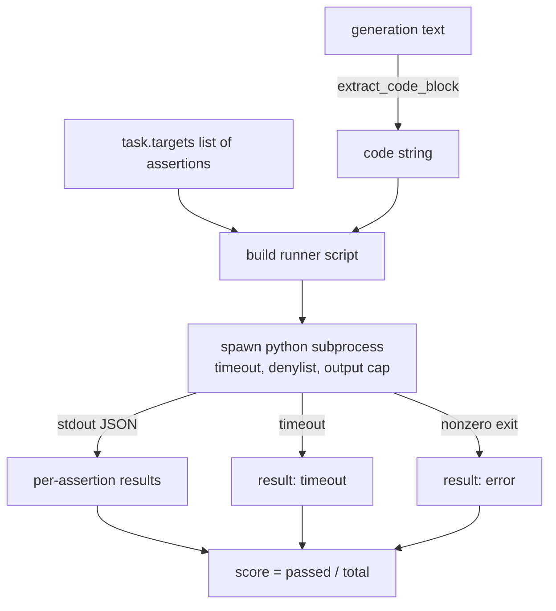
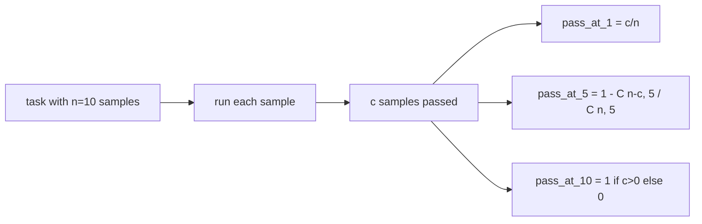

# Code Exec Metric

> 生成的代码只有在通过测试时才是正确的。评估框架必须提取代码，在不导致主机崩溃的情况下运行它，并如实统计通过率。本课将构建这一基础层。

**类型：** 构建
**语言：** Python
**前置要求：** 第 19 阶段 B 轨道基础，第 70 和 71 课
**耗时：** 约 90 分钟

## 学习目标

- 以符合第 70 课后处理规则的方式，从自由格式的生成内容中提取代码块。
- 在隔离的子进程中执行候选代码，并配备挂钟超时、输出上限和导入黑名单。
- 根据候选代码通过的提供断言字符串的比例为任务打分。
- 为从单一模型采样多次生成的任务计算 pass-at-k 指标。
- 将沙箱崩溃、语法错误和超时视为一等失败模式，并为运行器可记录的每种模式分配不同的退出码。

## 为什么使用隔离子进程

内联 `exec` 会带来安全和稳定性隐患。生成的 `while True: pass` 会导致评估永久阻塞。生成的 `import shutil; shutil.rmtree('/')` 正如其名一样具有灾难性。解决方案是为每个候选代码生成一个全新的 Python 解释器，通过 stdin 传入代码，将断言结果写入 stdout，并在超时时终止该进程。主机评估进程则继续运行。

HumanEval、MBPP、BigCodeBench 和 LiveCodeBench 等真实评估基准均使用子进程沙箱。部分基准还在其上叠加了 Docker。我们止步于子进程是有原因的：它具备可移植性，仅依赖标准库，且能捕获对教学评估至关重要的失败模式。生产环境部署会额外添加 seccomp、网络隔离和只读文件系统。关于安全加固的后续课程不在本轨道范围内。

## 代码执行任务的结构

`code_exec` 任务在 `targets` 中携带断言字符串。运行器从生成内容中提取代码围栏块，围绕其构建测试框架，并运行结果。



分数是 `[0, 1]` 中的一个比例值。包含三个断言且通过两个的任务得分为 0.667。无论发生何种失败，运行器都返回相同的结构：子进程崩溃会被映射为规范化的错误码，而不是向上冒泡到框架的 Python traceback。

## 黑名单

黑名单基于导入机制。在运行候选代码前，运行器脚本会将危险模块的导入重写为引发 `ImportError("denied")` 的存根。该列表刻意保持保守：`os.system`、`subprocess`、`socket`、`requests`、`urllib`、`urllib.request`、`urllib.error`、`urllib.parse`、`ctypes`、`shutil`、`http.client`、`asyncio.subprocess`。

我们并不声称这是万无一失的。蓄意的对抗性代码可以逃逸 Python 中的任何进程内沙箱。黑名单只是一道兜底防线。挂钟超时和输出上限才是起核心支撑作用的控制手段。

```python
DENIED = {
    "os.system": True,
    "subprocess": True,
    "socket": True,
    "shutil": True,
    "requests": True,
    "urllib": True,
    "ctypes": True,
}
```

我们通过前置 `import sys` 以及一个将 `os.system` 进行 monkey-patch 以引发异常的守卫来包装候选代码。完整模板位于 `main.py`。

## 挂钟超时

每个子进程默认获得三秒的挂钟时间预算。运行器使用 `subprocess.run(..., timeout=t)`。如果触发超时，运行器会捕获 `TimeoutExpired`，终止进程，并为该任务记录 `timeout` 退出原因。该任务得分为零。运行器继续执行后续任务。

超时时间可通过 `task.metadata.timeout_s` 按任务进行配置。长时间运行的单元测试可以申请更多时间；第 70 课的验证器会将该值上限设为三十秒，以保持测试套件可控。

## 输出上限

子进程可能向 stdout 倾泻大量输出，从而耗尽主机内存。运行器将 stdout 流式读入缓冲区，一旦累计输出超过 256 KB 就立即终止子进程。结果将被记录为 `exit_code = error`，并附带详细信息字符串 `"output overflow"`。在实际应用中，当生成内容意外写出包含打印操作的无限循环时，就会出现这种情况。

## Pass-at-k

Pass-at-k 是 HumanEval 等基准使用的无偏估计量。给定每个任务 `n` 个独立样本，其中 `c` 个通过，则从 `n` 中抽取大小为 `k` 的样本包含至少一个通过解的概率为：

```
pass_at_k(n, c, k) = 1 - C(n - c, k) / C(n, k)
```

当 `n - c < k` 时，分子未定义，该值为 `1`。实现代码直接处理了该边界情况。我们暴露了 `pass_at_k(n, c, k)` 供第 74 课的排行榜层使用。



## 退出码

运行器为每个任务返回以下五种结果之一：

- `pass`：所有断言均通过时。
- `assertion_fail`：代码已运行但至少一个断言失败时。
- `syntax_error`：代码无法导入或存在 SyntaxError 时。
- `timeout`：挂钟时间耗尽时。
- `error`：任何其他崩溃，包括触发黑名单和输出溢出（溢出会附带详细信息 `"output overflow"`）。

分数仍然是一个比例值。退出码是元数据。下游课程可自行决定将超时计为零分还是视为缺失数据。

## 本课未涵盖的内容

它不提供真正的沙箱。它不运行来自开放网络的不可信代码。它不处理文件 I/O 或网络调用等有状态任务。这些需要容器或 microVM。本课的核心在于确立契约：隔离子进程、黑名单、超时、输出上限、清晰的退出码语义以及 pass-at-k 数学计算。

## 如何阅读代码

`main.py` 定义了 `extract_code`、`run_candidate`、`score_code_exec` 和 `pass_at_k`。子进程运行器脚本被构建为字符串，并作为 `-c` 传递给全新的 Python 解释器。`code/tests/test_exec.py` 中的测试针对源自 HumanEval 风格的示例，演练了四种退出码以及 pass-at-k。

从上到下阅读 `main.py`。运行器模板是核心支撑部分。仔细研读断言循环，直到你能预测它写回父进程的 JSON 封装结构。

## 进阶延伸

一旦子进程结构运行正常，下一个关注点就是可移植性。不同 Python 版本在 Windows 上处理 SIGKILL 的方式不同。最彻底的解决方案是将运行器放入 Docker 镜像中。接下来的步骤是用真实的单元测试文件替换断言字符串，使评估与生产环境 CI 的行为保持一致。到那时就不要再把断言字符串称为测试了；它们只是简易测试，且只具备简易的失败模式。
