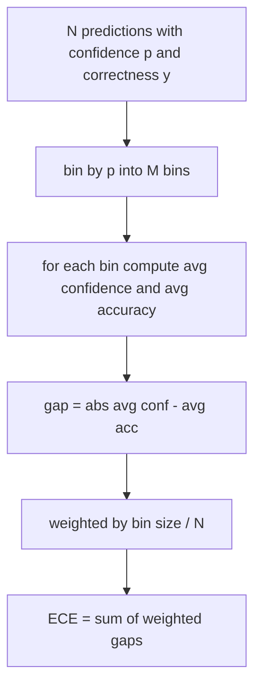
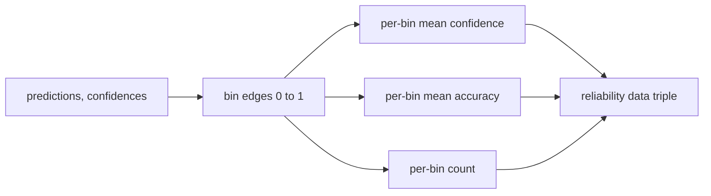

# 困惑度与校准

> 如果你的模型在一千个答案上表示 90% 的置信度，但只答对了六百个，那么它的校准就很差。校准是可信评估的一半。另一半是困惑度，它告诉你模型是否认为保留文本（held-out text）根本合理。

**类型：** 构建
**语言：** Python
**前置要求：** 第 19 阶段 B 轨道基础，第 70 和 71 课
**耗时：** 约 90 分钟

## 学习目标

- 基于模型适配器提供的 token 负对数概率，在保留语料库上计算 token 级困惑度。
- 基于分箱的预测概率，计算分类器或多选题评估的预期校准误差（ECE）。
- 计算 Brier 分数（针对正确性指示符的均方误差），并解释它在哪些场景下能弥补 ECE 的不足。
- 构建绘制置信度-准确率曲线所需的可靠性图（reliability diagram）数据。
- 将这三项指标接入评估框架（eval harness），使运行器能够将 `perplexity`、`ece` 和 `brier` 数值附加到模型报告中。

## 困惑度揭示了什么

困惑度是每个 token 平均负对数似然的指数化值。越低越好。困惑度为 1 表示模型为每个真实 token 分配的概率为 1。困惑度等于词表大小表示模型呈均匀分布且什么都没学到。实际数值介于两者之间：在 WikiText-103 上，一个优秀的 2026 基础模型困惑度大约在 8 到 12 之间。表现差的模型在同一文本上会超过 50。

评估框架本身不计算对数概率。这些由模型适配器提供。框架负责聚合：它接收每个 token 的对数概率列表、每个序列的 token 计数列表，并返回语料库困惑度。

```python
def perplexity(neg_log_probs, token_counts):
    total_nll = sum(neg_log_probs)
    total_tokens = sum(token_counts)
    return math.exp(total_nll / total_tokens)
```

该实现处理了零 token 的边界情况，并断言负对数概率为非负数。一个常见错误是忘记取负号：如果适配器返回 `log p` 而不是 `-log p`，会导致困惑度低于 1，这是不可能的。该函数会将其作为契约违规（contract violation）捕获。

## ECE 衡量什么

预期校准误差（ECE）按置信度将预测分组到固定数量的箱（bins）中，然后按箱大小加权，衡量各箱置信度与准确率之间的平均差距。



标准公式在 `[0, 1]` 上使用十个等宽分箱。该实现支持任意正整数数量的分箱。我们暴露了一个 `bins` 参数，以便运行器可以在发布惯例（10）和对比惯例（15）之间进行选择。

ECE 会受到分箱数量和样本量的偏差影响。在十个分箱和一百个预测的情况下，你无法将 0.02 的 ECE 与随机噪声区分开来。该实现会连同 ECE 一起返回非空分箱的数量，以便运行器在样本过少时拒绝报告单一数值。

## Brier 分数能做到而 ECE 做不到的事

ECE 只关心平均差距。一个在一半分箱上过度自信、在另一半分箱上自信不足的模型，可能具有较低的 ECE，但在局部校准很差。Brier 分数衡量每次预测相对于真实结果的平方误差，因此它直接惩罚预测值的离散程度。

对于二元结果，Brier 分数为 `mean((p_i - y_i)^2)`。它可以分解为可靠性（reliability）、分辨率（resolution）和不确定性（uncertainty）。我们计算该分数及其分解项。运行器报告标量值，但会将分解项记录到仪表盘中。

```python
def brier(p, y):
    return float(np.mean((p - y) ** 2))
```

## 可靠性图数据

可靠性图绘制每个分箱中预测置信度与经验准确率的对比。对角线代表完美校准。该函数返回三个数组：每箱平均置信度、每箱平均准确率和每箱计数。绘图代码位于下游；本课仅止于数据形状。



返回的元组是调用层绘制图表或计算自定义 ECE 变体（如自适应 ECE、扫描 ECE 等）所需的内容。我们返回 numpy 数组，以便下游代码无需进行转换。

## 置信度来源

评估框架不假设置信度来自 softmax。它接受每次预测在 `[0, 1]` 范围内的任意数值。对于多选题任务，自然置信度是 `softmax over option log-likelihoods`。对于自由文本，自然置信度是模型自报的概率或平均对数似然的指数值。评估模块只消费该数值。其来源是适配器的职责。

## 边界情况

- 所有预测均错误：ECE 为平均置信度，Brier 分数很高，困惑度取决于模型对该文本的看法。
- 所有预测均正确且置信度高：ECE 接近零，Brier 分数接近零。
- 在 p=0.5 处完全不确定性的预测器：ECE 为 0.5 减去准确率，Brier 分数为 0.25 减去一个修正项。
- 空输入：ECE、Brier 和可靠性返回 `0.0`（或全零数组）。困惑度在零 token 情况下返回 `NaN`。这些路径均不会发出警告；运行器会检查数值并决定是报告还是跳过。

这些情况已内置于测试中。真实基准上的真实模型不会触发它们，但有缺陷的适配器或极小样本会触发，此时运行器不应崩溃。

## 调度

校准不是像 F1 那样的逐任务指标。它是逐模型的报告。运行器在整个评估过程中累积 `(confidence, correct)` 对，并一次性计算 ECE、Brier 和可靠性数据。困惑度在保留文本语料库上计算，与逐任务评分分开。

接口如下：

```python
report = CalibrationReport.from_predictions(confidences, correct)
report.ece          # float
report.brier        # float
report.reliability  # tuple of three numpy arrays
report.populated_bins  # int
```

`PerplexityResult.from_token_nll(neg_log_probs, token_counts)` 返回困惑度及每个 token 的平均负对数似然。

## 本课不涉及的内容

它不调用模型。它不实现 softmax。它不从输出 token 估计置信度；那是适配器的工作。它不进行温度缩放（temperature scaling）或 Platt 缩放；那些是事后修正方法，属于另一课的内容。本课的重点是确保这三个数值（困惑度、ECE、Brier）可信且可复现。

## 如何阅读代码

`main.py` 定义了 `perplexity`、`expected_calibration_error`、`brier_score`、`reliability_diagram` 以及 `CalibrationReport` / `PerplexityResult` 数据类。演示在已知真实标签的合成预测上运行：一个校准良好的模型、一个过度自信的模型和一个自信不足的模型。`code/tests/test_calibration.py` 中的测试固定了所有边界情况以及合成预测器的参考值。

从上到下阅读 `main.py`。函数顺序从标量到向量再到报告。每个函数都有一个简短的文档字符串，包含数学公式和契约说明。

## 进阶延伸

校准是已发布评估中最常被忽视的维度。大多数排行榜只报告一个准确率数值就宣告完成。一个在准确率上获胜但在 Brier 分数上失败的模型，其生产部署效果往往不如一个准确率低几分但能可靠报告不确定性的模型。一旦你搭建好校准的底层管道，可以在保留的验证切片上添加温度缩放，重新计算 ECE，并观察差距如何缩小。那是另一课的内容，但基础便在于此。
