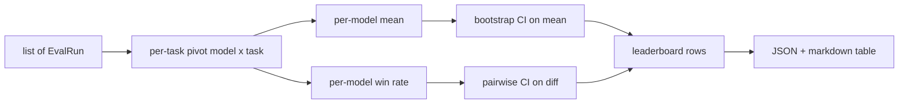
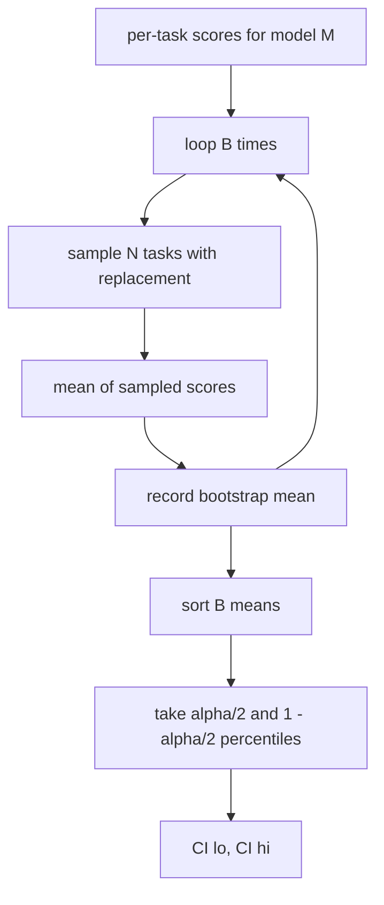

# 排行榜聚合

> 单个任务的得分很容易计算。跨异构任务的模型排名则更难。在包含上千次预测的排行榜上计算统计显著性，是大多数人都会跳过的部分。本课绝不跳过。

**类型：** 构建
**语言：** Python
**前置要求：** 第 19 阶段 B 轨基础，第 70、71、73 课
**耗时：** 约 90 分钟

## 学习目标

- 将多个模型在多个任务上的单项得分聚合为整洁的单模型行记录。
- 对异构得分进行归一化，防止通过率（pass rate）和 BLEU 值对聚合结果产生过度影响。
- 按均值（mean）和胜率（win-rate）对模型进行排名，并说明各自适用的汇总场景。
- 计算每个模型均值得分及成对差异的自助法（bootstrap）置信区间。
- 将排行榜输出为 JSON 报告以及 Markdown 表格，以便第 75 课的运行器（runner）可直接粘贴到 CI 评论中。

## 输入数据形态

聚合器消费一组 `EvalRun` 记录：

```python
@dataclass
class EvalRun:
    model_id: str
    task_id: str
    metric_name: str
    score: float          # in [0, 1]
    category: str
```

第 75 课的运行器会为每个 `(model, task)` 对输出一条记录。聚合器不关心得分是如何产生的。它期望归一化已经完成：每个得分都处于 `[0, 1]` 范围内。

## 输出结果

输出包含三张表：



排行榜行包含：`model_id`、`mean_score`、`mean_ci_lo`、`mean_ci_hi`、`win_rate`、`tasks_completed`，以及一个可选的 `categories` 映射（用于各类别均值）。

## 归一化

如果一个任务的得分范围是 `[0, 1]`，而另一个是 `[0, 100]`，后者会悄无声息地主导均值。聚合器会验证每个输入得分是否位于 `[0, 1]` 范围内，否则将拒绝运行。修复工作应在上游完成：指标层本就应该返回分数值。第 71 至 73 课已强制履行该契约。

## 均值与胜率

这两种排名方案服务于不同的目标。

均值得分是单个模型在各任务上得分的平均值。它是排行榜报告的头条数字。它对异常值和任务不平衡较为敏感。

胜率统计一个模型在同一任务上击败其他所有模型的频率。对于每个任务，得分最高的模型获胜（平局则平分胜场）。胜率等于胜场数除以该模型有得分的任务总数。它对异常值和尺度差异不那么敏感，但会损失部分信息。

```python
def win_rate(model_id, runs_by_task, all_models):
    wins, total = 0, 0
    for task_id, runs in runs_by_task.items():
        scores = {r.model_id: r.score for r in runs if r.model_id in all_models}
        if model_id not in scores:
            continue
        total += 1
        best = max(scores.values())
        if scores[model_id] >= best:
            wins += 1
    return wins / total if total else 0.0
```

测试框架会同时报告两者。第 75 课的运行器默认按均值排名；胜率对应的 Markdown 列也已备好，以防用户更倾向使用它。

## 自助法置信区间

每个模型的均值都附带一个通过对任务进行自助法重采样估算的置信区间。我们对任务 ID 进行有放回重采样，计算重采样集合的均值，重复 `B` 次，并取 `alpha` 水平的百分位数区间。



对于成对比较，我们对每个任务的差值 `score_A - score_B` 进行自助法采样，取百分位数区间并报告。用户可直接观察该区间是否排除零。若排除零，则差异在 alpha 水平上显著；若未排除零，排行榜将视这些模型为并列。

底层辅助函数（`bootstrap_mean_ci`、`bootstrap_pairwise_diff`）默认为 `B=1000`；公共聚合器（`aggregate`、`pairwise_diffs`）默认为 `b=500`，以确保演示和测试保持快速。默认 alpha 为 0.05。本课的自助法实现保持纯 numpy，不依赖 scipy。

## 类别

如果设置了 `EvalRun.category`，聚合器还会报告各类别的均值。这就是每个排行榜上显示 `math`、`reasoning`、`code`、`safety` 的列。它能让运行器发现模型是否整体表现良好但在代码方面较弱，而这些信息会被头条均值所掩盖。

## Markdown 渲染

排行榜将渲染为 Markdown 表格：

```text
| Rank | Model | Mean | 95% CI | Win rate | Tasks |
|------|-------|------|--------|----------|-------|
| 1    | gpt   | 0.78 | 0.74-0.82 | 0.62 | 50 |
| 2    | claude| 0.75 | 0.71-0.79 | 0.34 | 50 |
| 3    | random| 0.10 | 0.07-0.13 | 0.04 | 50 |
```

表格按均值得分排序。置信区间（CI）保留两位小数。过长的模型 ID 将被截断至二十个字符。

## 本课不涉及的内容

它不运行模型。它不调用指标层。它不实现自适应 ECE 或其他校准变体；那些属于第 73 课。它不实现任务加权。此处每个任务权重相同。生产环境的排行榜会对任务加权；我们通过 `weight` 字段保留了该扩展钩子，但在聚合器中暂不处理。如需加权功能，可在后续课程中添加。

## 代码阅读指南

`main.py` 定义了 `EvalRun`、`LeaderboardRow`、`aggregate`、`bootstrap_mean_ci`、`bootstrap_pairwise_diff` 和 `render_markdown`。演示代码构建了一个包含三个模型和十二个任务的合成测试集，进行聚合后打印排行榜及成对差异表。`code/tests/test_leaderboard.py` 中的测试固定了自助法、Markdown 渲染、胜率边界情况以及空输入行为的预期结果。

请从上到下阅读 `main.py`。首先是数据形态（EvalRun、LeaderboardRow），其次是聚合器，接着是自助法，最后是渲染逻辑。每个函数都有明确的契约。

## 进阶方向

自然的下一步是采用配对任务显著性检验，而非非配对自助法。如果模型 A 和 B 都运行了相同的一百个任务，合适的检验方法是对逐任务差值进行配对自助法采样，我们已实现该逻辑。在此基础上，你可能还需要尊重任务族系的层次化自助法（例如数学题之间并非相互独立；一种算术错误模式可能影响其中十道题）。这将是后续内容。本课的核心目标是打好地基，确保评估报告给出的数字经得起推敲。
