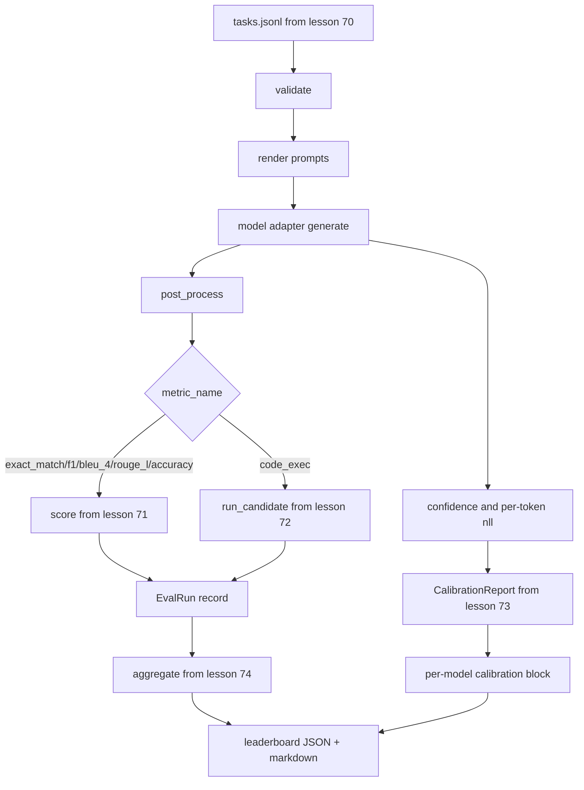

# 端到端评估运行器

> 五节管道搭建课，一节整合粘合课。运行器读取第 70 课的任务规范，通过适配器调用模型，使用第 71 和 72 课进行评分，附加第 73 课的校准报告，并输出第 74 课的排行榜。演示程序会自动终止。

**类型：** 构建
**语言：** Python
**前置要求：** 第 19 阶段 B 轨道基础，第 70 至 74 课
**耗时：** 约 90 分钟

## 学习目标

- 定义一个 `ModelAdapter` 接口，任何模型（模拟、本地、API）均可通过极小的方法暴露面满足该接口。
- 在工作线程池上并行执行任务，对 fixture JSONL 文件运行评估。
- 在一次遍历中组合指标层（exact_match、F1、BLEU-4、ROUGE-L、code_exec）与校准层。
- 输出每个模型的 `EvalRun` 记录，并直接将其输入排行榜聚合器。
- 同时输出 JSON 报告和 markdown 表格；在顺利运行时以退出码 0 自动终止，在验证或运行时失败时以非零退出码终止。

## 流水线



运行器是集成点。第 70 至 74 课各自拥有一个模块，由运行器进行组合。运行器不会重复这些模块中的任何逻辑：它直接导入它们。

## 适配器接口

适配器是运行器与任意模型之间的衔接边界。该接口被刻意设计得很小。

```python
class ModelAdapter:
    model_id: str

    def generate(self, prompt: str, task: TaskSpec) -> Generation: ...
```

`Generation` 是一个数据类，包含：

- `text`：模型的自由格式输出
- `confidence`：位于 `[0, 1]` 范围内的浮点数，表示模型自报的答案概率
- `token_nll`：可选字段，生成 token 的负对数似然之和
- `token_count`：可选字段，生成的 token 数量

运行器中的模拟适配器提供三种风格：`RuleBasedAdapter`（确定性，近乎完美）、`NoisyAdapter`（过度自信，经常出错）和 `BiasedAdapter`（擅长某一类别，在另一类别表现极差）。演示程序会在第 70 课的 fixture 上运行全部三种适配器。

## 并行执行

运行器使用 `concurrent.futures.ThreadPoolExecutor` 按模型并行运行任务。工作线程数默认为 8 和任务数中的较小值。使用线程已足够，因为真实模型调用的瓶颈在于网络 I/O。code-exec 路径会在任务内部生成自己的子进程，执行器仅负责调度等待。

为了进行确定性测试，运行器暴露了 `run_eval(adapters, tasks, parallel=False)`，以便测试可以固定执行顺序。

## 单次遍历评分循环

对于每个任务：

1. 渲染提示词（少样本前缀加上提示词主体）。
2. 调用适配器并记录调用耗时。
3. 根据任务规则对生成结果进行后处理。
4. 分发至指标层。
5. 构建包含分数和指标元数据的 `EvalRun` 记录。
6. 将 `(confidence, correct)` 对追加到校准缓冲区。

对于 exact_match 风格的指标（`exact_match`、`accuracy`、`code_exec`），`correct` 信号为 `score >= 1.0`；对于分级指标，则为 `score >= 0.5`。阈值位于 `_correct_from_score` 中，且运行器不暴露公共覆盖接口。

## 聚合

当每个任务都有结果后，运行器会调用第 74 课的 `aggregate` 和 `pairwise_diffs`，以及第 73 课的 `CalibrationReport.from_predictions`。输出为单个 JSON 封装结构：

```json
{
  "leaderboard": [...],
  "pairwise": [...],
  "calibration": {
    "model_id_a": {"ece": 0.04, "brier": 0.10, "populated_bins": 8, ...},
    ...
  },
  "summary": {
    "tasks": 10,
    "models": 3,
    "wall_seconds": 1.2
  }
}
```

运行器还会将 markdown 表格写入 stdout，以便用户将结果粘贴到 PR 审查中。

## 自动终止的演示程序

演示程序在第 70 课的十个 fixture 任务上运行三个模拟适配器。实际耗时（Wall time）应控制在十秒以内。顺利运行时退出码为零。

顺利运行的标准如下：

- 每个任务均通过第 70 课的验证。
- 每个任务均通过第 71 和 72 课的评分。
- 校准报告在第 73 课中无误聚合。
- 排行榜中基于规则的适配器排名严格高于随机适配器。

如果其中任何一项失败，运行器将以非零退出码终止，并在 JSON 封装结构中返回结构化错误。

## 本课不涉及的内容

它不调用真实模型。不实现 API 密钥流程或速率限制处理。不实现流式传输或部分生成；适配器每次调用返回一个生成结果。不进行重试或缓存。这些关注点属于适配器层；运行器与指标无关，也与提供商无关。

## 如何阅读代码

`main.py` 是集成入口。它通过一个小型的 `_load_sibling` 辅助函数从其他五个课程模块导入，该辅助函数通过相对路径解析它们。数据类 `Generation`、`EvalReport` 和 `ModelAdapter` 在本地定义。模拟适配器位于文件底部。

从上到下阅读 `main.py`。略读导入部分，然后查看 `run_eval`，接着是 `_score_one`，最后是适配器。末尾的演示程序是入口点。

`code/tests/test_runner.py` 中的测试固定了适配器接口、单次遍历循环、并行与顺序的等价性、校准缓冲区以及 JSON 封装结构的形状。

## 进阶扩展

此运行器只是基础起点。生产级评估系统会增加：以 `(task_id, model_id, model_version)` 为键的结果缓存、跟踪每次运行费用和 token 的成本账本、在触发速率限制时进行退避的重试层、针对 pass-at-k 任务的采样策略，以及用于长测试套件的流式输出格式。每一项都是单一关注点，它们包装运行器而不改变指标或聚合层。这种分离正是契约的核心意义。

在模拟适配器运行正常后，为真实提供商添加适配器。选择一个提供免费额度的提供商，编写三十行胶水代码，看着排行榜亮起。然后添加第二个提供商，让测试框架代劳。
