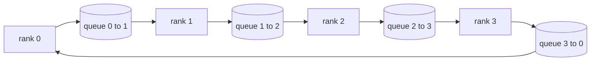

# 从零实现集合通信操作

> 支撑分布式训练的四大集合通信操作是 allreduce、broadcast、allgather 和 reduce_scatter。训练框架提供的其他所有原语都是对这些操作的封装。在 `multiprocessing.Queue` 网格上构建一次，对照参考实现进行验证，本路线的其余部分就只是底层管道对接了。

**类型：** 构建
**语言：** Python
**前置要求：** 第 19 阶段 C 路线 第 42-49 课
**耗时：** ~90 分钟

## 学习目标

- 分两阶段（先 reduce-scatter 后 allgather）实现 ring allreduce，并证明每个 rank 的通信量为每元素 2(N-1)/N 字节。
- 基于 `multiprocessing.Queue` 上的点对点发送构建 broadcast、allgather 和 reduce_scatter。
- 针对相同输入，将每个原语与 `torch.distributed` gloo 参考实现进行对比验证。
- 结合集群拓扑、延迟下限和带宽上限，论证选择 ring 或 tree 拓扑的理由。

## 问题背景

在 N 个 rank 上执行朴素的 allreduce 会将张量发送 N 次到根节点，再广播 N 次回来。每个 rank 的带宽开销按 O(N) 增长，根节点成为瓶颈，且实际耗时下限是最慢链路乘以 N。Ring allreduce 将其扁平化为 2(N-1) 个大小为 T/N 的数据块，因此每个 rank 的字节数降至 2T(N-1)/N，与集群规模无关。Tree allreduce 在 N 较小且链路延迟较高时更具优势，因为其深度为 log2(N) 跳，而非 2(N-1)。若为集群拓扑选错通信拓扑，最慢的 GPU 将决定单步耗时。

本路线中你将接触到的每个分布式训练框架都依赖这四大原语。PyTorch DDP 通过每个参数桶执行一次 allreduce 来同步梯度。ZeRO 通过 reduce_scatter 分片优化器状态，并通过 allgather 广播更新后的参数。FSDP 将完整的前向传播转化为 allgather 加 reduce_scatter。流水线并行需要 broadcast 在阶段组之间传递激活值。如果你无法实现这四种集合操作，就无法推断训练为何停滞、为何梯度不匹配出现在 rank 3，或者为何切换拓扑后流水线气泡会翻倍。

## 核心概念



### 两阶段 Ring allreduce

将张量拆分为 N 个大小相等的块，索引为 0..N-1。每个 rank 拥有与其 rank 编号相同的块索引。第一阶段 reduce-scatter 执行 N-1 步。在第 s 步，rank r 将块 (r - s) mod N 发送给 rank (r + 1) mod N，并从 rank (r - 1) mod N 接收块 (r - s - 1) mod N，将接收到的块累加到本地副本中。经过 N-1 步后，rank r 拥有块 r 的完整求和结果。第二阶段 allgather 再执行 N-1 步，将已完成的块沿环旋转，直到每个 rank 都持有所有块的完整求和结果。

| 原语 | 每 rank 字节数 | 步数 | 适用场景 |
|-----------|---------------|-------|-------------|
| Ring allreduce | 2T(N-1)/N | 2(N-1) | T 较大、高带宽同构集群 |
| Tree allreduce | T log2(N) | 2 log2(N) | T 较小或高延迟链路 |
| Broadcast | T | log2(N) tree | 参数初始化、标量配置 |
| Allgather | T(N-1)/N | N-1 | 分片前向传播、ZeRO 取消分片 |
| Reduce_scatter | T(N-1)/N | N-1 | ZeRO 梯度分片 |

### 以 Queue 网格替代 NCCL

NCCL 运行在 PCIe 和 NVLink 之上，并依赖硬件卸载进行规约操作。在 CPU 上你没有这些硬件支持。为环的每条边分配一个 `multiprocessing.Queue`，即可实现单生产者单消费者的有序点对点传输。规约发生在用户空间，因此需要承担 Python 开销，但其通信链路模式与 NCCL ring allreduce 完全一致。在 queue 版本上验证正确性，集群行为自然随之成立。

### 对照 gloo 进行验证

每个原语都附带单元测试，将其输出与在相同张量、相同 world size 下使用 gloo 后端初始化的 `torch.distributed` 进行对比。如果你的 ring allreduce 结果与 gloo 的偏差超过 float32 的 epsilon，测试将失败。对照参考实现进行验证是硬性要求；否则，该原语在实际训练跑到第 10000 步之前看起来都是正确的。

## 动手构建

`code/main.py` 实现了：

- `Mesh` 类，将 N 个 `multiprocessing.Queue` 实例连接成环，并为每个 rank 暴露 `send(dst, tensor)` 和 `recv(src)`。
- `ring_allreduce(mesh, rank, world_size, tensor)`，运行两阶段算法。
- `broadcast(mesh, rank, world_size, tensor, src)`，基于对数树结构。
- `allgather(mesh, rank, world_size, tensor)`，使用 N-1 次旋转。
- `reduce_scatter(mesh, rank, world_size, tensor)`，作为 allreduce 的前半部分。
- `_gloo_reference(op, world_size, tensor)`，将相同输入通过 `torch.distributed` 与 gloo 运行，进行逐字节对比。

运行方式：

```bash
python3 code/main.py
```

输出：对比 queue-mesh 与 gloo 输出的逐原语验证表，随后是证明 2T(N-1)/N 扩展规律的每 rank 字节计数器。

## 业界生产模式

以下三种模式可使原语达到可交付的生产级标准。

**在 allreduce 前对梯度进行分桶（Bucket）。** 一个 10 亿参数的模型包含数万个梯度张量。每个张量执行一次 allreduce 会重复支付 N 次延迟下限。DDP 将梯度打包成约 25 MB 的桶，每个桶发起一次 allreduce；小张量随大数据块一同传输。若不进行分桶，延迟开销将主导单步耗时。

**通信与计算重叠。** 反向传播按逆序逐层计算梯度。当最后一层的梯度就绪时，立即启动其 allreduce，同时下一层继续计算。PyTorch DDP 通过 bucket-ready 钩子实现此机制。当网络带宽存在冗余时，重叠机制可将可见通信时间减半。

**根据消息大小选择 ring 或 tree，而非盲目遵循教条。** NCCL 内置拓扑检测器，对大于约 1 MB 的消息选择 ring，小于该阈值则选择 tree。临界点在于带宽与延迟的权衡：大于 1 MB 时，带宽项 2T(N-1)/N 占主导，ring 胜出；小于 1 MB 时，log2(N) 跳数占优，tree 胜出。硬编码单一拓扑会在不匹配的消息大小上损失吞吐量。

## 应用场景

生产模式：

- **PyTorch DDP。** 反向传播后在分桶梯度上调用 `dist.all_reduce`。桶大小可调；默认 25 MB 对 100Gbit 以太网较为合理。
- **DeepSpeed ZeRO。** 发起 reduce_scatter 对梯度分片，并在前向传播前通过 allgather 重建完整参数。本课的原语正是 ZeRO 所调用的操作。
- **FSDP。** 前向传播以 allgather 开始以取消层分片，执行计算后通过 reduce_scatter 进行规约并丢弃未分片数据。原语相同，调度顺序不同。

## 后续衔接

在第 77-81 课中使用 queue-mesh 原语。第 77 课将 allreduce 接入 DDP。第 78 课将 reduce_scatter 接入 ZeRO。第 79 课将 broadcast 接入流水线激活值。第 81 课将四大原语组合为端到端演示。

## 练习

1. 添加 tree allreduce 变体，并根据消息大小在 ring 和 tree 之间切换。测量临界点。
2. 添加 `recv_timeout_ms`，使停滞的 rank 抛出超时（deadline）错误而非永久挂起。
3. 将四大原语的 `multiprocessing.Queue` 替换为 TCP socket。测试不变，使用真实网络传输。
4. 添加带宽插桩钩子，使每 rank 字节计数器输出到 JSONL 日志。
5. 在 4 个 rank 上对比 ring 与 tree 在 1KB、1MB、16MB 张量下的实际耗时。用实验数据论证临界点。

## 关键术语

| 术语 | 常见说法 | 实际含义 |
|------|----------------|------------------------|
| Allreduce | “跨 rank 求和” | 调用后每个 rank 都持有相同的规约后张量 |
| Ring | “快速拓扑” | N-1 个大小为 T/N 的数据块沿环流动两次 |
| Tree | “对数拓扑” | 规约沿二叉树进行；深度为 log2(N) 跳 |
| Allgather | “拼接分片” | 每个 rank 最终获得所有其他 rank 的分片 |
| Reduce_scatter | “拆分求和结果” | 每个 rank 最终仅持有单个数据块的求和结果 |
| Bucket | “融合小张量” | 将 N 次小型 allreduce 合并为一次大型 allreduce |

## 延伸阅读

- [PyTorch Distributed: NCCL collectives](https://pytorch.org/docs/stable/distributed.html#collective-functions)
- [Horovod ring allreduce paper](https://arxiv.org/abs/1802.05799)
- [NCCL topology and algorithm selection](https://docs.nvidia.com/deeplearning/nccl/user-guide/docs/index.html)
- [Patarasuk and Yuan, Bandwidth optimal allreduce algorithms](https://www.cs.fsu.edu/~xyuan/paper/09jpdc.pdf)
- 第 10 阶段 第 05 课 - 分布式训练概述
- 第 19 阶段 第 77 课 - 基于这些原语构建的 DDP
