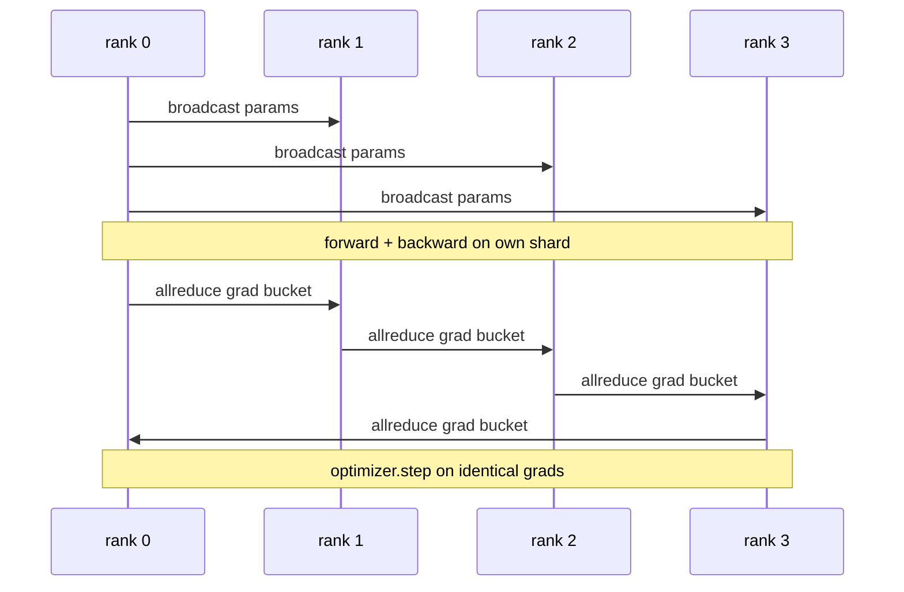

# 从零实现数据并行 DDP

> DistributedDataParallel 是建立在 allreduce 之上的一个钩子（hook）。包装一个模型，从 rank 0 广播初始参数以确保每个 rank 起始状态一致，为每个参数安装一个在反向传播时触发梯度 allreduce 的后向钩子，剩下的就是梯度下降。整个模式仅需 200 行代码。

**类型：** 构建
**语言：** Python
**前置要求：** 第 19 阶段 C 轨道第 42-49 课
**耗时：** 约 90 分钟

## 学习目标

- 搭建一个 `DistributedDataParallel` 形态的包装器，用于广播初始参数并在反向传播后对梯度执行 allreduce。
- 使用 `torch.multiprocessing.spawn` 在 gloo 后端上通过基于文件的 rendezvous 生成 N 个 CPU rank。
- 通过在相同数据上顺序训练同一模型，并展示每一步的参数等价性，来证明梯度同步的正确性。
- 论证使用桶（梯度融合）和重叠（反向传播期间通信）这两项改进，是如何将可用的 DDP 转化为生产级 DDP 的。

## 问题背景

一个拥有 10 亿参数且激活值占用 12 GB 的模型无法塞进单张消费级 GPU。即使能放下，训练也需要数周时间。数据并行将批次（batch）拆分到 N 个 rank 上，每个 rank 在其数据分片上计算前向和反向传播，并且在每一步中，所有 rank 的梯度会被求和，从而保持 N 个副本完全一致。优化器正是基于这个求和后的梯度进行更新。

如果没有梯度同步，N 个副本到第 2 步就会发生分歧。此时模型不再是“在更多数据上训练的一个模型”，而是 N 个恰好共享初始权重的独立模型。如果梯度同步实现得很差（每个参数一次 allreduce、无重叠、无分桶），网络就会成为瓶颈，GPU 将空闲等待网络传输。DDP 的核心技艺在于使梯度同步的开销相对于计算几乎可以忽略不计。标准的 PyTorch DDP 通过梯度分桶、将 allreduce 与下一层的反向传播重叠，以及在 NVLink 上使用 NCCL 来实现这一点。我们可以在 CPU 上使用 gloo 完成这三项操作，并学到相同的经验。

## 核心概念



### DDP 所需的三个操作

| 阶段 | 集合通信操作 | 原因 |
|-------|-----------|-----|
| 初始化 | 从 rank 0 广播 | 确保每个 rank 以相同的参数起始 |
| 反向传播后 | 对每个梯度执行 allreduce | 优化器基于平均梯度进行更新 |
| 有时 | 广播缓冲区（buffers） | 保持 BatchNorm 运行统计量同步 |

### 为什么使用均值而非求和

将 Allreduce-SUM 的结果除以 world_size 即可得到平均梯度。均值对 world_size 具有不变性：在单个 rank 上调优好的学习率可以直接用于四个 rank，因为每一步的梯度幅值不会改变。如果不做除法直接使用 Allreduce-SUM，则每次更改集群规模时都必须重新调优学习率。DDP 内部封装了 SUM 并执行除法；本课中也请照此实现。

### 为什么对梯度分桶

一个 Transformer 模型包含数千个参数张量。如果每个张量执行一次 allreduce，就需要承受数千次 gloo 的基础延迟。DDP 将梯度分组到约 25 MB 的桶中，每个桶触发一次 allreduce。通过网络传输的总字节数相同，但延迟被分摊到了整个桶上。对于本课的小型模型，我们将所有内容放入一个桶中；重点在于掌握这种结构模式。

### 为什么固定随机种子

每个 rank 必须调用 `torch.manual_seed(seed + rank)` 进行数据打乱，但必须调用 `torch.manual_seed(seed)` 进行参数初始化。如果使用单一共享种子，每个 rank 将看到相同的批次顺序（这会破坏数据并行的意义）；如果参数初始化使用特定于 rank 的种子，初始参数会产生浮点 epsilon 级别的差异，导致梯度同步无法再使副本保持一致。必须正确设置种子模式，否则参数等价性测试将在第 1 步失败。

## 动手构建

`code/main.py` 实现了以下内容：

- `MiniMLP`：一个 3 层 MLP，小到可在数秒内收敛，大到足以暴露底层连接逻辑。
- `DistributedDataParallel(model, world_size)`：在构造时广播参数，返回一个包装器，其 `sync_grads` 会将累积的 allreduce 求和梯度除以 world_size。
- `worker(rank, world_size, ...)`：完整的训练循环，包含基于 gloo 的 `torch.distributed` 初始化、前向、反向、同步与优化器步进。
- `_reference_single_process_loop(...)`：在单个 rank 上按顺序使用相同数据训练同一模型，用于测试每一步之后参数的字节级等价性。

运行方式：

```bash
python3 code/main.py
```

输出：一个逐步训练表格，对比单进程的损失值与参数校验和，以及在 4 个 rank 上运行的 DDP 结果。两条路径产生的损失曲线在浮点 epsilon 精度内完全一致，证明梯度同步是正确的。

## 业界生产环境模式

以下三种模式足以让 DDP 达到可交付的生产级强度。

**查找未使用的参数。** 某些前向路径会条件性地跳过部分参数（例如提前退出、混合专家路由器）。被跳过的参数没有梯度，但 DDP 的桶就绪钩子仍会等待它们，导致 allreduce 死锁。`find_unused_parameters=True` 会告知 DDP 在执行规约前检查哪些参数获得了梯度。其代价是每一步都需要遍历计算图，因此除非你的前向传播存在分支，否则请保持关闭。

**静态图优化。** 当各步的前向传播结构稳定时，`static_graph=True` 允许 DDP 预先计算桶的调度计划。该优化在大规模训练中至关重要：预计算每一步可节省几毫秒，在 10000 步累积下来效果显著。

**梯度累积需谨慎处理。** 在 K 个微批次（microbatches）上累积梯度而不同步每个微批次，可带来 10 倍的吞吐量提升。DDP 提供了 `no_sync()` 作为上下文管理器，用于暂停反向传播后的 allreduce。如果忘记使用该管理器，你会白白执行 K 次 allreduce；吞吐量将跌至谷底。

## 实际应用

生产环境模式：

- **PyTorch DDP。** 标准实现。`torch.nn.parallel.DistributedDataParallel(model)` 封装了分桶、重叠以及 no_sync 上下文。
- **HuggingFace Accelerate。** 添加了一个启动器，用于处理 `torchrun` 环境变量及模型包装。底层仍是相同的 DDP。
- **Megatron-LM 数据并行。** 将 DDP 与张量并行结合用于大模型；其数据并行部分同样是反向传播后执行 allreduce 的模式。

## 后续交付

第 78 课（ZeRO 分片）将逐参数的 allreduce 替换为 reduce_scatter，使得每个 rank 仅存储其优化器状态的分片。第 81 课将 DDP 与 ZeRO 组合，形成端到端的演示项目。

## 练习

1. 添加可配置大小的梯度桶，并在更深的模型上测量其相对于“每个参数一次 allreduce”的加速比。
2. 将 `no_sync()` 实现为上下文管理器，并验证在 K 个微批次上的梯度累积结果与单进程基线一致。
3. 添加一个 `find_unused_parameters` 模式，使前向传播有时跳过某个 MLP 层；若不启用该标志，运行应发生死锁。
4. 使用仅基于 `torch.distributed.barrier()` 的同步替换 gloo，以体会基于 allreduce 与基于 barrier 的同步之间的差异。
5. 测量批次大小为 1、16、256 时梯度同步开销占单步时间的比例，并解释其扩展规律。

## 关键术语

| 术语 | 人们常说的 | 实际含义 |
|------|----------------|------------------------|
| DDP | “数据并行” | 每一步广播参数并对梯度执行 allreduce 的包装器 |
| Bucket（桶） | “融合梯度” | 将 N 次小型 allreduce 合并为一次大型 allreduce |
| Overlap（重叠） | “隐藏通信” | 在后层仍在计算反向传播时触发 allreduce |
| no_sync | “累积” | 为梯度累积跳过反向传播后的 allreduce |
| find_unused | “分支前向” | 在规约前检测没有梯度的参数 |

## 延伸阅读

- [PyTorch DistributedDataParallel 文档](https://pytorch.org/docs/stable/generated/torch.nn.parallel.DistributedDataParallel.html)
- [PyTorch DDP 内部机制教程](https://pytorch.org/tutorials/intermediate/ddp_tutorial.html)
- [Li 等人，《PyTorch Distributed: Experiences on Accelerating Data Parallel Training》](https://arxiv.org/abs/2006.15704)
- 第 19 阶段第 76 课 - DDP 所依赖的集合通信操作
- 第 19 阶段第 78 课 - ZeRO 分片将逐参数 allreduce 替换为 reduce_scatter
