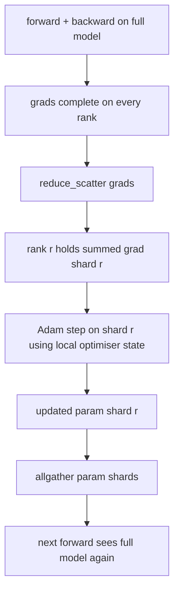

# ZeRO 优化器状态分片

> Adam 会为每个参数存储两个矩估计（moment estimates），且均为 float32。一个 7B 参数的模型会携带 56 GB 的优化器状态。ZeRO stage 1 将其分片到 N 个 rank 上；每个 rank 拥有 1/N 的优化器状态。在本地步进（step）完成后，更新后的参数分片被广播回所有节点，每个 rank 重建完整模型，随后开始下一步。其收益在于训练栈中最大单笔内存分配呈线性下降。

**类型：** 构建
**语言：** Python
**前置要求：** 第 19 阶段 C 轨道 第 42-49 课
**耗时：** ~90 分钟

## 学习目标

- 将优化器状态（一阶矩、二阶矩、fp32 主副本）分片到 N 个 rank 上，使每个 rank 拥有 1/N。
- 使用 `reduce_scatter` 仅向每个 rank 传递其分片的梯度总和，随后使用 `allgather` 将更新后的参数分片广播回去。
- 计算 stage 1、stage 2、stage 3 相对于原生 DDP 的内存节省对照表。
- 根据模型规模与带宽预算，论证选择 stage 1、stage 2 或 stage 3 的理由。

## 问题背景

原生 DDP 会复制所有内容：参数、梯度和优化器状态在每个 rank 上都是完整副本。对于一个 fp16 的 7B 参数模型，这意味着每个 rank 需要 14 GB 参数、14 GB 梯度和 28 GB 优化器状态。优化器状态是占比最大的部分，也是最容易分片的部分，因为它仅在优化器步进时被访问，而在前向或反向传播期间不会被触及。

ZeRO stage 1 对优化器状态进行分片。每个 rank 持有 1/N 的 Adam 矩。反向传播完成后，ZeRO 不再对完整梯度执行 `allreduce` 并在本地步进，而是执行 `reduce_scatter`，使每个 rank 仅接收其所属分片的梯度总和。该 rank 将优化器步进应用于其持有的主参数分片。随后，更新后的参数分片通过 `allgather` 广播回所有节点，使每个 rank 都拥有完整模型以进行下一次前向传播。优化器内存下降为原来的 1/N。每步的通信流量与 DDP 相同：按带宽计算，一次 `reduce_scatter` 加一次 `allgather` 等于一次 `allreduce`。内存大幅节省，吞吐量保持不变。

## 核心概念



### ZeRO 的阶段

| 阶段 | 分片内容 | 每 rank 内存 | 每步通信 |
|-------|----------------|------------------|---------------|
| DDP | 无 | params + grads + optim | 1x allreduce |
| ZeRO-1 | 优化器状态 | params + grads + optim/N | 1x reduce_scatter + 1x allgather |
| ZeRO-2 | 优化器 + 梯度 | params + grads/N + optim/N | 1x reduce_scatter + 1x allgather |
| ZeRO-3 | 优化器 + 梯度 + 参数 | params/N + grads/N + optim/N | 每层 1x allgather + 每层 1x reduce_scatter |

Stage 1 是性价比最高的优化，因为优化器状态占据了内存预算的大头。Stage 2 需要梯度分片累积逻辑，但带宽开销相同。Stage 3（FSDP）在每次前向和反向传播中需支付按层通信的开销，以换取参数分片带来的内存下降。本课将完整实现 stage 1。

### 内存计算，真实数据

对于使用 Adam 和混合精度训练的包含 P 个参数的模型：

| 项 | 原生 (Vanilla) | ZeRO-1 | 原因 |
|------|---------|--------|-----|
| fp16 params | 2P bytes | 2P bytes | 前向传播所需 |
| fp16 grads | 2P bytes | 2P bytes | 反向传播所需 |
| fp32 master copy | 4P bytes | 4P/N bytes | 仅优化器使用 |
| fp32 first moment | 4P bytes | 4P/N bytes | 仅优化器使用 |
| fp32 second moment | 4P bytes | 4P/N bytes | 仅优化器使用 |
| 总计 | 16P bytes | 4P + 12P/N bytes |   |

当 N=8 时：原生 16P，ZeRO-1 5.5P，下降 65%。当 N=64 时：原生 16P，ZeRO-1 4.19P，下降 74%。

### 为什么 reduce_scatter 优于 allreduce-then-shard

`allreduce` 会向每个 rank 提供完整的梯度总和。如果你只需要分片 r，那么在 rank r 上被规约的 (N-1)/N 梯度就被浪费了。`reduce_scatter` 精确传递每个 rank 所拥有的分片；每个 rank 的通信字节数与 `allreduce` 相同（因为 `allreduce` 等价于 `reduce_scatter` + `allgather`），但后半部分被后续的参数分片 `allgather` 所替代。净通信流量与 DDP 完全相同，但内存被均分。

## 动手构建

`code/main.py` 实现了：

- `flatten_params(module)` 与 `unflatten_into(module, flat)`：将模型参数打包为一个连续张量并支持解包还原。这种扁平化布局使得按 rank 分片只需简单的切片操作。
- `ZeroOptimizer(model, world_size, rank, lr)`：负责管理该 rank 所拥有的主副本与 Adam 矩的分片。
- `step()`：对扁平化梯度执行 `reduce_scatter`，将 Adam 更新应用于该 rank 的分片，并通过 `allgather` 将更新后的参数广播回所有 rank。
- 一个演示程序：训练一个 3 层 MLP 共 20 步，并打印每步的内存预算，同时与原生 DDP 基线进行对比。

运行方式：

```bash
python3 code/main.py
```

输出：每步 loss 以及内存对照表，展示 ZeRO-1 在每个 rank 上仅持有 1/N 的优化器状态，而 DDP 持有完整副本。

## 业界生产环境模式

有三种模式能让 ZeRO 达到可交付的生产级稳定性。

**分片检查点至关重要。** ZeRO-1 的优化器状态被拆分到各个 rank 上；检查点必须记录每个 rank 负责哪些分片。第 80 课将构建分片检查点清单（manifest），用于在相同 `world size` 下恢复 ZeRO 训练。若无此清单，重启时将无法读取保存的状态。

**混合精度是核心所在。** ZeRO 本质上是一种混合精度技术；被分片的正是 fp32 主副本。若不在混合精度下运行 ZeRO，你将承担 fp32 主副本的内存开销，却无法获得 fp16 前向传播带来的收益。生产环境始终将 ZeRO 与 `autocast` 或 `bf16` 权重搭配使用。

**Stage 1 几乎是零成本的收益。** 按带宽计算，其通信开销与 DDP 完全一致。内存节省与 N 呈线性关系。唯一的代价是优化器分片的状态管理开销。生产栈默认使用 stage 1，除非参数本身的内存也成为瓶颈；此时 stage 2 或 3 会以通信换内存。

## 实际应用

生产环境模式：

- **DeepSpeed ZeRO。** 参考实现。`deepspeed_config.json` 用于选择 stage 1/2/3 及分片大小。
- **PyTorch FSDP。** PyTorch 原生等效实现。`ShardingStrategy.SHARD_GRAD_OP` 对应 ZeRO-2；`FULL_SHARD` 对应 ZeRO-3。
- **HuggingFace Accelerate。** 通过统一配置封装 DeepSpeed 与 FSDP。

## 后续衔接

第 79 课（流水线并行）是正交的分片维度：流水线并行不是在同一模型上分片优化器状态，而是将网络层分片到不同 rank 上。第 81 课将在端到端演示中组合 DDP + ZeRO。

## 练习

1. 通过分片梯度扩展至 ZeRO-2：每个 rank 仅存储其分片的梯度，通过在反向传播后将非分片部分置零来实现。
2. 添加内存分析器，打印 rank 0 上的实际 fp32 字节使用量，并与公式预测值进行对比。
3. 测量原生 DDP 与 ZeRO-1 的单步实际耗时（wall-clock time），并将其分解为前向、反向和通信时间。
4. 在 ZeRO-1 下实现梯度裁剪：必须通过对局部范数平方进行 `allreduce`，跨所有分片计算 L2 范数。
5. 使用 `allreduce` 而非 `reduce_scatter` 实现“朴素版 ZeRO”，测量通信时间差异。用数据论证选择 `reduce_scatter` 的理由。

## 关键术语

| 术语 | 常见说法 | 实际含义 |
|------|----------------|------------------------|
| ZeRO-1 | “分片优化器” | 每个 rank 持有 1/N 的 fp32 主副本 + Adam 矩 |
| ZeRO-2 | “梯度也分片” | 每个 rank 在 reduce_scatter 后还会丢弃非所属分片的梯度 |
| ZeRO-3 | “参数也分片” | 每个 rank 持有 1/N 的 fp16 参数；前向传播中按层执行 allgather |
| Master copy | “fp32 权重” | 优化器更新所用的高精度参数副本 |
| Reduce_scatter | “拆分求和” | 仅向每个 rank 传递其所属分片的梯度总和 |

## 延伸阅读

- [Rajbhandari et al, ZeRO: Memory Optimizations Toward Training Trillion Parameter Models](https://arxiv.org/abs/1910.02054)
- [DeepSpeed ZeRO documentation](https://www.deepspeed.ai/tutorials/zero/)
- [PyTorch FSDP documentation](https://pytorch.org/docs/stable/fsdp.html)
- Phase 19 Lesson 76 - 本课所依赖的 reduce_scatter 与 allgather 基础
- Phase 19 Lesson 80 - ZeRO 状态必须使用的分片检查点技术
