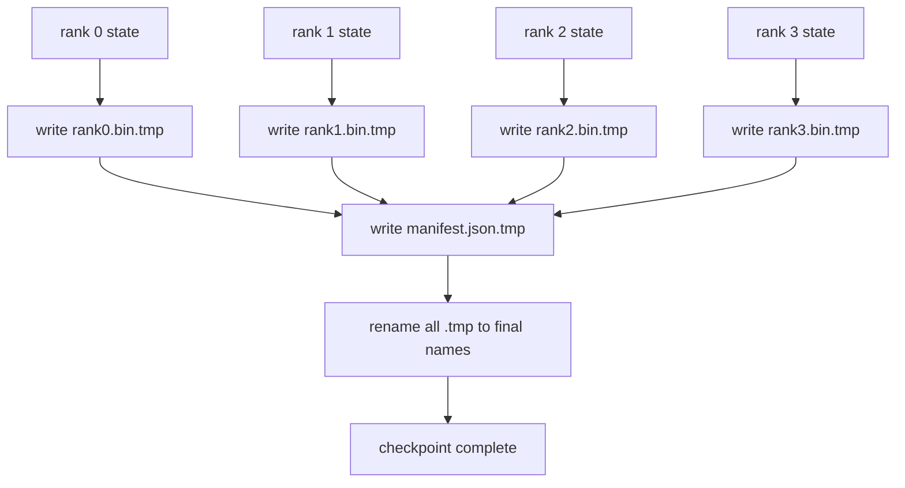

# 分片检查点与原子恢复

> 一个 70B 参数的训练任务每隔几小时就会因节点故障而暂停。检查点格式决定了你损失的是 30 分钟还是 30 小时。分片检查点并行写入每个 rank 的分片，并在清单（manifest）中记录所有权。恢复时从各自的文件加载每个 rank 的分片，在相同的 world size 下重建状态，优化器继续步进，仿佛什么都没发生过。原子写入可防止未完成的检查点污染下一次恢复。

**类型：** 构建
**语言：** Python
**前置要求：** 第 19 阶段 C 轨道第 42-49 课
**耗时：** 约 90 分钟

## 学习目标

- 将多 rank 检查点保存为每个 rank 的分片文件，并附带记录各 rank 所有权的清单。
- 使用原子写入模式（先写入临时路径再重命名），确保写入中途崩溃绝不会产生未完成的检查点。
- 从清单恢复，验证每个 rank 上 fp16 参数和 ZeRO 优化器状态的字节级一致性。
- 针对三种故障模式防御清单 schema：world size 变更、分片数量不匹配以及部分写入。

## 问题背景

传统的检查点会将所有参数和优化器状态读取到 rank 0，进行 gather 操作后写入单个文件。对于 70B 模型，这意味着 1.1 TB 的状态数据需通过单个 rank 的网络端口传输。写入操作会阻塞其他所有 rank，因为它们只能空闲等待 gather 完成。IO 带宽受限于最慢的单个 GPU 网络链路，而非聚合带宽。在真实集群中，gather 后写入的步骤耗时可能超过前一小时的训练时间，这意味着该任务每天产生的检查点还不到一个。

分片检查点反转了这一模式：每个 rank 并行将自身的分片写入独立的文件。清单记录每个分片所属的 rank，以便恢复时将各分片放回原处。聚合写入带宽随集群规模线性扩展。通过单个 rank 需要 4 小时写入的 1 TB 检查点，通过 64 个 rank 仅需 4 分钟。此外，清单为不兼容的恢复提供了一份契约：可检测 world size 变更，可检测部分写入，加载路径可以明确报错，而不是静默使用陈旧数据。

## 核心概念



### 清单 Schema

```json
{
  "world_size": 4,
  "step": 1234,
  "wall_clock_seconds": 4521,
  "shards": [
    {"rank": 0, "path": "rank0.bin", "sha256": "...", "param_shard_offset": 0, "param_shard_numel": 65536},
    {"rank": 1, "path": "rank1.bin", "sha256": "...", "param_shard_offset": 65536, "param_shard_numel": 65536}
  ],
  "schema_version": 1
}
```

其中三个字段至关重要。`world_size` 使得在不同规模下恢复时会明确报错，而非静默损坏。每个分片的 `sha256` 可捕获部分写入或损坏的写入。每个分片的 `param_shard_offset` 和 `param_shard_numel` 让加载器能在正确位置重建扁平化的参数张量。

### 原子写入

标准模式：将每个分片写入 `<name>.tmp`，将清单写入 `manifest.json.tmp`，对每个文件执行 fsync，然后重命名。同一文件系统内的 POSIX rename 是原子的；要么新文件完整存在，要么旧文件保持原样。在最终重命名前崩溃会保留上一个检查点作为当前有效版本。若无原子写入，崩溃可能留下一个部分写入的分片，而清单却指向它，导致恢复时加载过程损坏优化器状态。

### Schema 必须防御的三种故障模式

| 故障 | 症状 | 防御措施 |
|---------|---------|---------|
| World size 变更 | 使用 N=4 的清单在 N=8 上恢复 | 清单中 world_size 不匹配，明确报错 |
| 分片数量不匹配 | 恢复时看到的 rank*.bin 文件少于清单中的分片数 | 枚举分片，验证每一个是否存在 |
| 部分写入 | 分片文件在刷新中途被截断 | 加载时进行 sha256 验证 |

每种防御措施都会尽早拒绝错误的加载；否则将导致静默损坏，并在 100 步之后 loss 变为 NaN 时才暴露出来。

### 为何使用每个 rank 独立文件，而非单个大文件

通过 `O_APPEND` 并发写入单个文件在 POSIX 上适用于字节对齐的写入，但实际上一个分片内的偏移量跨越 MB 级区域，锁竞争会占据主导。每个 rank 独立文件不存在竞争，且当底层文件系统为并行文件系统（如 Lustre、GPFS）时可受益于条带化（striping）。生产级技术栈（DeepSpeed、FSDP、NeMo）均出于此原因采用每个 rank 独立文件。

## 动手构建

`code/main.py` 实现了：

- 包含上述 schema 以及 `to_json`/`from_json` 的 `ShardManifest` dataclass。
- `save_sharded(state_dict_per_rank, dir, step)`：使用原子的“临时文件后重命名”模式将每个 rank 的二进制状态写入其独立文件，随后写入清单。
- `load_sharded(dir, expected_world_size)`：读取清单，验证每个分片的 sha256，并返回每个 rank 的状态字典。
- 往返测试：构建每个 rank 的状态，保存，加载，断言字节级一致。

运行它：

```bash
python3 code/main.py
```

输出：写入 4 个分片文件及清单，随后重新加载并进行字节级一致性验证。

## 业界生产环境模式

以下三种模式可充分加固检查点，使其达到生产交付标准。

**异步写入。** 生产级技术栈会在独立线程或进程中发起检查点写入，以便训练继续执行。屏障设在下一个检查点：在上一个保存完成前，不启动下一次保存。DeepSpeed 的 `async_io` 标志正是实现此功能。本课保持同步写入以便步骤清晰可见。

**先写本地高速磁盘，再异步上传。** 先写入本地 NVMe（高速），再异步上传至 S3 或 GCS。这种双层模式既保证了集群内检查点用于恢复的速度，又将持久化副本发送至集群外进行归档。清单携带本地路径；上传清单则携带远程路径。

**轮转（Rotation）至关重要。** 生产环境运行通常保留最近 K 个检查点（一般为 3-5 个），并轮替删除最旧的。若不轮转，磁盘会在运行中途写满，导致下一个检查点失败。启用轮转后，下一次保存会先删除最旧的检查点，释放存储空间。

## 实际应用

生产环境模式：

- **DeepSpeed 检查点。** `deepspeed.save_checkpoint(tag=step)` 写入每个 rank 的文件以及一个指向当前活跃标签的 `latest` 文件。
- **PyTorch FSDP 检查点。** `torch.distributed.checkpoint` 保存分片状态，并通过 `Planner` 决定每个 rank 的布局。
- **NeMo。** 使用统一的 `save_to_checkpoint` API 封装 DeepSpeed 和 FSDP，并添加元数据。

## 交付验证

第 81 课将保存端到端 DDP+ZeRO 运行的分片检查点，并在相同的 world size 下重新加载，以证明恢复契约成立。

## 练习

1. 添加异步写入：在线程中启动保存操作并让训练继续。阻塞下一次保存，直到上一次完成。
2. 添加 `last_5_steps` 轮转：保留最近的 5 个检查点，在保存新检查点前删除最旧的。
3. 为内循环重新加载添加仅 CRC 的快速验证路径（轮转将某个检查点滚动为新的活跃检查点时，无需完整 sha256 验证）。
4. 添加跨 world size 加载：通过读取清单、拼接并重新分片，实现从 N=4 到 N=8 的分片重平衡。
5. 添加上传至模拟 S3（第二个目录）的功能，并写入上传清单。实现双层存储策略的防御机制。

## 关键术语

| 术语 | 常见说法 | 实际含义 |
|------|----------------|------------------------|
| 分片检查点 (Sharded checkpoint) | “按 rank 保存” | 每个 rank 并行写入自身的分片文件 |
| 清单 (Manifest) | “索引” | 记录分片路径、偏移量和 sha256 的 JSON 文件 |
| 原子写入 (Atomic write) | “先 tmp 后 rename” | 写入 .tmp 后执行 POSIX rename，确保崩溃时旧文件仍有效 |
| 部分写入 (Partial write) | “截断的分片” | 写入期间崩溃导致分片损坏；sha256 可捕获此问题 |
| 轮转 (Rotation) | “保留最近 K 个” | 写入新检查点前删除最旧的，以控制磁盘占用 |

## 延伸阅读

- [DeepSpeed checkpointing](https://www.deepspeed.ai/tutorials/checkpointing/)
- [PyTorch torch.distributed.checkpoint](https://pytorch.org/docs/stable/distributed.checkpoint.html)
- [POSIX rename atomicity](https://pubs.opengroup.org/onlinepubs/9699919799/functions/rename.html)
- 第 19 阶段第 78 课 - 本检查点旨在保存的 ZeRO 状态
- 第 19 阶段第 81 课 - 端到端演示对已保存状态进行往返验证
